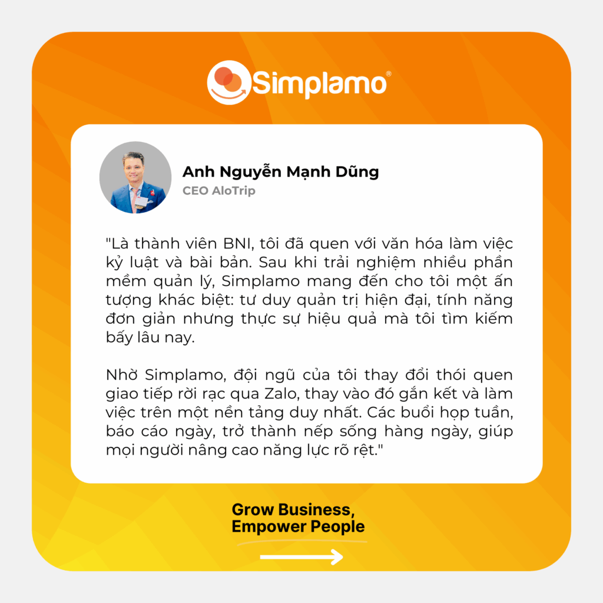
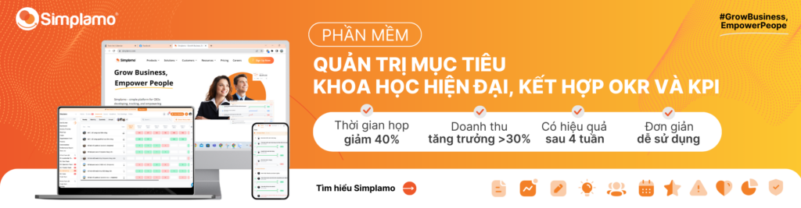

Founded in 2014, [Alotrip.vn](http://Alotrip.vn) is an online travel platform providing end-to-end booking services for flights, hotel rooms, tours, visas, and insurance.

After more than 10 years of development, AloTrip has become a trusted partner for thousands of customers and domestic and international airlines.

Operating in an extremely dynamic and volatile market—where every decision is measured in seconds and data is the most valuable asset—AloTrip has built a solid position thanks to its ability to provide fast and convenient booking services for tickets, tours, and accommodation.

Under the leadership of CEO Nguyễn Mạnh Dũng (Mr. Dũng AloTrip), the company has not only grown strongly in technology, but has also pioneered the modernization of its internal management approach, building a disciplined and highly productive team.

## I. Context and challenges caused by fragmentation

Mr. Dũng AloTrip shared the management problem before Simplamo:

> “Previously, I used many separate software tools to manage work, so the work was both difficult and fragmented, and important information was easily lost.”

He realized that although specialized departments such as Tech and Marketing already had their own tools, the business still lacked a **shared management platform** to solve core challenges:

- **Lack of a centralized system:** Data, goals, and important decisions were scattered across many software tools, making continuous lookup and tracking difficult.
- **Low collaboration performance:** Fragmented information led to inefficient coordination between departments, affecting the ability to interact.
- **Promoting a strong culture of discipline:** As someone who values discipline and proactivity in execution, Mr. Dũng wanted to find a transparent and clear management solution that would drive action across the team.

## II. Simplamo – A platform connecting Goals and a culture of discipline

When approaching Simplamo, Mr. Dũng AloTrip recognized that this was exactly the tool he had long been looking for, because it met the need to **manage goals, data, collaboration, and increase discipline** on a single shared platform.

### **1. From fragmented to centralized Data**

By deploying Simplamo at the Leader & Senior level, AloTrip solved the problem of information fragmentation. Department goals are created and tracked consistently on the same platform. Discussion content from meetings and the actions created from them are also stored on Simplamo.

**Benefits delivered:**

- **Centralized repository:** A single place to store and search for important information, preventing information from “drifting away” with no one taking responsibility to the end.
- **Scientific work allocation:** Ways of working are reorganized and allocated more scientifically, ensuring that every action is tied to shared goals.
- **A proactive team while the CEO maintains good control:** The team no longer waits for the CEO to remind them; they proactively create work plans, ensure goal completion, and update progress weekly.

### **2. Execution discipline – The decisive factor**

As an active member of [BNI Vietnam](https://simplamo.com/vi/bni-vietnam-ap-dung-4-nguyen-tac-thuc-thi-nang-cap-he-thong-quan-tri-tren-simplamo/), Mr. Dũng AloTrip especially values **discipline** in goal execution and a meeting culture based on clear templates. This was also the key point that made him decide to apply Simplamo immediately after first encountering it.

> Mr. Dũng emphasized: “Every business needs many tools to work, and when choosing a tool, it is necessary to consider whether it fits the culture. But especially for the CEO, when using a tool, the CEO must be the person most satisfied with it; only then will deploying it to the team be effective.”

Simplamo has proven its fit with the **proactive, disciplined, and transparent** culture that AloTrip is building through a structured meeting system focused on solving issues and producing actions with specific owners.

## III. Breakthrough results: Centralized, proactive **& disciplined** management

Starting its use of Simplamo on 22.07.2025, after a 3-month journey with training and support from Simplamo experts, AloTrip successfully upgraded its management model to be **centralized, proactive & disciplined**, as Mr. Dũng expected.

Watch Mr. Dũng AloTrip share about Simplamo at the workshop held on 25.09.2025:

Simplamo is not only a goal management tool, but also a platform for **centralizing strategic data** and building a **culture of execution discipline**, a key factor that helps AloTrip maintain its position and break through in the volatile travel industry.

**Is your business struggling with scattered data and goals?**

Let Simplamo help you build a **centralized – disciplined – effective** platform to conquer your business goals!

👉 [**Sign up to try Simplamo for 30 days.**](https://app.simplamo.com/sign-up?lang=vi)

…

Simplamo – Excellent Goal Management & Execution, applying KPI, OKRs, BSC, and 4DX. A tool that helps the Executive Board and Board of Directors monitor and drive goals effectively, improving performance.

Start experiencing [Simplamo](https://www.facebook.com/simplamocom) and feel the change after only 4 weeks!

Register for a [Simplamo](https://www.linkedin.com/company/79564065/) demo at: <https://app.simplamo.com/vi/sign-up>

