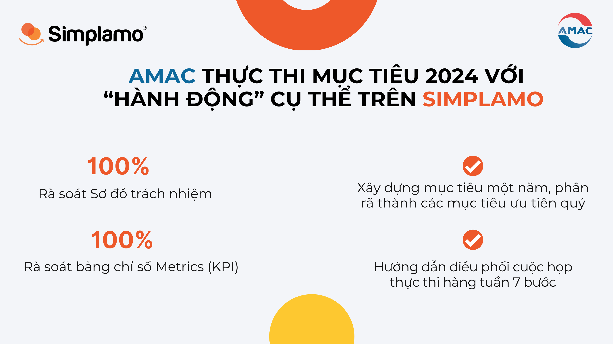
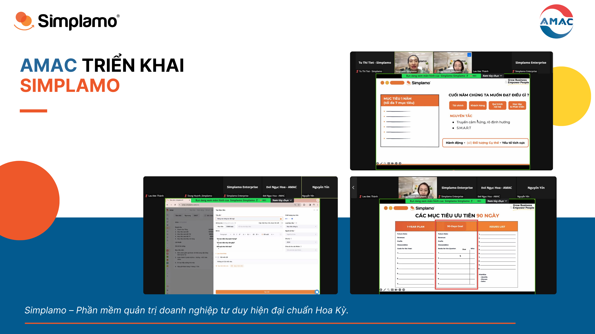

## 1. Overview of AMAC

Established in 2010, AMAC Automotive and Motorcycle Supporting Industry Joint Stock Company specializes in supplying replacement parts and consumable materials for automobile and motorcycle manufacturers, logistics providers, transportation, and warehousing.

Ms. Pham Thu Mai — Chairwoman of AMAC — is a female leader with a strong Vision. She wants to build a business capable of operating on its own, with a team that effectively executes the directions she sets for the coming period.

Ms. Mai had previously applied KPI and then OKRs, but neither matched what she wanted. What she needed was **a method, an operating framework** in which the team could effectively execute the goals handed down by the Visionary, Ms. Mai.

After spending time learning about Simplamo and recognizing that it was exactly what she was looking for, she saw that Simplamo is not only software but also a very systematic operating framework. With Simplamo, she can observe every activity and how the team executes goals each day.

For that reason, on January 16, 2024, Ms. Pham Thu Mai decided to apply Simplamo at AMAC — marking a turning point in building a **self-operating business**.

## 2. AMAC executes its 2024 goals with specific “actions” on Simplamo

Through three implementation sessions, Simplamo experts supported AMAC in reviewing and transferring its data onto the software, while also guiding important activities that help business-plan execution take place scientifically and effectively.

Below are several activities that Simplamo experts coached AMAC on:

- **Reviewing AMAC’s Accountability Chart**, ensuring that the chart was optimized to effectively serve the company’s business operations in the coming year. Each position built on Simplamo clearly shows the five roles each individual needs to perform, which helps strengthen the team’s commitment and execution.
- Guiding the development of **one-year goals**, breaking them down into **priority quarterly goals**, and shaping the execution process by identifying specific **“actions”** through milestone markers.
- **Reviewing the Metrics table (KPI)** on Simplamo and identifying important indicators that AMAC needs to measure in order to track and evaluate business operations in a detailed and complete way.
- **Guiding the facilitation of the seven-step weekly execution meeting** in the most effective way, while training everyone on the I.D.S. problem-solving tool so they can solve issues using a scientific framework and ensure that every issue in the organization is handled effectively.

During the transfer of the operating system on Simplamo, AMAC went through important activities that strengthened execution within the organization, with the hope that once all activities are put into a clear framework, the company will be able to build an **“execution environment” and a self-operating organization** on Simplamo.

During the implementation session, Simplamo expert Ms. Nguyen Thi Nghia emphasized that only when Goals are broken down into specific “actions” and specific steps can they be executed effectively by the team, because the team knows what needs to be done.

AMAC’s leadership team shared: *“Today’s implementation session helped us identify the actions needed to achieve our goals. In the past, AMAC applied OKRs and KPI, but everything was scattered and could not be connected, making execution take a lot of time. Meanwhile, Simplamo helps connect every goal scientifically and create specific actions.”*

The leadership team also highly appreciated the **execution meeting** framework in Simplamo:

- The meeting has very detailed steps and gathers complete information from departments, so everyone can understand the working progress of each department.
- The meeting helps identify what last week’s results were and what actions need to be taken in the next week. This is very effective for work and creates a productive working week.

Simplamo will continue accompanying AMAC on its journey of operating the business and conquering its goals. The Simplamo team wishes AMAC a breakthrough development in the coming period.

— – – – –

[Simplamo](https://simplamo.com/vi/) – A modern goal management & execution software that makes complex operations simple and accessible to every employee. It relieves pressure for leaders, helps them focus on what matters, and optimizes work performance for businesses.

Start experiencing [Simplamo](https://www.facebook.com/simplamocom) and feel the change after only 4 weeks!

Register for a Simplamo demo at: [https://app.simplamo.com/sign-up](https://app.simplamo.com/sign-up?lang=vi)

