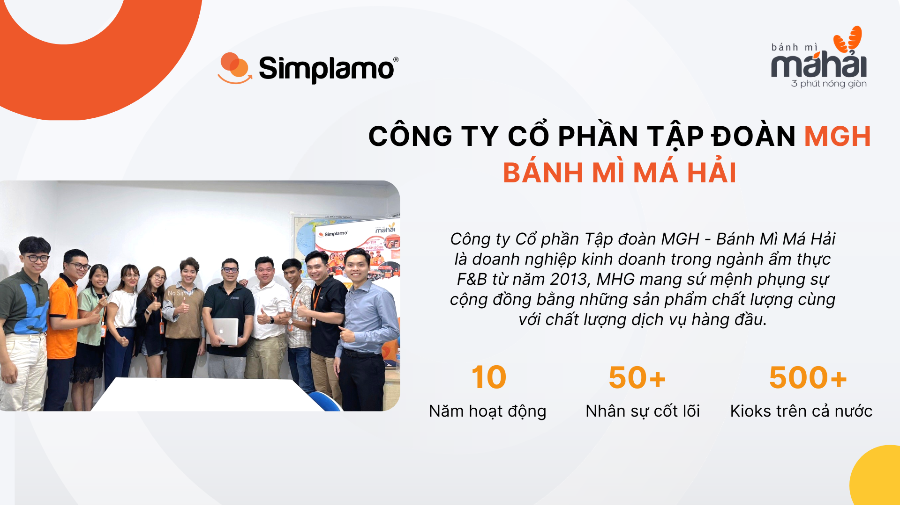
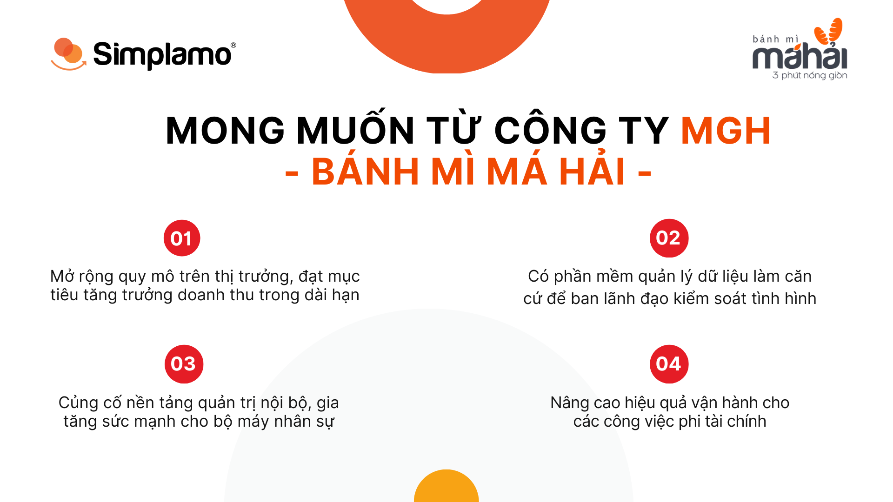
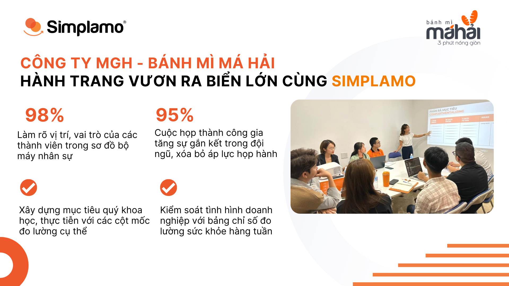
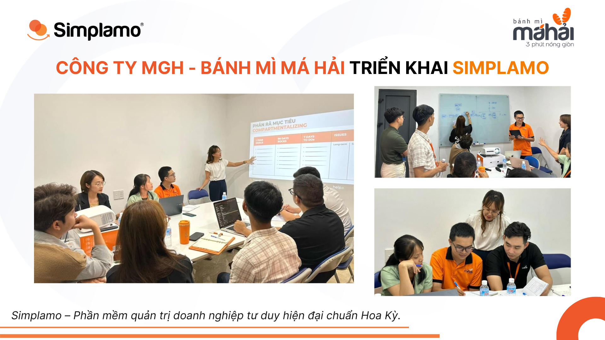
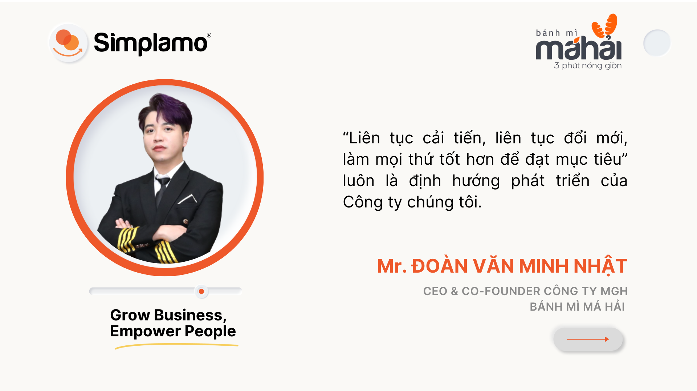

Founded in 2013, **Bánh mì Má Hải** – a brand under MHG Group Joint Stock Company – is now Vietnam’s leading fish-cake bánh mì chain, with a system of more than 500 kiosks across 37 provinces and cities, 4 stores, and a team of more than 50 core personnel. MHG operates under two models: a store chain and a franchise system of mobile bánh mì carts.

## **I. Bánh mì Má Hải** **moves toward the goal** **of reaching the big sea**

After 10 years of steady development in the domestic market, MHG has identified the goal of **expanding scale and growing revenue sustainably** in the coming years. To realize the vision of “reaching the big sea,” MHG chose Simplamo as its companion in the journey to strengthen its internal operating capability.

## **II. 4 pillars for rebuilding Má Hải’s operating system**

Bánh mì Má Hải implemented Simplamo in 09.2023.

> *“We chose Simplamo because we needed a system that helps renew operations, keep pace with expansion speed, and at the same time help the team execute strategy through a structured, thoughtful system”*
> *— Mr. Hồ Đức Hải, Founder of Bánh mì Má Hải*

### **1. Clear roles – Build an accountability chart**

Má Hải redefined its organizational structure using an accountability chart. Is the current organizational structure still suitable to meet the major goals ahead?

After that, each position was clarified with five main roles, helping eliminate overlap, increase transparency, and optimize operating performance.

This is the first foundation for the organization to be ready for the expansion phase over the next six months.

### **2. Clear goals – Establish a system of quarterly priority goals**

From the 2023 annual goals, Má Hải’s leadership together with Simplamo experts broke them down into clear, measurable Q4/2023 goals. Each goal had a main owner and a clear action plan, step by step, to complete that goal.

Each person understands what they are contributing to, thereby increasing commitment and alignment across the organization.

### **3. Clear data – Manage with a weekly Scorecard**

Using the Scorecard tool, Simplamo experts guided Má Hải in identifying 5–15 key metrics to track weekly business results. Through this Scorecard, **leadership can forecast the likelihood of achieving 90-day goals, see where issues are emerging, and from there create plans to push forward and improve promptly within the week.**

*In the early stage of implementation, members also encountered some difficulty because they had not yet seen the value of this somewhat unfamiliar Scorecard tool. But after discussion and working sessions with Simplamo experts, leadership members identified the metrics they wanted to measure and recognized the value the Scorecard brings to the company and to themselves.*

### **4. Clear issues – 7-step weekly meetings, concise and practical**

The weekly meeting using Simplamo’s 7-step framework helps leadership periodically review metrics, review goals, and detect issues promptly. With meeting rules pre-designed in the software, every member has the opportunity to share personal viewpoints and work together on priority issues.

There is no longer rambling in meetings. Members join meetings proactively and openly; the team stays close to goals and knows what they need to do immediately afterward.

## **III. Results: An aligned organization, a system ready to accelerate**

After applying Simplamo, Bánh mì Má Hải has a new operating system – where each individual understands their goals, every metric is closely tracked, and every week has specific actions to move forward.

- **Clear roles in the organization** – responsibilities are transparently defined
- **Clear goals** – from company level to each individual
- **Clear progress** – track and adjust promptly
- **Effective meetings** – no rambling, focused on solutions

Wishing Bánh mì Má Hải continued growth with **a new and solid operating foundation on Simplamo**, moving closer to the goal of reaching the big sea and bringing the Vietnamese bánh mì brand to the world.

🎯 **Are you a CEO looking for a way to upgrade operations for sustainable growth?**

Simplamo is not only software – it is a system that helps your organization execute goals with control, build a proactive team, and maintain a stable growth rhythm.

👉 [**Schedule a consultation with a Simplamo expert today.**](https://app.simplamo.com/sign-up)
We are ready to accompany you, from operational restructuring to long-term strategy execution.

—————————————————

[Simplamo](https://simplamo.com/vi/) – Modern scientific goal-management software, uniquely combining KPI and OKR. It turns the complexity of business operations into something simple and familiar for every employee. It releases pressure on leaders, helps them focus on what matters, and optimizes work performance for the business.

Start experiencing Simplamo and feel the change after only 4 weeks!

Register for a Simplamo demo at: <https://app.simplamo.com/sign-up>

