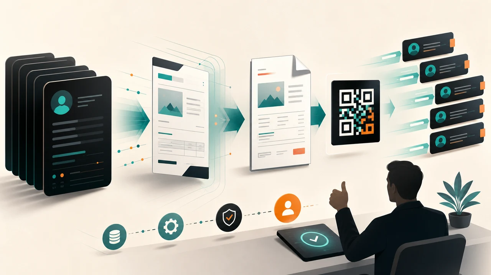

Many companies are implementing AI at a very low level: **question — answer**.

An employee opens a chatbot, asks a few questions, copies the answer, and then does the rest manually. It sounds like the company is using AI. But the actual work is still on the human: gathering context, creating files, checking errors, sending things to customers, and remembering what to do next time.

That is AI at the **Q&A** level. It is not AI at the **job to be done** level — completing a real piece of work.

Co-working tools, coding assistants, chat inside IDEs, and internal chatbots are all better than before. But if a CEO wants AI to support multiple departments, multiple workflows, multiple communication channels, and especially agents that can execute in the cloud without a personal computer always running, a different layer is needed.

That is where Hermes becomes interesting.

Hermes should no longer be seen as a chatbot. Hermes should be seen as a **self-evolving execution assistant**: it can use tools, run scripts, create files, check outputs, remember processes, and turn one correct run into a skill so the next run is faster.

## Main point: design assistants like you design an organization


If all you need is an answer, a chatbot is enough.

But if you want AI to enter operations, the CEO has to design it the way one designs an organization:

```text
The CEO defines the job to be done
→ Hermes executes through tools/scripts/files
→ The output is checked
→ The correct way of working is packaged into a skill
→ The skill expands into each department
→ Every correct run becomes a repeatable capability
```

The difference is not in getting a better answer. The difference is in the **ability to complete the work**.

A good execution assistant must be able to do at least five things:

1. understand the goal and context;
2. call the right tool;
3. create real outputs: files, videos, reports, checklists, scripts;
4. check its own output;
5. learn from the correct run so the next run is better.

This is where Hermes differs from a normal Q&A chatbot.

## Why companies are stuck at Q&A, not job to be done


Most companies begin AI with the question:

> “What should employees use ChatGPT for?”

That question is not wrong. But it easily leads to a fragmented implementation:

- Marketing uses it to write captions;
- Sales uses it to draft emails;
- Implementation uses it to ask about errors;
- the CEO uses it to brainstorm;
- everyone works differently, with no skill, no QA, and no output standard.

The result is that AI makes individual people slightly faster, but **the organization does not become significantly smarter**.

To go further, the question has to change:

> “Which job needs to be completed from end to end?”

For example:

| Q&A | Job to be done |
|---|---|
| Write a few video ideas | Create the script, visual spec, voice, subtitles, render, QA, and caption |
| Draft quotation content | Create DOCX, PDF, quote code, payment QR, and send the files |
| Ask about a server error | Read logs, suggest check commands, fix, and write a checklist for next time |
| Summarize a meeting | Capture decisions, assign work, create a checklist, and track follow-up |

Q&A is the first step. But CEOs need Hermes for the next step: **assigned work must produce a complete output**.

## Hermes fits when CEOs want an agent to run like an execution environment


A chatbot usually lives inside the chat box.

Hermes can live in more environments:

- terminal;
- Telegram or other messaging channels;
- server/cloud;
- code repositories;
- file system;
- workflows with scripts;
- tools for search, image generation, voice generation, video QA, and screenshot reading.

The important point is this: CEOs do not always want to open a personal computer to run every task. With an agent that can run through a gateway or on a server, the CEO can assign work from chat while the execution environment lives in the cloud/server.

If you want to install and try it yourself, start with the official Hermes documentation at [hermes-agent.nousresearch.com/docs](https://hermes-agent.nousresearch.com/docs) or the [NousResearch/hermes-agent](https://github.com/NousResearch/hermes-agent) repository. Quick install:

```bash
curl -fsSL https://raw.githubusercontent.com/NousResearch/hermes-agent/main/scripts/install.sh | bash
```

After installation:

```bash
hermes setup
hermes model
hermes doctor
```

For models, the easiest path for beginners is **OpenRouter**, because one API key can try many different models and switch quickly by task. If the company already has its own API, Hermes can also connect directly: use Anthropic if you have a **Claude API**, or OpenAI if you have a **ChatGPT/OpenAI API**. A practical selection guide:

| Situation | Suggestion |
|---|---|
| Start quickly and try many models | OpenRouter |
| Already have Claude API and need strong reasoning | Anthropic / Claude |
| Already have OpenAI API and need the ChatGPT/OpenAI ecosystem | OpenAI |
| Have an internal endpoint or custom proxy | Custom provider |

The CEO should not lock the company into one model. Hermes should be configured so the model can change by task: strategic work uses a stronger model, repetitive work uses a faster or cheaper one.

Example:

```text
You send the request through Telegram.
Hermes receives the task.
Hermes reads the necessary files/templates.
Hermes runs the script.
Hermes creates the DOCX/PDF/video.
Hermes checks the output.
Hermes sends the result back.
```

This is a better approach for companies: AI is not just a place to ask questions, but an **execution layer** between people, data, tools, and processes.

## Self-evolving capability: Hermes learns from the correct way of working


The value of Hermes is not only that it can “use tools.”

The bigger value is this: when a task has been done correctly, Hermes can package that way of working into a **skill**.

A skill should not be understood as dry technical documentation. For a CEO, a skill simply means:

> “The way our company wants AI to perform a specific task.”

For example:

- how to create a standard quotation;
- how to produce a CEO-style video reel;
- how to write a blog post from a video/script;
- how to check a server after deployment;
- how to import a post into the website;
- how to create a weekly executive report.

The first time Hermes performs a task, the CEO can review and adjust it. The second time, Hermes can optimize. Once the workflow is good, the CEO can say:

```text
This way of working is good now. Package it into a skill so we can run it again next time.
```

From there, the agent no longer just answers within one chat session. It starts accumulating operating capability.

That is the important meaning of “self-evolving”: the AI agent does not magically become smarter by itself. It becomes better because the organization knows how to turn correct experience into reusable skills.

## The architecture can be deep, but the CEO does not need to start with the technical details


Behind Hermes there are many technical pieces: model providers, toolsets, terminal, memory, gateway, file system, cron, skills, plugins.

But CEOs do not need to start with all those concepts.

The CEO only needs to learn how to assign work well:

```text
This is the job to be done.
This is the input.
This is the desired output.
This is how to check it.
If it works well, package it into a skill.
```

The rest can be guided gradually through natural language.

This matters. If an AI implementation requires the CEO or department heads to understand too much technical detail at the start, the project will slow down. But if they can assign work in natural language, let the agent propose workflows, create scripts, and package skills, the organization learns faster.

It is not that technical depth does not matter. It is that technical depth should support operations from behind the scenes, not become a barrier for business users.

## Scenario 1: from a random quotation request to a quotation skill



Instead of teaching the team to write skill files at the beginning, the CEO can start with one real task.

For example, Sales sends:

```text
Create a quotation for Minh Anh Company.
The customer needs 20 software packages deployed over 12 months.
Use the current quotation template.
Export DOCX and PDF.
Add a payment QR code.
```

Hermes should respond in execution mode:

```text
I will check the existing quotation template,
standardize the customer information,
create the quotation code,
fill the data into the DOCX,
export the PDF,
generate the payment QR code,
and send both files back for review.
```

After the first run, the CEO should not package the skill immediately. Ask:

```text
Review the workflow you just ran.
Which steps are still manual, error-prone, or could be optimized for next time?
```

Hermes may find that:

- the quote-code rule is missing;
- customer names need normalization;
- totals need to be checked;
- QR codes need verification;
- PDF should be exported from DOCX instead of generated in parallel;
- if there are multiple customers, the workflow should run in batch.

After optimization, the CEO asks:

```text
If next time I only send the customer name and line items,
what else do you need to ask to create a standard quotation?
```

This is the step that turns a random task into a structured process.

Finally, once the workflow is good:

```text
Package this process into a quotation-generation skill.
The skill should remember:
- use the current template
- quote code follows the company convention
- always create DOCX first, then export PDF
- include payment QR
- if there are multiple customers, run batch
- send each quotation as soon as it is done, do not wait for the full batch
```

The CEO does not need to write `SKILL.md` by hand. The CEO only needs to guide Hermes through a clear enough conversation so the agent can design the skill.

## Scenario 2: from a video idea to a content production skill


Another example is video production.

The CEO assigns:

```text
Make me a Vietnamese reel about Hermes for CEOs.
The hook must be strong, include the Hermes logo, simulate chat creating a quotation and a video,
and use the CTA to pull viewers into the detailed blog post.
```

Hermes should not render immediately. It should respond with a plan:

```text
I will do it in 5 steps:
1. Write the script for your approval.
2. Write the visual animation spec.
3. Build the video in Remotion.
4. Generate voice and subtitles from the same transcript.
5. Render, QA the contact sheet, then send the MP4.
```

After the first version, the CEO reviews:

```text
The voice and transcript are good, but the scene timeline is not synced.
Retiming should follow the real transcript, not storyboard estimates.
```

Hermes must extract the rule:

```text
Scene boundaries must map to the VTT/transcript.
Do not cut scenes by feel.
If audio is sped up, subtitle timing must be scaled accordingly.
```

Once the video is good, the CEO asks:

```text
Save this way of working as a CEO video production skill.
Next time, remember: script approval first, detailed visual spec,
voice and subtitles from the same source, and QA contact sheet after rendering.
```

This is self-evolution in practice: not that the model naturally becomes smarter, but that the organization’s workflow gets packaged better after each run.

## Scale into Sales, Marketing, and Implementation


After the CEO has a few reliable skills, then it makes sense to expand into departments.

Do not give everyone the same chatbot.

Each department has a different job to be done, so each department needs different skills.

### Sales

Sales needs Hermes to shorten the path from customer need to proposal.

Useful skills include:

- creating quotations;
- summarizing customer history;
- suggesting next steps;
- standardizing follow-up;
- drafting customer-care emails or messages.

A good task instruction:

```text
Read the exchange history with this customer.
Summarize the need, deal risks, and next step.
Then create a short follow-up, professional in tone, not too long.
```

### Marketing

Marketing needs Hermes to turn insights into publishable content.

Useful skills include:

- writing reel scripts;
- turning a blog post into a carousel;
- creating a landing page outline;
- creating visual briefs;
- producing video;
- writing captions in the brand voice;
- measuring response to extract insights.

A good task instruction:

```text
Turn this blog post into 5 reel ideas.
Each idea should include a hook, key message, visual metaphor, CTA, and short caption.
Prioritize a CEO voice: practical, direct, not generic.
```

### Implementation

Implementation needs Hermes to reduce repeated errors.

Useful skills include:

- installation checklists;
- server setup scripts;
- error-log inspection;
- restore docs;
- health checks;
- handover runbooks.

A good task instruction:

```text
Based on this error log, analyze the most likely cause.
Then suggest check commands, the fix,
and rewrite it as a checklist the implementation team can reuse next time.
```

If each department has its own skill set, Hermes is no longer “one generic chatbot.” It becomes an operating layer that can learn by department.

## A 30-day roadmap for CEOs


If I wanted to start lean, I would follow this roadmap.

### Week 1: Use Hermes for CEO work

Choose 3 real tasks:

1. summarize context and clean up a decision;
2. create an output with a real file;
3. turn an idea into a workflow with QA.

The goal of week 1 is not company-wide rollout. The goal is for the CEO to understand how Hermes should be assigned work.

### Week 2: Create the first 2–3 skills from real work

Do not write skills from a meeting room.

Create skills from work that has been run at least once:

- quotations;
- video/reels;
- blogs;
- weekly reports;
- plan review;
- deployment checks.

After each task, ask:

```text
Is this workflow optimized?
If we run it again next time, what rules do you need to remember?
Package it into a skill for me.
```

### Week 3: Expand to one department

Choose the department with the clearest workflow.

- Sales if the company is losing time on quotations/follow-up.
- Marketing if it needs more consistent content production.
- Implementation if it keeps repeating technical/documentation errors.

Do not expand aggressively. Expand through one concrete job to be done.

### Week 4: Build the internal skill library

Start organizing the skill library:

```text
CEO
- decision-briefing
- video-production
- blog-writing

Sales
- quotation-generation
- follow-up-assistant
- customer-history-summary

Marketing
- reel-production
- landing-page-outline
- content-repurposing

Implementation
- server-checklist
- log-debugging
- restore-docs
```

Each skill should have an owner, an update date, and a QA checklist.

## Guardrails: self-evolving, but not self-authorizing


Hermes can use tools and run scripts, so governance principles are required.

At minimum, there should be 5 rules:

1. Do not put API keys, passwords, or tokens into prompts.
2. Work with side effects — sending emails, deleting files, deploying, sending quotations — needs clear scope.
3. Important outputs need QA: file path, logs, screenshots, contact sheets, test results.
4. Wrong skills must be fixed immediately; do not let skills become dead documents.
5. Humans keep approval rights at risky points.

The more an AI agent can execute, the more important guardrails become.

Not to slow things down. But so the organization can trust the result.

## Conclusion: Hermes is not a chatbot, Hermes is operating capability

A good chatbot helps people answer faster.

A good execution assistant helps a company work better.

Hermes is valuable because it does not stop at Q&A. It can move toward the job to be done:

```text
Receive the request
→ understand the context
→ use tools
→ create output
→ check it
→ package the skill
→ do it better next time
```

If the CEO sees Hermes only as a place to ask questions, the value will be small.

If the CEO designs Hermes as an operating-system layer for the organization, the value becomes much larger.

Start with the CEO. Run one real task. Optimize through conversation. Package it into a skill. Then expand into Sales, Marketing, and Implementation.

Do not implement AI as “whoever likes it can use it.”

Design assistants like you design an organization.
