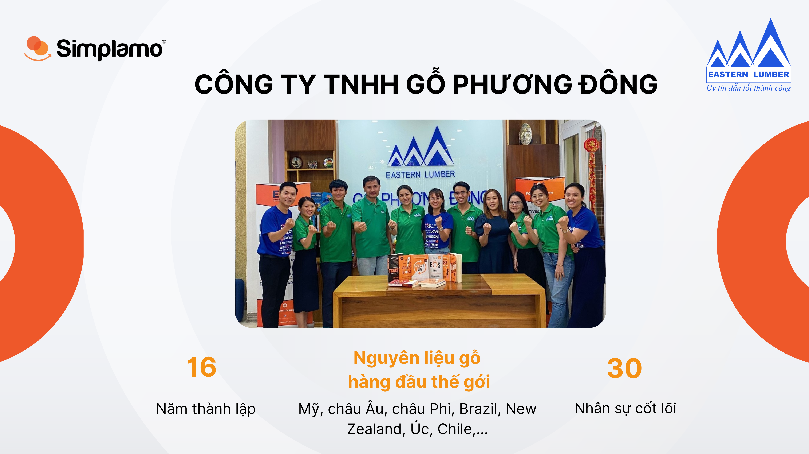
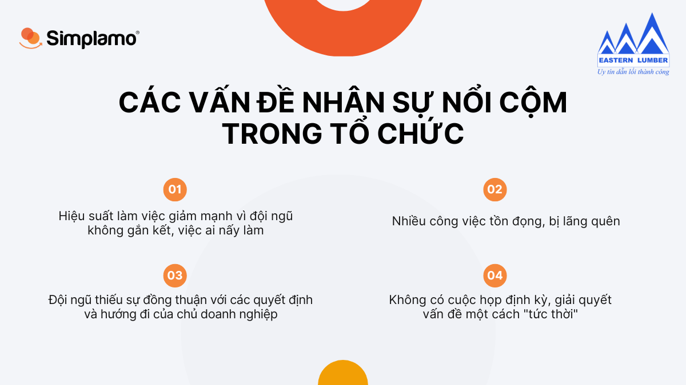
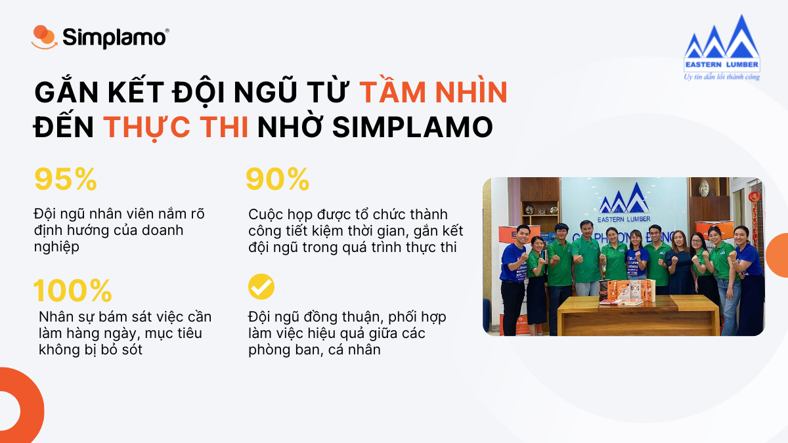
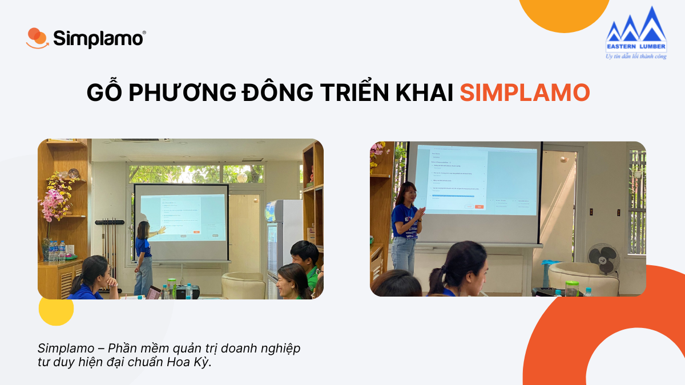

Founded in 2007, after more than 16 years operating in Vietnam’s wood market, [Gỗ Phương Đông](https://gophuongdong.com) Co., Ltd. is currently one of the leading importers and distributors of raw wood materials. Its products are imported from many reputable wood manufacturers around the world, including the United States, Europe, Africa, Brazil, New Zealand, Australia, Chile, and more.

Ms. Trương Tuyết Thanh – CEO of Gỗ Phương Đông – brought the Simplamo team a thoughtful story worth sharing from her journey of running a business. During a meeting with Simplamo, Ms. Trương Tuyết Thanh confided: “I am carrying **many roles** and **responsibilities** in the organization. At this moment, I feel exhausted and pressured because there is so much work that must reach me before it can be resolved.”

## 1. Many prominent problems in the organization: where is the root cause?

***One cause, many problems appear***

While operating Gỗ Phương Đông, Ms. Thanh could not find a common voice between herself and the team. One truth she realized was that the team was there and the people were there, yet there were still many gaps. People were **hesitant to share** and **did not speak up for the common good**. This made everything disconnected; departments worked very separately, and in the end more and more problems appeared. Some of the issues Ms. Thanh faced at that time included:

- **Team performance was hindered:** Departments operated without connection, and employees did not fully understand their own importance to the organization’s shared goals.
- **Many tasks were backlogged or forgotten:** Gỗ Phương Đông was a business on a strong growth path and had achieved many proud accomplishments. However, alongside this growth, the company’s workload kept increasing and required a suitable method so the business would not lose balance. At this point, Ms. Thanh had difficulty controlling work across departments; many tasks were overloaded and missed.
- **No regular weekly meeting – solving problems “on the spot”:** The absence of recurring meetings with a fixed framework meant Ms. Thanh could not track progress on planned activities and lacked timely assessments to make quick decisions. Meetings at Gỗ Phương Đông were not organized around a fixed structure and happened immediately whenever daily problems arose, consuming both her time and the team’s energy during work.

As these problems became increasingly clear, through the implementation session with the Simplamo team, Ms. Thanh realized that the causes above originated from **not effectively communicating the company’s vision and mission to the team**. Because of this, things could not yet be aligned and work performance could not be maximized.

Every business is a spiritual child born with its own distinct vision and mission, carrying the personality, soul, and aspirations of its owner. It becomes even more wonderful when these things are **shared** by the team inside the organization and lived together with them.

## 2. Gỗ Phương Đông connects the team from vision to execution on Simplamo

- **Building Vision and Mission on a single platform**

Simplamo helped Ms. Thanh communicate her vision and mission to the team on one unified platform. Members began to understand and share Gỗ Phương Đông’s vision; Ms. Thanh’s core values were also “brought back to life” within the organization. The team now worked toward a common goal, and everyone in the organization shared one voice.

A company’s vision and mission do not have enough value if they are communicated only once. They must be reflected throughout the company’s execution of strategies and plans, including the team’s implementation process. Simplamo helps Gỗ Phương Đông put the organization’s vision and mission onto the software, allowing everyone to continuously “communicate” with this living document. More deeply, throughout the journey of executing goals and strategy, the team always holds onto the company’s core values and spirit.

- **Weekly meetings help remove distance between members**

When using Simplamo in the organization, Ms. Thanh began holding **regular** weekly meetings and solving problems in a more systematic and scientific way. The team discussed together and made decisions quickly.

Through weekly meetings, for the first time she saw that people still wanted to share and contribute ideas for the common issue; it was just that previously Gỗ Phương Đông did not have the right meeting method.

- **Staying close to work so goals are not missed**

With the weekly goal and metric measurement board on Simplamo, Ms. Thanh could closely follow the company’s execution progress. Previously, she tried to shoulder too much work and could not control it. Now Simplamo has helped her manage and monitor goals, including daily tasks, more effectively and eliminate the situation of tasks being forgotten.

Hopefully, with Simplamo’s companionship, Ms. Trương Tuyết Thanh – CEO of Gỗ Phương Đông – will build a healthy, united team that acts for the company’s common good.

—————————————————

[Simplamo](http://simplamo.com/) – modern scientific goal-management software with a unique combination of KPI and OKR. It turns complex operations into something simple and close to every employee. It releases pressure for leaders, focuses on what matters, and optimizes work performance for businesses.

Start experiencing Simplamo and feel the change after only four weeks!

Register for a Simplamo demo at: <https://app.simplamo.com/sign-up>

