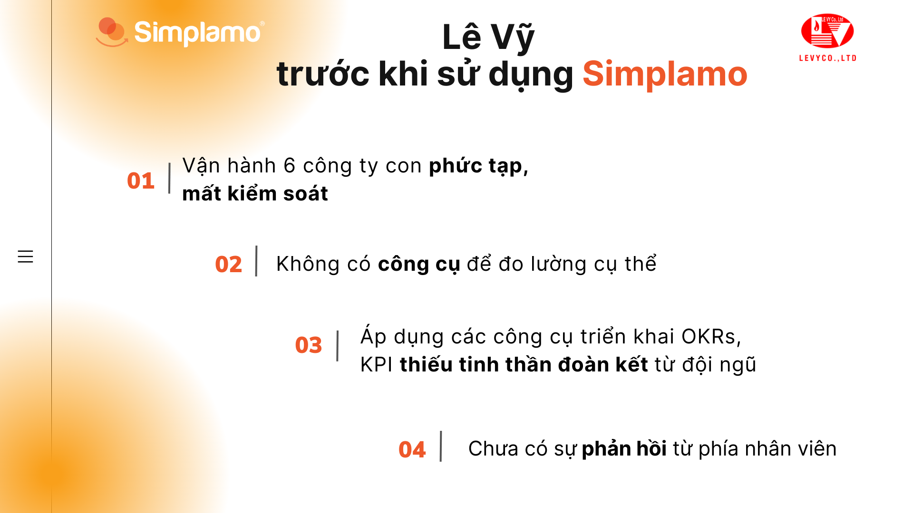
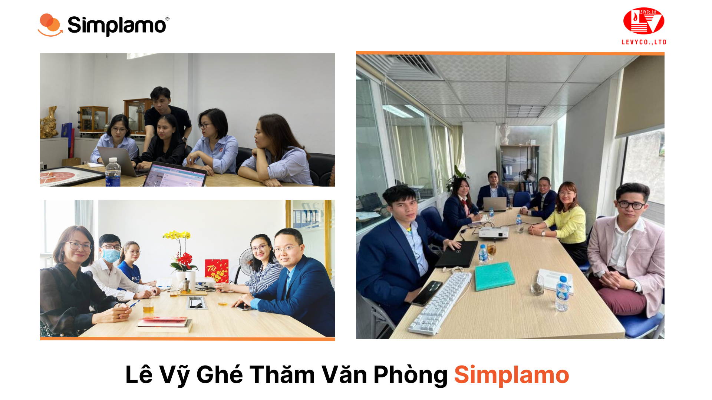
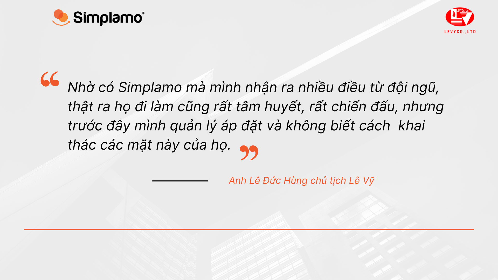

*Founded in 2007, Lê Vỹ operates in manufacturing, trading, and services for refractory materials, insulation and heat-insulation materials, technical services, kiln construction and installation, and products for the steel, foundry, casting, gemstone, and feng shui stone industries. Today, Lê Vỹ has six subsidiaries operating within its ecosystem.*

*Like many other business owners, **Mr. Lê Đức Hùng** — Chairman of Lê Vỹ — carried the aspiration to develop his brainchild while steering the company forward. However, operating six subsidiaries in different fields, each with different processes, created many management difficulties and left Lê Vỹ in a state of slow growth.*

## **Multi-industry operations and the challenge of finding a “synchronized” operating framework**

In 2021, Lê Vỹ’s activities tended to be fragmented, and the leadership team faced difficulties in managing and operating the business. This opened up the challenge of finding a solution that could help operate the chain of subsidiaries in a more unified way. The question raised by Lê Vỹ’s chairman at the time was: “If six companies operate with six different management systems, the difficulty and complexity will increase significantly. Therefore, finding a unified management method is essential.”

Some of the issues Lê Vỹ faced at that time included:

- The operating processes of six subsidiaries were complex, unsynchronized, time-consuming, and overlapping.
- The company’s overall situation could not be controlled effectively.
- Some team members did their jobs well, but there was no tool to measure results specifically.
- OKR and KPI implementation tools were applied, but the team lacked a spirit of unity.
- Strategy came one-way from the leadership team and had not yet received sufficient agreement, feedback, or execution commitment from the team.

## Using the quiet period of Covid 2021 to solve the problem of synchronized business operations with Simplamo

When he clearly saw the company’s core obstacles, Mr. Lê Đức Hùng realized that finding a unified operating framework would be the “trump card” that helped Lê Vỹ control the operating engine of its ecosystem. Especially in the era of digital transformation, finding software that allows leaders to manage many companies at the same time is what many businesses are aiming for.

When the economy was heavily affected by the pandemic, Lê Vỹ’s activities slowed down. Taking advantage of this period, Mr. Lê Đức Hùng spent more time searching for an effective operating method for the business. However, meeting many consulting firms made him **even more confused**, and he could not clearly see where the company’s problems were in order to fix them in time.

Lê Vỹ found Simplamo through a talk show and realized that Simplamo represented something simple and easy to understand, answering the questions the business was asking at the time. After only three months of operation, Lê Vỹ saw many clear changes:

- First, Simplamo brought a **synchronized operating framework** for the subsidiaries on a single platform, with unified operating processes across the ecosystem and everything becoming much simpler.
- Second, the **accountability chart** on Simplamo brought clarity and transparency, helping every employee understand their own role and their colleagues’ roles.
- Third, building the **Scorecard** on Simplamo helped Lê Vỹ look deeper into each business activity without spending too much time. Previously, waiting for monthly reports was a weakness in identifying problems and solving them promptly. The Scorecard helps Lê Vỹ see how the company is operating every week, with indicators closely tied to the business goals that have been set.
- Fourth, the **weekly meeting** framework helps Lê Vỹ truly connect and motivate the team. People often tend to hide problems, hide negative things, and feel afraid to share. Simplamo’s weekly meeting framework helps the team share openly and solve problems scientifically. This encourages employees to exchange more and look at issues from the perspective of the company’s interests.

## **Breakthrough growth thanks to a synchronized operating framework for the “multi-tasking” company system**

At the time of this story, it had been one full year since Lê Vỹ decided to use Simplamo. Simplamo had earned the recognition and affection of Lê Vỹ’s leadership team through the practical achievements the software delivered:

- A **synchronized operating framework for six subsidiaries** that is simple, easy to use, and integrated on one platform.
- **200% growth** after one year of operating the business on Simplamo. At the end of 2022, Simplamo received feedback that Lê Vỹ’s revenue had grown by 200% after one year of using the software, marking a milestone in which the business reversed course and achieved strong growth.
- A **35% reduction in time** spent on meetings, improving work performance.
- A healthy, proactive, and responsible team was built.
- The company could grasp business activities in time and make sound business decisions.

“Simplamo is very practical, simple, and exactly what I need.

We used to think that business management was something very grand and complicated, but in fact it means going into daily activities and being able to manage those daily activities.

Simplamo gives me a synchronized operating framework for the subsidiaries, even though they are in different fields. It also improves employees’ self-discipline at work instead of everyone waiting for direction from the board of directors as before. Thanks to Simplamo, I discovered very different sides of the team. In fact, they come to work with dedication and fighting spirit, but previously I managed in an imposing way and did not know how to draw out those sides of them,” Mr. Hùng shared.

With Simplamo’s companionship, we hope operating the “multi-tasking” companies in the Lê Vỹ Group ecosystem will become easier, more unified, and especially continue to grow throughout the journey ahead.

—————————————————

[Simplamo](https://simplamo.com/vi/) – A modern, scientific goal-management software that uniquely combines KPI and OKR. It turns everything complex in management into something simple and familiar for every employee. It frees leaders from pressure, helps them focus on what matters, and optimizes business performance.

Start experiencing Simplamo and feel the change after only four weeks!

Register for a Simplamo demo at: <https://app.simplamo.com/sign-up>

