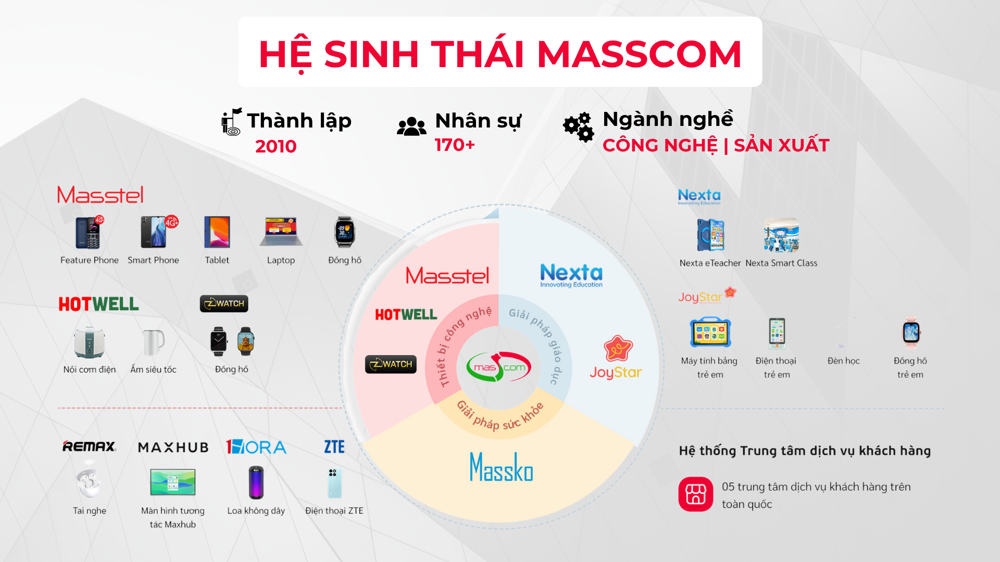
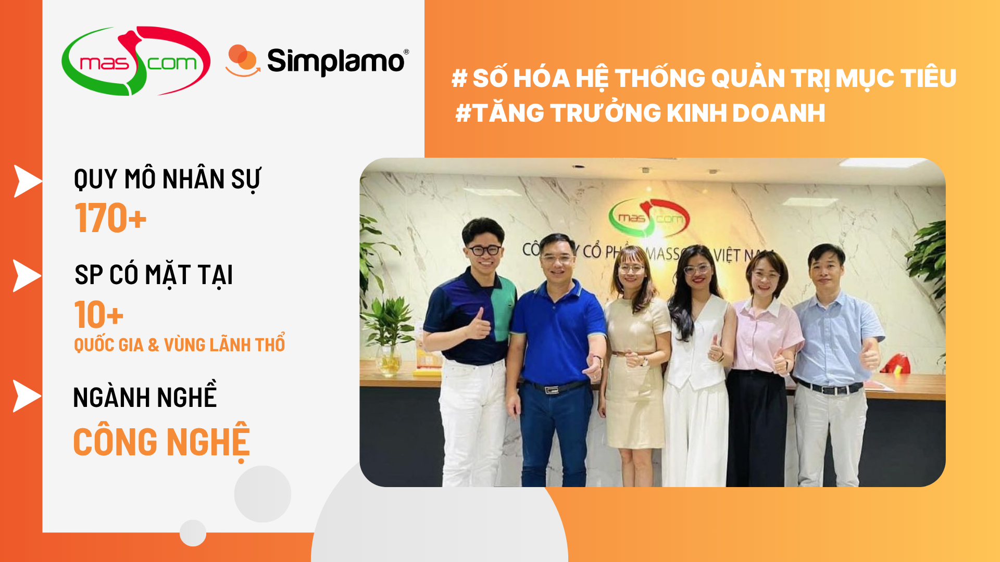

## I. From a big Vision to a clear execution system

Founded in 2010, Masscom Vietnam is one of the fast-growing domestic technology companies, with a team of more than 170 employees nationwide.

The company owns a diverse product ecosystem, from smartphones and tablets to smart home appliances, distributed through a nationwide network.

**Masscom's Vision:** “To become the leading company in providing an ecosystem of mobile device products and integrated hardware-software solutions at optimal cost.”

To develop sustainably, scale up, and conquer its long-term Vision, Masscom needed a **system that could connect goals from strategy to operations, clarify responsibilities, and ensure execution discipline.**

Simplamo met exactly that need with a **visual, systematized approach and clear layered alignment among SBUs**. On September 23, 2023, Chairman Nguyen Sy Phap decided to implement Simplamo as a tool to drive strategy execution across the enterprise.

## II. Rebuilding the operating system: clear roles – clear goals – clear actions

### **1. Organizational structure & people**

Masscom began by building a **Responsibility Chart for its SBUs**. The leadership team had the opportunity to “look at” and define the right organizational structure for the whole company in its new stage, **clarifying five key roles for each position** and eliminating previous “misunderstandings” about roles and responsibilities.

*While a traditional organizational chart is limited to titles and the people holding them, the Responsibility Chart on Simplamo emphasizes each member's core functions and responsibilities, creating the foundation for breaking down goals to the right people in the right positions.*

**Results delivered:**

- Optimized the use of available resources and improved work performance
- Departments coordinated more effectively because they understood one another's functions and roles

### **2. Building strategic Goals**

With coordination and guidance from Simplamo experts, Masscom's leadership team broke down its long-term Vision into annual Goals and **completed the list of strategic Goals for Q4/3023**. Each Goal was assigned to a directly responsible owner and had a clear action plan measured weekly.

The Goals created on Simplamo were no longer distant or merely formal. They became **clear, easy to understand, easy to deploy and measure through smart work plans, highly impactful, and clearly showing each department's and individual's responsibility toward shared Goals.**

**Results delivered:**

- The long-term Vision was translated into concrete action, creating team alignment
- The leadership team could easily track progress on quarterly Goal execution
- The team focused on the right important work with high commitment, optimizing work performance

### **3. Establishing a measurement and reporting system**

Masscom designed a Scorecard with 5–15 KPIs reflecting business and operating performance, removing complex indicators that caused distraction. These indicators were measured and updated weekly, displayed visually on the dashboard.

**Results delivered:**

- Bottlenecks could be detected in time before they became serious problems
- Data became transparent and clear, helping forecast the likelihood of achieving quarterly and annual Goals
- The leadership team could quickly grasp the week's business situation without waiting for reports from the team

### 4. **Periodic execution reporting meeting rhythm**

Masscom applied Simplamo's standard seven-step weekly meeting framework, from updating goals and reviewing KPIs to resolving priority issues. Each meeting lasted 90 minutes with a clear, consistent structure every week.

**Results delivered:**

- Improved meeting effectiveness: clear goals – the right people – decisions made during the meeting
- Helped the team maintain a steady execution rhythm and stay close to the plan
- Limited unfocused meetings that lacked action conclusions

## III. Breakthrough growth from a clear goal system

After nearly one year of implementation, Simplamo not only helped Masscom build a **clear strategic system** but also created a **disciplined execution culture**, where every member understands their role and moves together toward shared goals.

Impressive results achieved:

- Masscom **GREW 100% in 2024**, continues to set growth targets for 2025, and is among the few companies to grow strongly during a difficult economic period
- The entire goal execution system was digitized and managed in sync on Simplamo, tightly linking strategy with operations
- Work performance increased thanks to a clear goal reporting system and structured operating meetings that enabled fast decisions
- The team developed shared understanding, unity, and a common voice on issues and the long-term Vision

Wishing Masscom continued growth and acceleration toward becoming the leading enterprise in domestic technology in the Vietnamese market!

### **Are you also running a company with many SBUs like Masscom?**

Let Simplamo accompany you in building an **aligned – simple – effective** system that helps turn strategy into reality and accelerate execution from the very first week.

👉 [**Register to meet a Simplamo expert here to receive advice tailored to your business.**](https://app.simplamo.com/sign-up?lang=vi)

…

Simplamo – Excellent Goal Management & Execution, applying KPI, OKRs, BSC, and 4DX. A tool that helps executive boards and boards of directors track and drive Goals effectively, improving performance.

Start experiencing [Simplamo](https://www.facebook.com/simplamocom) and feel the change after only four weeks!

Register for a [Simplamo](https://www.linkedin.com/company/79564065/) demo at: <https://app.simplamo.com/vi/sign-up>
