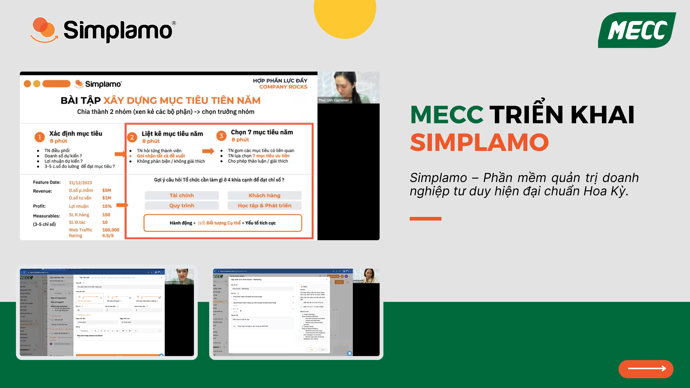

## 1. Overview of MECC

Vietnam Industrial Electromechanical and Construction One Member Limited Liability Company (MECC) is one of the companies that has built a strong reputation in the field of electrical supply and installation. With the motto “professional – efficient – trustworthy” and people as the core factor for development, the company is increasingly affirming its position in construction and growth. Its main areas of operation include: construction and installation of electrical works, national highway lighting, supply and installation of generators, transformer station equipment, electrical cabinet and panel systems, and more.

**Mr. Hoàng Trọng Hưng – Founder of MECC** wants to build a **structured operating framework** that helps the team focus on goal execution, bring management knowledge to the entire team, create a foundation for achieving business goals, and advance further in the market.

After learning about and applying Simplamo on October 10, 2023, and recognizing that **Simplamo is software with a management mindset**, he believes that applying Simplamo will help the team enhance leadership and management capacity, thereby driving successful goal execution.

## 2. MECC Enhances Leadership Capacity and Executes Goals Effectively with Simplamo

Below are several activities the company carried out during its journey of applying Simplamo:

### **2.1 Building an accountability chart on Simplamo – reshaping the company’s operating structure**

During the first implementation session, Simplamo’s expert team supported MECC’s leadership in building an accountability chart: simple, yet specific in showing the function and the five most important roles the company needs for each position.

Through the process of building the accountability chart on Simplamo, MECC was able to:

- Redefine the **necessary structure** for the company over the next 6–12 months.
- Create clarity and alignment in management.
- Create strong motivation and commitment from the team as they better understand their work responsibilities in relation to the company’s shared goals.

### **2.2 Building quarterly priority goals – orienting the execution process**

After completing the accountability chart, MECC’s leadership team worked together to build quarterly priority goals. Starting from the company’s long-term vision, including the 10-year goal and the three-year picture, they created a shared direction: for the next year and specifically for each quarter.

**The important thing is not only setting goals, but also clarifying the milestones and specific work needed to achieve those goals.** Through this, the team not only identified a concrete execution direction, but also created a detailed roadmap that helps each member better understand the work that needs to be done.

When goals are implemented with connection to each person’s clear role, the team becomes more flexible and autonomous in its work. At the same time, thanks to transparency, MECC’s leadership team eliminates overlap between functions and avoids wasting time and resources caused by unclear roles and goals.

### **2.3** **Building the Scorecard metrics board**

Building the Scorecard not only helps the MECC team set 10–15 core indicators to **track business activities in the coming period**, but also serves as an important tool that helps the company **better understand the overall picture at each “present” moment**. It helps MECC’s leadership team evaluate the situation and drive strategic decisions based on detailed and timely information.

### **2.4 Organizing a weekly meeting framework to connect the team**

The process of organizing Simplamo’s seven-step weekly meeting was the part that **brought the most noticeable change** felt by MECC’s leadership team, as they saw the team become more connected through the section where everyone shares one good piece of news from work and personal life.

*MECC’s leadership shared: “After organizing the weekly meeting, I felt the team became more connected. When reviewing work every week, members always shared and solved problems together, instead of everyone doing their own work as before.”*

Simplamo’s expert team received alignment from the entire MECC team. As management knowledge on Simplamo was delivered to everyone, we believe that in the coming time, MECC will build an effective business operating foundation, achieve its business goals, and develop sustainably.

*Mr. Hoàng Trọng Hưng shared: “Applying Simplamo has initially helped MECC and the whole team review themselves, see both the good points and the not-so-good points, and bring everything back to something simpler but more scientific. I hope that in the coming time it will help everything become more structured and promote the company’s growth.”*

[<https://simplamo-cdn.simplamo.com/wp-content/uploads/2023/11/mecc-quyet-dinh-trien-khai-simplamo.mp4>](https://simplamo-cdn.simplamo.com/wp-content/uploads/2023/11/mecc-quyet-dinh-trien-khai-simplamo.mp4?_=1)

—————————————————

[Simplamo](https://simplamo.com/vi/) – modern scientific goal-management software that uniquely combines KPI and OKR. It turns the complexity of running a company into something simple and approachable for every employee. It relieves pressure on leaders, helps them focus on what matters, and optimizes work performance for the business.

Start experiencing Simplamo and feel the change after only four weeks!

Register for a Simplamo demo at: [https://app.simplamo.com/sign-up](https://app.simplamo.com/sign-up?lang=vi)

