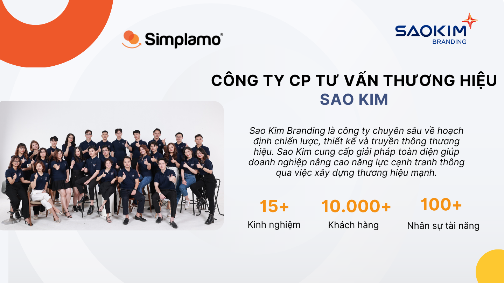
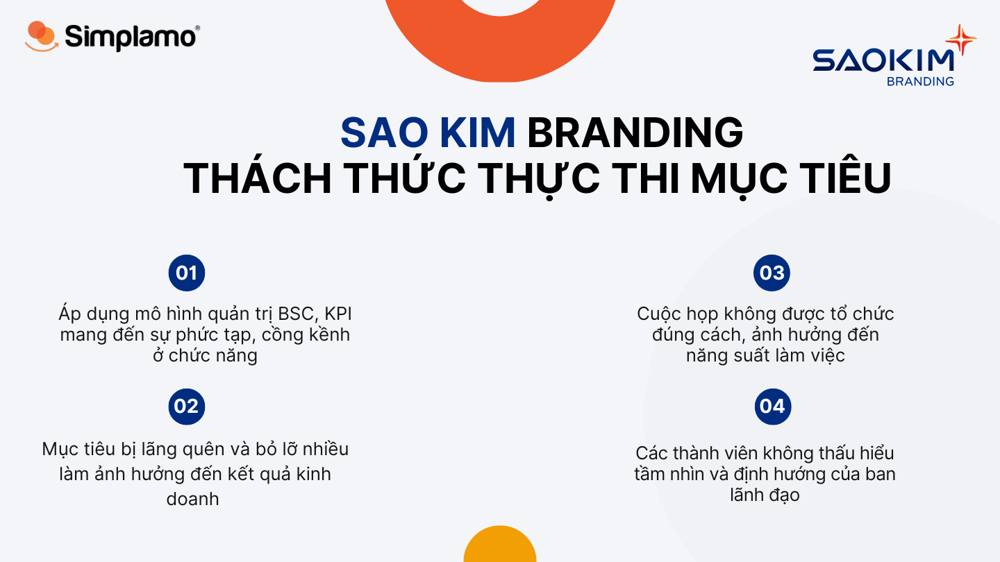
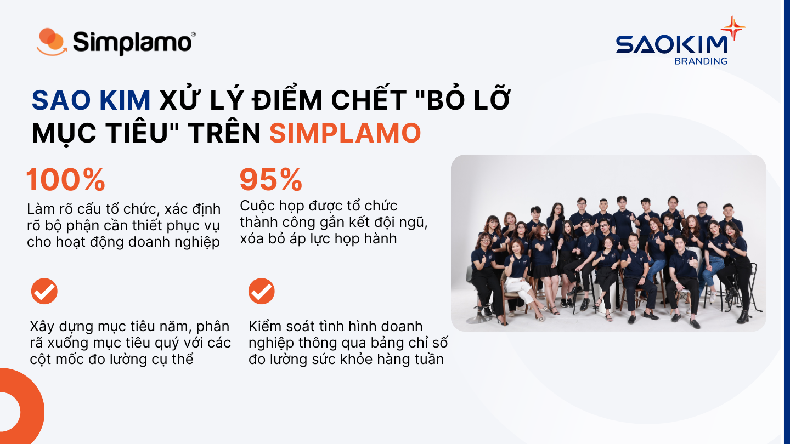

Sao Kim Branding is a company specializing in strategic planning, design, and brand communications. The business provides comprehensive solutions that help customers improve competitiveness through building strong brands. Currently, Sao Kim has earned the trust of more than 10,000 customers, has more than 15 years of experience in the field, and with more than 100 talented employees, has been delivering customers the best service quality.

## 1. The barrier of missed goals and complexity in operations

As a business operating in the agency field, Sao Kim faces many difficulties specific to its industry when dealing with pressure from human resources, a fiercely competitive market, and the need to control many projects. On the other hand, Sao Kim is a business on a growth trajectory, and the personnel system built previously no longer strongly supports the company’s growth. Mr. Nguyen Thanh Tuan – CEO of Sao Kim – encountered many obstacles in his operations.

Some operational difficulties that Mr. Nguyen Thanh Tuan – CEO of Sao Kim – faced:

- Using popular management methods today such as **BSC and KPI models brings complexity** and cumbersome functionality. In an environment that always demands speed and quickness, using complex tools only causes the team to spend more time and human resources on unnecessary work, strongly affecting the team’s productivity.
- **Goals were “forgotten” by the team and missed quite often**. When facing many projects at the same time, Sao Kim needs a tight goal management method that is clear from the company level down to departments and individuals so the company’s projects can proceed on schedule. Mr. Tuan also did not yet have an effective method for tracking goal execution progress, and could not promptly propose solutions when the team’s execution process became “blocked.”
- Meetings were organized regularly, but not in the right way; people only focused on solving problems, **putting pressure on the team’s work performance**.
- Mr. Tuan had applied methods to communicate the vision and connect the team, but members had not absorbed it deeply enough because it could not be reminded and reviewed regularly.

In the coming time, Mr. Tuan – CEO of Sao Kim – also wants to develop an ecosystem consisting of 10 member companies with independent functions. Therefore, he needs to reorganize the organizational structure, remove complexity from the operating system, and promote a smoother goal execution process.

## 2. Simple management thinking – laying the foundation for seamless goal execution

Mr. Nguyen Thanh Tuan – CEO of Sao Kim – operates the business with core values that always aim toward goals and create positive results. Understanding the importance of SIMPLICITY in business management, he came to Simplamo and recognized it as the management software he had been looking for. Simplamo brings together modern management thinking, answers the difficulties Sao Kim encountered in goal execution, and above all, offers an extremely simple yet intelligent management approach, something he had not seen in previous management software.

On April 20, 2023, Sao Kim officially kicked off the project to operate the business on Simplamo. Through the first implementation session, it helped Sao Kim’s leadership team:

- **The accountability chart – diamond filter funnel** helped Sao Kim identify the necessary functions to serve business operations well over the next 6–12 months. The leadership team discussed and clarified the five main roles that members take on in their positions, shown transparently in the software. In the new positions, the leadership team could recognize which personnel needed to be added in the coming time.

In this first task, Simplamo experts supported Sao Kim’s leadership team in identifying the necessary positions in the organization themselves and building the most “right structure” and clearest structure for Sao Kim. This will also be the foundation that helps the team move from transparency in roles and responsibilities to clarity about who is responsible for the company’s goals.

- **The next direction: building the annual picture for the business and a clear quarterly execution roadmap – handling the dead spot of missed goals for the business**

After the Sao Kim team agreed on the accountability chart that had been built, Simplamo experts guided and supported Sao Kim’s leadership team in sharpening the “annual goals” into specific execution-driving indicators. The annual goals were also broken down into each quarter, creating specific milestones for the team to check in on and track every week.

To handle the “missed goals” dead spot, Simplamo helps clearly show the execution roadmap in the software; goals are broken down into Milestones so the team continuously follows them and pursues the goals to the end.

**

*When problems arise from “complexity” in operating processes, they make it very difficult for businesses to solve them; sometimes they are too “slippery” to recognize and grasp. More than ever, businesses need simple software that can remove what is complex, and only then accelerate execution. Hopefully, implementing Simplamo will help Sao Kim systematize and rearrange the organization in a more orderly and scientific way, and execute goals more effectively.*

**

*In the coming time, Simplamo will continue accompanying Sao Kim to complete the operating system on the platform.*

—————————————————

[Simplamo](https://simplamo.com/vi/) – modern, scientific goal management software that uniquely combines KPI and OKR. It turns everything complex in operations into something simple and approachable for every employee. It frees leaders from pressure, helps them focus on what matters, and optimizes work performance for businesses.

Start experiencing Simplamo and feel the change after only 4 weeks!

Register for a Simplamo demo at: <https://app.simplamo.com/sign-up>

