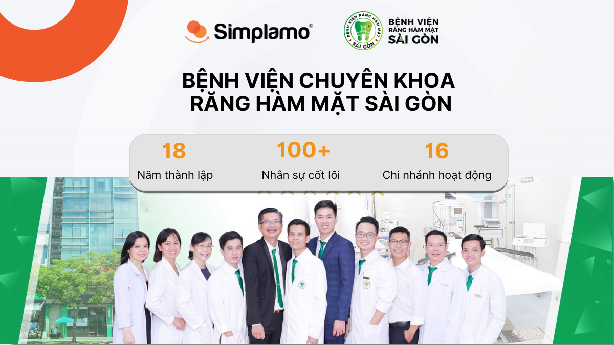
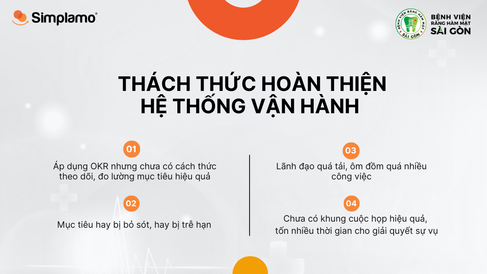
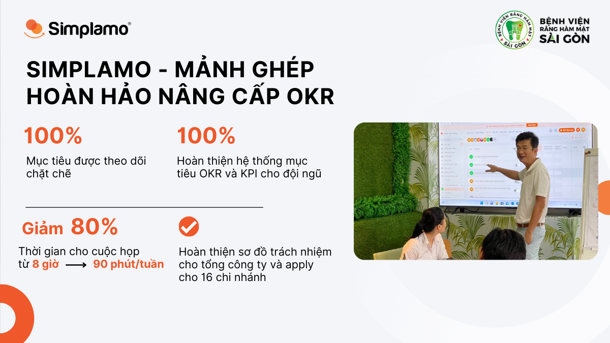
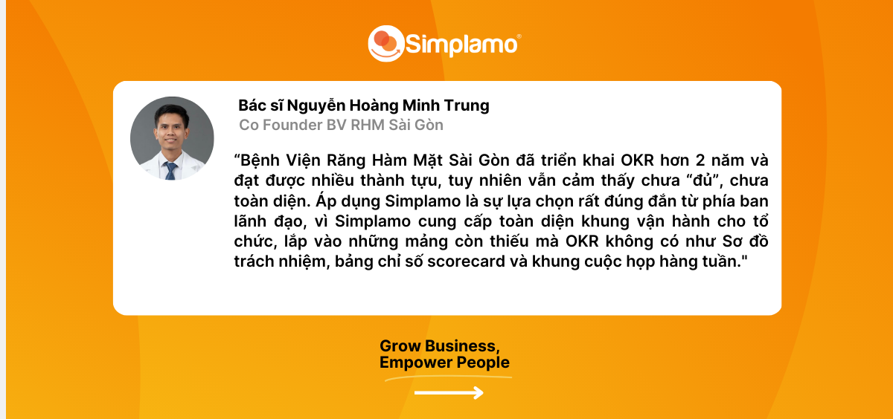

*After applying OKRs to business operations since 2020, Saigon Odonto-Stomatology Hospital (BV RHM) had built an OKR goal-management system for its team. However, OKRs alone were not enough. The hospital’s leadership recognized that **there were still many management gaps that needed to be filled**, and this created a strong connection with Simplamo — a comprehensive business management software platform built on modern U.S.-standard thinking.*

## **1. Odonto-Stomatology Hospital – OKRs are not enough**

[Saigon Odonto-Stomatology Specialist Hospital](https://benhvienranghammatsg.vn) is the first private odonto-stomatology hospital in Ho Chi Minh City. The business has continuously expanded and equipped itself with modern dental diagnosis and treatment devices, with 16 active branches. In addition, BV RHM constantly improves its professional quality and service processes, strengthening its position as one of Vietnam’s leading reputable dental brands.

With the goal of improving work productivity and achieving business targets, BV RHM began applying OKRs in 2020. With strong effort and determination from leadership, after three years of persistent application, BV RHM achieved several important objectives. Yet according to Dr. Nguyễn Quang Tiến, Director of BV RHM, that still was not enough.

OKRs provide a highly logical way to build and cascade goals while unlocking employees’ capabilities. In return, however, the business itself needs to already have a solid management system, including **strategic vision, an accountability chart, and recurring meetings**. That is why OKRs are very successful around the world but often fail in Vietnam. Understanding this, BV RHM decided to use **Simplamo to fill the missing pieces, maximize OKR effectiveness, and free up leadership.**

## **2. The challenge of completing the operating system**

Before finding Simplamo, BV RHM was facing several operational challenges:

- It was applying OKRs but **did not yet have an effective way to pursue and measure goal-execution progress**, so goals were often missed or delayed.
- It did not have an effective meeting framework and **spent too much time in meetings**, mainly meetings to handle incidents, with the same issues recurring again and again.
- **Leadership was overloaded**, taking on too much work and no longer having time for themselves or major projects.

After learning about Simplamo and being impressed by its simplicity, systematization, and powerful impact on the team’s mindset, BV RHM decided to adopt Simplamo in early December 2022.

To remove these challenges and complete BV RHM’s operating system, Simplamo’s expert team spent time systematically digitizing the most important parts of RHM’s business onto the software. Below are the project highlights:

- **Starting with the accountability chart**

With support from Simplamo, the system of 16 branches across Ho Chi Minh City, Cần Thơ, and Mỹ Tho, together with many functional departments, was displayed clearly on a single screen. Each seat on the chart was assigned **five roles and one main accountable person**. In this way, every employee gained an overall view of the system, how departments coordinate, and what each individual’s role is. **Transparency and clarity** are the first key points of a healthy organization, forming the foundation for delegating to the right people, freeing up leadership, and developing the team’s capabilities.

- **Completing the measurement system: Scorecard – KPI**

Inseparable from OKRs, KPIs are the right missing piece to ensure that all activities are progressing on schedule, provide a basis for evaluating employee performance, and identify organizational “risks.”

Starting by providing the mindset for building a correct and complete Scorecard for the business, Simplamo’s experts then accompanied BV RHM to complete the scorecard on the software — **the most important metrics the leadership team wants to understand every week**. The scorecard helps the business escape uncertainty and worry by breaking everything down close to weekly reality, making problems easier to recognize and solve in time.

- **Meetings – the soul that connects the team in the OKR execution process**

Before using Simplamo, meetings had been a painful issue at BV RHM for a long time. With 16 branches spread across many provinces and cities, bringing leadership together in a meeting, solving problems, and communicating effectively seemed nearly impossible.

**Wasted time, lost connection, and the same issue being discussed repeatedly without resolution** significantly affected the team’s working spirit.

Simplamo’s “Weekly Meeting” feature solved BV RHM’s bottleneck after only four meetings.

RHM’s meeting problem is similar to what Simplamo has seen in most businesses it has met. What the business needed at that moment was a way to organize effective meetings: structured, time-boxed, easy for reviewing KPI metrics and OKR goals, able to resolve issues fully into to-dos, automatically export reports to each participant, and work for both online and offline meetings. All of these features are available in Simplamo.

## **3. The system ran automatically after only 2 months of using Simplamo**

After two months of operating the business on Simplamo, BV RHM achieved the following impressive results:

- The **OKR goal system and KPI measurement indicators** were completed and unified across the system of 16 branches.
- The **accountability chart for the head company was completed and applied to all 16 branches**, ensuring goals are assigned to the right people and right work, supporting delegation, freeing leadership, and recruiting suitable personnel.
- **Meeting time was reduced by 80%** (from eight hours to 90 minutes per week), increasing the effectiveness of each meeting and resolving issues decisively.
- **100% of goals are closely tracked** and kept on schedule by the team.
- The leadership team became **more proactive at work**, knowing which important goals to focus on and how to deploy them effectively to lower levels.
- By clarifying roles on the accountability chart, Dr. Tiến gained a basis to **delegate** to the team, giving **leadership more time** to focus on investing in major projects and expanding branches.

With the systematic operating framework that Simplamo digitized and completed for BV RHM (Vision/Strategy, Accountability Chart, OKR Goals, Weekly KPI Scorecard), the **weekly meeting became the springboard** for the entire system to run automatically and smoothly over time.

By understanding one another and sharing the same view of every issue, BV RHM’s OKR goals became increasingly clear, gained stronger team alignment, and ultimately became easier to achieve than before. This was also what RHM had wanted from the beginning of the Simplamo project.

***BV RHM promises to grow stronger, expand branches to more provinces and cities, and improve service quality with a systematic management operating framework from Simplamo — comprehensive business management software built on modern U.S.-standard thinking.***

—————————————————

[Simplamo](http://simplamo.com/) – Modern, scientific goal-management software that uniquely combines KPIs and OKRs. It turns the complexity of management into something simple and approachable for every employee, releases pressure on leaders, focuses on what matters, and optimizes business work performance.

Start experiencing Simplamo and feel the change after only four weeks!

Register for a Simplamo demo at: <https://app.simplamo.com/sign-up>

