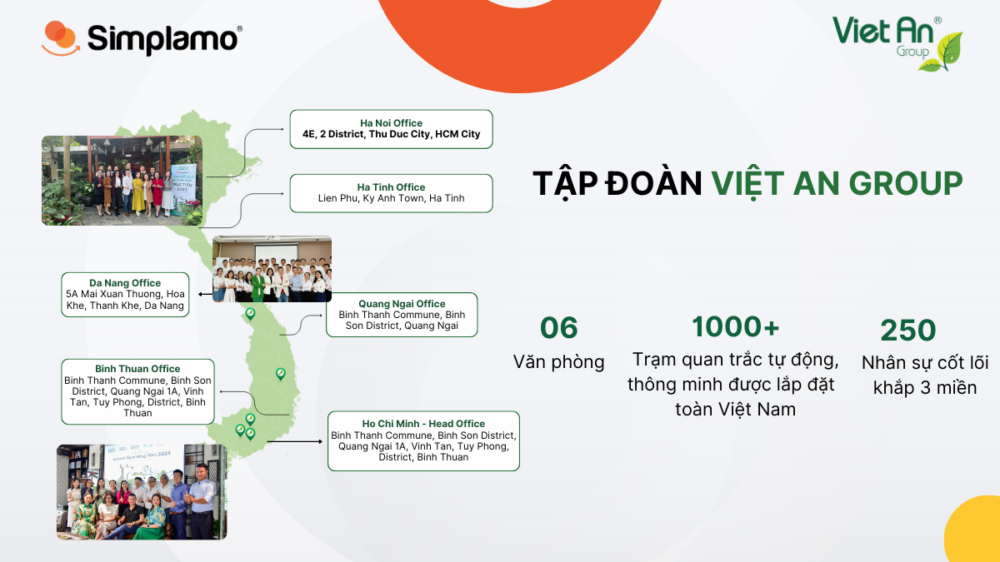
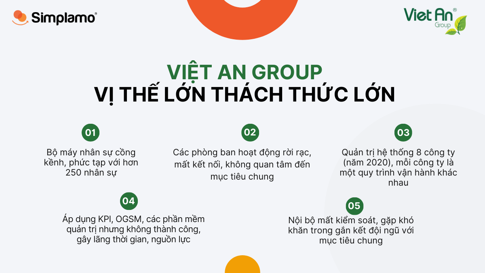
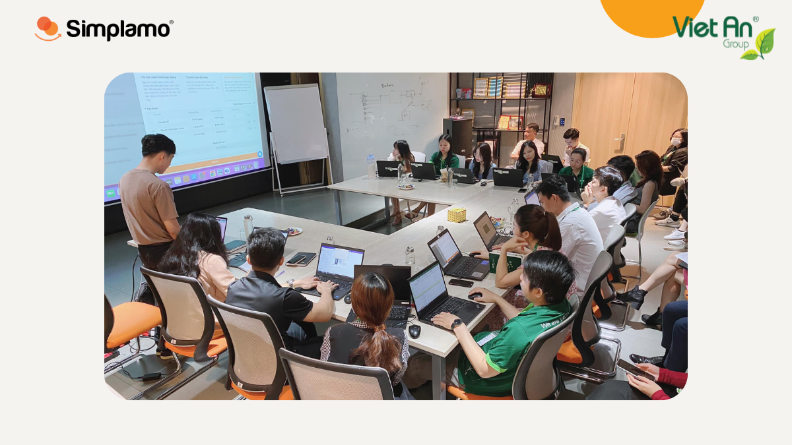
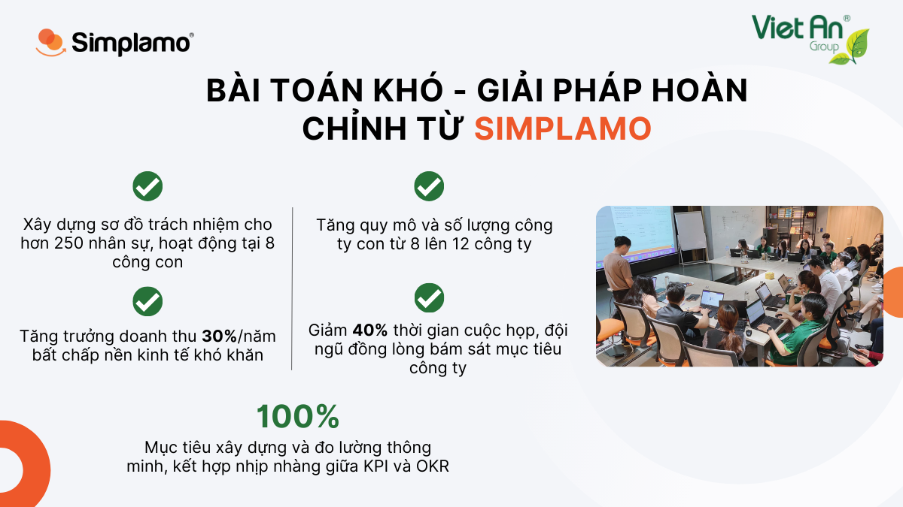
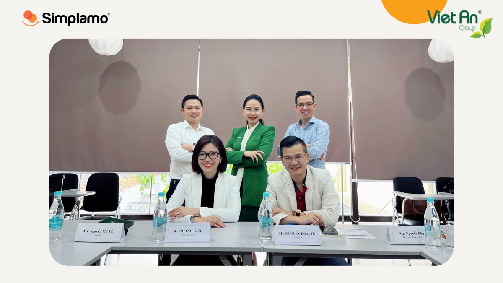
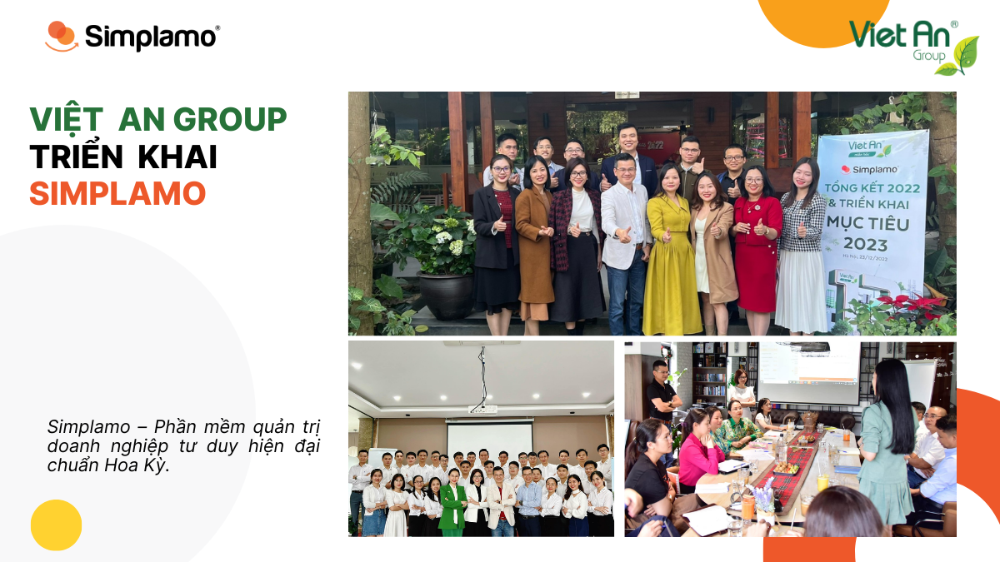
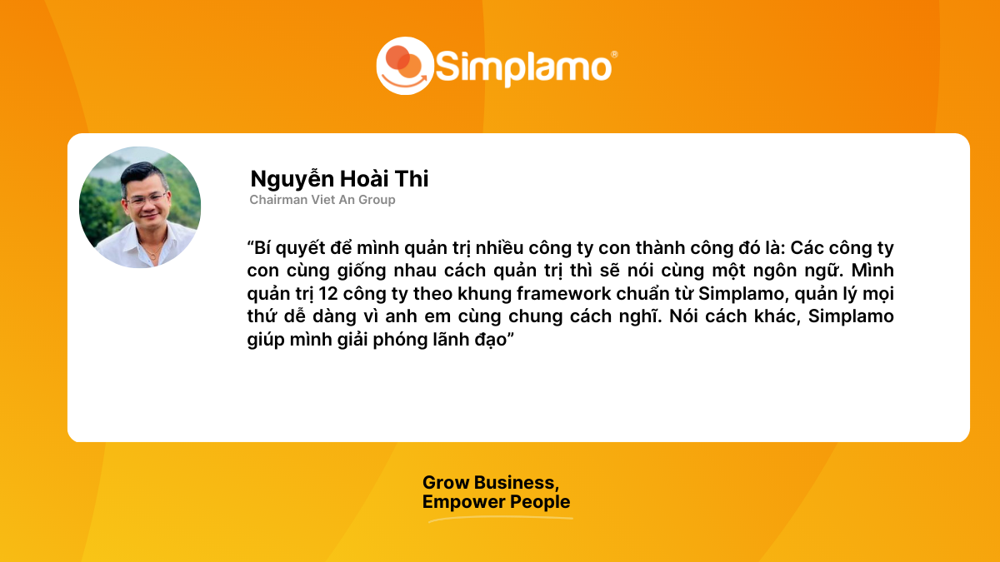

As an industry-leading business for many consecutive years, Việt An Group has continued to develop strongly, building its name and a deep mark in the market. Being in a major position does not mean there are no difficulties; Việt An Group’s problem is even more challenging than that of many other businesses because its ecosystem includes up to 12 subsidiaries and more than 250 employees operating across all three regions of the country.

## Việt An Group – Great position, great challenges

**[Việt An Group](https://www.vietan-group.com)** is a leading company in environmental monitoring and online analytical and measurement equipment, applying today’s leading technologies such as IoT, Data-center, and AI into its solutions. With more than 12 years of operation, Việt An Group has installed over 1,000 environmental monitoring stations and provided analytical and measurement equipment to factories to support smart manufacturing processes.

Việt An went through a period of very rapid development and maintained its position for many consecutive years. However, with the pressure of scaling and from being a market leader, more and more difficulties emerged. Việt An’s good fortune is that it has a highly enthusiastic leadership team that is willing to learn and face its own problems. They constantly search, experiment, and apply many different business management methods and software solutions.

Below are the challenges Việt An faced at the moment it came to Simplamo – a modern-thinking business management software:

- A bulky and complex personnel system with more than 250 employees
- Disconnection, with departments operating separately, not caring about shared goals, and each person focusing only on their own work.
- The leadership team struggled to manage a system of 8 companies (in 2020), each operating in a different way.
- Loss of internal control and difficulty connecting the team to shared goals, which caused many employees to leave
- KPI and OGSM had been applied but were unsuccessful, wasting time and resources over a long period
- There was no effective business operating software.

Facing the difficult problem from Mr. Nguyễn Hoài Thi – Chairman of Việt An Group – the Simplamo team believed that the comprehensive business management platform combining OKR and KPI, Simplamo, was exactly what Việt An Group needed at that moment.

## Difficult problem – Complete solution – Scientific implementation

Starting to use Simplamo in March 2021, Simplamo faced a big question from the Việt An team. They had applied many different complex management software solutions and methods but still saw no effectiveness, so could a software named **Simplamo – Simple & More**, simple and focused on the core, solve the problems that the big players could not?

Simplamo is simple, but if something simple can operate a business, that simplicity is the essence. Indeed, Simplamo is the crystallization of modern 21st-century management thinking.

Simplamo guides Việt An on using new features

Việt An organizes its 2023 business planning on Simplamo

To begin this journey, Simplamo started from the most fundamental elements of an organization, helping change the team’s mindset weekly and continuously over a long period.

- First, with Simplamo’s **Vision Board** tool, Việt An easily built a strategic vision board for its business clearly and in an easy-to-understand language. Through Simplamo, this Vision Board was widely communicated throughout the organization. Each employee understood the company’s core values, vision, and mission, thereby forming a common voice and building connection among departments and across the organization.
- Second, with a smart approach to **goal building** and measurement that combines KPI and OKR, Simplamo helps Việt An define quarterly goals to focus the team’s resources, reduce disorder, and closely follow the company’s activities every week.
- Third, and most importantly, Simplamo’s **weekly meeting** tool helps Việt An solve its current challenges. With a smart 7-step meeting framework integrated with a **problem-solving tool that creates todos and automatically sends reports**, Việt An was able to resolve a series of bottlenecks, connect the team from top to bottom, and continuously update feedback every week. Through this meeting tool, Việt An’s leadership team clearly understands the organization’s situation from top to bottom and saves many tiring hours in traditional meetings.
- Fourth, to address the reorganization of the organizational chart for more than 250 employees operating across 8 subsidiaries, Simplamo’s approach is to build a **responsibility chart** based on the basic functions of a business that can run well for the next 6 to 12 months. With flexible arrangement features and built-in scientific principles, Simplamo helps Việt An easily adjust and expand its chart to meet the company’s growth needs.
- Fifth, Simplamo’s **personnel evaluation** tool answered the difficult HR management problem at Việt An at that time. Simplamo provides one shared tool for all management and leadership levels at Việt An, creating an objective and simple evaluation framework with data extracted directly from other tools on Simplamo. As a result, Việt An saves more than **50% of personnel evaluation time** and has a method to increase the number of **“Right People Right Seat” to as high as 90%.**

The good thing about Simplamo is that with just one platform, the system of 8 subsidiaries at that time all operated on this same platform. By unifying this way of operating, Simplamo greatly reduced pressure on the leadership team, especially Chairman Nguyễn Hoài Thi.

Sharing from Ms. Hoàng Thị Kiều – Chief Executive Officer of Việt An Group:

*“Because I have participated in operating many businesses before, I understand that many businesses are facing difficulties similar to Việt An. And to solve them, businesses should use Simplamo software.*

*I truly hope that small and medium-sized businesses will soon find and apply Simplamo to solve management difficulties, focus time and resources on developing products and services, and increase value for customers.”*

Ms. Hoàng Thị Kiều with Việt An Group’s leadership team

## Impressive 30% annual growth thanks to Simplamo

As of now (December 2022), Việt An Group has applied Simplamo for nearly 2 years. In addition to successfully solving the problems stated at the beginning and building a standardized operating framework for its system of 12 subsidiaries, the following results have been achieved:

- Revenue growth of **30% per year** despite economic difficulties
- Increased the scale and number of subsidiaries from **8 to 12 companies**, developing strongly to capture market opportunities
- **Reduced meeting time by 40%**, significantly increasing work efficiency

The achievements to date are thanks to the determination and unity of the Việt An Group team and the enthusiastic implementation by Simplamo’s consulting team.

Sharing from Mr. Nguyễn Hoài Thi – Chairman of Việt An Group:

*“The secret to successfully managing many subsidiaries is this: when subsidiaries share the same management approach, they speak the same language. I manage 12 companies according to the standard framework from Simplamo, managing everything easily because everyone shares the same way of thinking. In other words, Simplamo helps free leaders.”*

With the working principle of bringing success to businesses and freeing leaders, Simplamo will continue to accompany Việt An Group in its upcoming sustainable development.

—————————————————

[Simplamo](http://simplamo.com/) – A modern, scientific goal-management software that uniquely combines KPI and OKR. It turns complex management into something simple and close to every employee. It frees leaders from pressure, helps them focus on what matters, and optimizes work performance for businesses.

Start experiencing Simplamo and feel the change after only 4 weeks!

Register for a Simplamo demo at: <https://app.simplamo.com/sign-up>

