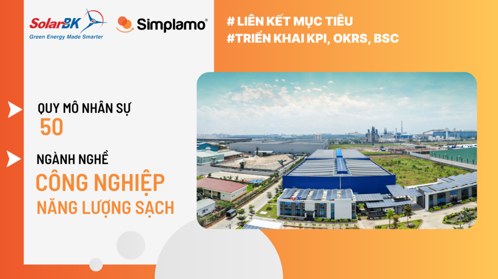
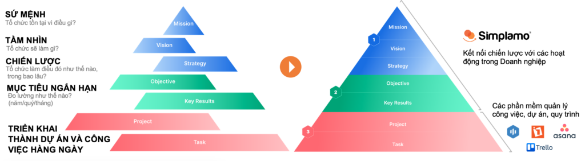
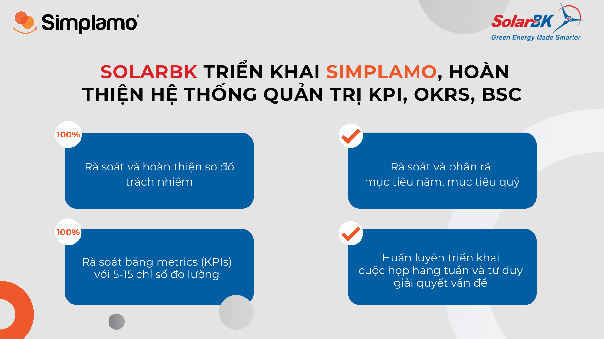

## **1. Overview of SolarBK**

With a research and development mindset built since 1975, SolarBK is proud to be a pioneer in developing the clean energy sector in Vietnam and is now a leading company in this field. Over more than 15 years, SolarBK has continuously affirmed the importance of bringing clean energy to the community, with the aim of building a greener and smarter living environment.

As a technical CEO with a professional background, Mr. Nguyen Duong Tuan — CEO of SolarBK — has always wanted to elevate corporate management in order to improve business performance. Mr. Tuan had applied many different management methods over a long period, such as KPI, OKRs, and BSC, and achieved certain results. However, those results still did not meet his expectations.

SolarBK is currently using several management software systems, such as Odoo for customer management and Redmine for project management. However, for Strategic Goal management (BSC), he was still using Excel, and this created many obstacles to synchronized implementation and to connecting Strategic Goals with daily activities.

After learning about Simplamo in 2023 and spending time exploring it, Mr. Tuan found that Simplamo had many differences and was exactly what he was looking for:

- First, Simplamo clearly shows the company’s **operating structure**, organizational structure, and synchronized operating method for departments.
- Second, Simplamo focuses on Goal & Strategy management, helping him **break down and deploy** Goals to the team effectively, **turning them into specific actions** for weekly execution.
- Third, Simplamo provides a unique goal-execution mindset through a **weekly execution meeting framework**, helping meetings be organized more effectively, the team execute in rhythm, and issues be handled efficiently every week.

*Simplamo helps connect Goals & Strategy with daily activities, removing SolarBK’s obstacles*

On January 12, 2024, Mr. Nguyen Duong Tuan officially applied Simplamo to business operations with guidance from Simplamo experts.

## 2. SolarBK implements Simplamo, completing its KPI, OKR, and BSC management system

During the implementation session, Simplamo’s expert team accompanied and supported SolarBK’s leadership team in completing the following tasks:

- **Reviewing and completing the accountability chart on Simplamo:** Simplamo experts supported the review of the accountability chart that had been built, ensuring that each member of the organization clearly understood their responsibilities, with five detailed roles for each position and close linkage between departments.
- **Reviewing and breaking down annual goals and quarterly goals into “specific actions”:** Simplamo experts supported the review of the goals that had been built, then guided the team in breaking them down into specific actions to achieve the best performance and track execution progress in an organized way.
- **Reviewing the metrics table (KPIs) with 5–15 measurement indicators:** Simplamo experts supported the review of important KPI indicators, from 5 to 15 core indicators, helping measure and evaluate business performance in a detailed and flexible way on Simplamo.
- **Training on weekly meeting implementation and effective problem-solving thinking:** To optimize the effectiveness of weekly meetings, Simplamo experts provided training on how to conduct meetings effectively, as well as problem-solving thinking to face challenges flexibly.

Through close guidance from experts and the visual presentation of data on the software, SolarBK’s leadership team became very **clear about the company’s Strategic Goals** for 2024 and **how to break Goals into actions** for weekly execution.

At the same time, everyone also grasped how to **execute goals synchronously and connect departments** into a unified whole through the weekly BOD meeting framework.

In the coming period, Simplamo will continue supporting SolarBK to complete its business operating process on the platform and deploy KPI combined with OKRs scientifically, in order to conquer the business goals set for 2024.

— – – – –

[Simplamo](https://simplamo.com/vi/) – A modern goal management & execution software that makes complex operations simple and accessible to every employee. It relieves pressure for leaders, helps them focus on what matters, and optimizes work performance for businesses.

Start experiencing [Simplamo](https://www.facebook.com/simplamocom) and feel the change after only 4 weeks!

Register for a Simplamo demo at: [https://app.simplamo.com/sign-up](https://app.simplamo.com/sign-up?lang=vi)

