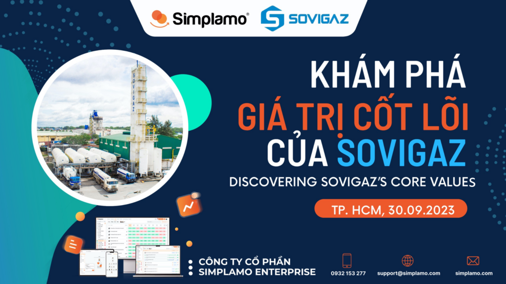
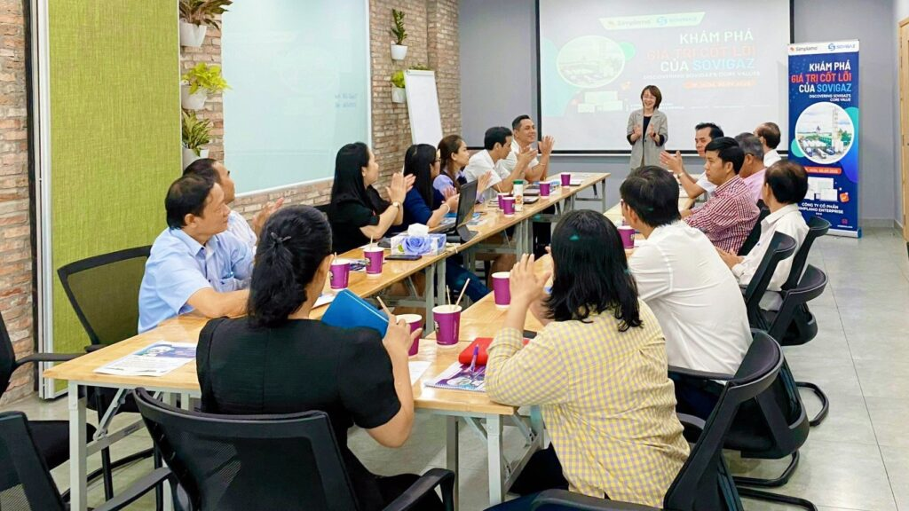
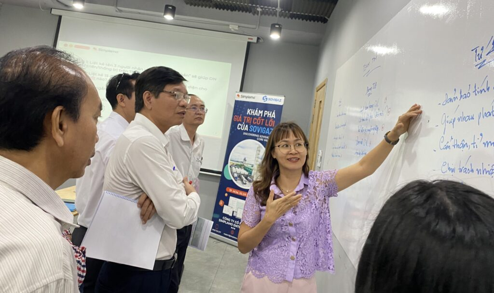
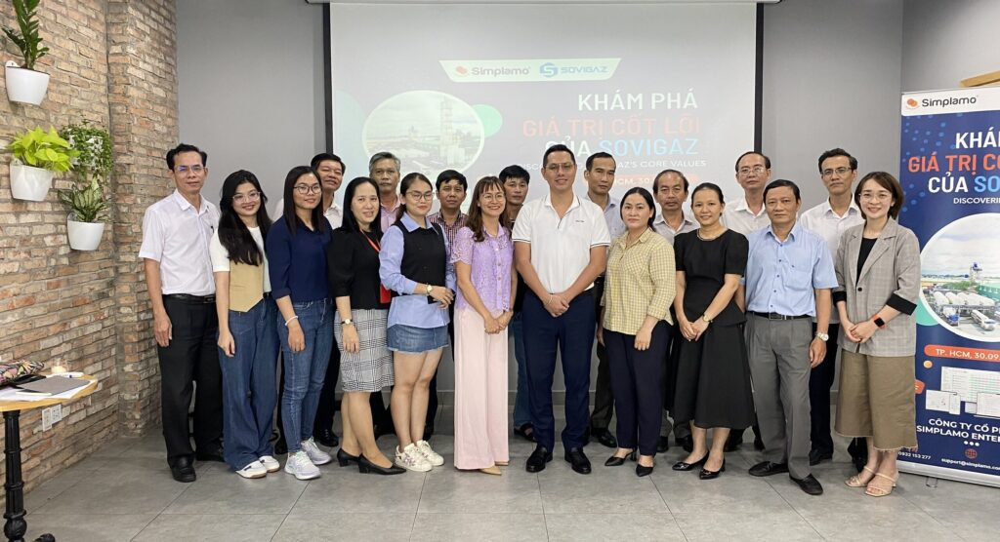

[Sovigaz](https://sovigaz.com.vn/) is a state-owned enterprise leading the production of medical gases, industrial gases, welding electrodes, and chemicals. Over more than 45 years of operation, Sovigaz has become one of Vietnam’s leading manufacturers of industrial gases, welding electrodes, and chemicals.

In June 2023, Mr. Trịnh Anh Phong – CEO of Sovigaz – adopted Simplamo software to help the team execute goals effectively and conquer the company’s vision [(see article).](https://simplamo.com/vi/sovigaz-nang-cao-nang-luc-thuc-thi-muc-tieu-simplamo/)

Recognizing the importance of Core Values in corporate culture, especially for a company with a long history and an industry-leading position like Sovigaz, on October 1, 2023, Sovigaz’s leadership team worked with Simplamo experts to organize an activity to “identify, clarify, and communicate Core Values” to the entire team.

The core values discovery session received openness and sincere sharing from the members. Under the guidance of Simplamo experts, the Sovigaz team completed the following:

- Clarifying the importance of core values – an essential factor in building a sustainably developing business.
- Learning the principles for building core values and Simplamo’s method for uncovering and clarifying the core values already present within the organization.
- Identifying core values, specifying them in the software, and turning them into a communication handbook for the entire team.

As an enterprise whose guiding principle is to place “People” at the center of every activity, Mr. Phong always emphasizes the importance of “living” by core values and fostering development from within. This is the key point that ensures the entire team works, collaborates, and makes decisions based on the company’s value system.

When core values are built properly, they become the foundation of “organizational culture,” where everyone shares the same purpose and mission in steering the ship toward the direction the business owner wants to reach.

*“When you create a culture based on core values, you’re building a foundation for sustainable growth and long-term success.” – Marc Benioff, CEO of Salesforce*

Read more: [Guide to building Core Values for Businesses](https://simplamo.com/vi/huong-dan-xay-dung-gia-tri-cot-loi-cho-doanh-nghiep/)

—————————————————

[Simplamo](https://simplamo.com/vi/) – A modern, scientific goal management software that uniquely combines KPI and OKR. It turns everything complex in operations into something simple and approachable for every employee. It frees leaders from pressure, helps them focus on what matters, and optimizes business performance.

Start experiencing Simplamo and feel the difference after just 4 weeks!

Register for a Simplamo demo at: [https://app.simplamo.com/sign-up](https://app.simplamo.com/sign-up?lang=vi)
