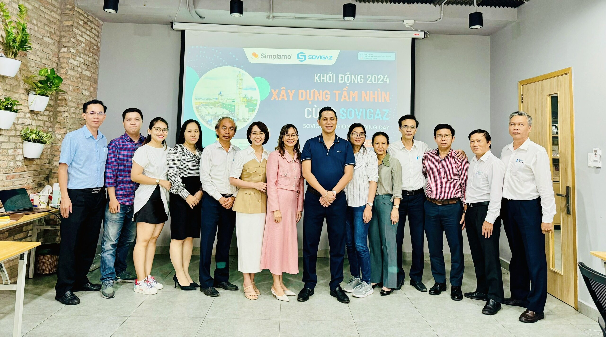
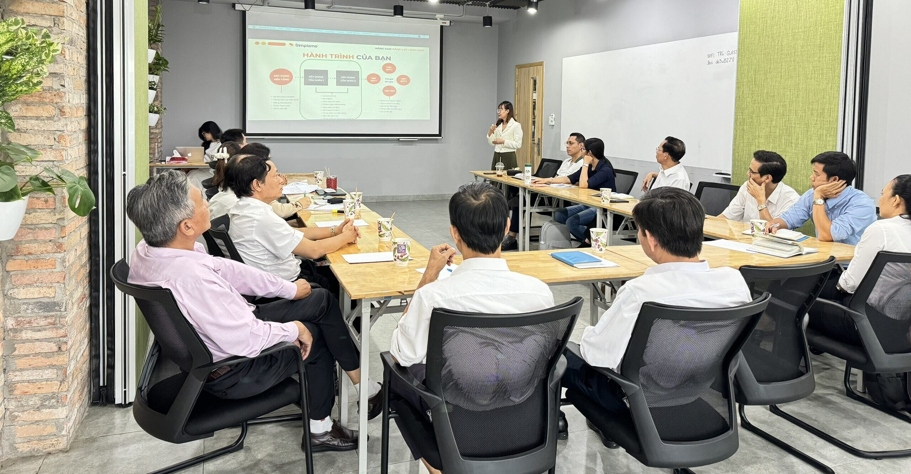
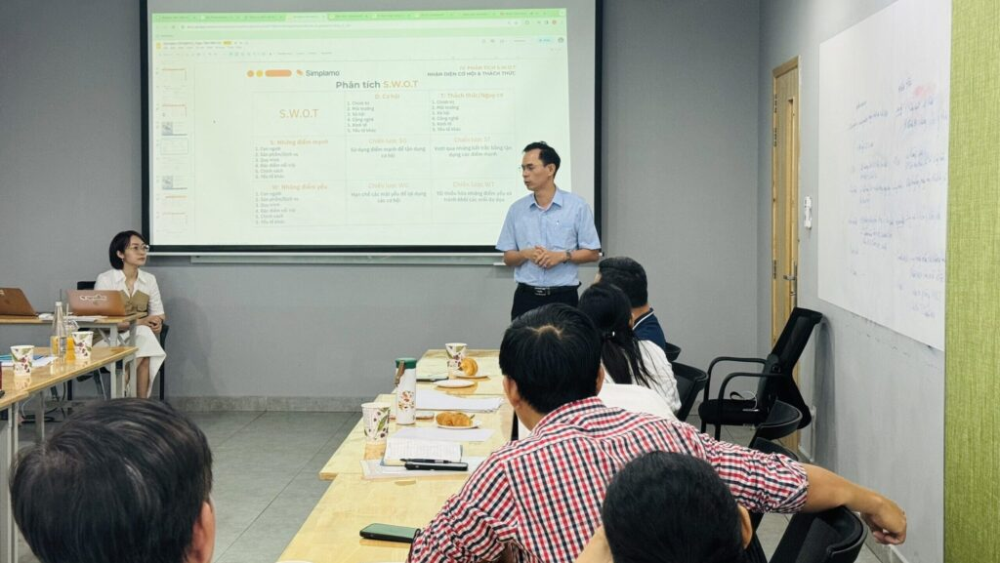

On January 8 and 9, 2024, Sovigaz opened its journey into a new year by organizing a two-day meeting focused primarily on building the company’s **vision and strategy**.

The implementation session was strongly supported by Simplamo’s team of experts. It not only set important milestones, but also became a turning point that helped reshape the company’s development direction after a challenging year. Sovigaz’s leadership team worked closely together and contributed ideas to build shared goals and a greater vision for the time ahead.

Below are several points that Simplamo’s experts guided the leadership team through:

- Clarifying Sovigaz’s mission: the whole team clarified the company’s mission together, creating a foundation for shaping the company’s direction.
- Defining the 10-year goal and marketing strategy: looking further ahead with a 10-year plan and marketing strategy.
- Setting three-year goals, planning for one year, and identifying priority work for the quarter.
- Identifying long-term issues and resolving the big rocks that block the team’s execution.

At the beginning of 2024, to support strong growth, businesses using Simplamo organized annual business planning meetings. These meetings helped clarify the company’s direction and focus resources on the most important priorities to achieve strong growth.

See the [tutorial video on organizing an annual planning meeting.](https://www.youtube.com/watch?v=Kmx2kxkBRsE)

The vision-building session was filled with emotion. Sovigaz CEO Mr. Trịnh Anh Phong shared his journey and the motivation guiding Sovigaz toward becoming Vietnam’s No. 1 state-owned enterprise in manufacturing medical gases, industrial gases, welding electrodes, and chemicals. Behind that is also a great mission to serve the country, thereby affirming the position of Vietnamese enterprises among international peers.

The Simplamo team sincerely wishes Sovigaz strong development in the time ahead, fulfilling its mission by conquering every goal on the platform.

See also: [Sovigaz explores core values and strengthens internal capacity with Simplamo](https://simplamo.com/vi/sovigaz-kham-pha-gia-tri-cot-loi-tang-suc-manh-noi-luc/)

— – – – –

[Simplamo](https://simplamo.com/vi/) – modern management and goal-execution software that turns the complexity of running a company into something simple and approachable for every employee. It relieves pressure on leaders, helps them focus on what matters, and optimizes work performance for the business.

Start experiencing [Simplamo](https://www.facebook.com/simplamocom) and feel the change after only four weeks!

Register for a Simplamo demo at: [https://app.simplamo.com/sign-up](https://app.simplamo.com/sign-up?lang=vi)

