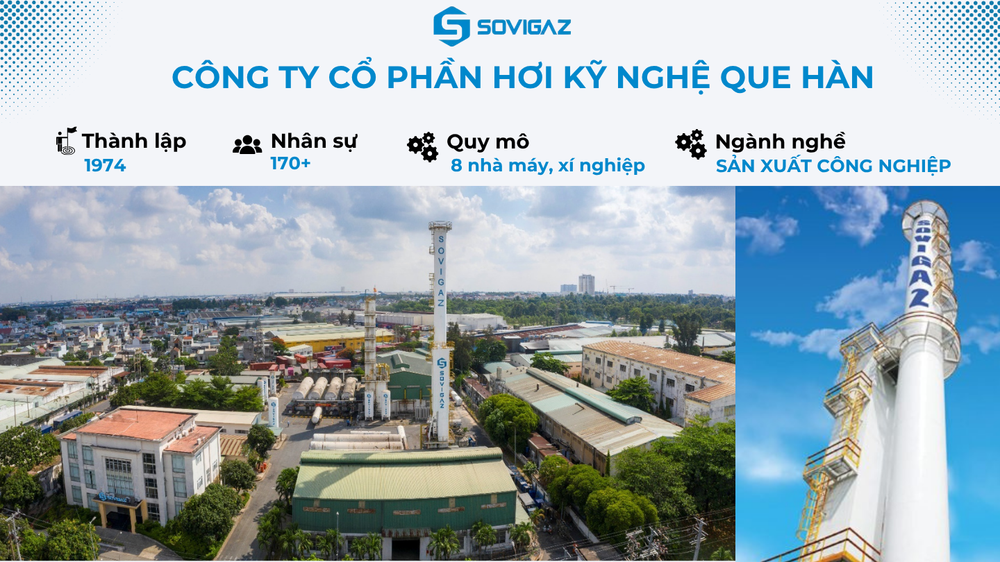
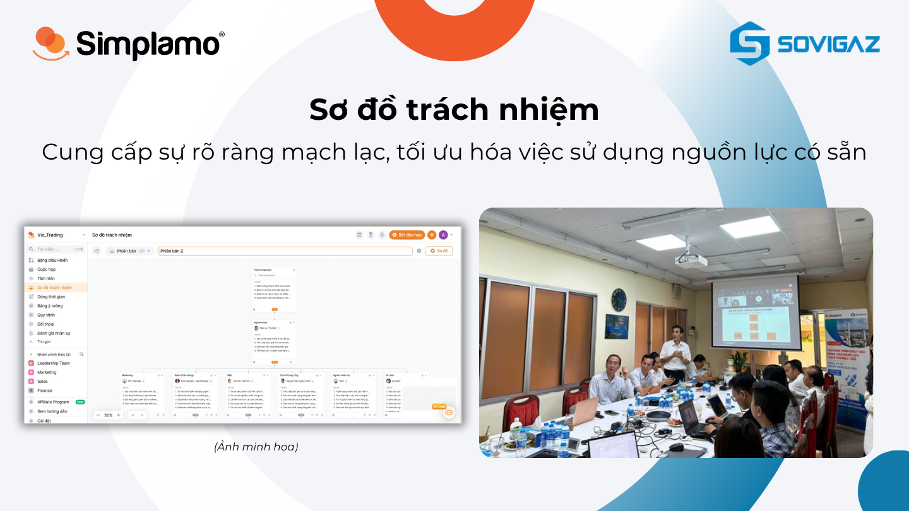
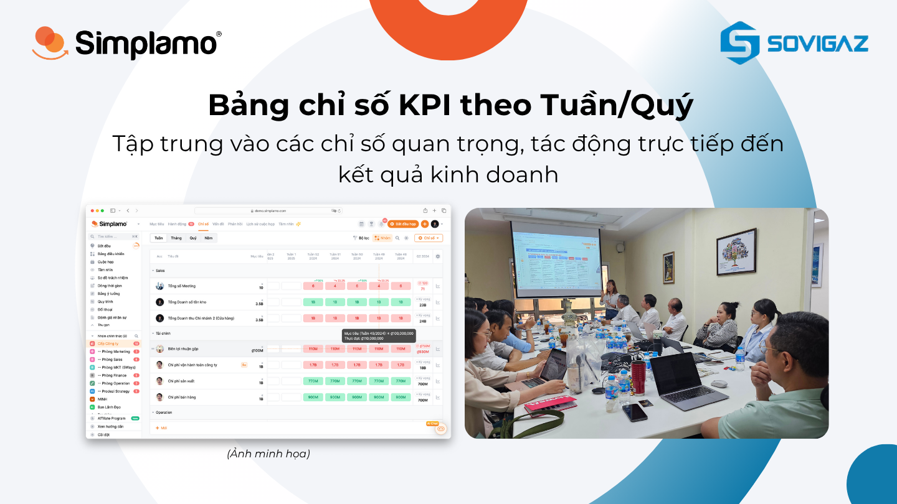
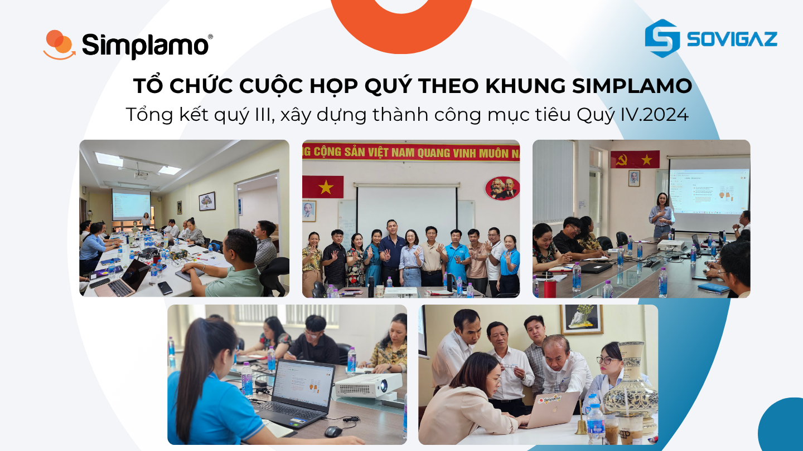
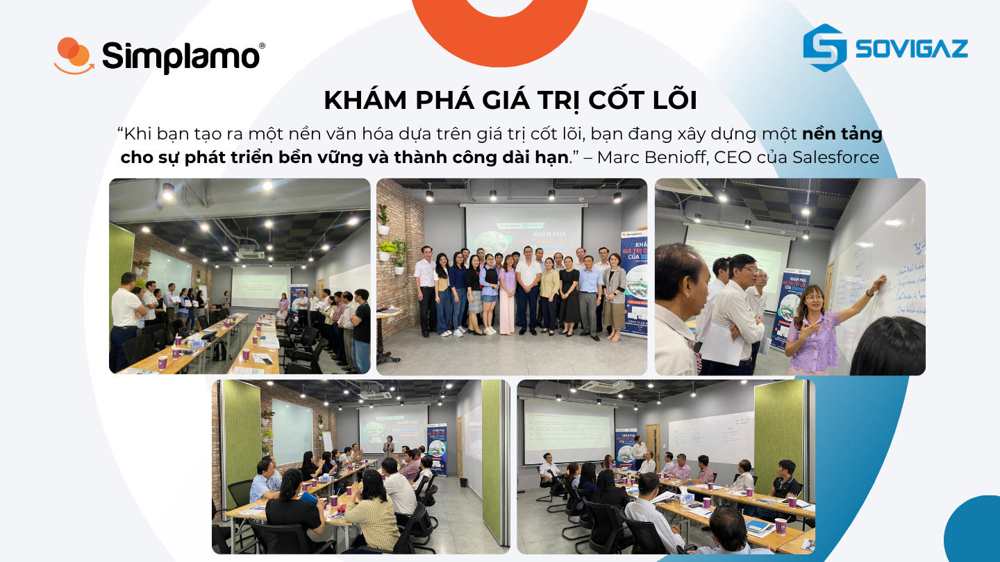
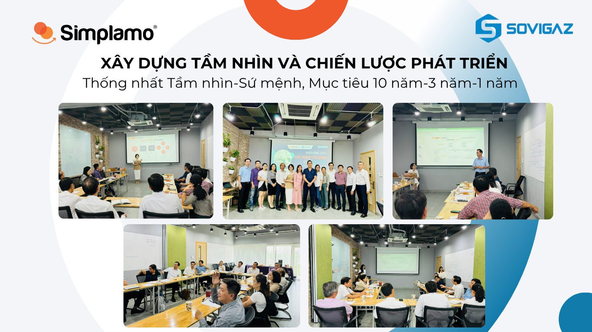
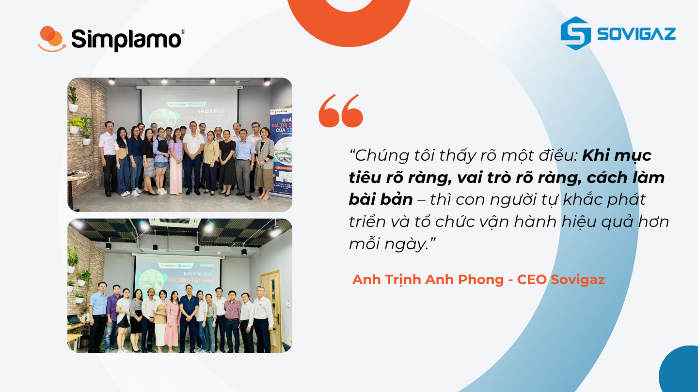

[Sovigaz – The Welding Electrode Industrial Gas Joint Stock Company](https://sovigaz.com.vn/) is a state-owned enterprise leading the production of medical gases, industrial gases, welding electrodes, and chemicals in Vietnam.

After more than 45 years of operation, Sovigaz has become one of Vietnam’s leading manufacturers of industrial gases, welding electrodes, and chemicals, and a reputable brand in industrial sectors with the noble mission of “serving people’s livelihoods” and being socially responsible.

## I. **Sovigaz’s challenge: The need for a system that helps the team execute more effectively**

As a company with a long history in the liquefied gas business, Sovigaz is in the process of restructuring and modernizing its operating system. In that context, the leadership team recognized that the **execution capability of the team** is a key factor in achieving the annual business plan.

To do this, Sovigaz needed a system that would help the team master **goal-oriented thinking**, **scientific work organization**, and **sustainable execution capability improvement**. Sovigaz tried many solutions, but they were not truly suitable for the team until the company learned about Simplamo.

> “We chose Simplamo because we wanted to own a system that is easy to use yet has depth—helping the team understand goals, connect actions, and turn strategy into concrete results.”
>
> — Mr. Trịnh Anh Phong – CEO of Sovigaz

## II. **Simplamo’s solution: Gradually improving execution capability across the whole team**

Sovigaz began its Simplamo software implementation project on 13.06.2023. With guidance and companionship from Simplamo experts, Sovigaz achieved strong progress after 2 years of application:

### **1. Strengthening the organizational foundation with a clear Accountability Chart**

Sovigaz upgraded its organizational chart to fit the new context using the **Accountability Chart** on Simplamo, clearly defining roles and responsibilities for each position and the connections between them, thereby allocating the right people to the right work according to the right capabilities.

**Benefits delivered:**

- The organizational foundation was clearly strengthened, limiting overlapping tasks
- Each individual understands what role they play within the overall organization
- Goals can be more easily allocated and tracked according to each position

### **2. Mastering the skill of building quarterly goals – Simple and scientific**

The management team was trained in the method of setting 90-day Goals on Simplamo, focusing on clarity, measurability, and fit with each position on the accountability chart.

The Scorecard was designed with 5–15 KPIs reflecting business and operational performance, eliminating complex metrics that cause distraction. These metrics are measured and updated weekly, displayed visually on the dashboard.

**Benefits delivered:**

- Goals became practical, easy to track, and no longer distant
- The team mastered how to build goals and action plans
- Middle managers’ goal-management capabilities were clearly upgraded
- Data became transparent and clear, helping forecast the ability to achieve quarterly and annual goals
- Leadership can quickly understand the week’s business situation without waiting for reports from the team

### **3. Holding weekly meetings consistently – Maintaining execution rhythm**

Sovigaz implemented the standard 7-step weekly meeting on Simplamo: review goals – review metrics – update feedback – solve issues – agree on actions.

**Benefits delivered:**

- The whole organization maintains a continuous rhythm of action and does not fall into stagnation
- Quarterly goals are closely monitored and flexibly adjusted according to reality
- Commitment and transparency inside the organization increase
- Time spent compiling reports and reporting after meetings is saved

Simplamo’s Meeting is also the feature that Mr. Trịnh Anh Phong – CEO of Sovigaz – likes most. Meetings are the main factor creating strong change in goal execution and team connection, and are also a prominent differentiator of Simplamo compared with other tools.

Sovigaz has consistently organized these meetings throughout the past period, **not only weekly meetings but also quarterly and annual meetings.**

### **4. Organizing quarterly meetings – Successfully building Q4 goals**

Sovigaz periodically organizes quarterly meetings based on the standard structure in the software and under the facilitation of Simplamo experts. Here, the leadership team summarizes the previous quarter’s results and sets goals for the new quarter in a focused, feasible, and system-connected way.

**Benefits delivered:**

- A clear and unified quarterly operating rhythm is formed
- The team achieves high consensus because everyone plans new goals together
- Connection and coordination between levels of the organization increase

## III. **Strengthening long-term strategy with a clear cultural foundation**

### **5. Discovering and reshaping Core Values**

Recognizing the importance of Core Values in corporate culture—especially for a company with a long history and industry-leading position like Sovigaz—on 1.10.2023, Sovigaz worked with Simplamo experts to organize activities to **identify, clarify, and communicate** **Core Values** to the entire team.

The process included: deepening the importance of core values, applying an internal discovery method from within the business, concretizing them on the software, and communicating them effectively internally.

**Benefits delivered:**

- The new core values are easy to remember, easy to communicate, and accurately reflect Sovigaz’s spirit
- Team pride and connection increase
- They become a foundation for behavior and the internal evaluation system

When core values are built properly, they form the foundation of “culture within the organization,” where everyone shares the purpose and mission of steering the ship toward where the business owner wants it to go.

### **6. Building Vision – Mission – Values toward 2024**

On 08–09.01.2024, Sovigaz organized a meeting to build its **Vision and long-term development strategy**.

The entire process was led by Simplamo experts based on the **annual meeting framework** in the Simplamo software and with active contributions from Sovigaz’s leadership team.

**Benefits delivered:**

- Vision, Mission, and long-term strategic direction were aligned
- Specific goals were established for each milestone: 10 years – 3 years – 1 year – quarterly
- “Big rocks” that hindered execution were removed
- Consensus and coordination capability within the leadership team were strengthened

## **IV. Results: A proactive execution organization, with people operating more effectively every day**

The implementation of Simplamo did not stop at software or methodology; it created **a new way of working and a new mindset about goal execution** throughout Sovigaz:

- The management team is more proactive in setting, tracking, and adjusting goals
- The culture of weekly and quarterly meetings has become a habit that creates real value
- Goals are no longer slogans, but tools for coordinating action every day
- Each employee clearly understands their role and contributes to the shared goals

May Sovigaz continue to grow stronger and maintain its leading position!

…

### **Are you looking for a way to improve your team’s execution capability? Start with the goal system**

**Simplamo** helps businesses build a clear, easy-to-apply goal system tied to operational reality, so the team not only knows “what needs to be done,” but also understands “why it must be done” and “how to do it effectively.”

👉 [**Book a free Simplamo consultation**](https://simplamo.com/) – Help your team execute strategy more effectively, starting today.

…

Simplamo – Excellent Goal Management & Execution, applying KPI, OKRs, BSC, and 4DX. A tool that helps the Executive Board and Board of Directors monitor and drive goals effectively, improving performance.

Start experiencing [Simplamo](https://www.facebook.com/simplamocom) and feel the change after only 4 weeks!

Register for a [Simplamo](https://www.linkedin.com/company/79564065/) demo at: <https://app.simplamo.com/vi/sign-up>

