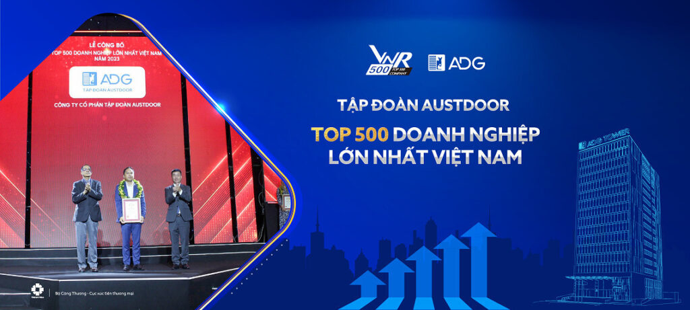
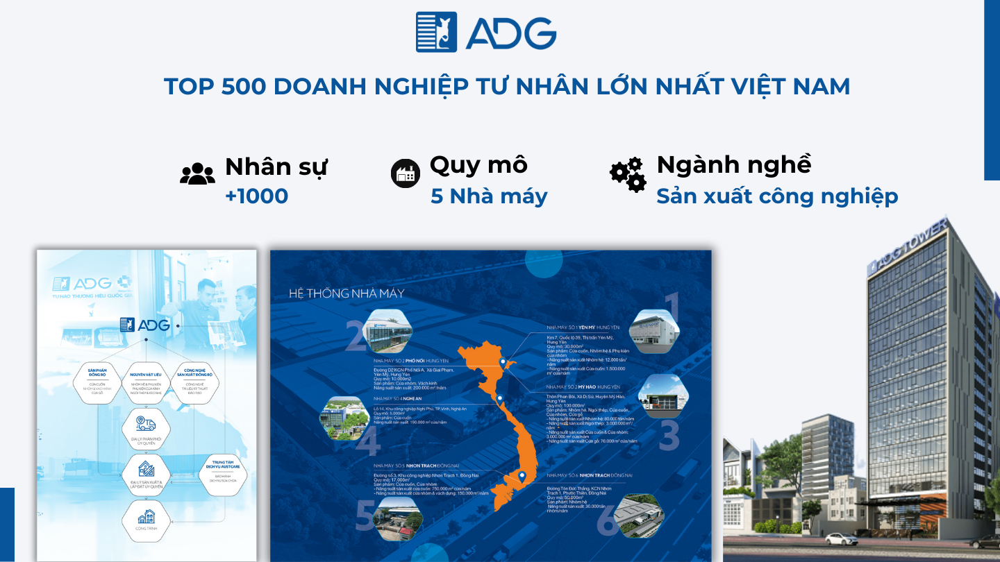
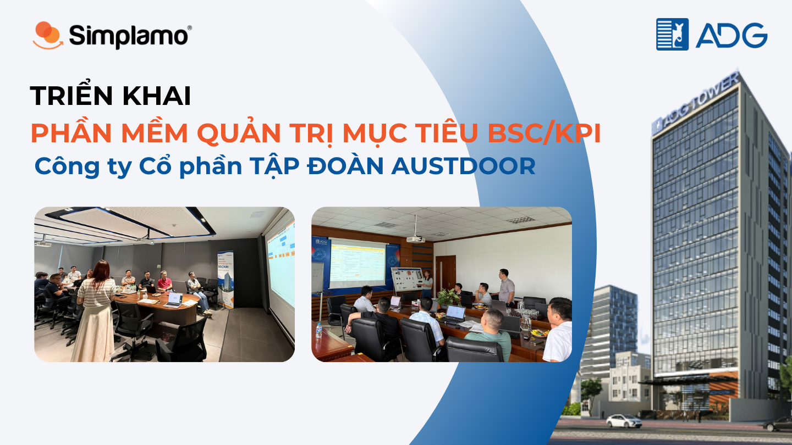
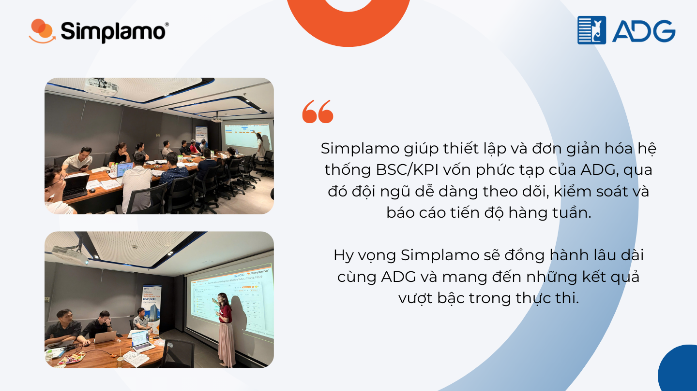

With five factories nationwide and more than 1,000 employees, Austdoor Vietnam Group (ADG) is currently among the top 500 largest private enterprises in Vietnam.

ADG is not stopping there. The company aims to become a leading Southeast Asian group in manufacturing and providing comprehensive solutions for doors and building materials. To realize this vision, ADG decided to choose Simplamo to digitize its BSC/KPI goal management system.

## I. The challenge of a “giant” and the search for the right fit

As a large-scale group in Vietnam's top 500 private enterprises, ADG has a **sizable and complex organizational structure and goal system**. Therefore, finding software that could comprehensively digitize and **deploy strategic goals down to divisions/departments/teams** in a systematic and connected way had been an important challenge for ADG.

Although ADG had researched many BSC/KPI deployment software options, it had not yet found a suitable fit and was still using basic tools such as Excel to manage BSC/KPI. After meeting and learning about Simplamo, ADG's leadership recognized that this was exactly the software they were looking for.

In addition to the software's scientific and connected presentation of goals/metrics, which can **turn a complex BSC/KPI goal system into something simple and easy to track**, the **training capability of Simplamo's experts** also deeply impressed ADG and contributed to the decision to choose Simplamo.

*“The team needs to deeply understand the thinking behind building and deploying BSC/KPI in order to trust and use the software as an effective tool for successful execution. If the team only ‘decorates’ the software without a deep understanding of the insight, they can easily give up midway.” – Shared by Simplamo expert Ms. Nguyen Thi Nghia.*

[<https://simplamo-cdn.simplamo.com/wp-content/uploads/2025/05/Chi-Nu.mp4>](https://simplamo-cdn.simplamo.com/wp-content/uploads/2025/05/Chi-Nu.mp4?_=1)

## II. Project goals and results achieved after only 5 training sessions

Simplamo and ADG began the project to deploy BSC/KPI goal management software on April 21, 2025, with the following goals:

- Improve the ability to measure and monitor performance through a clear goal system.
- Create a goal and KPI management tool that helps departments and leaders track progress and achieve business objectives.
- Build reporting dashboards that provide accurate and timely information to leadership levels.

To ensure the project ran smoothly, help the team easily visualize the leadership's strategy, and synchronize data with existing software, Simplamo and ADG spent the first 10 days reviewing and **setting up BSC data in the system and integrating data with SAP before the in-person training sessions took place.**

With rapid deployment speed and a high-performing leadership team, after only 5 training sessions, Simplamo and ADG's leadership completed the process of bringing data onto the software, aligned the team's working method with the new tool, and decisively put it into execution right away.

Specifically, the results achieved after 5 training sessions were as follows:

### **1. Strategic goal building**

- Completed the 2025 plan, quarterly plan, and monthly plan.
- Broke them down into goals and action milestones.
- Completed KPI scorecards by week/month/quarter/year.
- Completed reporting dashboards for the leadership/division/department levels.
- Broke down goals/metrics to the division level across Sales & Marketing, Supply, Back Office, and Production.

Despite a complex structure and a “huge” number of departments, Simplamo experts' scientific training method and the software's VISUAL, CONNECTED, and CLEARLY LAYERED presentation helped **successfully digitize and break down ADG's complex BSC/KPI system from company level to divisions/departments/teams while keeping it simple and easy to understand** — exactly what ADG had been searching for.

Rather than a dry theory session, the **training method** of Simplamo's experts helped ADG's leadership first deeply understand the thinking behind building and breaking down goals, then brainstorm directly with the team to set up and enter those goals into the system during the training session itself.

### **2. Periodic execution and reporting meetings**

- Guided the leadership and division/department/team levels to organize weekly EXECUTION MEETINGS using **7 scientific steps**.
- Guided the 3-step problem-solving technique: **Identify root cause – Comment on options – Close with action**.

What makes Simplamo different from other BSC/KPI software is that it does not stop at setup. Simplamo also has a tool that helps these goals truly be **activated and “run”** by the team in a weekly rhythm until completion: the **weekly execution meeting.**

With a scientifically designed meeting framework, rules, and a defined duration, Simplamo helps every ADG meeting become **systematic, consistent, and fast in reporting.**

Accordingly, all business information/results are updated and communicated properly, forming problem identification and solving skills for each individual, helping communication stay focused and increasing responsibility at work.

[<https://simplamo-cdn.simplamo.com/wp-content/uploads/2025/05/Anh-Thinh.mp4>](https://simplamo-cdn.simplamo.com/wp-content/uploads/2025/05/Anh-Thinh.mp4?_=2)

### **3. Simplamo AI – Winning over leadership with efficiency and intelligence**

Beyond that, Simplamo also provides an intelligent AI tool that helps ADG's leadership quickly build and set up goals and milestones with only a few clicks.

When the team is not yet familiar with goal building, AI becomes an indispensable assistant. Simplamo AI increases ADG team's excitement and confidence in this new goal management system.

[<https://simplamo-cdn.simplamo.com/wp-content/uploads/2025/05/Simplamo-AI.mp4>](https://simplamo-cdn.simplamo.com/wp-content/uploads/2025/05/Simplamo-AI.mp4?_=3)

After 5 training sessions and the deployment of goals down to divisions/departments/teams, ADG Group **completed the digitization of its BSC/KPI system** on Simplamo.

With goals/metrics presented scientifically, clearly, and methodically down to each department, **the entire ADG team understood the spirit and strategy of ADG's leadership**. From there, they could execute step by step with clear action plans and report/solve problems in the **weekly execution meeting.**

Simplamo was very impressed by the decisiveness and rapid deployment speed of ADG's leadership team.

We wish ADG the ability to seize opportunities, conquer goals effectively, and succeed in the coming period with Simplamo's strong support. The Simplamo team will always be there to accompany ADG in conquering its vision!

….

Are you a leader of a group or large-scale enterprise with a complex personnel structure, looking to digitize a BSC/KPI/OKR system to effectively deploy strategic goals down to divisions/departments/teams?

Meet Simplamo for 1:1 consultation today! Contact Simplamo via hotline 0901 866 922 or register for a feature demo [HERE.](https://app.simplamo.com/sign-up?lang=vi)

…

Simplamo – Excellent Goal Management & Execution, applying KPI, OKRs, BSC and 4DX. A tool that helps Executive Boards and Boards of Directors monitor and drive goals effectively, improving performance.

Start experiencing [Simplamo](https://www.facebook.com/simplamocom) and feel the change after only 4 weeks!

Register for a [Simplamo](https://www.linkedin.com/company/79564065/) demo at: <https://app.simplamo.com/vi/sign-up>

