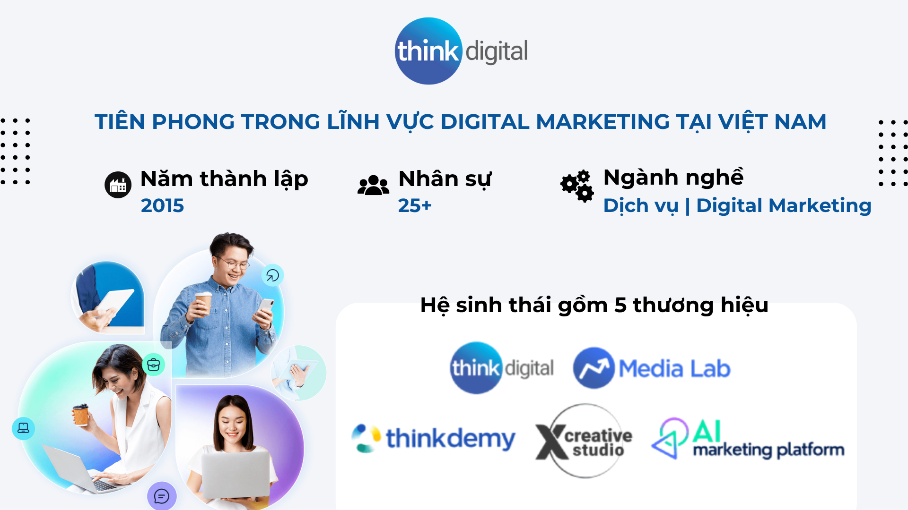
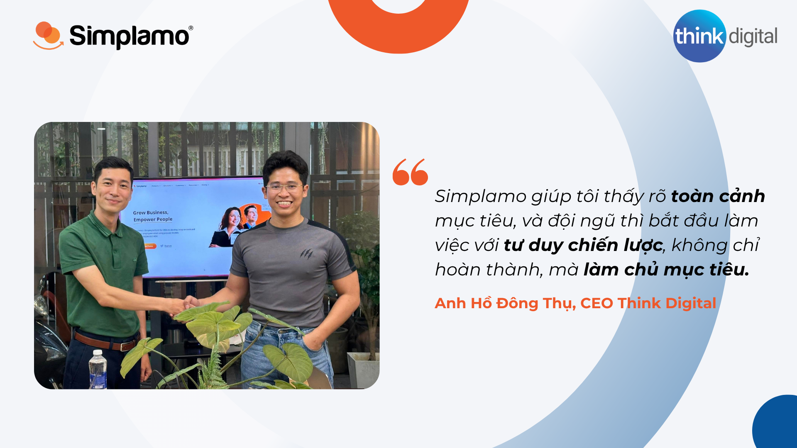

Think Digital is a pioneering company in Digital Marketing in Vietnam, founded in 2015 by Ho Dong Thu, an experienced expert in Marketing and Business Management.

With the mission **“Make Marketing Better for People”**, Think Digital is committed to delivering creative and effective digital marketing solutions, helping customers innovate, improve performance, and achieve success in Marketing and Sales activities.

Think Digital — a young marketing agency — has always been proud of its creativity, flexibility, and high adaptability. But as the organization grew, questions gradually emerged:

- How can the team not only do its current work well, but also move toward the long-term picture?
- How can each individual understand their role in the company's strategy?
- And how can the company build a successor leadership layer — people with a holistic mindset, not just task managers?

## I. Finding the answer to the problem of “strategic thinking in a small organization”

Previously, Think Digital used Lark Suite as a teamwork solution, including goal management features. But CEO Ho Dong Thu realized: *“We do not lack tools; what we lack is a system that helps the team form goal-management thinking and see the organization's overall picture.”*

In a context where growth requires the company not only to run fast but also to run in the right direction, choosing a specialized tool for management thinking became urgent. That was when Simplamo appeared in Think Digital's development journey.

Think Digital began applying Simplamo in March 2025.

## II. Why Simplamo?

Think Digital did not choose a tool merely to track goals. They needed a platform that could:

- **Help everyone think like a leader**: Not only know what they need to do, but understand why it matters to the overall strategy.
- **Be easy to deploy and maintain**: With a team of 25 people, the tool needed to be just enough — not too process-heavy, while still bringing depth.
- **Combine flexibly with other tools**: While Lark continued to be used for internal communication, Simplamo became the shared strategic map for the entire company.

## III. Results: Clarity – Connection – Maturity

### 1. **Everyone sees themselves in the shared goals**

On Simplamo, every goal is linked by level, from company to team to individual. No longer feeling that they are only doing their own work, the Think Digital team understands where they are contributing in the company's development journey.

### 3. **Faster, clearer decision-making**

When everyone looks at the same clear goal system, meetings become leaner and more decisive. Meeting time becomes shorter, but quality increases. There is no longer time lost debating things that have not been aligned, because everything is already on Simplamo.

### 2. **Beginning to build a successor leadership layer**

When assigned goals instead of tasks, middle-level members are forced to think holistically, propose solutions, and make decisions. From there, they gradually develop leadership thinking and management capability.

**In closing: Management thinking is not only for large corporations**

Think Digital proves that small businesses absolutely can — and should — begin the journey of building an organization with strategic depth, starting with the systematic application of OKRs.

*Do not wait until you are big to manage; manage so you can grow sustainably.*

Are you the CEO/business owner of an SME that has been implementing OKR/KPI, and are you looking for an intelligent digital goal-management tool to help the organization move faster, develop strategic thinking, empower the team, and build the next generation of leaders?

Meet Simplamo for a 1:1 consultation today! Contact Simplamo via hotline 0901 866 922 or register for a feature demo [HERE.](https://app.simplamo.com/sign-up?lang=vi)

…

Simplamo – Excellent Goal Management & Execution, applying KPI, OKRs, BSC, and 4DX. A tool that helps executive boards and boards of directors track and drive Goals effectively, improving performance.

Start experiencing [Simplamo](https://www.facebook.com/simplamocom) and feel the change after only four weeks!

Register for a [Simplamo](https://www.linkedin.com/company/79564065/) demo at: <https://app.simplamo.com/vi/sign-up>
