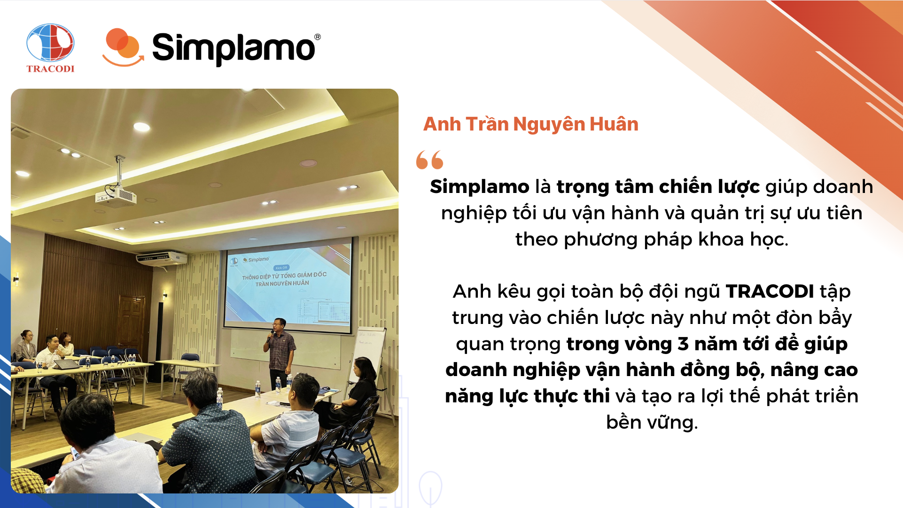
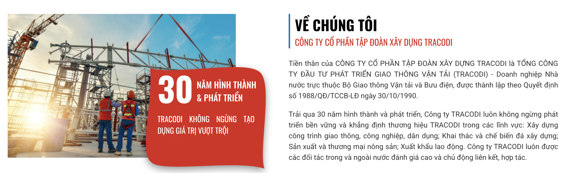
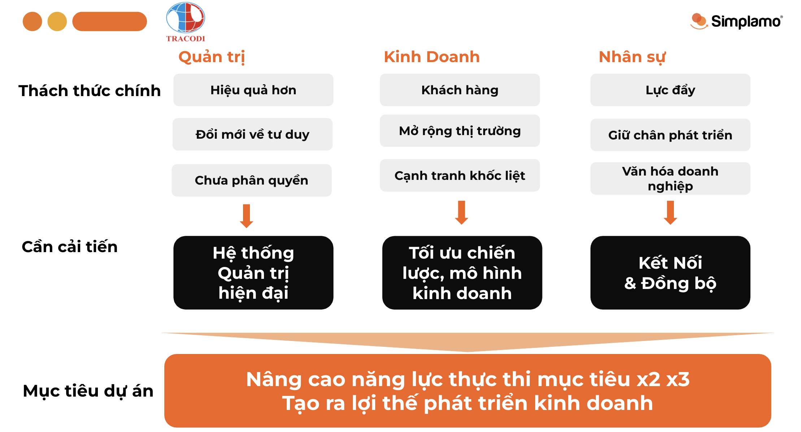
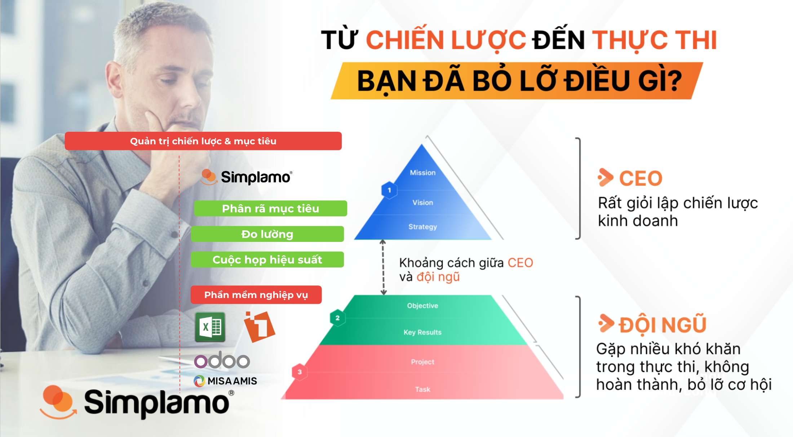

*TRACODI CEO: “Simplamo is one of the important technology levers that helps us manage priorities scientifically!”*

**Mr. Tran Nguyen Huan – CEO of TRACODI** officially declared Simplamo a strategic focus that helps the company optimize operations and manage priorities using a scientific method. He called on the entire TRACODI team to focus on this strategy as an important lever over the next 3 years, helping the company operate in sync, improve execution capability, and create sustainable development advantages.

So how has Simplamo helped TRACODI change? Let's explore their transformation journey!

## **I. The challenge of a long-standing construction enterprise**

In construction and infrastructure development, TRACODI is a name that has established its position for more than 30 years. With deep experience, a highly specialized team, and a series of major projects, TRACODI has continued to grow. However, like any long-standing business, TRACODI also faced **major challenges as it scaled**.

As the organization continued to grow, operational issues began to appear:

- Overlapping responsibilities slowed down the decision-making process.
- Work priorities were unclear, forcing the team to handle too many issues at once.
- A lack of clear performance measurement made progress difficult to track.

**The question was:** How could TRACODI optimize operations, help the organization operate in sync, improve execution capability, and create a modern management system?

**The answer:** Simplamo – the platform that helps TRACODI establish a modern, clear, and more effective management system.

## **II. The kick-off journey for goal management & change management with Simplamo**

After analysis and assessment, Simplamo accompanied TRACODI through a 4-session intensive working roadmap, focused on building a synchronized operating system, removing bottlenecks, and optimizing work priorities.

### **1. Session 1: Accountability structure – Clarifying the operating framework**

One of the reasons **TRACODI's decision-making process had slowed down** was **overlapping responsibilities** between departments. No one was truly ultimately accountable, and work was pushed around instead of being handled quickly.

Solution: **Apply the Accountability Chart on Simplamo.**

- Re-establish the operating structure according to a professional model.
- Every position is clearly defined in terms of responsibility.
- Overlap is eliminated, making decision-making faster and more transparent.

**Results:**

- TRACODI established a lean and scientific operating framework.
- Each team member clearly understood their role and each department's responsibility.
- Work no longer got “stuck” anywhere, helping the organization operate more smoothly.

### **2. Session 2: Defining Work-on vs. Work-in – Managing priorities**

A major problem in long-standing businesses is that management teams get pulled into daily operations (Work-in) and forget the important strategic tasks that help the company grow (Work-on).

Solution: **Apply the Work-on vs. Work-in method.**

- Work-in: Daily tasks that keep the company operating stably.
- Work-on: Strategic work that helps the company develop and expand.

**Results:**

- TRACODI's management team began spending more time on strategic work instead of focusing only on short-term problem solving.
- Productivity increased significantly as employees were no longer trapped in work that did not create major value.

### **3. Session 3: Defining measurement indicators – Orienting toward effectiveness**

*“You cannot improve what you cannot measure.”*

One of TRACODI's previous weaknesses was the **lack of** **a clear performance measurement system**. This led to the following situation:

- Work had no specific evaluation criteria.
- It was difficult to track the progress and performance of each department.
- Employees felt a lack of motivation because they did not know how their achievements contributed to the company's growth.

Solution: **Build an OKR & KPI system on Simplamo**

- OKRs (Objectives & Key Results): Define important objectives and how to measure results.
- KPIs (Key Performance Indicators): Set key performance indicators to monitor and evaluate progress toward goals.

**Results:**

- For the first time, TRACODI had a clear and transparent performance measurement system.
- Employees could track their own work progress instead of depending on monthly reports.
- Leaders could make faster and more accurate decisions based on real data.

### **4. Session 4: Performance meetings – Replacing traditional meetings**

Previously, meetings at TRACODI were often lengthy, unfocused, and time-consuming but did not deliver high effectiveness.

Solution: **Shift from the traditional meeting model to Performance Meetings on Simplamo.**

- Focus on OKRs/KPIs instead of lengthy reporting.
- Solve issues clearly and concisely.
- Create transparent accountability across the organization.

**Results:**

- Meeting time decreased significantly, while effectiveness multiplied.
- Participants became proactive, no longer just “sitting and listening for formality.”
- Every issue had a clearly accountable owner, ensuring everything was resolved thoroughly.

## **III. What did TRACODI say after the transformation journey?**

After implementing Simplamo, TRACODI achieved **breakthrough changes** in the way it operates:

- A clear management system, with no more overlapping responsibilities.
- A focus on long-term strategy instead of being caught up in daily operations.
- Easy performance measurement, helping leaders make faster decisions.
- A more transparent and synchronized working culture.
- 2x–3x improvement in execution capability, creating sustainable development advantages.

Sharing from the TRACODI team:

Do you want your business to achieve success like TRACODI?

Let Simplamo accompany you on the journey to optimize operations and improve execution capability today!

Simplamo – Excellent Goal Management & Execution, applying KPI, OKRs, BSC and 4DX. A tool that helps Executive Boards and Boards of Directors monitor and drive goals effectively, improving performance.

Start experiencing [Simplamo](https://www.facebook.com/simplamocom) and feel the change after only 4 weeks!

Register for a [Simplamo](https://www.linkedin.com/company/79564065/) demo at: <https://app.simplamo.com/vi/sign-up>

