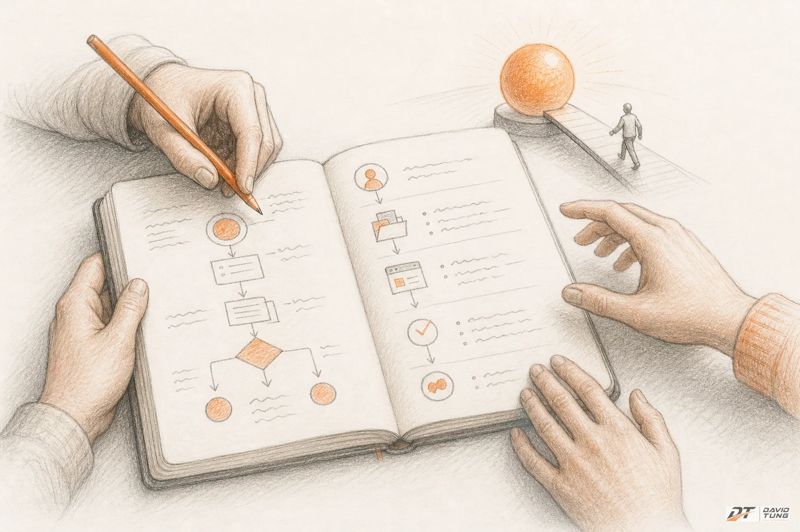
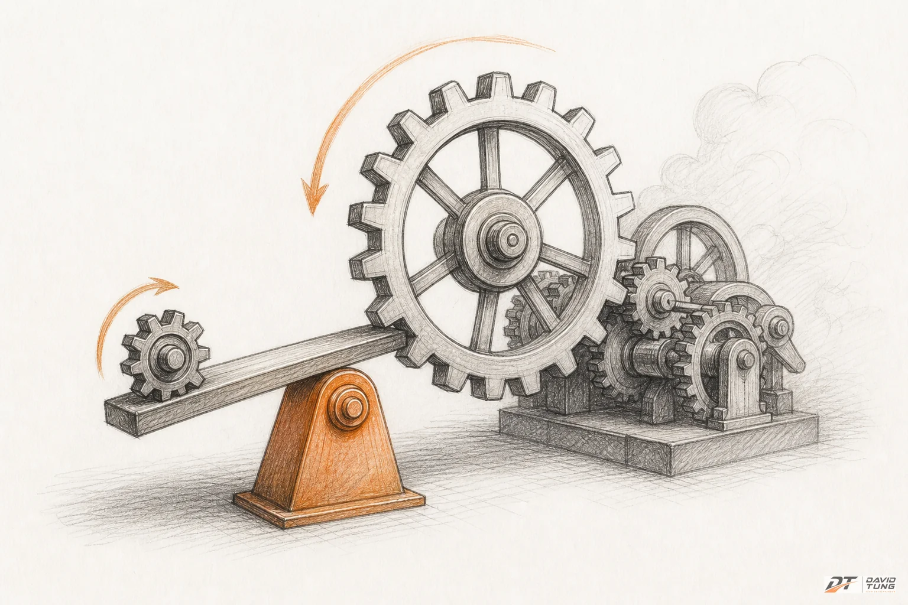
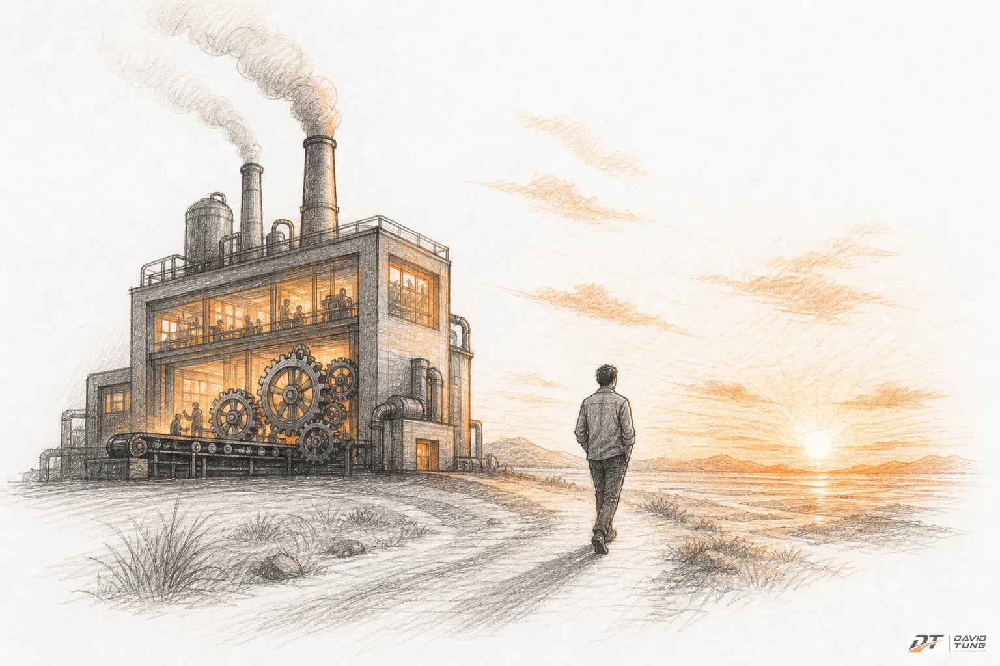

Có một câu tôi nghe đi nghe lại từ các CEO:

"Tôi biết mình muốn đi đâu. Chỉ là chưa biết đi thế nào thôi."

Nghe có vẻ khiêm tốn. Nhưng thực ra, đây là một trong những câu nói nguy hiểm nhất trong quản trị.

Vì nó đánh tráo hai thứ: **biết đích đến** và **có lộ trình**.

Biết đích đến là cảm giác. Có lộ trình là con số, thứ tự, và deadline.

Và nếu anh đang là CEO solo — hoặc CEO của một doanh nghiệp đã trưởng thành — mà chưa có cái thứ hai, thì anh đang lái xe không có GPS. Xe vẫn chạy. Xăng vẫn đốt. Nhưng không ai dám chắc 3 tháng nữa mình sẽ ở đâu.

## Tại sao CEO thông minh vẫn mắc kẹt

Có một nghịch lý tôi quan sát được sau nhiều năm làm việc với chủ doanh nghiệp:

**CEO càng giỏi chuyên môn, càng dễ mắc kẹt trong vận hành.**

Lý do rất đơn giản. Khi anh giỏi, anh giải quyết vấn đề nhanh. Khách hàng có vấn đề — anh xử lý. Nhân viên có vướng mắc — anh gỡ. Đối tác cần quyết định — anh ra.

Và rồi một ngày anh nhận ra: công ty đang chạy bằng phản xạ của anh, không phải bằng hệ thống.

Đây không phải lỗi của anh. Đây là hệ quả tự nhiên của việc không có một tấm bản đồ trình tự.

Hầu hết CEO tôi gặp đều mắc ít nhất một trong ba kiểu "nhảy cóc" sau:

- **Nhảy thẳng vào Marketing khi chưa có nền móng.** Chạy ads, làm nội dung, mở kênh mới — nhưng chưa có process chuẩn, chưa có checklist, chưa có cách làm rõ ràng. Kết quả: tiền đốt nhanh hơn khách vào.
- **Tuyển người trước khi có hệ thống.** "Tuyển người giỏi về rồi tính sau." Người giỏi vào, không có quy trình, làm theo cách của họ. Ba tháng sau họ đi, để lại một đống việc không ai hiểu.
- **Muốn mở rộng khi nền chưa vững.** Mở chi nhánh 2 trong khi chi nhánh 1 vẫn phụ thuộc 100% vào anh. Kết quả: không phải nhân đôi doanh thu, mà nhân đôi hỗn loạn.

Cả ba kiểu này đều có chung một gốc: **không có thứ tự**.

## 6 bước không phải menu — là trình tự

Sau hơn 30 năm làm việc với hàng trăm nghìn doanh nghiệp trên toàn thế giới, một hệ thống coaching kinh doanh đã rút ra được một điều: **doanh nghiệp thất bại không phải vì thiếu ý tưởng, mà vì làm sai thứ tự.**

6 bước là:

1. **Mastery** — Làm chủ nền tảng
2. **Niche** — Định vị ngách thị trường
3. **Leverage** — Đòn bẩy hệ thống
4. **Team** — Xây đội ngũ chiến thắng
5. **Synergy** — Hiệu ứng cộng hưởng
6. **Freedom** — Tự do thật sự

Đây không phải menu để chọn món. Đây là **trình tự bắt buộc**. Mỗi bước là điều kiện cần cho bước sau. Làm ngược là xây nhà từ tầng 3.

## Step 1: MASTERY — Nếu anh không viết ra được, anh chưa làm chủ

Mastery không phải là "giỏi nghề".

Giỏi nghề là anh làm được. Mastery là **người khác làm được khi anh không có mặt**.

Đây là bước khó nhất với CEO solo, vì nó đòi hỏi anh làm một việc rất ngược với bản năng: **dừng làm, ngồi xuống, và viết ra.**

Viết ra cách anh xử lý một đơn hàng. Viết ra cách anh onboarding khách mới. Viết ra cách anh xử lý khiếu nại. Viết ra cách anh quyết định giá.

Nếu anh không viết ra được, thì cái "kinh nghiệm 10 năm" của anh thực ra chỉ là phản xạ. Và phản xạ thì không thể nhân bản.

Với CEO solo, câu hỏi đầu tiên đơn giản hơn bất kỳ bộ đánh giá nào:

> Nếu ngày mai anh nghỉ 1 tuần, có ai trong công ty biết chính xác phải làm gì không?

Nếu câu trả lời là "không", thì anh chưa xong Step 1. Đừng nhảy sang Step 2.

## Step 2: NICHE — Định vị ngách, không phải làm cho tất cả mọi người

Niche không phải là "chọn ngành". Niche là **tìm chỗ anh giỏi nhất, khác biệt nhất, có lợi thế nhất — và chỉ làm cái đó.**

Hầu hết CEO sợ Niche vì sợ bỏ lỡ. Họ muốn phục vụ tất cả mọi người. Kết quả: không ai cảm thấy họ dành riêng cho mình.

Khi chưa có Niche, mọi marketing sau đó đều đốt tiền. Vì anh không biết mình đang nói với ai, không biết khách的理想画像 là gì, và không biết tại sao khách nên chọn anh thay vì đối thủ.

Niche trả lời 3 câu hỏi:

1. **Anh giỏi nhất cái gì?** — Không phải cái gì kiếm được tiền, mà cái gì anh làm tốt hơn 80% thị trường.
2. **Ai cần cái đó nhất?** — Không phải "ai cần", mà "ai không có sẽ đau".
3. **Tại sao họ chọn anh?** — Lợi thế cạnh tranh thật, không phải slogan.

Nếu anh không trả lời được 3 câu này, anh đang bán cho ai cũng được — tức là không bán cho ai cả.

## Step 3: LEVERAGE — Hệ thống chạy không cần anh

Nếu Step 1 là "viết ra cách làm", thì Step 3 là "làm cho cách đó thành quy trình bắt buộc".

Leverage nghĩa là **đòn bẩy**. Doanh nghiệp có đòn bẩy khi nó chạy mà không cần anh.

Hệ thống hóa là 9 tầng:

**Vision → Mission → Values → Company Goals → Org Chart → Position Contracts → KPIs → Manuals → Checklists**

Nghe nhiều. Nhưng logic rất đơn giản:

- **Vision/Mission/Values/Goals**: Anh muốn đi đâu? (Định hướng)
- **Org Chart/Position Contracts**: Ai làm gì? (Cấu trúc)
- **KPIs**: Làm sao biết đang đi đúng? (Đo lường)
- **Manuals/Checklists**: Làm thế nào mỗi ngày? (Vận hành)

Đây là bước phân biệt "ông chủ" với "chủ doanh nghiệp thực thụ".

Ông chủ là người có mặt thì công ty chạy. Chủ doanh nghiệp là người vắng mặt 1 tháng, công ty vẫn chạy — thậm chí chạy tốt hơn.

Tôi từng thấy một CEO mất 3 tháng để systemize toàn bộ quy trình bán hàng. Ba tháng đó, doanh thu không tăng. Nhưng 6 tháng sau, đội sales tăng gấp đôi mà anh ấy không cần tham gia một cuộc gọi nào.

Đó là Leverage.

## Step 4: TEAM — Xây đội ngũ trên nền hệ thống, không phải ngược lại

Đây là bước mà nhiều CEO làm sai thứ tự nhất.

Họ tuyển người trước khi có hệ thống. Rồi họ ngạc nhiên khi người giỏi bỏ đi.

Sự thật là: **người giỏi không bỏ đi vì lương thấp. Họ bỏ đi vì không có quy trình rõ ràng.** Họ muốn biết mình phải làm gì, làm thế nào là tốt, và ai chịu trách nhiệm cho cái gì. Nếu ba câu hỏi đó không có lời giải, họ sẽ tìm nơi khác có.

6 chìa khóa của đội ngũ chiến thắng:

1. **Strong Leadership** — Lãnh đạo mạnh, rõ ràng
2. **Common Goal** — Mục tiêu chung ai cũng tin
3. **Rules of the Game** — Luật chơi rõ ràng
4. **Action Plan** — Kế hoạch hành động cụ thể
5. **Support Risk Taking** — Khuyến khích dám thử
6. **100% Involvement** — Mọi người cùng tham gia

Để ý: Key số 1 là Leadership, không phải "tuyển người giỏi". Vì đội ngũ chiến thắng không bắt đầu từ CV — nó bắt đầu từ việc anh dẫn dắt rõ ràng đến mức nào.

## Step 5: SYNERGY — Khi hệ thống và đội ngũ cộng hưởng

Synergy không phải là " Scale". Synergy là **hiệu ứng cộng hưởng** — khi Systems + Team vận hành đồng bộ, doanh nghiệp chạy như một cỗ máy tinh chỉnh.

Ở bước này, từng bộ phận không chỉ làm tốt phần của mình — chúng **tăng cường lẫn nhau**. Marketing feed sales mượt. Sales feedback ops nhanh. Ops cải tiến product liên tục. Không ai phải chờ CEO gõ cửa mới hành động.

Synergy xảy ra khi:

- **Hệ thống đã đủ rõ** để mọi người biết phải làm gì
- **Đội ngũ đã đủ mạnh** để tự vận hành
- **Giao tiếp giữa các bộ phận đã đủ mượt** để thông tin chạy theo quy trình, không theo cảm xúc

Nhiều CEO dừng ở Step 4 và nghĩ "xong rồi". Nhưng nếu thiếu Synergy, doanh nghiệp vẫn là **tổng của các phần rời rạc** — không phải một cỗ máy đồng bộ.

Khi Synergy xuất hiện, anh bắt đầu thấy một thứ rất lạ: **doanh nghiệp chạy nhanh hơn khi anh vắng mặt.** Vì mọi người không chờ anh — họ chờ hệ thống.

## Step 6: FREEDOM — Đích đến thật sự

Freedom không phải là "nghỉ hưu sớm".

Nó là trạng thái: **doanh nghiệp là một tài sản vận hành độc lập, tạo ra giá trị mà không cần anh có mặt hàng ngày.**

Chiếc thang của người làm chủ:

- **Technician** — Anh là người làm chính
- **Manager** — Anh quản lý người khác làm
- **Owner** — Anh sở hữu hệ thống tạo ra giá trị
- **Investor** — Anh sở hữu tài sản sinh lời

Hầu hết CEO solo đang mắc kẹt ở bậc Technician. Họ là người giỏi nhất công ty — và đó chính là vấn đề.

6 bước không hứa hẹn anh sẽ thành Investor trong 6 tháng. Nhưng nó cho anh biết chính xác mình đang ở bậc nào, và bước tiếp theo là gì.

## Anh đang ở bước nào?

Trước khi đọc tiếp, thử tự trả lời mấy câu này:

**Mastery:** Nếu anh nghỉ 1 tuần, công ty có chạy được không?

**Niche:** Anh có biết chính xác mình giỏi nhất cái gì, và ai cần cái đó nhất không?

**Leverage:** Có ai trong công ty làm được việc của anh mà không cần hỏi anh không?

**Team:** Đội ngũ của anh có Common Goal không — hay mỗi người đang chạy một hướng?

**Synergy:** Các bộ phận có tự phối hợp được không, hay mọi thứ đều phải qua anh?

**Freedom:** Anh đang là Technician, Manager, Owner, hay Investor?

Nếu có bước nào anh trả lời "chưa" — thì đó chính là bước tiếp theo. Không phải bước anh muốn làm. Mà là bước anh **cần** làm.

## Đừng chạy nhanh hơn — dừng lại, kiểm tra móng

CEO solo thường có một siêu năng lực: **làm nhanh.** Nhưng cũng chính siêu năng lực đó là cái bẫy. Làm nhanh khiến anh nghĩ mình đang tiến bộ. Nhưng nếu làm nhanh sai thứ tự, anh chỉ đang đào hố nhanh hơn thôi.

6 bước không phải là "một framework nữa để học".

Nó là cái GPS cho anh biết: mình đang ở đâu, bước tiếp theo là gì, và tại sao không được nhảy cóc.

Trước khi anh mở thêm một chiến dịch marketing, tuyển thêm một người, hay nghĩ đến chuyện mở rộng — ngồi xuống 30 phút. Tự hỏi: **Step 1 của mình đã xong chưa?**

Nếu chưa, thì mọi thứ khác đang được xây trên cát.

---

*Bài viết thuộc series "Back to Basic" — nơi tôi quay lại những nguyên lý nền tảng đã được chứng minh qua hàng chục năm, thay vì chạy theo trend. Vì đôi khi, thứ anh cần không phải là ý tưởng mới — mà là làm đúng những điều cơ bản.*