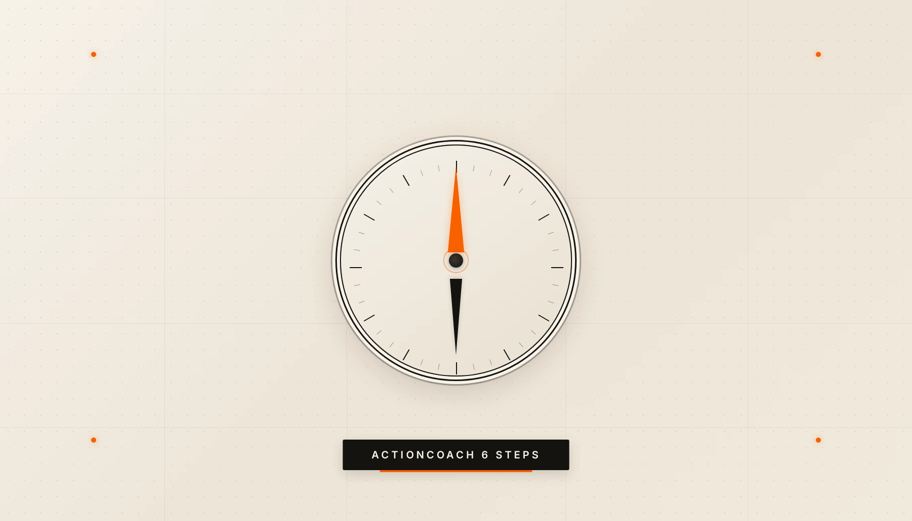
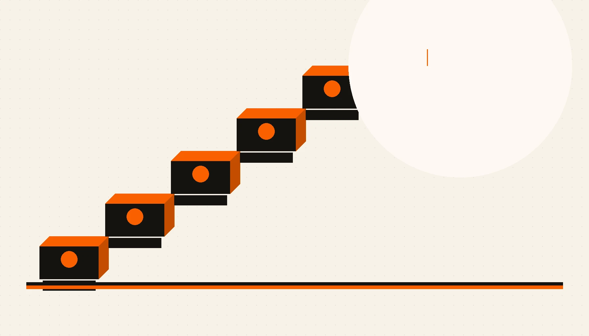

Có một câu tôi nghe đi nghe lại từ các CEO:

"Tôi biết mình muốn đi đâu. Chỉ là chưa biết đi thế nào thôi."

Nghe có vẻ khiêm tốn. Nhưng thực ra, đây là một trong những câu nói nguy hiểm nhất trong quản trị.

Vì nó đánh tráo hai thứ: **biết đích đến** và **có lộ trình**.

Biết đích đến là cảm giác. Có lộ trình là con số, thứ tự, và deadline.

Và nếu anh đang là CEO solo — hoặc CEO của một doanh nghiệp đã trưởng thành — mà chưa có cái thứ hai, thì anh đang lái xe không có GPS. Xe vẫn chạy. Xăng vẫn đốt. Nhưng không ai dám chắc 3 tháng nữa mình sẽ ở đâu.

## Tại sao CEO thông minh vẫn mắc kẹt

Có một nghịch lý tôi quan sát được sau nhiều năm làm việc với chủ doanh nghiệp:

**CEO càng giỏi chuyên môn, càng dễ mắc kẹt trong vận hành.**

Lý do rất đơn giản. Khi anh giỏi, anh giải quyết vấn đề nhanh. Khách hàng có vấn đề — anh xử lý. Nhân viên có vướng mắc — anh gỡ. Đối tác cần quyết định — anh ra.

Và rồi một ngày anh nhận ra: công ty đang chạy bằng phản xạ của anh, không phải bằng hệ thống.

Đây không phải lỗi của anh. Đây là hệ quả tự nhiên của việc không có một tấm bản đồ trình tự.

Hầu hết CEO tôi gặp đều mắc ít nhất một trong ba kiểu "nhảy cóc" sau:

- **Nhảy thẳng vào Marketing khi chưa có Mastery.** Chạy ads, làm nội dung, mở kênh mới — nhưng chưa có process chuẩn, chưa có checklist, chưa có cách làm rõ ràng. Kết quả: tiền đốt nhanh hơn khách vào.
- **Tuyển Team trước khi có Systems.** "Tuyển người giỏi về rồi tính sau." Người giỏi vào, không có quy trình, làm theo cách của họ. Ba tháng sau họ đi, để lại một đống việc không ai hiểu.
- **Muốn Scale khi nền chưa vững.** Mở chi nhánh 2 trong khi chi nhánh 1 vẫn phụ thuộc 100% vào anh. Kết quả: không phải nhân đôi doanh thu, mà nhân đôi hỗn loạn.

Cả ba kiểu này đều có chung một gốc: **không có thứ tự**.

---

## 6 Steps không phải framework — là trình tự

ActionCoach không phát minh ra 6 Steps để anh "học thêm một framework".

Họ xây dựng nó sau 31 năm làm việc với hàng trăm nghìn doanh nghiệp, vì họ nhận ra một điều: **doanh nghiệp thất bại không phải vì thiếu ý tưởng, mà vì làm sai thứ tự.**

6 Steps là:

1. **Mastery** — Làm chủ nền tảng
2. **Marketing** — Xây hệ thống khách hàng
3. **Systems** — Hệ thống hóa vận hành
4. **Team** — Xây đội ngũ chiến thắng
5. **Scale** — Mở rộng cấp số nhân
6. **Freedom** — Tự do thật sự

Đây không phải menu để chọn món. Đây là **trình tự bắt buộc**. Mỗi bước là điều kiện cần cho bước sau. Làm ngược là xây nhà từ tầng 3.

---

## Step 1: MASTERY — Nếu anh không viết ra được, anh chưa làm chủ

Mastery không phải là "giỏi nghề".

Giỏi nghề là anh làm được. Mastery là **người khác làm được khi anh không có mặt**.

Đây là bước khó nhất với CEO solo, vì nó đòi hỏi anh làm một việc rất ngược với bản năng: **dừng làm, ngồi xuống, và viết ra.**

Viết ra cách anh xử lý một đơn hàng. Viết ra cách anh onboarding khách mới. Viết ra cách anh xử lý khiếu nại. Viết ra cách anh quyết định giá.

Nếu anh không viết ra được, thì cái "kinh nghiệm 10 năm" của anh thực ra chỉ là phản xạ. Và phản xạ thì không thể nhân bản.

ActionCoach gọi bước này là ABoS Assessment — đánh giá nền tảng doanh nghiệp. Họ có cả một bộ Strategy Cards và Playbooks cho từng mảng. Nhưng với CEO solo, câu hỏi đầu tiên đơn giản hơn nhiều:

> Nếu ngày mai anh nghỉ 1 tuần, có ai trong công ty biết chính xác phải làm gì không?

Nếu câu trả lời là "không", thì anh chưa xong Step 1. Đừng nhảy sang Step 2.

---

## Step 2: MARKETING — Không phải chạy ads, là xây cỗ máy khách hàng

Đây là bước mà hầu hết CEO Việt Nam... làm đầu tiên.

Và đó chính là vấn đề.

Marketing trong 6 Steps không phải là "chạy Facebook Ads" hay "làm TikTok". Nó là **5 Ways Formula** — một công thức tăng trưởng dựa trên 5 con số:

1. **Leads** — Số người biết đến anh
2. **Conversion** — Tỷ lệ chuyển đổi thành khách
3. **Transactions** — Số lần khách mua
4. **Average Price** — Giá trung bình mỗi giao dịch
5. **Margin** — Biên lợi nhuận

Mỗi con số tăng 10%, doanh thu tăng 46%, lợi nhuận tăng 61%.

Nhưng điểm mấu chốt là: **anh chỉ nên làm Marketing sau khi đã có Mastery.** Vì nếu chưa có process chuẩn, khách vào càng nhiều, hỗn loạn càng lớn.

ActionCoach còn có một công cụ nữa ở bước này: **Ladder of Loyalty**. Từ prospect (người lạ) → customer (khách mua một lần) → client (khách quay lại) → advocate (khách giới thiệu).

CEO giỏi không hỏi "làm sao để có nhiều khách hơn". Họ hỏi "làm sao để khách hiện tại mua nhiều hơn và giới thiệu nhiều hơn".

---

## Step 3: SYSTEMS — Doanh nghiệp chạy không cần anh

Nếu Step 1 là "viết ra cách làm", thì Step 3 là "làm cho cách đó thành quy trình bắt buộc".

ActionCoach có **9 Steps to Systemizing a Business**:

Vision → Mission → Values → Company Goals → Org Chart → Position Contracts → KPIs → Manuals → Checklists

Nghe nhiều. Nhưng logic rất đơn giản:

- **Vision/Mission/Values/Goals**: Anh muốn đi đâu? (Định hướng)
- **Org Chart/Position Contracts**: Ai làm gì? (Cấu trúc)
- **KPIs**: Làm sao biết đang đi đúng? (Đo lường)
- **Manuals/Checklists**: Làm thế nào mỗi ngày? (Vận hành)

Đây là bước phân biệt "ông chủ" với "chủ doanh nghiệp thực thụ".

Ông chủ là người có mặt thì công ty chạy. Chủ doanh nghiệp là người vắng mặt 1 tháng, công ty vẫn chạy — thậm chí chạy tốt hơn.

Tôi từng thấy một CEO mất 3 tháng để systemize toàn bộ quy trình bán hàng. Ba tháng đó, doanh thu không tăng. Nhưng 6 tháng sau, đội sales tăng gấp đôi mà anh ấy không cần tham gia một cuộc gọi nào.

Đó là Systems.

---

## Step 4: TEAM — Xây đội ngũ trên nền Systems, không phải ngược lại

Đây là bước mà nhiều CEO làm sai thứ tự nhất.

Họ tuyển người trước khi có Systems. Rồi họ ngạc nhiên khi người giỏi bỏ đi.

Sự thật là: **người giỏi không bỏ đi vì lương thấp. Họ bỏ đi vì không có quy trình rõ ràng.** Họ muốn biết mình phải làm gì, làm thế nào là tốt, và ai chịu trách nhiệm cho cái gì. Nếu ba câu hỏi đó không có lời giải, họ sẽ tìm nơi khác có.

ActionCoach có **6 Keys to a Winning Team**:

1. **Strong Leadership** — Lãnh đạo mạnh, rõ ràng
2. **Common Goal** — Mục tiêu chung ai cũng tin
3. **Rules of the Game** — Luật chơi rõ ràng
4. **Action Plan** — Kế hoạch hành động cụ thể
5. **Support Risk Taking** — Khuyến khích dám thử
6. **100% Involvement** — Mọi người cùng tham gia

Để ý: Key số 1 là Leadership, không phải "tuyển người giỏi". Vì đội ngũ chiến thắng không bắt đầu từ CV — nó bắt đầu từ việc anh dẫn dắt rõ ràng đến mức nào.

---

## Step 5: SCALE — Từ tăng trưởng % đến tăng trưởng cấp số nhân

Không phải ai cũng cần Scale.

Có những doanh nghiệp đẹp nhất khi ở quy mô vừa: 20-30 người, lợi nhuận tốt, chủ doanh nghiệp tự do về thời gian. Đó đã là một dạng Freedom.

Nhưng nếu anh muốn Scale — mở rộng cấp số nhân — thì ActionCoach có **5 Core Disciplines of Scale**. Và điều kiện tiên quyết là: 4 bước trên phải vững.

Scale mà không có Systems là tự sát. Scale mà không có Team là ảo tưởng. Scale mà chưa có Mastery là đang nhân bản hỗn loạn.

Tôi từng thấy một công ty mở chi nhánh thứ 3 trong khi chi nhánh thứ 2 vẫn chưa có quy trình chuẩn. Kết quả: 3 chi nhánh, 3 cách làm khác nhau, 3 kiểu văn hóa khác nhau. Không phải scale — là phân mảnh.

---

## Step 6: FREEDOM — Đích đến thật sự

Freedom không phải là "nghỉ hưu sớm".

Nó là trạng thái: **doanh nghiệp là một tài sản vận hành độc lập, tạo ra giá trị mà không cần anh có mặt hàng ngày.**

ActionCoach có một khái niệm rất hay: **Entrepreneurial Ladder** — chiếc thang của người làm chủ.

- **Technician** — Anh là người làm chính
- **Manager** — Anh quản lý người khác làm
- **Owner** — Anh sở hữu hệ thống tạo ra giá trị
- **Investor** — Anh sở hữu tài sản sinh lời

Hầu hết CEO solo đang mắc kẹt ở bậc Technician. Họ là người giỏi nhất công ty — và đó chính là vấn đề.

6 Steps không hứa hẹn anh sẽ thành Investor trong 6 tháng. Nhưng nó cho anh biết chính xác mình đang ở bậc nào, và bước tiếp theo là gì.

---

## Anh đang ở bước nào?

Trước khi đọc tiếp, thử tự trả lời mấy câu này:

**Mastery:** Nếu anh nghỉ 1 tuần, công ty có chạy được không?

**Marketing:** Anh có biết chính xác 5 con số Leads, Conversion, Transactions, Price, Margin của mình không?

**Systems:** Có ai trong công ty làm được việc của anh mà không cần hỏi anh không?

**Team:** Đội ngũ của anh có Common Goal không — hay mỗi người đang chạy một hướng?

**Scale:** Nếu mở thêm một chi nhánh/đơn vị mới ngày mai, anh có tự tin nó sẽ vận hành giống hệt cái hiện tại không?

**Freedom:** Anh đang là Technician, Manager, Owner, hay Investor?

Nếu có bước nào anh trả lời "chưa" — thì đó chính là bước tiếp theo. Không phải bước anh muốn làm. Mà là bước anh **cần** làm.

---

## Đừng chạy nhanh hơn — dừng lại, kiểm tra móng

Có một câu tôi rất thích từ Brad Sugars, người sáng lập ActionCoach:

> "Đừng cố làm việc chăm chỉ hơn. Hãy làm việc thông minh hơn — và đúng thứ tự."

CEO solo thường có một siêu năng lực: **làm nhanh.** Nhưng cũng chính siêu năng lực đó là cái bẫy. Làm nhanh khiến anh nghĩ mình đang tiến bộ. Nhưng nếu làm nhanh sai thứ tự, anh chỉ đang đào hố nhanh hơn thôi.

6 Steps không phải là "một framework nữa để học".

Nó là cái GPS cho anh biết: mình đang ở đâu, bước tiếp theo là gì, và tại sao không được nhảy cóc.

Trước khi anh mở thêm một chiến dịch marketing, tuyển thêm một người, hay nghĩ đến chuyện mở rộng — ngồi xuống 30 phút. Tự hỏi: **Step 1 của mình đã xong chưa?**

Nếu chưa, thì mọi thứ khác đang được xây trên cát.

---

*Bài viết thuộc series "Back to Basic" — nơi tôi quay lại những nguyên lý nền tảng đã được chứng minh qua hàng chục năm, thay vì chạy theo trend. Vì đôi khi, thứ anh cần không phải là ý tưởng mới — mà là làm đúng những điều cơ bản.*
