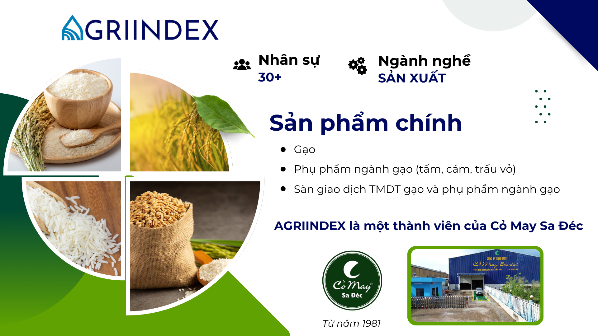
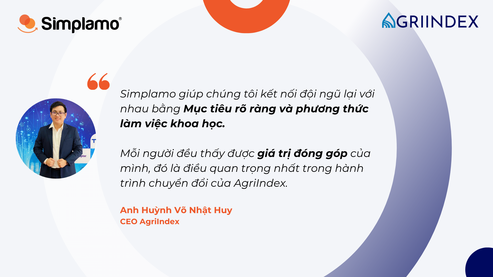

Là một thành viên trong hệ sinh thái Cỏ May Sa Đéc – Tập đoàn nông nghiệp với hơn 40 năm hình thành và phát triển, AgriIndex hoạt động trong lĩnh vực kinh doanh gạo và phụ phẩm ngành gạo như tấm, cám, trấu vỏ.

Doanh nghiệp đồng thời vận hành sàn giao dịch thương mại điện tử gạo và phụ phẩm ngành gạo, góp phần số hoá chuỗi giá trị nông nghiệp Việt Nam.

Với nền tảng truyền thống vững chắc và định hướng đổi mới mạnh mẽ, AgriIndex đang trở thành cầu nối giữa các nhà máy trong chuỗi giá trị, mang lại giá trị bền vững cho ngành nông nghiệp.

Họ không chỉ muốn duy trì giá trị bền vững đã được gây dựng qua nhiều năm, mà còn mong muốn kiến tạo một phương thức vận hành mới, hiện đại, hiệu quả và truyền cảm hứng hơn cho đội ngũ.

## I. Từ di sản vững chãi đến khát vọng quản trị tiên phong

Trong bối cảnh nền kinh tế số và nhu cầu quản trị tinh gọn ngày càng cao, AgriIndex đã chủ động nắm bắt cơ hội chuyển mình để vươn lên dẫn đầu trong kỷ nguyên mới:

- **Khát vọng nâng cấp hệ thống:** Dù có nền tảng vững chắc, AgriIndex cần một mô hình hiện đại để đồng bộ hóa hoạt động, thay thế các phương thức quản lý dựa trên kinh nghiệm.
- **Tiên phong trong hiệu suất và giao tiếp:** Doanh nghiệp mong muốn thiết lập một phương thức giao tiếp tinh gọn, hiệu quả, xóa bỏ mọi sự mơ hồ về vai trò trách nhiệm, minh bạch hiệu suất và giúp từng thành viên thấy rõ ý nghĩa đóng góp của mình mỗi ngày.
- **Tạo dựng năng lượng đột phá:** Với Tầm nhìn của một CEO trẻ, AgriIndex quyết tâm đổi mới phương thức quản trị nhằm hiện thực hóa Mục tiêu và mở rộng tầm ảnh hưởng trong ngành.

Để biến những khát vọng tiên phong này thành hiện thực, AgriIndex đã quyết định triển khai Simplamo – Nền tảng quản trị và thực thi Mục tiêu hiện đại tích hợp các mô hình quản trị OKR/KPI/BSC.

## II. Tái thiết Hệ thống vận hành: Rõ Mục tiêu – Rõ Hiệu suất – Rõ Dòng tiền

AgriIndex kickoff sử dụng Simplamo từ ngày 15.08.2025 với sự đồng hành xuyên suốt của chuyên gia Simplamo.

Trải qua 4 buổi huấn luyện, đội ngũ ban lãnh đạo AgriIndex trước hết đã nắm chắc về mặt tư duy (quản trị Mục tiêu hiện đại, kiểm soát dữ liệu và nhịp họp thực thi) sau đó là áp dụng Simplamo trong việc tạo Mục tiêu, Chỉ số và thực hiện các cuộc họp hiệu suất cải thiện giao tiếp hàng tuần.

Thông qua đó tái thiết quy trình vận hành, tập trung vào việc minh bạch hóa và trách nhiệm hóa mọi hoạt động.

### **1. Phân rã Mục tiêu và Kế hoạch hành động (OKRs/Goals)**

Dưới sự hướng dẫn của chuyên gia Simplamo, Ban lãnh đạo AgriIndex tiến hành phân rã Tầm nhìn thành các **Mục tiêu Quý** rõ ràng, cụ thể. Mỗi thành viên, phòng ban đều được giao Mục tiêu (OKR) và Kế hoạch hành động chi tiết.

**Hiệu quả mang lại:**

- Đội ngũ thấy được “bức tranh lớn” và vai trò cùa từng người trong bức tranh ấy.
- Đảm bảo tính đồng bộ từ chiến lược cấp cao nhất xuống hành động cụ thể.
- Cá nhân và đội nhóm chủ động hơn trong việc xây dựng **kế hoạch để đạt mục tiêu tốt hơn** trong chu kỳ tiếp theo.

### **2. Xây dựng nhịp điệu giao tiếp và họp hệ thống**

Khi mỗi phòng ban và cá nhân nắm được Mục tiêu và trách nhiệm của mình trong Kế hoạch kinh doanh của công ty, bước tiếp theo đội ngũ sẽ tham gia vào **nhịp họp hệ thống** theo chuẩn Simplamo để từng bước “dịch chuyển” các Mục tiêu tiến về phía trước.

Việc này giúp AgriIndex chuyển đổi từ các cuộc họp lan man, không kết luận sang các buổi họp tập trung, có cấu trúc & hướng đến Mục tiêu chung.

**Hiệu quả mang lại:**

- Đảm bảo duy trì kỷ luật họp hàng tuần, hàng quý.
- Thiết lập phương thức giao tiếp hiệu quả, đồng bộ từ trên xuống dưới và tập trung vào cách để hoàn thành Mục tiêu.
- Các vấn đề trọng tâm được xử lý ngay trong buổi họp, không kéo dài.
- Toàn đội ngũ thấy rõ kết quả và sự đóng góp của nhau thông qua việc cùng quan sát tiến độ Mục tiêu và kết quả kinh doanh hàng tuần.

### **3. Minh bạch hóa hiệu suất và dòng tiền (KPIs/Metrics)**

Việc sử dụng Bảng chỉ số đo lường hàng tuần trên Simplamo đã giúp AgriIndex theo dõi các chỉ số quan trọng một cách trực quan, loại bỏ sự phụ thuộc vào báo cáo thủ công.

Đặc biệt, trong một doanh nghiệp có yếu tố truyền thống, việc quản trị tài chính là then chốt. Simplamo đã giúp:

- Đội ngũ tài chính và kinh doanh phối hợp chặt chẽ để tăng tỷ lệ thu hồi công nợ.
- Thiết lập phương án cụ thể hơn trong quản trị dòng tiền, giảm thiểu rủi ro tài chính.

**Tác động:** Lãnh đạo và đội ngũ có thể thấy rõ hiệu suất hoạt động và sức khỏe tài chính của doanh nghiệp theo thời gian thực.

## III. Kết quả bứt phá từ quản trị khoa học:

Chỉ sau 3 tháng áp dụng, AgriIndex đã gặt hái được những thành quả ấn tượng, khẳng định hiệu quả của việc chuyển đổi quản trị khoa học:

- **Hoàn thành Mục tiêu Quý 3:** 80% Mục tiêu chiến lược quan trọng của quý 3 đã được hoàn thành, tạo đà mạnh mẽ cho quý tiếp theo.
- **Cải thiện sức khỏe Tài chính:** Tỷ lệ thu hồi công nợ được cải thiện đáng kể, cùng với các kế hoạch dòng tiền rõ ràng hơn, giúp doanh nghiệp vững vàng hơn về tài chính.
- **Văn hóa hiệu suất:** Đội ngũ không chỉ làm việc mà còn **thấy rõ kết quả đạt được hằng ngày**, tạo động lực và sự minh bạch, củng cố niềm tin vào mô hình quản trị mới.

Simplamo không chỉ là một công cụ, mà đã trở thành **hệ thống vận hành cốt lõi** giúp AgriIndex chuyển giao kinh nghiệm truyền thống thành năng lượng hiện đại, đưa doanh nghiệp đi đúng hướng và hiện thực hóa tầm nhìn bứt phá trong ngành nông nghiệp.

**Bạn cũng đang điều hành doanh nghiệp lâu đời và mong muốn chuyển đổi?**

Hãy để Simplamo đồng hành cùng bạn xây dựng một hệ thống **đồng bộ – đơn giản – hiệu quả**, giúp đội ngũ nhìn rõ Mục tiêu và tăng tốc thực thi.

👉 [**Đăng ký dùng thử Simplamo trong 30 ngày.**](https://app.simplamo.com/sign-up?lang=vi)

…

Simplamo – Quản trị & Thực thi Mục tiêu xuất sắc, ứng dụng KPI, OKRs, BSC và 4DX. Công cụ giúp Ban điều hành, HDQT theo dõi thúc đẩy các Mục tiêu hiệu quả, nâng cao hiệu suất.

Hãy bắt đầu trải nghiệm [Simplamo](https://www.facebook.com/simplamocom) và cảm nhận sự thay đổi chỉ sau 4 tuần!

Đăng ký nhận buổi demo [Simplamo](https://www.linkedin.com/company/79564065/) tại: <https://app.simplamo.com/vi/sign-up>
