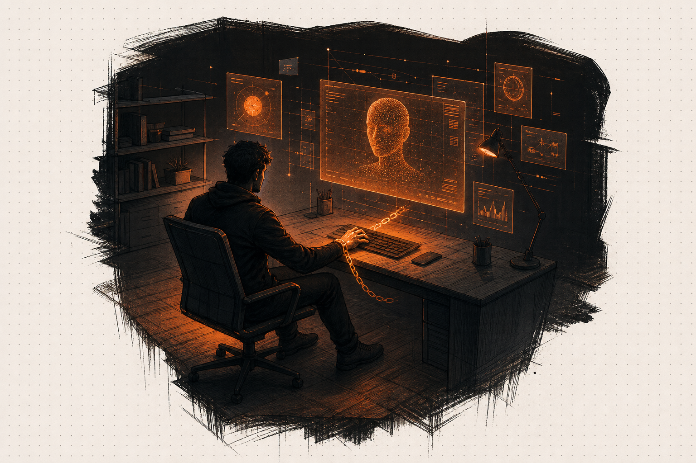
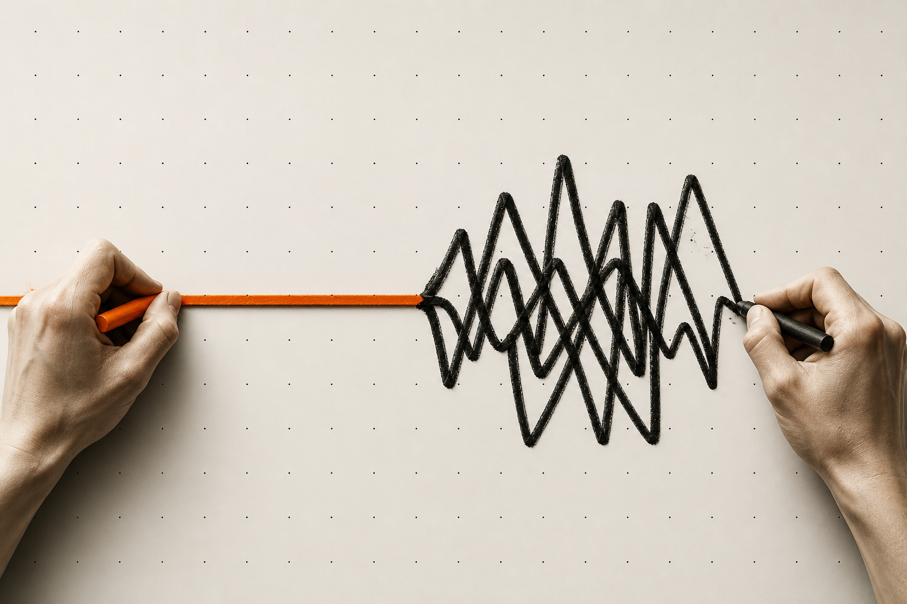
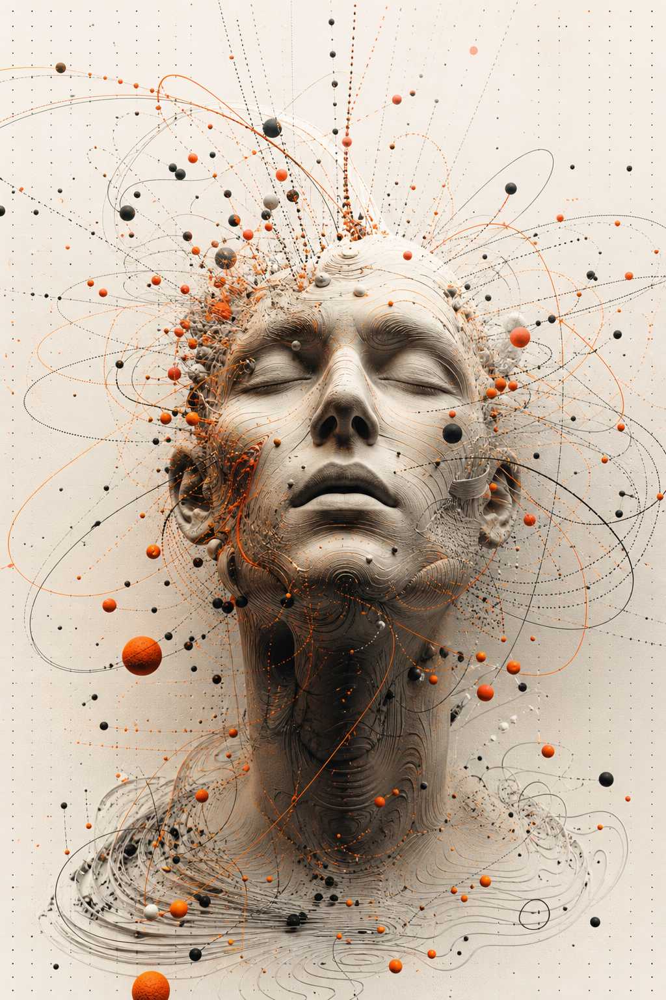
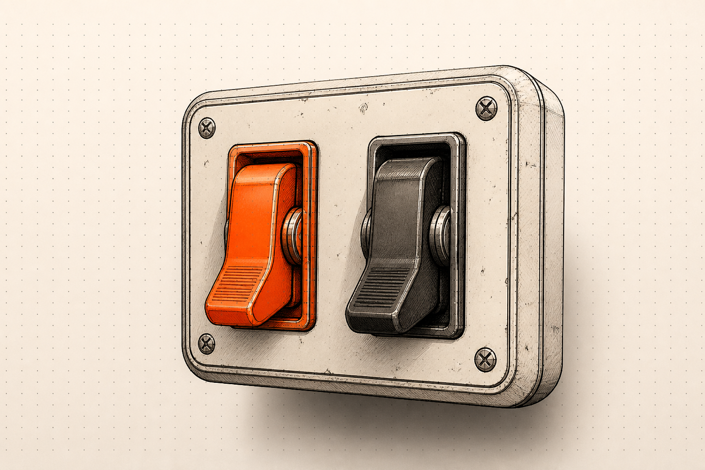
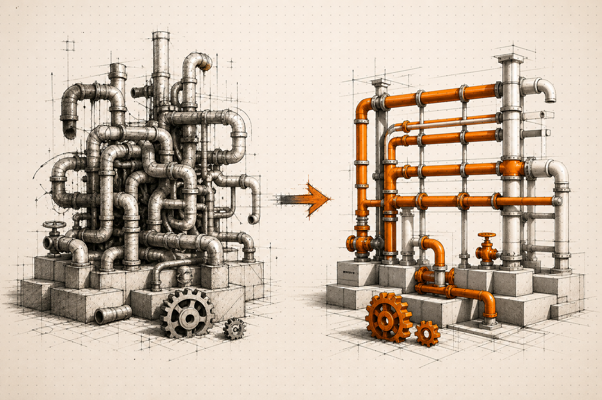
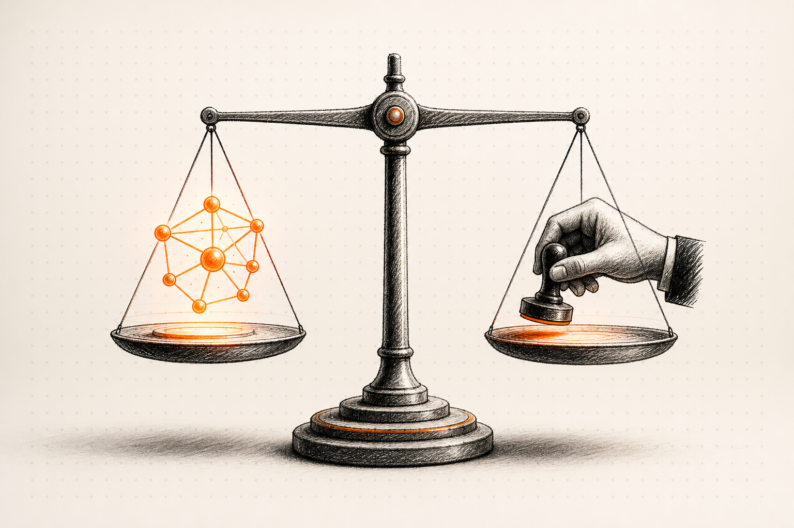
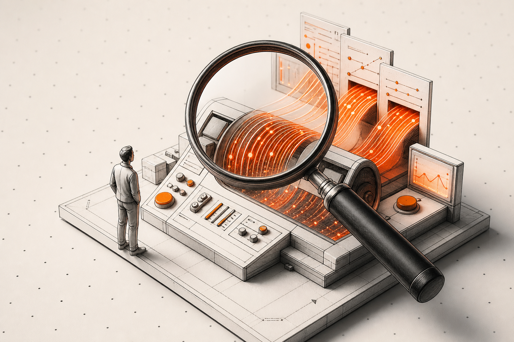
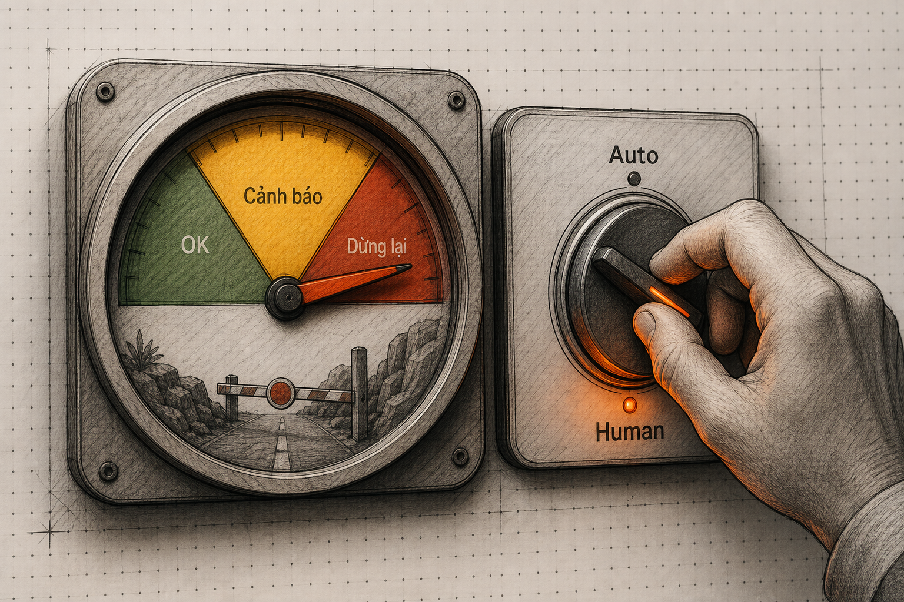

90% startup thất bại. Con số đó có trước AI, có sau AI, và sẽ còn đó sau AI.

Nhưng AI không làm con số đó giảm đi. Nó chỉ làm phần còn lại thất bại nhanh hơn.

Tôi viết bài này không phải để chê AI — tôi dùng AI mỗi ngày. Tôi viết để phản biện lại câu chuyện cổ tích đang được bán cho hàng ngàn người: "AI cho phép một người làm việc của năm người."

Đúng. Một người có thể làm việc của năm người.

Nhưng một người không thể **quyết định** cho năm người.

Và đó là điểm mù lớn nhất của trào lưu này.

---

## Tôi thấy gì?

Tôi đã làm việc với nhiều founder SME và doanh nghiệp một người trong suốt 5 năm qua. Trong số đó, có người dùng AI rất thành công. Có người thất bại. Cả hai đều thật.

Người thành công có một điểm chung: **họ tổ chức doanh nghiệp tốt trước khi dùng AI.** Họ có quy trình, có SOP, có hệ thống — rồi mới gắn AI vào để tăng tốc.

Người thất bại có một điểm chung: **họ nghĩ AI sẽ tự sắp xếp mọi thứ.** Họ mua ChatGPT, mua automation tools, mua AI agent — và hy vọng doanh nghiệp tự chạy.

AI không phải là vấn đề. Cách bạn tổ chức doanh nghiệp trước khi dùng AI mới là vấn đề.

Hãy nhìn vào bản chất.

---

## Lập luận 1: AI không có đồng nghiệp — nó không thể nói bạn sai

Khi bạn có một người đồng nghiệp, người đó có thể nói: "Cái này có vẻ không ổn." Khi bạn có một team, một người kiểm tra, một người phản biện, một người nhìn từ góc khác.

Khi bạn có AI, bạn hỏi — và AI trả lời. Luôn. Lịch sự. Tự tin.

Ngay cả khi câu trả lời sai.

Tôi biết một developer solo dùng AI để viết code cho sản phẩm của mình. Code chạy được. Tính năng hoạt động. Anh ta hài lòng. Ba tháng sau, một lỗ hổng bảo mật bị phát hiện — dữ liệu khách hàng bị lộ. Không ai biết. Vì không có ai review code.

AI không có trách nhiệm giải trình. Người duy nhất phải trả giá: bạn.

Đây không phải lỗi của AI. Đây là lỗi của người nghĩ rằng một công cụ thông minh có thể thay thế một team kiểm tra chéo. Nó không thể.

Và nếu bạn là doanh nghiệp một người, không có ai kiểm tra bạn — hãy chuẩn bị tinh thần rằng bạn đang chấp nhận một rủi ro mà không ai nói cho bạn biết.

---

## Lập luận 2: Năng suất tăng — nhưng điểm nghẽn vẫn là một cái đầu

Đây là điều ít người nói về năng suất AI.

Bạn dùng AI viết content. AI tạo ra 20 bài. Bạn duyệt — mất 2 tiếng.

Bạn dùng AI vẽ hình. AI tạo ra 5 phiên bản. Bạn chọn — mất 30 phút.

Bạn dùng AI phân tích số liệu. AI tạo ra 3 kịch bản. Bạn quyết định — mất 1 tiếng.

Cuối ngày, bạn làm việc nhiều hơn, không ít hơn. Bạn chỉ chuyển từ "làm tay" sang "làm đầu." Và đầu bạn vẫn chỉ có 24 giờ.

Năng suất không phải là vấn đề. **Quyết định** mới là.

AI có thể tạo ra 20 lựa chọn trong một phút. Nhưng một người chỉ có thể quyết định một lựa chọn trong một khoảng thời gian. Điểm nghẽn không phải là sản xuất — điểm nghẽn là **lọc và quyết định.**

Khi bạn là doanh nghiệp một người, không ai lọc giúp bạn. Không ai ưu tiên giúp bạn. Không ai nói "cái này quan trọng hơn cái kia."

Và nếu bạn giao việc quyết định cho AI — bạn vừa trao quyền cho một cái máy không hiểu gì về doanh nghiệp của bạn.

---

## Lập luận 3: Burnout tốc độ cao

AI làm việc 24/7. Bạn không phải AI.

Doanh nghiệp một người không AI: chậm nhưng có nhịp. Sáng làm, tối nghỉ. Cuối tuần không gửi email. Có ranh giới.

Doanh nghiệp một người có AI: nhanh nhưng không có điểm dừng.

AI gửi email lúc 10 giờ tối. Bạn đọc, bạn trả lời.
AI tạo báo cáo lúc 6 giờ sáng. Bạn đọc, bạn điều chỉnh.
AI chat với khách hàng lúc nửa đêm. Bạn thức dậy kiểm tra.

Ranh giới "đủ" không tồn tại khi AI không bao giờ ngừng tạo ra đầu việc. Và bạn, với tư cách là người duy nhất, không thể nói "để mai."

Tôi thấy điều này lặp lại ở rất nhiều founder solo dùng AI: họ hào hứng trong 3 tháng đầu. Tháng 4, họ bắt đầu mệt. Tháng 6, họ kiệt sức. Một số bỏ cuộc. Một số quay lại làm thủ công. Một số ít — biết cách đặt giới hạn.

Sự khác biệt không nằm ở AI. Nằm ở kỷ luật cá nhân.

Và kỷ luật cá nhân là thứ AI không thể dạy bạn.

---

## Lập luận 4: Bus factor = 1, nhưng với AI, một sai lầm chạy nhanh gấp 10 lần

Bus factor là số người có thể nghỉ trước khi công ty tê liệt. Với doanh nghiệp một người, con số này luôn là 1.

Không AI: một sai lầm xảy ra — bạn phát hiện chậm, sửa chậm, nhưng hậu quả nhỏ. Vì bạn chỉ làm một việc một lúc.

Có AI: một quyết định sai — và AI thực thi nó ngay lập tức trên toàn bộ hệ thống.

Gửi sai email? AI gửi cho 500 khách hàng trong 3 giây.
Sai giá? AI cập nhật toàn bộ website trong 1 phút.
Sai điều khoản? AI ký hợp đồng trong đêm.

Một sai lầm với AI không chỉ nhanh hơn — nó còn có hệ thống hơn, nhất quán hơn, và khó thu hồi hơn.

Đây là điều tôi muốn mọi founder solo hiểu: **AI khuếch đại không chỉ năng suất — nó khuếch đại cả sai lầm.**

Bạn có thể thành công nhanh gấp 10 lần với AI. Bạn cũng có thể thất bại nhanh gấp 10 lần.

Không ai nói với bạn điều đó.

---

## Giải pháp: 4 nguyên tắc để dùng AI mà không tự sát

Sau khi quan sát cả người thành công và người thất bại, tôi đúc kết 4 nguyên tắc.

### 1. Hệ thống trước, AI sau

Nguyên tắc quan trọng nhất. Cũng là nguyên tắc bị vi phạm nhiều nhất.

Đừng mua AI để vá quy trình đang hỏng. AI không sửa được quy trình tồi — nó chỉ làm quy trình tồi chạy nhanh hơn.

Trước khi dùng AI viết báo giá, hãy đảm bảo quy trình báo giá của bạn đã rõ: ai duyệt, khi nào gửi, giá bao nhiêu, chiết khấu thế nào.

Sau đó dùng AI để tăng tốc. Không phải để quyết định.

Người thành công tôi biết đều làm theo thứ tự này: **thiết kế quy trình → chuẩn hoá SOP → automation → AI.** Không bao giờ làm ngược.

### 2. Human-in-the-loop — không phải để làm chậm, để không chết

AI đề xuất. Người quyết định.

Nghe có vẻ chậm. Nhưng nó là tấm lưới bảo vệ cuối cùng của doanh nghiệp một người.

Rule of thumb: giao cho AI những việc **sai được.** Giữ lại những việc **sai không được.**

- Sai được: gợi ý content, tạo draft, phân tích dữ liệu sơ bộ.
- Sai không được: duyệt giá, ký hợp đồng, trả lời khiếu nại, quyết định chiến lược.

Với doanh nghiệp một người, ranh giới này là thứ sống còn. Vượt qua nó — bạn đang đánh bạc.

### 3. Có "tầng kiểm tra thứ hai"

Nếu bạn là solo founder, hãy cân nhắc việc thuê một người 10 giờ mỗi tuần. Không phải để làm việc. Để **kiểm tra AI.**

Một người bên ngoài nhìn vào số liệu, đọc email AI vừa gửi, kiểm tra báo giá AI vừa tạo.

Chi phí: vài triệu mỗi tháng. Chi phí của một lần AI sai không ai phát hiện: có thể gấp 100 lần.

Đây là bảo hiểm rẻ nhất cho doanh nghiệp một người dùng AI.

### 4. Biết điểm dừng — và biết khi nào cần người thật

AI thay được thao tác. AI không thay được quan hệ, trách nhiệm, và cảm giác "có người ở đó."

Ba dấu hiệu bạn đang dùng AI quá nhiều:

1. **Khách hàng phàn nàn không nói chuyện được với người thật.** — Nghe đi. Họ có lý do.
2. **Bạn không hiểu tại sao AI làm thế.** — Bạn đã mất kiểm soát.
3. **Bạn không dám tắt AI dù chỉ một ngày.** — Bạn đã phụ thuộc.

Khi cả ba dấu hiệu xuất hiện, đã đến lúc dừng lại và thiết kế lại. Không phải thêm AI — mà là **lấy lại quyền kiểm soát.**

---

## Kết luật: AI không biến doanh nghiệp 1 người thành công ty 10 người

Nó biến doanh nghiệp 1 người thành một cỗ máy chạy bằng một đôi tay — nhưng tốc độ gấp 10 lần.

Và khi đôi tay đó mỏi — không ai thay được.

Tôi không nói đừng dùng AI. Tôi nói: hãy tổ chức doanh nghiệp của bạn trước. Hãy xây hệ thống. Hãy hiểu rõ quy trình. Rồi mới gắn AI vào để tăng tốc.

Đừng để hype đưa bạn vào một cuộc đua mà bạn là người duy nhất chạy.

Và nếu bạn đang là doanh nghiệp một người dùng AI — hãy thử tắt nó một ngày. Xem chuyện gì xảy ra.

Câu trả lời sẽ nói cho bạn biết bạn đang ở đâu.

---

*Đọc thêm về tư duy hệ thống tại [davidtung.net](https://davidtung.net).*
