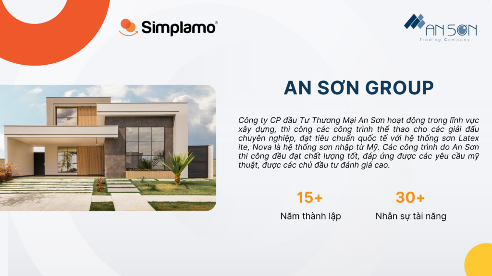
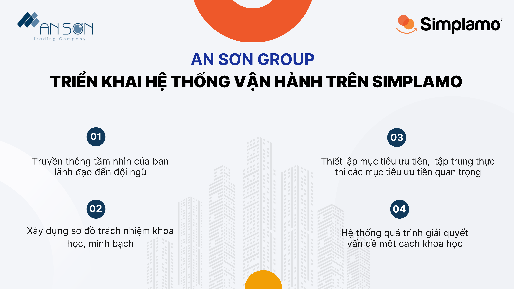
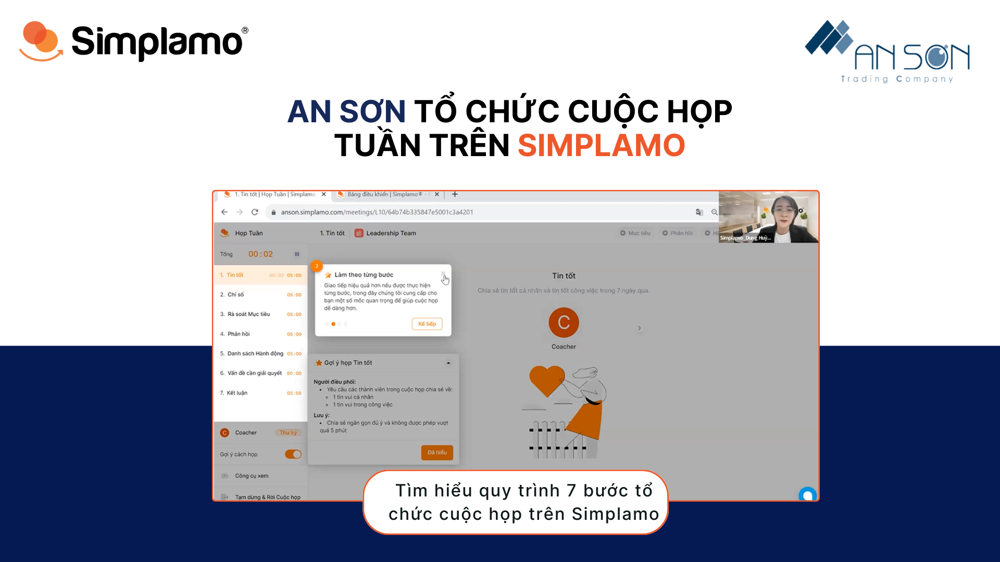
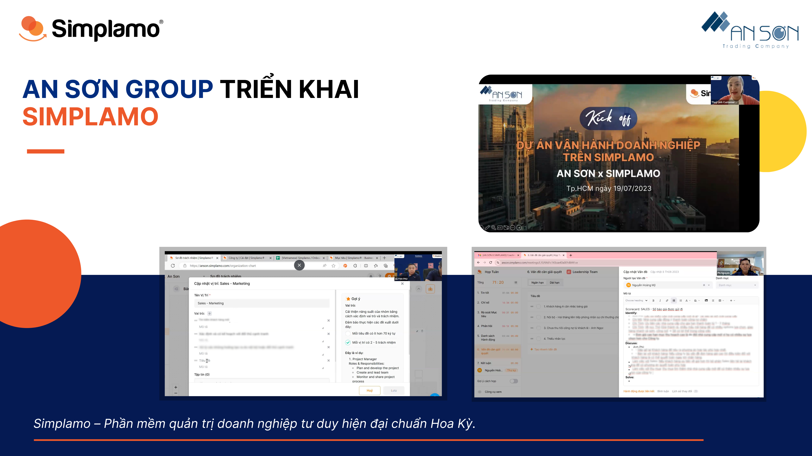

Anh Đinh Hoàng Lâm – CEO An Sơn chia sẻ “Tổ chức cuộc họp hàng tuần là phần mình mong chờ nhất, mình hiểu được quá trình khai thác nguyên nhân của một vấn đề, và việc hệ thống lại mọi thứ theo nguyên tắc 3 bước trên Simplamo giúp mình và đội ngũ tiết kiệm thời gian và đưa ra phương án giải quyết nhanh hơn”

Công ty Cổ Phần đầu Tư Thương Mại An Sơn hoạt động trong lĩnh vực xây dựng, trong suốt quá trình thành lập đến nay An Sơn đã vươn lên trở thành một công ty uy tín, có chỗ đứng vững chắc trên thị trường xây dựng và thi công các công trình thể thao cho các giải đấu chuyên nghiệp, đạt tiêu chuẩn quốc tế với hệ thống sơn Latex ite, Nova là hệ thống sơn nhập từ Mỹ. Các công trình do An Sơn thi công đều đạt chất lượng tốt, đáp ứng được các yêu cầu mỹ thuật, được các chủ đầu tư đánh giá cao.

Là doanh nghiệp hoạt động nhiều năm trong lĩnh vực xây dựng, thời điểm hiện tại, anh Đinh Hoàng Lâm – CEO An Sơn mong muốn hệ thống hóa mô hình kinh doanh một cách bài bản, giúp đội ngũ hiểu được tầm nhìn và tập trung vào thực thi mục tiêu, để có những bước phát triển xa hơn trong tương lai.

Với sự hỗ trợ của đội ngũ chuyên gia Simplamo, ban lãnh đạo An Sơn đã chính thức triển khai phần mềm vào ngày 19/07/2023. Ở buổi đầu tiên mọi người đã cùng nhau thảo luận chuẩn hóa sơ đồ trách nhiệm – làm rõ vai trò mỗi thành viên và xây dựng mục tiêu ưu tiên quý – đưa tầm nhìn của lãnh đạo đến đội ngũ trong quá trình thực thi.

## Hoàn thiện hệ thống sơ đồ trách nhiệm trong tổ chức

Tại buổi đầu tiên đội ngũ chuyên gia Simplamo hỗ trợ ban lãnh đạo An Sơn xây dựng sơ đồ giải trình trách nhiệm, giúp An Sơn thể hiện rõ ràng các vị trí quan trọng cần có trong tổ chức cùng với người đảm nhận rõ ràng, đi kèm là 5 vai trò cần đảm nhận. Trong khi sơ đồ tổ chức truyền thống chỉ thể hiện rõ những “chức vụ” thì sơ đồ giải trình trách nhiệm thể hiện rõ “chức năng” cần có cho sự phát triển, đồng thời xóa bỏ các vấn đề nảy nở trong quá trình thực thi từ việc đội ngũ không xác định trách nhiệm rõ ràng, chồng chéo chức năng.

## Xây dựng mục tiêu ưu tiên quý – đưa tầm nhìn của lãnh đạo đến đội ngũ trong quá trình thực thi

Anh Lâm mong muốn đội ngũ nắm rõ định hướng của doanh nghiệp trong quá trình thực thi, cũng như Tầm nhìn – Chiến lược của An Sơn trong hành trình phát triển, đảm bảo mục tiêu luôn được thông suốt.

Với tư duy trên Simplamo, Tầm nhìn của An Sơn được thể hiện rất cụ thể và thông suốt: Mục tiêu được chia nhỏ từ Tầm nhìn của doanh nghiệp, sau đó được phân rã thành các cột mốc Milestone giúp mọi thành viên dễ dàng bám sát và đánh dấu hành trình thực thi để đạt kết quả cuối cùng.

## Thiết lập bảng chỉ số Scorecard hàng tuần

Hướng đi tiếp theo, Simplamo hỗ trợ đội ngũ ban lãnh đạo An Sơn xây dựng bảng chỉ số đo lường hàng tuần. Đội ngũ ban lãnh đạo đã cùng thảo luận để thiết lập các chỉ số đo lường giúp doanh nghiệp nắm bắt tình hình kinh doanh, đưa ra những quyết định kịp thời trong ngắn hạn.

Là doanh nghiệp hoạt động trong lĩnh vực xây dựng, việc xây dựng bảng chỉ số để đo lường tình hình hoạt động kinh doanh có ý nghĩa quan trọng để quản lý dự án một cách hiệu quả cũng như đảm bảo rằng các dự án được triển khai thành công. Simplamo giúp An Sơn đưa những chỉ số quan trọng mà anh đã xây dựng trực quan hóa trên phần mềm và cô đọng chúng thành 5 -15 chỉ số cốt lõi, nhanh chóng đo lường chỉ số quan trọng và có được góc nhìn tổng thể.

## Hướng dẫn đội ngũ tổ chức cuộc họp hàng tuần

Đội ngũ chuyên gia Simplamo đã hướng dẫn An Sơn tổ chức khung cuộc họp hàng tuần 7 bước giúp đội ngũ An Sơn:

- Gắn kết đội ngũ thông qua việc chia sẻ tin tốt
- Giảm thời gian họp hành
- Bám sát tình hình thực thi mục tiêu thông qua việc review tiến độ
- Tạo khoảng không gian giúp đội ngũ giải quyết vấn đề, trực quan hóa quá trình giải quyết vận đề, đưa ra kết quả cuối cùng hạn chế hiện trạng tồn đọng, không xử lý kịp thời

Với tinh thần cởi mở, việc quyết định áp dụng Simplamo vào vận hành giúp An Sơn từng bước củng cố hệ thống vận hành của mình, tạo nền tảng vững chắc để đội ngũ bám đuổi Tầm nhìn, thực thi mục tiêu thành công.

Simplamo sẽ tiếp tục hỗ trợ An Sơn trên hành trình vận hành doanh nghiệp sắp tới, hy vọng An Sơn sẽ đạt được những bước tiến mạnh mẽ khi vận hành doanh nghiệp trên nền tảng.

—————————————————

[Simplamo](https://simplamo.com/vi/) – Phần mềm quản trị mục tiêu khoa học hiện đại, kết hợp độc đáo giữa KPI, OKR. Biến mọi thứ phức tạp trong điều hành trở nên đơn giản và gần gũi đến từng nhân viên. Giải phóng áp lực cho nhà lãnh đạo, tập trung vào điều quan trọng, tối ưu hiệu suất làm việc cho doanh nghiệp.

Hãy bắt đầu trải nghiệm Simplamo và cảm nhận sự thay đổi chỉ sau 4 tuần!

Đăng ký nhận buổi demo Simplamo tại: <https://app.simplamo.com/sign-up>
