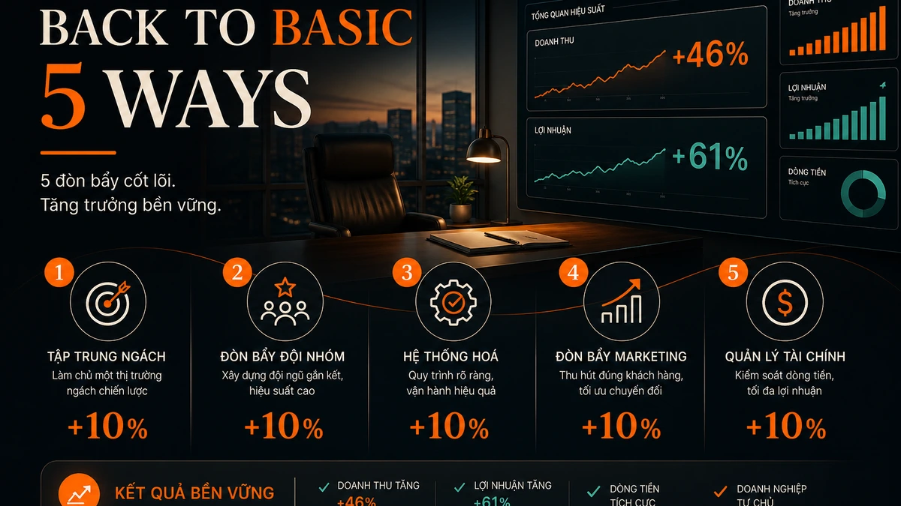
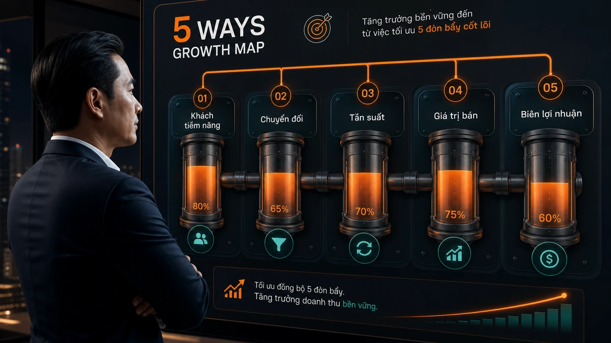
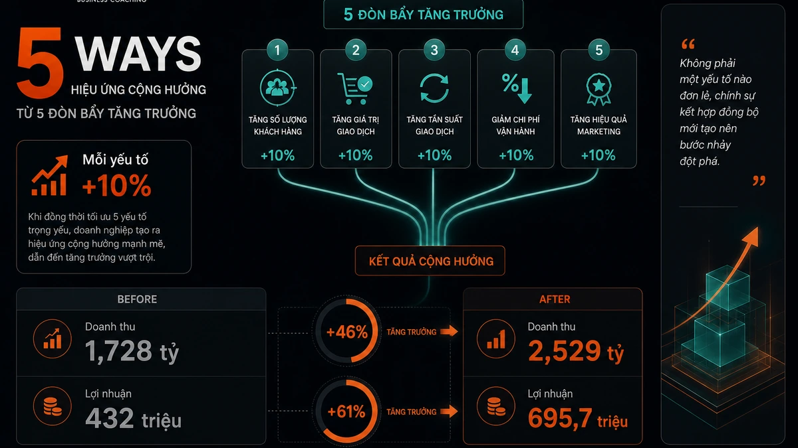
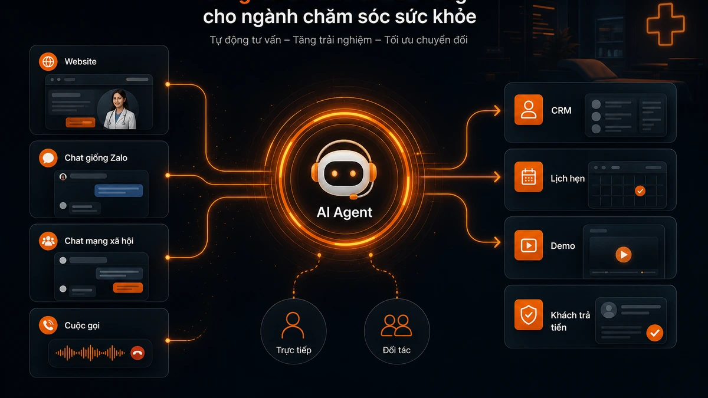
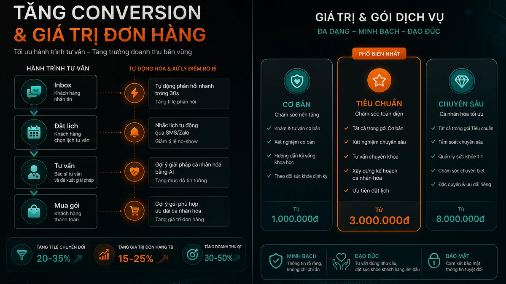
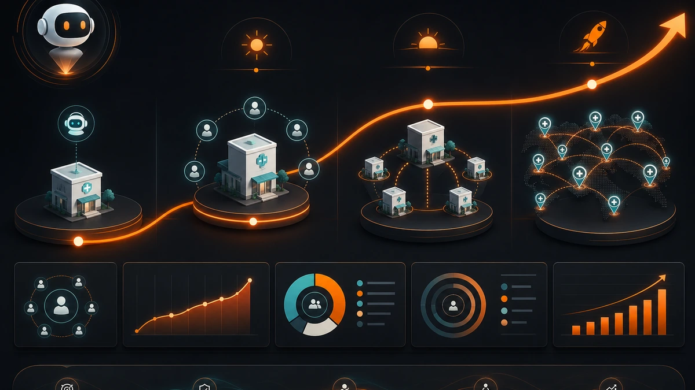
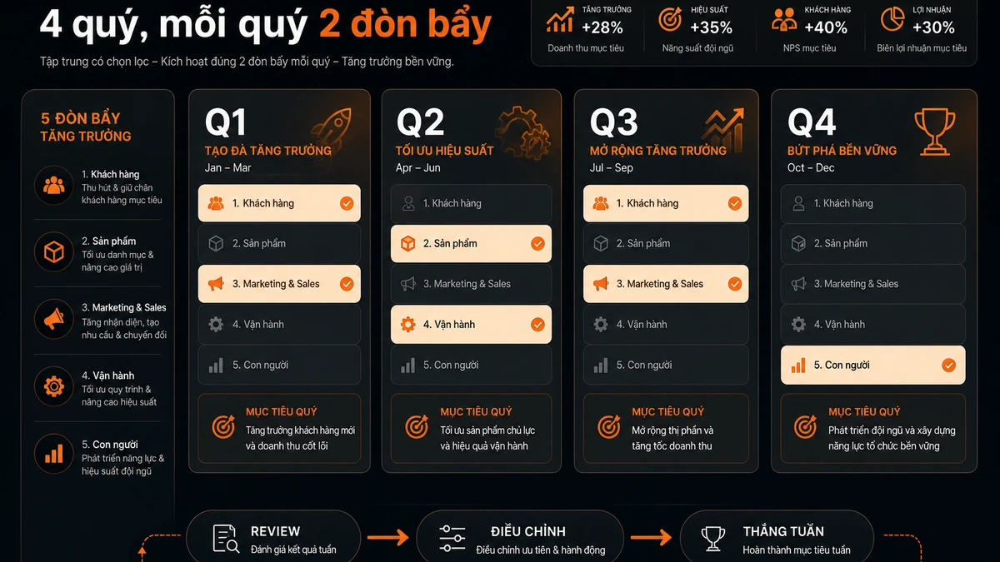
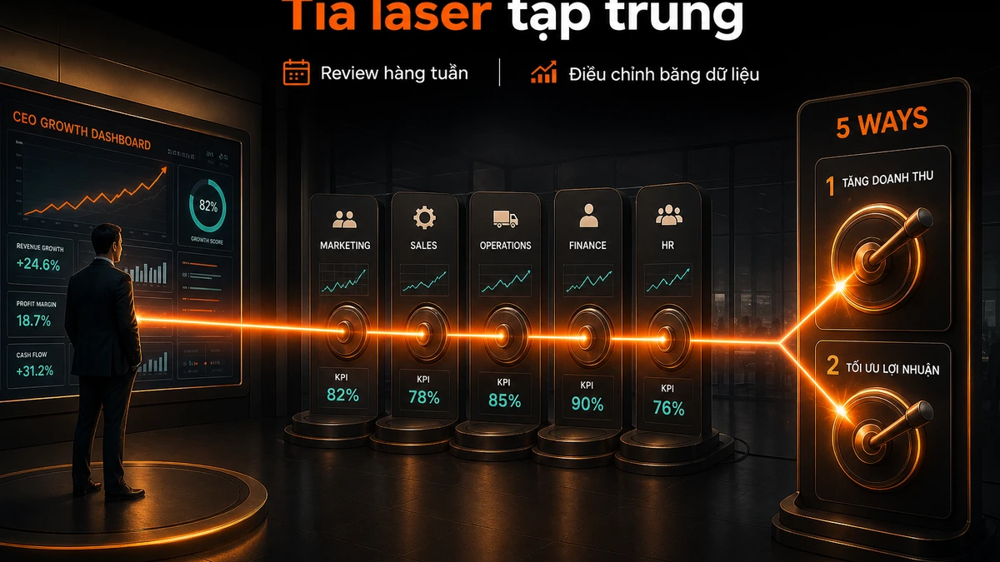
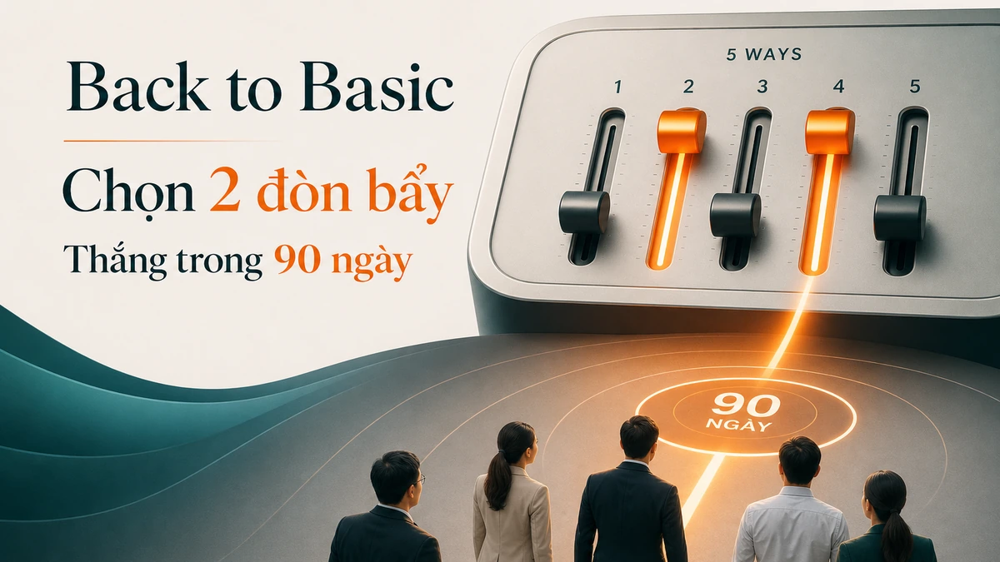

Có một kiểu tăng trưởng nghe rất hấp dẫn: x10, x15, đổi cuộc chơi, mở thị trường mới, đổi mô hình.

Tôi không phản đối. Nhưng phải nói thẳng: nếu một công ty thật sự tăng x10 hoặc x15, phần lớn trường hợp đó không còn là tối ưu vận hành nữa. Đó là **thay đổi mô hình**.

Mô hình bán hàng khác. Mô hình phân phối khác. Mô hình giá khác. Mô hình sản phẩm khác. Có thể là từ dịch vụ sang SaaS. Từ bán trực tiếp sang đối tác. Từ triển khai thủ công sang nền tảng tự phục vụ. Từ một phân khúc nhỏ sang một thị trường rộng hơn.

Nhưng nếu mục tiêu của CEO là tạo ra thay đổi nhìn thấy trong **90 ngày**, tôi thường không bắt đầu bằng câu hỏi: “Làm sao để x10?”

Tôi bắt đầu bằng câu hỏi đơn giản hơn:

> Trong 5 con số cơ bản của tăng trưởng, chỗ nào đang nghẽn nhất?

Đây là lý do tôi thích tư duy **Back to Basic**.

Không phải quay lại cơ bản vì thiếu tham vọng. Mà vì cơ bản là nơi kết quả xuất hiện nhanh nhất nếu công ty biết đo, biết chọn, biết làm và biết review.



## 5 Ways không phải bài toán Excel, mà là bản đồ tăng trưởng của CEO

Framework 5 Ways của ActionCOACH rất đơn giản:

```text
Khách hàng tiềm năng × Tỷ lệ chuyển đổi = Khách hàng

Khách hàng × Tần suất mua × Giá trị mỗi lần bán = Doanh thu

Doanh thu × Tỷ suất lợi nhuận = Lợi nhuận
```

Nghe giống một công thức tài chính. Nhưng nếu nhìn đúng, đây là bản đồ điều hành.

Vì mỗi dòng trong công thức này đại diện cho một câu hỏi vận hành rất cụ thể.

**Khách hàng tiềm năng** cho biết thị trường có đang biết tới mình không.

**Tỷ lệ chuyển đổi** cho biết thông điệp, quy trình tư vấn và năng lực bán hàng có đủ lực không.

**Tần suất mua** cho biết khách hàng có quay lại, dùng tiếp, mua thêm hay chỉ đến một lần rồi biến mất.

**Giá trị mỗi lần bán** cho biết công ty có thiết kế gói giá trị đủ sâu không, hay chỉ đang bán từng món rời rạc.

**Tỷ suất lợi nhuận** cho biết tăng trưởng có thật sự tạo tiền, hay chỉ tạo doanh thu đẹp trên báo cáo.

Một CEO không nhìn doanh nghiệp qua 5 chỉ số này rất dễ rơi vào họp cảm tính.

Marketing nói thiếu ngân sách. Sales nói lead kém. Product nói khách chưa hiểu giá trị. Finance nói biên lợi nhuận thấp. Mỗi phòng đúng một phần. Nhưng không ai chỉ ra chính xác nút nghẽn nằm ở đâu.

5 Ways ép công ty quay về một câu hỏi rất thật:

> Nếu chỉ được chọn 2 đòn bẩy trong quý này, chúng ta chọn gì?



## Vì sao mỗi yếu tố chỉ tăng 10% mà doanh thu có thể tăng 46%

Điểm hay của 5 Ways nằm ở hiệu ứng nhân.

Giả sử một công ty có bộ số theo quý như sau:

| Chỉ số | Trước |
|---|---:|
| Khách hàng tiềm năng | 1.200 |
| Tỷ lệ chuyển đổi | 15% |
| Khách hàng mới | 180 |
| Tần suất mua / khách / quý | 1,2 |
| Giá trị mỗi lần bán | 8.000.000đ |
| Doanh thu / quý | 1,728 tỷ |
| Tỷ suất lợi nhuận | 25% |
| Lợi nhuận / quý | 432 triệu |

Bây giờ không cần một cú nhảy khổng lồ. Chỉ cần từng yếu tố nhích lên 10%:

| Chỉ số | Sau khi tăng 10% |
|---|---:|
| Khách hàng tiềm năng | 1.320 |
| Tỷ lệ chuyển đổi | 16,5% |
| Tần suất mua / khách / quý | 1,32 |
| Giá trị mỗi lần bán | 8.800.000đ |
| Tỷ suất lợi nhuận | 27,5% |

Kết quả không phải tăng 10%.

Kết quả là:

| Kết quả | Trước | Sau | Tăng |
|---|---:|---:|---:|
| Doanh thu | 1,728 tỷ | 2,529 tỷ | ~46,4% |
| Lợi nhuận | 432 triệu | 695,7 triệu | ~61,1% |

Đây là lý do tôi thích gọi 5 Ways là tư duy “điều chỉnh bánh răng”.

Bạn không cần đập bỏ cả cỗ máy. Bạn chỉnh đúng 5 bánh răng nhỏ. Khi chúng ăn khớp với nhau, đầu ra thay đổi rất lớn.

Nhưng có một cái bẫy.

Nhiều CEO thấy 5 yếu tố rồi muốn làm cả 5 cùng lúc.

Thế là quý đó công ty có 5 ưu tiên lớn, 13 dự án nhỏ, 27 đầu việc, và cuối cùng không có gì đủ sắc để thắng.

Back to Basic không có nghĩa là làm nhiều thứ cơ bản. Nó có nghĩa là chọn rất ít thứ cơ bản, rồi làm tới nơi.



## Case: SaaS AI Agent tư vấn đa nền tảng cho ngành chăm sóc sức khỏe

Bây giờ lấy một case cụ thể.

Một công ty SaaS bán giải pháp **AI Agent tư vấn đa nền tảng** cho phòng khám, nha khoa, spa trị liệu và trung tâm chăm sóc sức khỏe.

Sản phẩm chính là một AI Agent có thể tư vấn trên website, Facebook, Zalo, Messenger, đồng thời kết nối với CRM, lịch hẹn và form tư vấn.

Công ty có 2 kênh bán hàng:

1. **Bán trực tiếp** cho phòng khám và trung tâm chăm sóc sức khỏe.
2. **Bán qua đối tác** như agency marketing, consultant ngành healthcare, đơn vị triển khai CRM.

Bộ số gốc theo quý:

| Chỉ số | Giá trị |
|---|---:|
| Khách hàng tiềm năng | 1.200 |
| Tỷ lệ chuyển đổi thành khách trả tiền | 15% |
| Khách hàng mới | 180 |
| Tần suất mua / quý | 1,2 |
| Giá trị mỗi lần bán | 8.000.000đ |
| Doanh thu / quý | 1,728 tỷ |
| Biên lợi nhuận | 25% |
| Lợi nhuận / quý | 432 triệu |

Nếu hỏi chung chung: “Làm sao tăng doanh thu?”, công ty sẽ có 100 câu trả lời.

Chạy thêm ads. Tuyển thêm sales. Làm webinar. Thêm tính năng AI. Giảm giá. Tăng hoa hồng đối tác. Đổi landing page. Làm video. Làm referral.

Không sai. Nhưng quá rộng.

5 Ways giúp CEO hỏi sắc hơn:

- Lead có đủ và đúng phân khúc chưa?
- Lead có chuyển thành lịch demo không?
- Demo có chuyển thành khách trả tiền không?
- Khách đang mua gói quá nhỏ hay đúng gói giá trị?
- Biên lợi nhuận có bị ăn mòn bởi onboarding, support, custom quá nhiều không?

Đây là lúc chiến lược bớt mơ hồ.

Không còn “tăng trưởng doanh thu”.

Mà là: quý này chọn đúng 2 nút nghẽn, mỗi nút nghẽn có 1 chiến lược SMART, rồi ép cả team chạy theo một nhịp review hàng tuần.



## Quý 1: ưu tiên Tỷ lệ chuyển đổi và Giá trị mỗi lần bán

Trong quý đầu tiên, tôi sẽ không chọn cả 5 Ways.

Tôi chọn 2:

1. **Tỷ lệ chuyển đổi**
2. **Giá trị mỗi lần bán**

Vì sao?

Vì ở giai đoạn này, công ty đã có lead. Lead đến từ ads, webinar, đối tác và giới thiệu. Nhưng vấn đề nằm ở hai chỗ:

- nhiều lead quan tâm nhưng không đi tới demo hoặc mua gói nhỏ nhất;
- nhiều khách không hiểu được giá trị của một hệ thống AI Agent triển khai đầy đủ.

Nếu quý 1 chỉ chăm chăm tăng lead, công ty sẽ đổ thêm nước vào cái phễu đang rò.

Đó là lỗi rất thường gặp.

Marketing tạo thêm lead, sales vẫn mất lead, product vẫn phải giải thích lại từ đầu, support vẫn onboarding thủ công, finance vẫn thấy biên lợi nhuận mỏng.

Muốn tăng trưởng 90 ngày, đừng đổ thêm nước trước khi vá phễu.

### Chiến lược SMART 1: tăng tỷ lệ chuyển đổi

Mục tiêu không nên viết là: “Tăng conversion”.

Mục tiêu phải cụ thể hơn:

> Trong 90 ngày, tăng tỷ lệ chuyển đổi từ lead đủ điều kiện sang khách trả tiền từ 15% lên 18% bằng quy trình demo 3 bước, follow-up trong 24 giờ và dashboard theo dõi lead nóng hằng ngày.

Đây mới là SMART.

- **Cụ thể:** tăng conversion từ lead đủ điều kiện sang khách trả tiền.
- **Đo được:** 15% lên 18%.
- **Có người phụ trách:** sales lead chịu conversion, marketing chịu chất lượng lead, product chịu demo flow.
- **Có deadline:** 90 ngày.
- **Có nhịp review:** dashboard hằng tuần.

Trong ngành chăm sóc sức khỏe, ví dụ trực quan hơn như sau.

Một phòng khám nhận 1.000 inbox/tháng. Trong đó 300 người hỏi giá hoặc hỏi lịch. Nhưng chỉ 120 người đặt lịch tư vấn. Chỉ 70 người đến thật. Và chỉ 25 người mua gói điều trị.

Nếu AI Agent chỉ trả lời câu hỏi kiểu “phòng khám mở cửa mấy giờ”, nó chưa đủ.

AI Agent phải giúp tăng conversion ở từng điểm rơi:

- phản hồi trong 30 giây;
- hỏi đúng nhu cầu và triệu chứng;
- phân loại lead nóng, ấm, lạnh;
- gợi ý lịch phù hợp;
- nhắc lịch trước giờ hẹn;
- gửi case phù hợp trước buổi tư vấn;
- chuyển lead nóng cho tư vấn viên trong 24 giờ.

Đây không phải “chatbot”. Đây là một quy trình chuyển đổi.

### Chiến lược SMART 2: tăng giá trị mỗi lần bán

Mục tiêu cũng không nên viết là: “Tăng doanh thu trung bình”.

Viết như vậy thì sales sẽ hiểu thành bán mạnh hơn, ép gói cao hơn, hoặc thêm ưu đãi cho rối.

Trong chăm sóc sức khỏe, cách đó rất nguy hiểm. Upsell bẩn là tự bắn vào niềm tin.

Mục tiêu SMART nên là:

> Trong 90 ngày, tăng giá trị mỗi lần bán từ 8 triệu lên 9,5 triệu bằng cách thiết kế 3 gói giải pháp theo mức độ nhu cầu: cơ bản, tiêu chuẩn, chuyên sâu; mỗi gói có kết quả kỳ vọng, thời gian theo dõi và quy trình chăm sóc sau mua rõ ràng.

Ở đây, tăng average sale không đến từ việc “bán thêm cho bằng được”.

Nó đến từ thiết kế giá trị tốt hơn.

Ví dụ một trung tâm chăm sóc sức khỏe không chỉ bán một buổi tư vấn đơn lẻ. Họ có thể thiết kế:

- gói kiểm tra ban đầu;
- kế hoạch điều trị 3 tháng;
- lịch tái khám;
- nhắc chăm sóc sau điều trị;
- gói duy trì;
- dịch vụ bổ sung chỉ khi thật sự giúp khách đạt kết quả tốt hơn.

Với SaaS AI Agent, công ty cũng cần thiết kế gói tương tự:

- gói cơ bản: AI Agent trả lời và thu lead;
- gói tiêu chuẩn: AI Agent + CRM + lịch hẹn + dashboard conversion;
- gói chuyên sâu: AI Agent + kịch bản tư vấn + báo cáo phễu + tích hợp đội sales/CS.

Nếu khách chỉ mua phần chatbot, họ thấy đây là một công cụ.

Nếu khách mua một hệ thống tăng conversion, họ thấy đây là một giải pháp vận hành.

Đó là khác biệt giữa bán tính năng và bán kết quả.



## Quý 2: ưu tiên Khách hàng tiềm năng và Tần suất mua

Sau quý 1, giả sử conversion đã tốt hơn và offer đã rõ hơn. Bây giờ công ty mới nên đẩy mạnh đầu vào.

Quý 2 chọn:

1. **Khách hàng tiềm năng**
2. **Tần suất mua**

Lý do: khi phễu đã bớt rò, thêm lead mới có ý nghĩa. Và khi khách đã mua lần đầu, cần có lý do để họ tiếp tục dùng, mở rộng hoặc mua thêm.

### Chiến lược SMART 1: tăng khách hàng tiềm năng qua đối tác

Mục tiêu:

> Trong 90 ngày, tăng số lead đủ điều kiện từ 1.200 lên 1.600 mỗi quý bằng cách xây dựng 20 đối tác triển khai trong ngành healthcare, mỗi đối tác tạo tối thiểu 20 lead đủ điều kiện/tháng.

Điểm sắc ở đây là “lead đủ điều kiện”.

Không phải lead nào cũng đáng nhận.

Một agency marketing có thể đưa rất nhiều phòng khám nhỏ chưa có ngân sách, chưa có CRM, chưa có đội tư vấn. Những lead đó làm sales bận, nhưng không làm doanh thu mạnh hơn.

Vì vậy đối tác phải được thiết kế như một kênh có tiêu chuẩn:

- đối tác hiểu ngành chăm sóc sức khỏe;
- có khách đang chạy ads hoặc có inbound ổn định;
- khách có đội tư vấn hoặc lễ tân;
- khách có nhu cầu tăng đặt lịch, tăng tư vấn, giảm bỏ sót lead;
- khách có ngân sách tối thiểu cho phần mềm và triển khai.

Nếu không có tiêu chuẩn, kênh đối tác sẽ biến thành cái chợ lead.

### Chiến lược SMART 2: tăng tần suất mua qua gói vận hành định kỳ

Mục tiêu:

> Trong 90 ngày, tăng tần suất mua từ 1,2 lên 1,35 lần/khách/quý bằng cách thêm gói tối ưu hằng tháng: review phễu tư vấn, cập nhật kịch bản AI Agent và báo cáo conversion theo tuần.

Với SaaS AI Agent, tần suất mua không nhất thiết là khách mua “một sản phẩm khác”.

Nó có thể là:

- gói tối ưu script tư vấn;
- gói phân tích dữ liệu phễu;
- gói thêm kênh mới;
- gói đào tạo đội tư vấn dùng dashboard;
- gói chăm sóc định kỳ để AI Agent không bị cũ.

Đây là chỗ nhiều SaaS B2B bỏ lỡ.

Họ bán xong license rồi chờ renewal. Trong khi giá trị thật nằm ở việc giúp khách hàng cải thiện kết quả vận hành hàng tháng.

Nếu khách hàng thấy AI Agent giúp họ giảm bỏ sót lead, tăng lịch hẹn, tăng tỷ lệ đến tư vấn, họ sẽ không nhìn phần mềm như chi phí. Họ nhìn nó như một phần của doanh thu.


## Quý 3: ưu tiên Tỷ lệ chuyển đổi và Tỷ suất lợi nhuận

Quý 3 là lúc công ty phải nhìn vào chất lượng vận hành.

Nếu chỉ tăng doanh thu mà onboarding phình ra, support quá tải, custom quá nhiều, lợi nhuận sẽ bị ăn hết.

Quý 3 chọn:

1. **Tỷ lệ chuyển đổi**
2. **Tỷ suất lợi nhuận**

Tại sao quay lại conversion?

Vì lúc này lead nhiều hơn, đối tác nhiều hơn, khách hàng đa dạng hơn. Nếu không chuẩn hóa cách bán và cách triển khai, tỷ lệ chuyển đổi có thể giảm.

### Chiến lược SMART 1: chuẩn hóa demo theo từng phân khúc

Mục tiêu:

> Trong 90 ngày, tăng tỷ lệ demo thành khách trả tiền từ 18% lên 20% bằng 3 demo flow riêng cho nha khoa, spa trị liệu và phòng khám tổng quát; mỗi demo phải dùng đúng pain, đúng dữ liệu mẫu và đúng ROI logic của phân khúc đó.

Một demo chung cho mọi ngành thường nghe rất an toàn. Nhưng an toàn quá thì không bén.

Nha khoa quan tâm lịch hẹn, nhắc tái khám, tư vấn gói niềng/răng sứ.

Spa trị liệu quan tâm inbox, upsell liệu trình đúng nhu cầu, chăm sóc sau buổi đầu.

Phòng khám tổng quát quan tâm phân luồng bệnh nhân, giảm tải tư vấn, nhắc lịch xét nghiệm/tái khám.

Cùng là AI Agent, nhưng câu chuyện bán hàng phải khác.

Không phải vì mình muốn phức tạp. Mà vì khách hàng chỉ mua khi họ thấy vấn đề của họ được gọi đúng tên.

### Chiến lược SMART 2: tăng biên lợi nhuận bằng template hóa triển khai

Mục tiêu:

> Trong 90 ngày, tăng biên lợi nhuận từ 25% lên 32% bằng cách template hóa 70% onboarding: bộ kịch bản AI Agent mẫu, checklist tích hợp CRM, thư viện câu hỏi tư vấn và dashboard báo cáo chuẩn.

Đây là điểm sống còn của SaaS có triển khai.

Nếu mỗi khách hàng mới đều cần team làm lại từ đầu, công ty không scale. Doanh thu tăng nhưng team delivery cháy.

Muốn biên lợi nhuận tốt hơn, công ty phải biến kinh nghiệm triển khai thành tài sản:

- template onboarding;
- playbook ngành;
- script tư vấn mẫu;
- checklist tích hợp;
- dashboard mẫu;
- thư viện câu hỏi thường gặp;
- quy trình handoff từ sales sang CS.

Lợi nhuận không chỉ đến từ tăng giá. Lợi nhuận đến từ việc hệ thống biết lặp lại thông minh hơn.


## Quý 4: ưu tiên Khách hàng tiềm năng và Tần suất mua để scale

Đến quý 4, nếu ba quý trước làm tốt, công ty đã có:

- offer rõ hơn;
- conversion tốt hơn;
- gói giá trị tốt hơn;
- đối tác chất lượng hơn;
- onboarding chuẩn hơn;
- biên lợi nhuận tốt hơn.

Lúc này mới đáng nói chuyện scale.

Quý 4 chọn:

1. **Khách hàng tiềm năng**
2. **Tần suất mua**

Mục tiêu không phải “chạy thêm ads”.

Mục tiêu là biến kênh phân phối thành hệ thống.

### Chiến lược SMART 1: scale đối tác có kiểm soát

Mục tiêu:

> Trong 90 ngày, tăng lead đủ điều kiện từ 1.600 lên 2.200 mỗi quý bằng cách xây dựng chương trình partner 3 tầng: giới thiệu, đồng bán, triển khai; mỗi tầng có tiêu chuẩn, hoa hồng, tài liệu bán hàng và dashboard theo dõi riêng.

Đối tác không thể chỉ quản bằng quan hệ.

Muốn scale, phải có hệ thống:

- ai là partner tốt;
- partner nào chỉ referral;
- partner nào có thể co-sell;
- partner nào đủ năng lực triển khai;
- tài liệu nào giúp họ bán đúng;
- KPI nào đo chất lượng lead;
- tỷ lệ chốt theo từng partner ra sao.

Nếu không đo, kênh partner sẽ tạo cảm giác rất bận nhưng khó biết ai thật sự tạo tiền.

### Chiến lược SMART 2: tăng expansion trong khách hiện hữu

Mục tiêu:

> Trong 90 ngày, tăng tần suất mua từ 1,35 lên 1,6 bằng cách triển khai chương trình expansion: thêm kênh mới, thêm chi nhánh, thêm gói tối ưu, hoặc thêm dashboard cho đội quản lý.

Đây là chỗ SaaS mạnh hơn dịch vụ truyền thống.

Một khách hàng tốt không chỉ mua một lần.

Nếu AI Agent chứng minh được giá trị ở một kênh, nó có thể mở rộng sang kênh khác.

Nếu chứng minh được giá trị ở một chi nhánh, nó có thể mở sang nhiều chi nhánh.

Nếu chứng minh được giá trị trong tư vấn, nó có thể mở sang chăm sóc sau mua, nhắc tái khám, reactivation khách cũ.

Tăng trưởng đẹp nhất không phải lúc nào cũng đến từ khách mới. Nhiều khi nó đến từ việc khách cũ tin hơn, dùng sâu hơn và mở rộng tự nhiên hơn.



## Bảng chiến lược 4 quý: 2 Ways, 1 SMART, 1 nhịp review

Dưới đây là cách tôi sẽ biến case này thành operating plan trong 1 năm.

| Quý | 2 Ways ưu tiên | Chiến lược SMART chính | Kết quả kỳ vọng |
|---|---|---|---|
| Q1 | Chuyển đổi + Giá trị bán | Demo 3 bước, follow-up 24h, thiết kế 3 gói giải pháp | Doanh thu từ 1,728 tỷ lên khoảng 2,462 tỷ |
| Q2 | Lead + Tần suất mua | 20 đối tác chất lượng, gói tối ưu hằng tháng | Doanh thu lên khoảng 3,693 tỷ |
| Q3 | Chuyển đổi + Biên lợi nhuận | Demo theo phân khúc, template hóa onboarding | Lợi nhuận cải thiện mạnh nhờ biên tăng |
| Q4 | Lead + Tần suất mua | Partner 3 tầng, expansion khách hiện hữu | Doanh thu có thể đạt khoảng 6,688 tỷ / quý |

Đừng hiểu bảng này như một lời hứa.

Nó là một bản đồ giả định.

Điểm quan trọng không phải con số chính xác đến từng đồng. Điểm quan trọng là cách CEO điều hành:

```text
Chọn 2 đòn bẩy
→ gắn mỗi đòn bẩy với 1 chiến lược SMART
→ phân rã xuống team
→ review hàng tuần
→ điều chỉnh bằng dữ liệu
```

Nếu bỏ phần review, bảng này chỉ là kế hoạch đẹp.

Nếu có review, nó trở thành hệ điều hành tăng trưởng.



## Weekly review: nơi chiến lược trở thành tia laser

Chiến lược không thắng vì nó được viết hay.

Chiến lược thắng vì nó được review đủ gần với thực tế.

Mỗi tuần, CEO không cần họp dài. Nhưng cần hỏi đúng câu hỏi:

1. Hai Ways ưu tiên của quý có đang nhích không?
2. Chỉ số nào đứng yên?
3. Giả định nào sai?
4. Team cần bỏ việc gì để tập trung hơn?
5. Cần chỉnh offer, script, follow-up, kênh, gói bán hay dashboard?

Weekly review không phải để “cập nhật tình hình”.

Weekly review là để điều chỉnh cách đánh.

Nếu conversion không tăng, đừng chỉ mắng sales. Hãy xem lead có đúng không, demo có sắc không, follow-up có đủ nhanh không, offer có đủ rõ không.

Nếu average sale không tăng, đừng chỉ ép team bán gói cao hơn. Hãy xem gói giá trị có thật sự đáng mua không, khách có hiểu kết quả không, quy trình tư vấn có chạm đúng nhu cầu không.

Nếu margin không tăng, đừng chỉ cắt chi phí. Hãy xem delivery có template chưa, onboarding có lặp lại được không, custom có bị bán quá tay không.

Khi CEO review như vậy mỗi tuần, công ty bắt đầu có một thứ rất quý: **một tia laser tập trung**.

Marketing không còn chạy mọi lead.

Sales không còn follow-up mọi người như nhau.

Product không còn build mọi tính năng khách hỏi.

CS không còn xử lý mọi vấn đề bằng sức người.

Finance không chỉ báo cáo số, mà chỉ ra rò rỉ lợi nhuận.

Cả công ty biết quý này mình đang thắng bằng 2 đòn bẩy nào.

Đó là lúc chiến lược bớt giống slide và bắt đầu giống năng lực thực thi.



## Kết luận: muốn x10 thì đổi mô hình, muốn thắng 90 ngày thì quay lại 5 Ways

Tăng trưởng x10, x15 là câu chuyện đáng làm. Nhưng phải gọi đúng tên.

Nếu muốn x10, có thể bạn cần đổi mô hình: đổi cách bán, đổi thị trường, đổi sản phẩm, đổi phân phối, đổi cấu trúc giá, hoặc đổi cách deliver giá trị.

Nhưng nếu muốn tạo ra thay đổi nhìn thấy trong 90 ngày, hãy quay lại điều cơ bản.

Bóc 5 Ways.

Chọn 2 nút nghẽn.

Mỗi nút nghẽn chỉ chọn 1 chiến lược SMART.

Phân rã xuống team.

Review mỗi tuần.

Điều chỉnh bằng dữ liệu.

Và để cả công ty thắng bằng một tia laser tập trung.

Back to Basic không phải là lùi lại.

Nó là cách CEO bỏ bớt nhiễu để nhìn thấy đòn bẩy thật.


