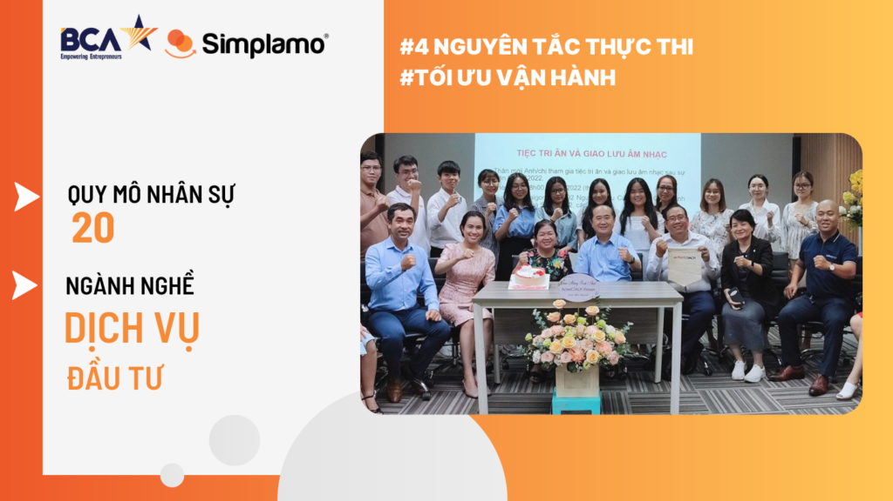
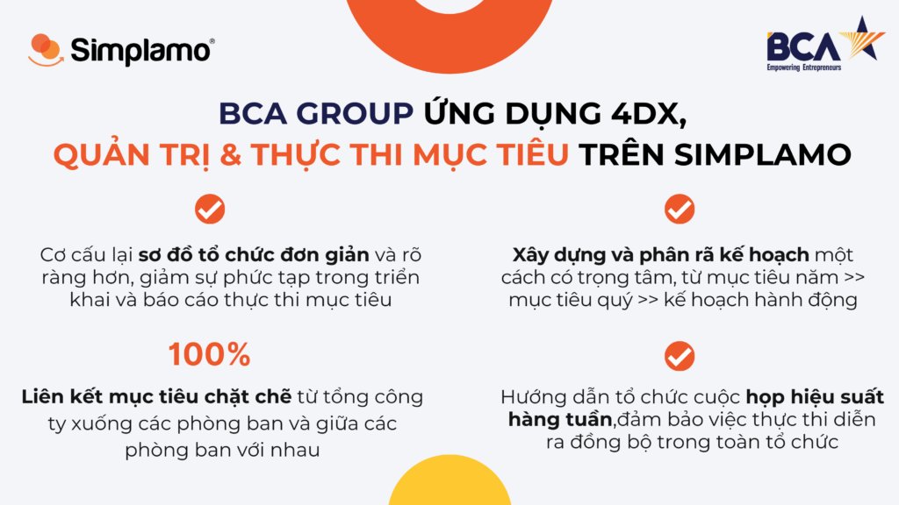
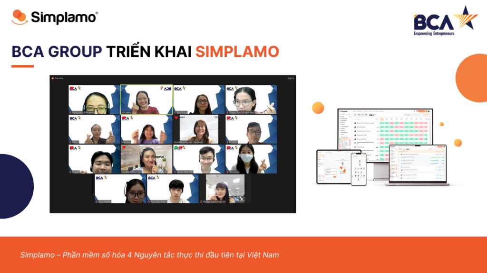

## **1. Giới thiệu BCA Group**

BCA Group giữ vai trò holding với pháp lý là Công ty TNHH Biển Đức thành lập ngày 11/7/2008 tại Việt Nam gồm các công ty thành viên hợp tác với từng thương hiệu riêng có uy tín trên toàn thế giới.

Trong đó các thương hiệu BCA Group đầu tư tại Việt Nam bao gồm: **BNI Vietnam, Action Coach**, Franchise Success, Corporate Connections,…

Hiện tại BCA Group đang sử dụng các công cụ cơ bản như excel, google sheet,… để quản trị các mục tiêu và đạt được những hiệu quả nhất định. Tuy nhiên, để đáp ứng xu thế mới về quản trị, tối ưu vận hành và đặc biệt là ứng dụng hiệu quả 4 Nguyên tắc thực thi, vào tháng 01.2024 vừa qua, BCA Group đã chính thức triển khai Simplamo – phần mềm ứng dụng 4 Nguyên tắc thực thi đầu tiên tại Việt Nam.

## **2. BCA Group ứng dụng 4 Nguyên tắc thực thi chinh phục mục tiêu kinh doanh**

Trải qua các buổi gặp gỡ và triển khai với đội ngũ ban lãnh đạo BCA, chuyên gia Simplamo đã từng bước tháo gỡ sự phức tạp, làm rõ ràng cơ cấu hoạt động và đưa tư duy 4DX vào tổ chức:

- **Cơ cấu lại sơ đồ tổ chức đơn giản và rõ ràng hơn:** BCA Group quản lý khá nhiều danh mục đầu tư với nhiều thương hiệu lớn trên khắp cả nước, nên cơ cấu quản lý khá phức tạp. Tại bước đầu tiên, chuyên gia Simplamo đã rà roát và tinh gọn lại cơ cấu tổ chức mới cho BCA, nhằm mục đích giảm bớt sự phức tạp trong triển khai và báo cáo thực thi mục tiêu sau này.
- **Xây dựng và phân rã kế hoạch một cách có trọng tâm:** Với nhiều công ty thành viên, BCA Group cũng có lượng lớn các mục tiêu cần quản lý và liên kết hiệu quả. Chuyên gia Simplamo hướng dẫn xây dựng và phân rã kế hoạch một cách có trọng tâm, đi từ mục tiêu năm xuống mục tiêu quý và các kế hoạch hành động (milestone) cho từng mục tiêu.
- **Liên kết mục tiêu chặt chẽ:** liên kết mục tiêu từ tổng công ty xuống các phòng ban và giữa các phòng ban với nhau, tạo nên sự kết nối chặt chẽ trong toàn tổ chức, mọi thành viên dễ dàng nắm được các diễn biến đang xảy ra tại mọi thời điểm.
- Hướng dẫn tổ chức **cuộc họp hiệu suất hàng tuần**, định kỳ gặp gỡ kết nối ban lãnh đạo đảm bảo việc thực thi đang diễn ra đồng bộ trong toàn tổ chức.
- Hướng dẫn cách nhận diện và **xử lý vấn đề** triệt để theo ba bước I.D.S, các thành viên có chung góc nhìn về các vấn đề và biết cách tạo **hành động cụ thể** để giải quyết vấn đề đó, chấm dứt tình trạng “trao đổi dong dài”.

Thông qua các buổi triển khai với chuyên gia Simplamo và các dữ liệu được số hóa trên phần mềm, ban lãnh đạo BCA Group rất rõ ràng minh bạch về các mục tiêu 2024 và có cùng chung cách thức để thực thi mục tiêu hiệu quả. Bằng việc tổ chức các buổi họp tuần định kỳ trong thời gian tới, các thành viên sẽ hiểu sâu sắc hơn về tư duy của 4 Nguyên tắc thực thi và hiệu quả mà nó mang lại.

Trong thời gian tiếp theo, đội ngũ Simplamo sẽ luôn đồng hành cùng BCA Group để khai thác tối ưu hiệu quả của hệ thống và mang về những giá trị thiết thực nhất cho BCA, giúp BCA Group quản lý & thực thi mục tiêu hiệu quả, tăng trưởng mạnh mẽ.

– – – – –

[Simplamo](https://simplamo.com/vi/) – Hệ điều hành thực thi mục tiêu đơn giản mà hiệu quả, biến mọi thứ phức tạp trở nên đơn giản và gần gũi đến từng nhân viên. Giải phóng áp lực cho nhà lãnh đạo, tập trung vào điều quan trọng, tối ưu hiệu suất làm việc cho doanh nghiệp.

Hãy bắt đầu trải nghiệm [Simplamo](https://www.facebook.com/simplamocom) và cảm nhận sự thay đổi chỉ sau 4 tuần!

Đăng ký nhận buổi demo Simplamo tại: [https://app.simplamo.com/sign-up](https://app.simplamo.com/sign-up?lang=vi)

