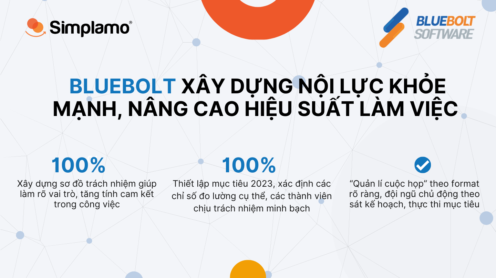

*“Mình rất ấn tượng với Simplamo, các tính năng trên phần mềm giúp mình giải quyết 2 vấn đề mà mình rất quan tâm là “quản lí cuộc họp” theo format rõ ràng và các chỉ số đo lường theo kế hoạch. Hy vọng sau khi áp dụng Simplamo, cùng với với sự hỗ trợ của chuyên gia thì doanh số x3 trong thời gian tới.”* – Anh Lê Hoàng Đạt CEO Bluebolt Software chia sẻ

[Bluebolt Software](https://blueboltsoftware.com) là công ty phần mềm hàng đầu Việt Nam chuyên tư vấn và cung cấp những giải pháp về nhân sự, công nghệ phù hợp với nhu cầu chuyển đổi số của Doanh nghiệp. Bluebolt có độ phủ sóng rộng khắp cả nước với hơn 100 nhân sự từ Bắc vào Nam.

Anh Lê Hoàng Đạt là một CEO trẻ tuổi đầy nhiệt huyết, với tinh thần không ngại “thử” và phát triển. Khi đón nhận các cơ hội từ thị trường, anh nhận định rằng, phải củng cố nội lực thật vững mạnh để tăng trưởng nhanh mà không bị vỡ trận.

## I. Nội lực doanh nghiệp càng lung lay, cơ hội càng dễ tụt mất

*Khi thời cơ xuất hiện, nội lực doanh nghiệp càng vững vàng sẽ càng nắm chắc cơ hội thành công. Ngược lại, khi nội lực chưa vững doanh nghiệp sẽ gặp nhiều khó khăn. Anh Đạt – CEO Bluebolt mong muốn củng cố sức mạnh nội tại của đội ngũ giúp mọi thành viên luôn trong tư thế sẵn sàng đón nhận các cơ hội từ thị trường:*

**1. Số lượng khách hàng ngày càng tăng gây áp lực cho bộ máy vận hành, khối lượng công việc ngày càng nhiều**

Số lượng khách hàng ngày càng tăng là một tín hiệu rất tốt trong kinh doanh nhưng đồng thời cũng gây nên sức nặng cho bộ máy vận hành của Bluebolt lúc bấy giờ. Khối lượng công việc tăng cấp số nhân theo số dự án, nếu không có một nội lực mạnh và kiểm soát tốt mọi việc, Bluebolt sẽ bị vỡ trận không sớm thì muộn.

Điều này đã thôi thúc anh Đạt tìm kiếm một phần mềm quản trị hiệu quả, để trong hành trình sắp tới, giúp Bluebolt vừa vững vàng chớp lấy các cơ hội kinh doanh, mặt khác vừa ổn định sức mạnh nội tại giúp đội ngũ thực thi hiệu quả.

Anh Đạt chia sẻ thêm: “Về cơ bản các phần mềm về triển khai OKR anh đã sử dụng qua, Simplamo khá mới trên thị trường. Tuy nhiên mình rất kỳ vọng các lý thuyết quản trị trên phần mềm, cùng với sự tham gia hỗ trợ của chuyên gia Simplamo”.

**2. CEO luôn đứng ra sắp xếp mọi công việc, kiêm nhiệm nhiều vị trí**

Áp lực về vai trò của người léo lái doanh nghiệp cũng lớn hơn rất nhiều khi đón nhận các cơ hội từ thị trường. Anh Đạt luôn là người đứng ra sắp xếp các công việc và kiêm nhiệm nhiều vị trí trong tổ chức.

Không những thế, anh Đạt còn gặp khó khăn trong khâu thực thi của đội ngũ. Các mục tiêu được đưa ra cho các bộ phận phòng ban, tuy nhiên cuối cùng anh cũng là người **thực thi** các mục tiêu đó.

Chính vì vậy ở thời điểm hiện tại, anh cần có sự đóng góp, chủ động và trách nhiệm từ phía đội ngũ, để vừa phát triển doanh nghiệp vừa **giảm bớt áp lực** trên vai anh.

**3. Mong muốn xây dựng đội ngũ làm việc năng suất, vui vẻ**

Là công ty hoạt động trong lĩnh vực công nghệ, anh Đạt mong muốn có một phương pháp thúc đẩy tinh thần làm việc của đội ngũ, từ đó xây dựng một team làm việc năng suất, vui vẻ.

Song song đó, anh muốn đội ngũ nắm được kiến thức quản trị, các thành viên hiểu được vấn đề mà công ty đang gặp phải để đồng hành thật sự cùng với mình, sau cùng đội ngũ chủ động thực thi mục tiêu được đưa ra.

## **II. Với chất liệu từ Simplamo, Bluebolt xây dựng nội lực khỏe mạnh, nâng cao hiệu suất làm việc của đội ngũ**

Ngày 4/4/2023, Bluebolt chính thức triển khai Simplamo vào trong doanh nghiệp. Dưới sự hướng dẫn của chuyên gia Simplamo và sự hợp tác của đội ngũ ban lãnh đạo Bluebolt đã làm rõ các vấn đề trong tổ chức:

**1. Xây dựng sơ đồ trách nhiệm, làm rõ vai trò trách nhiệm – giải pháp triệt để giúp đội ngũ tăng tính chủ động trong thực thi**

Sự phức tạp ở sơ đồ trách nhiệm không những không mang lại hiệu quả mà còn kìm hãm tốc độ và sự linh hoạt của đội ngũ. Xây dựng sơ đồ trách nhiệm là yếu tố cốt lõi giúp Bluebolt bước đầu hình thành nội lực vững chắc.

Đội ngũ ban lãnh đạo Bluebolt đã làm rõ cấu trúc, chức năng chính trong hệ thống. Xây dựng sơ đồ trách nhiệm trên Simplamo giúp Bluebolt **tập trung** vào các vai trò quan trọng, công khai minh bạch nhiệm vụ mà các thành viên phải đảm nhận. Việc thể hiện rõ ràng trên phần mềm, giúp mọi người xóa bỏ sự mù mờ ở vai trò trách nhiệm, thúc đẩy tính **chủ động** của các thành viên.

**2. Xây dựng mục tiêu 2023, tạo sự tập trung cho đội ngũ vào các mục tiêu quan trọng**

Simplamo đồng hành cùng Bluebolt xây dựng mục tiêu cho 3 quý còn lại của năm 2023. Thông suốt từ việc xây dựng bản kế hoạch 1 năm đến quá trình thực thi, và đội ngũ biết rõ công việc cần làm như thế nào để hoàn thành:

- Làm rõ mục tiêu năm với các chỉ số đo lường rất cụ thể, theo sát kế hoạch, đội ngũ tập trung, không bỏ lỡ điều quan trọng
- Cung cấp cho toàn bộ đội ngũ góc nhìn tổng quan, và đi sâu vào chi tiết
- Các mục tiêu được gắn liền với các thành viên đảm nhận cụ thể, nhận được sự cam kết của đội ngũ và dồn sức chiến đấu trong thời gian phát triển tới

*Anh Đạt xây dựng mục tiêu năm trên Simplamo cùng với đội ngũ*

“Less is more”, CEO đã thống nhất mỗi bộ phận chịu trách nhiệm từ 3 đến 4 mục tiêu cụ thể để đạt được sự **tập trung**. Đội ngũ ban lãnh đạo Bluebolt cũng đồng tình và xây dựng mục tiêu năm một cách dễ hiểu và mang tính thúc đẩy bằng các chỉ số cụ thể, tất cả đều được phục vụ để hoàn thành bức tranh lớn cho doanh nghiệp.

*Tinh thần cởi mở, mong muốn xây dựng một đội ngũ khỏe mạnh từ bên trong là điều mà đội ngũ chuyên gia Simplamo cảm nhận được từ CEO Bluebolt qua buổi triển khai.*

Hy vọng những buổi triển khai tiếp theo sẽ giúp Bluebolt dần gỡ rối những khó khăn của mình, xây dựng được nội lực khỏe mạnh, nắm bắt tốt cơ hội kinh doanh trong thời gian tiếp theo.

—————————————————

[Simplamo](http://simplamo.com/) – Phần mềm quản trị mục tiêu khoa học hiện đại, kết hợp độc đáo giữa KPI, OKR. Biến mọi thứ phức tạp trong điều hành trở nên đơn giản và gần gũi đến từng nhân viên. Giải phóng áp lực cho nhà lãnh đạo, tập trung vào điều quan trọng, tối ưu hiệu suất làm việc cho doanh nghiệp.

Hãy bắt đầu trải nghiệm Simplamo và cảm nhận sự thay đổi chỉ sau 4 tuần!

Đăng ký nhận buổi demo Simplamo tại: <https://app.simplamo.com/sign-up>

