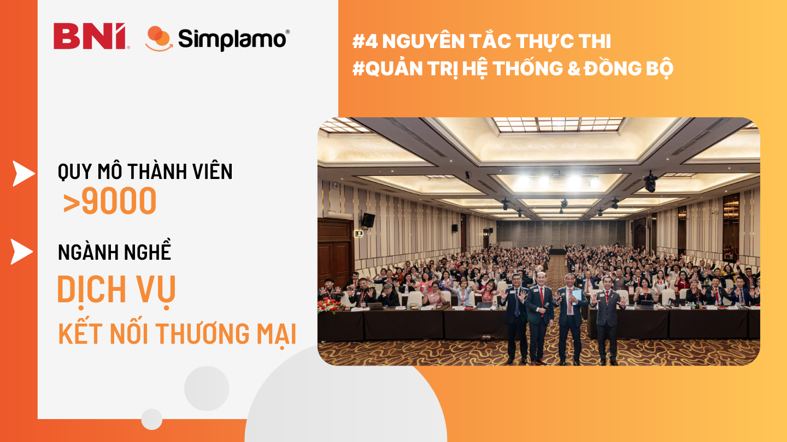
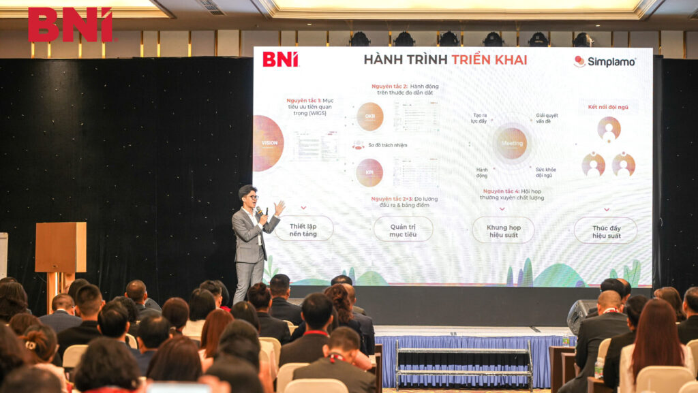
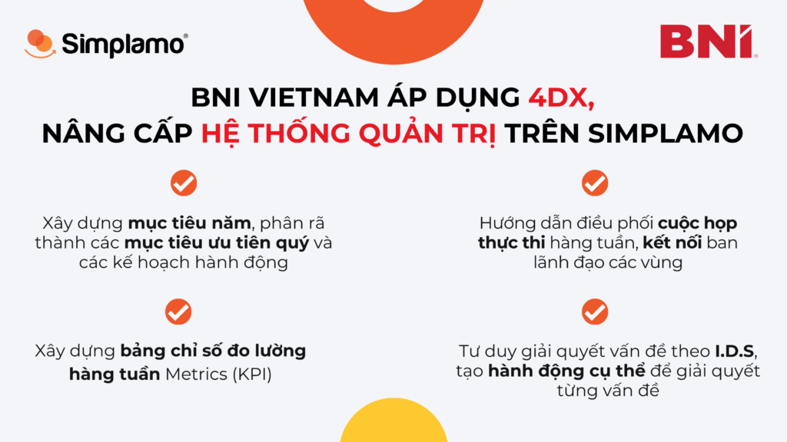
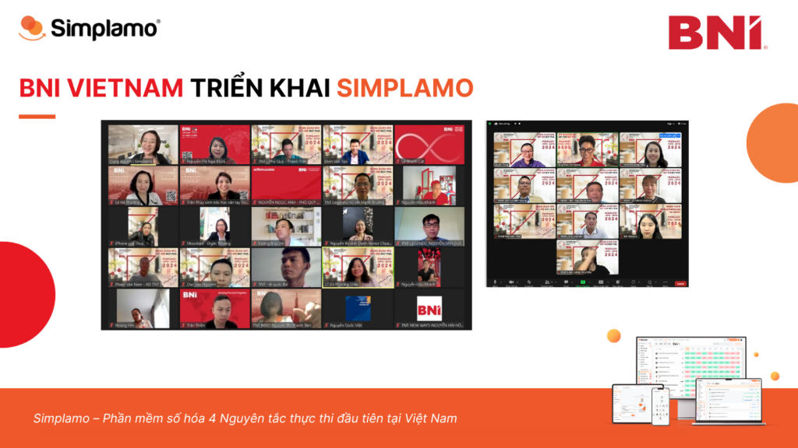

BNI là tổ chức kết nối thương mại lớn nhất và thành công nhất trên thế giới được sáng lập vào năm 1985. BNI Việt Nam chính thức được thành lập vào năm 2010, đến nay đã có hơn 9,000 thành viên với 214 chapter tại 32 tỉnh thành lớn trên cả nước.

Vào ngày 28 – 29.12.2023 vừa qua tại sự kiện **BNI Vietnam National Leadership Summit 2023**, BNI đã chính thức quyết định áp dụng phần mềm Simplamo để triển khai **4 Nguyên tắc thực thi (4DX)**, số hóa dữ liệu quản trị mục tiêu và quản lý các vùng, khu vực & chapter trên phần mềm.

## 1. Thách thức quản trị hệ thống hơn 214 chapter và 9,000 thành viên

Là một tổ chức lớn, đồng nghĩa với thách thức cũng lớn hơn nhiều so với các tổ chức khác, BNI Vietnam luôn không ngừng tối ưu hệ thống quản trị của mình, nhất là quản trị mục tiêu một cách đồng bộ trong toàn hệ thống. Đi cùng với xu hướng số hóa quản trị doanh nghiệp, BNI Vietnam đã đưa ra bài toán tìm kiếm một phần mềm vừa có thể quản trị dữ liệu hiệu quả vừa giúp triển khai mục tiêu kinh doanh thành công, với một số yêu cầu:

- **Quản lý dữ liệu** kinh doanh đồng bộ tại 10 vùng và 214 chapter
- **Dễ dàng triển khai mục tiêu** chiến lược từ Tổng công ty xuống các vùng, khu vực
- Cách thức **thực thi mục tiêu đồng bộ** và **theo dõi hoạt động** thực thi trên toàn hệ thống
- **Kết nối** hoạt động tại các vùng, khu vực hiệu quả, tạo sự **gắn kết và đồng lòng** với mục tiêu chung
- Giảm tải hoạt động đốc thúc, gia tăng **tính trách nhiệm và chủ động** trong công việc

Trước những yêu cầu từ BNI Vietnam, Simplamo đã chứng tỏ mình là phần mềm quản trị phù hợp nhất tại thời điểm hiện tại. Thông qua các buổi giới thiệu, trao đổi và thống nhất với các Giám đốc vùng và khu vực, BNI Vietnam đã bắt đầu triển khai sử dụng phần mềm Simplamo từ tháng 01.2024.

*CEO Simplamo – Anh Phan Thanh Tùng trình bày về hành trình triển khai Simplamo cho BNI*

## 2. Hành trình đổi mới vận hành, phát huy sức mạnh 4 Nguyên tắc thực thi trên Simplamo

Tại giai đoạn đầu của hành trình, đội ngũ chuyên gia Simplamo bắt đầu triển khai từ cấp vùng, với 10 vùng và hơn 40 thành viên ban lãnh đạo. Bao gồm các nội dung chính như sau:

- Hướng dẫn xây dựng **Mục tiêu năm** 2024 cho từng khu vực, bao gồm việc xác định các chỉ số đo lường kết quả và các mục tiêu cần hoàn thành trong năm
- Hướng dẫn phân rã Mục tiêu năm thành **Mục tiêu quý 1** và lên kế hoạch hành động chi tiết (milestone) cho từng mục tiêu một cách khoa học, rõ ràng và dễ hiểu nhất
- Hướng dẫn xây dựng **bảng chỉ số đo lường các kết quả kinh doanh hàng tuần**, đảm bảo các thành viên nắm rõ kết quả kinh doanh hàng tuần là gì và tập trung hoàn thành
- Hướng dẫn tổ chức **cuộc họp hiệu suất hàng tuần**, định kỳ gặp gỡ kết nối ban lãnh đạo của 10 vùng và trong mỗi vùng, đảm bảo việc thực thi đang diễn ra đồng bộ trong toàn hệ thống
- Hướng dẫn cách nhận diện và **xử lý vấn đề** triệt để theo ba bước I.D.S, các thành viên có chung góc nhìn về các vấn đề và biết cách tạo **hành động cụ thể** để giải quyết vấn đề đó, chấm dứt tình trạng “trao đổi dong dài”.

Bằng cách số hóa dữ liệu trên một nền tảng, Simplamo cung cấp góc nhìn trực quan, rõ ràng cho các thành viên BNI nắm bắt dữ liệu và các hành động cần làm tiếp theo để đạt mục tiêu chung là gì.

*“Trước khi bắt đầu với Simplamo, mình cho rằng Simplamo chỉ là phần mềm, nhưng sau khi tham dự các buổi triển khai, mình nhận ra Simplamo còn là một tư duy quản trị nữa, bên cạnh việc hướng dẫn sử dụng hệ thống, BNI còn được team Simplamo hướng dẫn sử dụng hệ thống sao cho hiệu quả và giá trị nhất”* – Chia sẻ từ Ban lãnh đạo BNI.

Sau thời gian triển khai, ban lãnh đạo 10 vùng của BNI đã bắt đầu áp dụng Simplamo vào việc quản trị & thực thi mục tiêu, định kỳ gặp gỡ nhau hàng tuần để kết nối, chia sẻ phản hồi và giải quyết các vấn đề phát sinh.

Simplamo sẽ tiếp tục đồng hành cùng BNI Vietnam trong thời gian tới để đưa tư duy quản trị xuống các tầng phía dưới bao gồm các chapter và doanh nghiệp thành viên, hỗ trợ toàn thể thành viên BNI khai thác tối đa giá trị của hệ thống, quản trị & thực thi mục tiêu hiệu quả, tăng trưởng mạnh mẽ và không ngừng mở rộng.

– – – – –

[Simplamo](https://simplamo.com/vi/) – Hệ điều hành thực thi mục tiêu đơn giản mà hiệu quả, biến mọi thứ phức tạp trở nên đơn giản và gần gũi đến từng nhân viên. Giải phóng áp lực cho nhà lãnh đạo, tập trung vào điều quan trọng, tối ưu hiệu suất làm việc cho doanh nghiệp.

Hãy bắt đầu trải nghiệm [Simplamo](https://www.facebook.com/simplamocom) và cảm nhận sự thay đổi chỉ sau 4 tuần!

Đăng ký nhận buổi demo Simplamo tại: [https://app.simplamo.com/sign-up](https://app.simplamo.com/sign-up?lang=vi)

