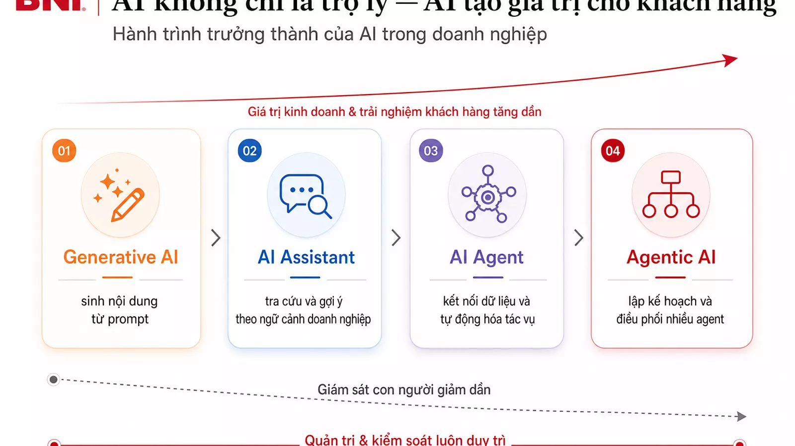
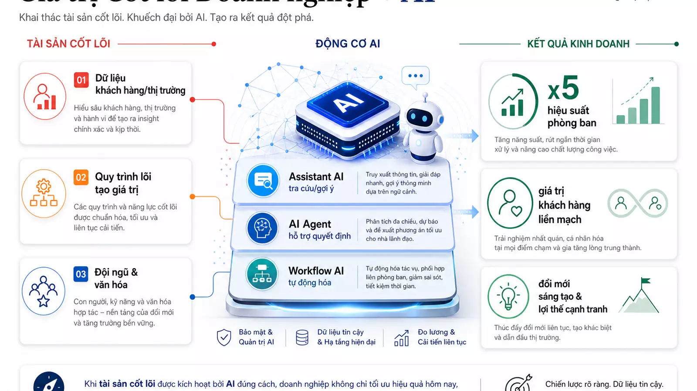
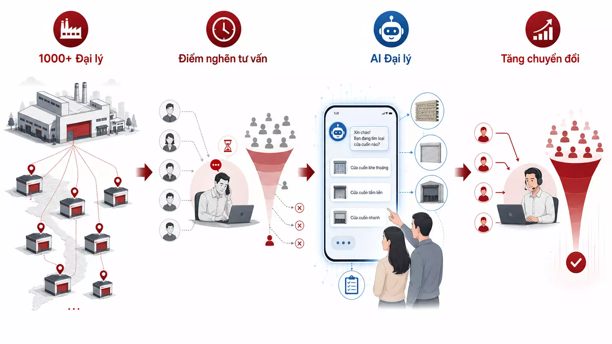

import { AgentMaturityPlayground, AgentWorkflowSimulator, AgentQuoteAutomationSimulator, AgentUseCasePicker } from '../../../components/blog/AiAgentPlaygrounds';

*AI đang phổ cập rất nhanh. Khi công cụ trở nên dễ tiếp cận, lợi thế không còn nằm ở việc “có dùng AI hay không”, mà nằm ở cách doanh nghiệp biến AI thành năng lực vận hành, gắn với quy trình lõi, dữ liệu nội bộ và trải nghiệm khách hàng.*

Trong nhiều buổi làm việc với lãnh đạo doanh nghiệp, tôi thường thấy một câu hỏi lặp lại: “Doanh nghiệp nên bắt đầu AI từ đâu để tạo ra kết quả thật, thay vì chỉ dừng ở vài thử nghiệm thú vị?”

Câu trả lời ngắn gọn là: hãy nhìn AI Agent như một **kiến trúc vận hành**, không phải một công cụ đơn lẻ.

Một chatbot có thể trả lời câu hỏi. Một trợ lý AI có thể viết email, tóm tắt tài liệu, gợi ý nội dung. Nhưng một AI Agent cấp doanh nghiệp phải đi xa hơn: nó hiểu bối cảnh, truy cập dữ liệu được phép, phối hợp công cụ, tạo hành động và được con người giám sát trong những quyết định quan trọng.

Theo tinh thần của các báo cáo doanh nghiệp lớn về AI, thị trường đang ở một thời điểm đặc biệt: chỉ một nhóm nhỏ doanh nghiệp thật sự dẫn đầu, trong khi phần lớn vẫn đang học cách ứng dụng. Điều này tạo ra một “điểm xuất phát mới” cho doanh nghiệp Việt Nam. Nếu triển khai đúng, doanh nghiệp vừa và lớn hoàn toàn có thể đi nhanh hơn những đối thủ từng mạnh về công nghệ nhưng chậm trong thay đổi vận hành.

## 1. Vì sao “dùng AI” chưa tạo ra lợi thế cạnh tranh?

> **Mô tả hình ảnh:** hai doanh nghiệp dùng cùng công cụ AI, nhưng một bên chỉ tạo nội dung rời rạc, bên còn lại kết nối AI vào quy trình lõi. **Highlight:** lợi thế không nằm ở công cụ, mà ở kiến trúc vận hành. **Công nghệ:** GenAI, RAG nội bộ, workflow automation, data governance.

AI tạo sinh đã phổ cập. Nhân sự nào cũng có thể dùng một công cụ để viết nội dung, dịch tài liệu, tóm tắt biên bản, phân tích bảng dữ liệu hoặc tạo hình ảnh.

Nhưng khi mọi người đều có cùng một bộ công cụ, lợi thế cạnh tranh sẽ mỏng đi. Doanh nghiệp không thể khác biệt chỉ vì đội ngũ biết dùng AI để soạn email nhanh hơn.

Lợi thế thật sự xuất hiện khi AI được đặt vào ba lớp sâu hơn:

- **Quy trình lõi:** AI tham gia vào những hoạt động tạo giá trị cho khách hàng, không chỉ việc văn phòng bên lề.
- **Dữ liệu doanh nghiệp:** AI trả lời và hành động dựa trên dữ liệu đã được kiểm soát, không dựa vào phỏng đoán chung chung.
- **Cơ chế quản trị:** AI có vai trò, quyền hạn, tiêu chuẩn chất lượng và điểm giám sát rõ ràng.

Nói cách khác, doanh nghiệp không chỉ cần “người dùng AI”. Doanh nghiệp cần trở thành **nhà kiến trúc khai thác AI**.

## 2. Năm cấp độ AI Agent trong doanh nghiệp

> **Mô tả hình ảnh:** thang trưởng thành 5 bậc từ công cụ cá nhân đến nền tảng AI Agent cấp doanh nghiệp, có mũi tên tăng dần về dữ liệu, quyền thực thi và quản trị. **Highlight:** mỗi cấp độ phải đo được giá trị vận hành. **Công nghệ:** LLM, AI Assistant, workflow orchestration, tool calling, enterprise agent platform.

Để lãnh đạo dễ ra quyết định, có thể chia hành trình trưởng thành AI Agent thành năm cấp độ.

<AgentMaturityPlayground locale="vi" client:load />

### Cấp độ 1: AI như công cụ cá nhân

> **Mô tả hình ảnh:** một nhân sự dùng AI để viết, dịch, tóm tắt và chuẩn bị slide trên laptop cá nhân. **Highlight:** nhanh hơn nhưng phân tán. **Công nghệ:** ChatGPT/Claude/Gemini, prompt cá nhân, spreadsheet AI.

Đây là giai đoạn phổ biến nhất. Nhân sự dùng AI để làm nhanh hơn các công việc cá nhân: viết nội dung, tóm tắt tài liệu, chuẩn bị slide, dịch email, phân tích sơ bộ dữ liệu.

Giá trị tạo ra là có thật, nhưng phân tán. Mỗi người dùng một cách khác nhau. Kết quả khó đo lường, khó chuẩn hóa và dễ phụ thuộc vào kỹ năng đặt câu hỏi của từng cá nhân.

**Câu hỏi quản trị:** năng suất cá nhân có tăng, nhưng doanh nghiệp có học được điều gì chung không?

### Cấp độ 2: AI Assistant theo phòng ban

> **Mô tả hình ảnh:** các phòng ban Sales, Marketing, HR, Finance có trợ lý AI riêng nhưng vẫn do con người kích hoạt. **Highlight:** ngữ cảnh theo chức năng. **Công nghệ:** knowledge base phòng ban, RAG, template prompt, chatbot nội bộ.

Ở cấp độ này, AI bắt đầu được cấu hình cho từng chức năng: bán hàng, marketing, nhân sự, tài chính, chăm sóc khách hàng hoặc quản lý dự án.

Ví dụ:

- Sales assistant gợi ý kịch bản tư vấn theo từng nhóm khách hàng.
- Marketing assistant tạo kế hoạch nội dung theo thông điệp thương hiệu.
- HR assistant hỗ trợ onboarding nhân sự mới.
- Project assistant tóm tắt tiến độ, rủi ro và việc cần theo dõi.

AI đã có ngữ cảnh rõ hơn, nhưng vẫn chủ yếu ở vai trò **gợi ý** và **hỗ trợ**. Con người là người chuyển gợi ý thành hành động.

**Câu hỏi quản trị:** phòng ban có giảm được việc lặp lại và nâng chất lượng đầu ra không?

### Cấp độ 3: Workflow AI tích hợp vào quy trình

> **Mô tả hình ảnh:** luồng khách hàng đi qua CRM, dữ liệu sản phẩm, báo giá nháp và cảnh báo cho nhân sự phụ trách. **Highlight:** AI đi vào workflow, không đứng ngoài quy trình. **Công nghệ:** Dify/n8n/Zapier, API integration, CRM, document retrieval, automation trigger.

Đây là bước chuyển quan trọng. AI không còn đứng ngoài quy trình, mà được nhúng vào workflow.

Một yêu cầu khách hàng có thể tự động đi qua nhiều bước: tiếp nhận thông tin, phân loại nhu cầu, truy xuất dữ liệu sản phẩm, gợi ý phương án, tạo báo giá nháp, gửi cảnh báo cho người phụ trách và cập nhật trạng thái trên CRM.

AI ở cấp độ này chưa nhất thiết “tự quyết định”. Nhưng nó có thể làm giảm đáng kể thời gian xử lý, giảm lỗi thao tác và giúp đội ngũ phản hồi khách hàng nhanh hơn.

**Câu hỏi quản trị:** quy trình nào đang lặp lại nhiều, có dữ liệu đủ rõ, và nếu rút ngắn 30–50% thời gian thì tạo tác động lớn nhất?

### Cấp độ 4: AI Agent ra quyết định có giám sát

> **Mô tả hình ảnh:** AI Agent đề xuất hành động và tạo đầu ra, con người phê duyệt các điểm rủi ro cao. **Highlight:** human-in-the-loop để tăng tốc nhưng vẫn kiểm soát. **Công nghệ:** agent tool use, approval workflow, audit log, permission control.

AI Agent bắt đầu có mục tiêu, công cụ và quyền thực thi trong phạm vi được định nghĩa.

Ví dụ, một AI Agent cho bán hàng không chỉ gợi ý nội dung, mà còn có thể:

- đọc lịch sử tương tác khách hàng;
- xác định mức độ tiềm năng;
- đề xuất bước tiếp theo;
- tạo báo giá nháp;
- nhắc nhân sự follow-up;
- ghi nhận kết quả vào hệ thống.

Tuy nhiên, các điểm quan trọng vẫn cần con người phê duyệt: điều khoản thương mại, chính sách chiết khấu, cam kết triển khai hoặc quyết định ảnh hưởng đến khách hàng lớn.

Đây là mô hình **human + AI**: AI làm nhanh, con người đảm bảo đúng.

<AgentWorkflowSimulator locale="vi" client:load />

**Câu hỏi quản trị:** doanh nghiệp đã định nghĩa được ranh giới “AI được làm gì” và “điểm nào bắt buộc con người duyệt” chưa?

### Cấp độ 5: AI Agent Platform cấp doanh nghiệp

> **Mô tả hình ảnh:** một lớp AI trung tâm kết nối CRM, ERP, dashboard điều hành, kho tri thức và dữ liệu khách hàng. **Highlight:** AI trở thành năng lực vận hành chung của doanh nghiệp. **Công nghệ:** enterprise AI platform, vector database, data warehouse, SSO/RBAC, observability.

Ở cấp độ cao nhất, doanh nghiệp có một nền tảng AI Agent kết nối nhiều phòng ban và hệ thống: CRM, ERP, phần mềm quản trị mục tiêu, dữ liệu khách hàng, dữ liệu vận hành, báo cáo tài chính, kho tri thức nội bộ.

AI không còn là một dự án nhỏ, mà trở thành một lớp năng lực trong hệ điều hành doanh nghiệp.

Ở cấp độ này, AI có thể:

- tạo báo cáo tự động theo yêu cầu của ban điều hành;
- cảnh báo sớm vấn đề trong quy trình;
- điều phối tác vụ giữa các bộ phận;
- hỗ trợ ra quyết định dựa trên dữ liệu;
- cá nhân hóa trải nghiệm khách hàng;
- tạo ra nhịp vận hành nhanh hơn nhưng vẫn có kiểm soát.

Mục tiêu không phải “thay thế con người”, mà là tạo ra một tổ chức có khả năng học nhanh hơn, phối hợp tốt hơn và phục vụ khách hàng nhanh hơn.

## 3. Bốn nguyên tắc triển khai AI Agent trong doanh nghiệp

> **Mô tả hình ảnh:** bốn trụ cột triển khai gồm quy trình lõi, thử nghiệm nhỏ, dữ liệu quản trị và giám sát con người. **Highlight:** triển khai AI phải đi cùng quản trị. **Công nghệ:** process mining, data catalog, guardrails, evaluation dashboard.

Từ góc nhìn triển khai, tôi thường khuyến nghị doanh nghiệp giữ bốn nguyên tắc.

### Nguyên tắc 1: Tích hợp AI vào quy trình lõi

> **Mô tả hình ảnh:** bản đồ chuỗi giá trị khách hàng với các điểm nghẽn được đánh dấu để AI can thiệp. **Highlight:** bắt đầu từ nơi tạo giá trị, không bắt đầu từ công cụ. **Công nghệ:** BPMN, CRM/ERP integration, process analytics.

Đừng bắt đầu từ câu hỏi “nên dùng công cụ AI nào?”. Hãy bắt đầu từ câu hỏi: “quy trình nào tạo giá trị lớn nhất cho khách hàng nhưng đang chậm, rời rạc hoặc phụ thuộc quá nhiều vào thao tác thủ công?”

AI có giá trị nhất khi nó rút ngắn chuỗi giá trị đến khách hàng.

### Nguyên tắc 2: Bắt đầu từ việc nhỏ và lặp lại

> **Mô tả hình ảnh:** các tác vụ nhỏ như báo giá, phân loại lead, báo cáo tuần được chuẩn hóa thành checklist AI. **Highlight:** nhỏ, lặp lại, đo được. **Công nghệ:** automation workflow, prompt template, form-to-output pipeline.

AI Agent không nên khởi đầu bằng một dự án quá rộng. Hãy chọn các điểm việc có tần suất cao, dữ liệu rõ và tiêu chuẩn đầu ra tương đối ổn định.

Ví dụ:

- tạo báo giá nháp;
- phân loại khách hàng tiềm năng;
- tóm tắt cuộc họp;
- kiểm tra tiến độ dự án;
- tạo báo cáo tuần;
- hỗ trợ onboarding nhân sự.

Khi những việc nhỏ được chuẩn hóa, doanh nghiệp mới mở rộng sang các quy trình phức tạp hơn.

### Nguyên tắc 3: AI phải tuân thủ dữ liệu doanh nghiệp

> **Mô tả hình ảnh:** AI truy cập dữ liệu qua lớp quyền hạn, nguồn tin cậy và cảnh báo không suy diễn. **Highlight:** dữ liệu đúng quan trọng hơn câu trả lời hay. **Công nghệ:** RAG có kiểm soát, RBAC, data lineage, secure connector.

AI không thể là một “người tư vấn tự do” nếu nó phục vụ doanh nghiệp. Nó phải biết đâu là nguồn dữ liệu đúng, quyền truy cập nào được phép, thông tin nào không được suy diễn và quyết định nào cần kiểm chứng.

Dữ liệu, bảo mật và quản trị quyền hạn phải đi cùng từ đầu.

### Nguyên tắc 4: Con người phải giám sát cùng AI

> **Mô tả hình ảnh:** dashboard giám sát AI với trạng thái phê duyệt, lỗi, phản hồi và vòng học lại. **Highlight:** AI mạnh cần cơ chế kiểm soát mạnh. **Công nghệ:** human-in-the-loop, audit trail, feedback loop, model evaluation.

AI Agent càng mạnh, cơ chế giám sát càng quan trọng. Doanh nghiệp cần thiết kế rõ:

- ai là người chịu trách nhiệm cuối cùng;
- đầu ra nào cần duyệt;
- sai lệch được ghi nhận thế nào;
- phản hồi của con người được đưa ngược vào hệ thống ra sao.

Không có giám sát, AI dễ tạo ra rủi ro. Có giám sát tốt, AI trở thành một đồng đội vận hành có kỷ luật.

## 4. Ví dụ chiến lược: AI đại lý cho doanh nghiệp cửa cuốn Austdoor

> **Mô tả hình ảnh:** mạng lưới hơn 1.000 đại lý nhận hỗ trợ từ AI để tư vấn chủ nhà nhanh hơn và nhất quán hơn. **Highlight:** AI nâng năng lực kênh bán hàng, không thay thế đại lý. **Công nghệ:** dealer portal, product recommendation, CRM, quotation automation.

Một ví dụ gần với thực tiễn là chiến lược AI cho doanh nghiệp sản xuất cửa cuốn có mạng lưới hơn 1.000 đại lý và đối tác.

Bài toán không nằm ở việc doanh nghiệp thiếu sản phẩm. Bài toán nằm ở tốc độ tư vấn, tính nhất quán của thông tin và khả năng chuyển đổi nhu cầu của chủ nhà thành đơn hàng thông qua hệ thống đại lý.

Trong mô hình truyền thống, một khách hàng có nhu cầu lắp cửa cuốn sẽ phải đi qua nhiều bước: hỏi đại lý, mô tả hiện trạng, nhận tư vấn sản phẩm, chờ báo giá, xác nhận kỹ thuật, hẹn khảo sát, rồi mới tiến tới lắp đặt. Mỗi điểm chậm trong chuỗi này đều làm giảm tỷ lệ chuyển đổi.

Chiến lược AI được thiết kế không phải để thay đại lý, mà để **nâng năng lực đại lý**.

### AI Agent đóng vai trò “đồng tư vấn” cho đại lý

> **Mô tả hình ảnh:** đại lý trò chuyện với AI trên điện thoại/tablet khi tư vấn sản phẩm cửa cuốn cho chủ nhà. **Highlight:** đồng tư vấn giúp chuẩn hóa tri thức sản phẩm. **Công nghệ:** mobile AI assistant, product catalog RAG, pricing rules, voice/chat interface.

AI có thể hỗ trợ đại lý trong các tình huống như:

- hỏi nhanh nhu cầu của chủ nhà;
- gợi ý nhóm sản phẩm phù hợp theo loại công trình, ngân sách, mức độ an toàn và thẩm mỹ;
- truy xuất thông tin kỹ thuật được chuẩn hóa;
- tạo kịch bản tư vấn dễ hiểu;
- lập báo giá nháp;
- nhắc các bước cần kiểm tra trước khi lắp đặt;
- lưu lại dữ liệu nhu cầu để công ty mẹ hiểu thị trường tốt hơn.

Điểm quan trọng là AI không hoạt động như một chatbot tách rời. Nó phải kết nối với dữ liệu sản phẩm, chính sách bán hàng, quy trình khảo sát, quy trình bảo hành và CRM/đại lý.

#### Giả lập: AI Agent tư vấn và tạo báo giá tự động trong 60 giây

> **Mô tả hình ảnh:** timeline tự động từ lead mới, agent đọc dữ liệu, tư vấn phương án, tạo báo giá nháp, sales duyệt và CRM follow-up. **Highlight:** agent chạy tự động nhưng vẫn có guardrail và điểm duyệt của con người. **Công nghệ:** CRM trigger, product catalog RAG, pricing rule engine, approval workflow, audit log.

Một AI Agent tư vấn báo giá không nên chỉ “chat cho hay”. Nó phải chạy như một quy trình có trigger, dữ liệu, luật giá, điểm duyệt và log vận hành.

<AgentQuoteAutomationSimulator locale="vi" client:load />

Cách vận hành đúng thường là: khách để lại nhu cầu, agent tự thu thập dữ liệu liên quan, đề xuất phương án, tạo báo giá nháp, chuyển người phụ trách duyệt các điểm rủi ro và tự ghi nhận toàn bộ lịch sử vào CRM. Nhờ vậy doanh nghiệp vừa phản hồi nhanh, vừa không buông lỏng kiểm soát giá, chính sách và trách nhiệm với khách hàng.

### Giá trị chiến lược

> **Mô tả hình ảnh:** ba lớp kết quả gồm phản hồi nhanh hơn, tư vấn chuẩn hơn và dữ liệu thị trường thời gian thực. **Highlight:** từ hỗ trợ bán hàng đến lợi thế cạnh tranh. **Công nghệ:** analytics dashboard, conversion tracking, market intelligence, CRM sync.

Nếu triển khai đúng, doanh nghiệp có thể tạo ra ba lớp giá trị.

**Một là tăng tốc độ phản hồi khách hàng.** Đại lý có thể tư vấn nhanh hơn, nhất quán hơn và giảm thời gian chờ báo giá.

**Hai là chuẩn hóa chất lượng tư vấn trên toàn mạng lưới.** Một mạng lưới 1.000 đại lý rất khó đảm bảo cùng một chuẩn tư vấn nếu chỉ dựa vào đào tạo thủ công. AI Agent giúp đưa tri thức sản phẩm và quy trình bán hàng vào từng cuộc tư vấn.

**Ba là tạo dữ liệu thị trường theo thời gian thực.** Mỗi tương tác với chủ nhà có thể trở thành tín hiệu: khu vực nào có nhu cầu cao, nhóm sản phẩm nào được hỏi nhiều, lý do mất đơn là gì, điểm nghẽn nằm ở tư vấn, giá, kỹ thuật hay thời gian lắp đặt.

Đây chính là sự khác biệt giữa “dùng AI để trả lời câu hỏi” và “dùng AI để xây năng lực cạnh tranh”.

## 5. Lộ trình 90 ngày cho doanh nghiệp bắt đầu AI Agent

> **Mô tả hình ảnh:** roadmap 90 ngày chia thành chọn chiến trường, tích hợp đo lường và chuẩn hóa mở rộng. **Highlight:** 90 ngày đủ để tạo năng lực đầu tiên. **Công nghệ:** pilot backlog, KPI dashboard, workflow builder, governance checklist.

Doanh nghiệp không cần chờ đến khi có một hệ thống hoàn hảo mới bắt đầu. Một lộ trình 90 ngày có thể đủ để tạo nền tảng.

<AgentUseCasePicker locale="vi" client:load />

### 30 ngày đầu: chọn chiến trường nhỏ

> **Mô tả hình ảnh:** nhóm lãnh đạo chọn 1–2 quy trình ưu tiên từ danh sách điểm nghẽn. **Highlight:** chọn đúng bài toán trước khi chọn công cụ. **Công nghệ:** process inventory, impact-effort matrix, discovery workshop.

- Liệt kê 10 quy trình lặp lại nhiều nhất.
- Chọn 1–2 quy trình có tác động rõ đến khách hàng hoặc ban điều hành.
- Xác định dữ liệu cần dùng, người chịu trách nhiệm và tiêu chuẩn đầu ra.
- Thiết kế thử một AI Assistant hoặc workflow AI đơn giản.

### 30 ngày tiếp theo: tích hợp và đo lường

> **Mô tả hình ảnh:** AI được kết nối với tài liệu, dữ liệu và phần mềm; dashboard bắt đầu đo thời gian, lỗi và chất lượng. **Highlight:** đo lường để biết AI có tạo kết quả thật không. **Công nghệ:** API connector, vector store, evaluation metric, event tracking.

- Kết nối AI với tài liệu, dữ liệu hoặc phần mềm liên quan.
- Định nghĩa điểm nào AI được tự làm, điểm nào cần duyệt.
- Đo các chỉ số: thời gian xử lý, tỷ lệ lỗi, chất lượng đầu ra, mức độ hài lòng của người dùng nội bộ.
- Thu thập phản hồi để cải tiến prompt, dữ liệu và quy trình.

### 30 ngày cuối: chuẩn hóa để mở rộng

> **Mô tả hình ảnh:** quy trình mới được đóng gói thành SOP, checklist giám sát và kế hoạch nhân rộng. **Highlight:** biến thử nghiệm thành năng lực tổ chức. **Công nghệ:** SOP knowledge base, access control, training portal, reusable agent template.

- Viết lại quy trình vận hành chuẩn.
- Tạo checklist giám sát.
- Đào tạo nhóm sử dụng chính.
- Chọn phòng ban hoặc quy trình tiếp theo để mở rộng.
- Kết nối với bức tranh 1 năm, 3 năm và 5 năm của doanh nghiệp.

## 6. Công cụ là điểm bắt đầu, không phải chiến lược

> **Mô tả hình ảnh:** hộp công cụ AI như Dify chỉ là tầng xây dựng bên dưới chiến lược quy trình, dữ liệu và quản trị. **Highlight:** công cụ tăng tốc, chiến lược quyết định hướng đi. **Công nghệ:** Dify, LangChain/LangGraph, model gateway, API orchestration, monitoring.

Các nền tảng như Dify giúp doanh nghiệp tự xây workflow và agentic AI nhanh hơn, đặc biệt vì có thể tích hợp nhiều mô hình AI và hệ thống phần mềm khác nhau. Đây là một điểm bắt đầu tốt cho doanh nghiệp muốn học nhanh và tùy chỉnh sâu.

Nhưng công cụ không thay thế chiến lược.

Nếu không có quy trình lõi, dữ liệu đúng, người chịu trách nhiệm và cơ chế đo lường, doanh nghiệp sẽ có nhiều demo đẹp nhưng ít kết quả thật.

Ngược lại, nếu có kiến trúc đúng, một AI Agent nhỏ cũng có thể mở ra một năng lực mới: báo cáo nhanh hơn, tư vấn khách hàng tốt hơn, onboarding nhân sự ngắn hơn, ra quyết định dựa trên dữ liệu hơn và phối hợp phòng ban mượt hơn.

## Kết luận: AI Agent là năng lực vận hành mới

> **Mô tả hình ảnh:** ban điều hành nhìn vào bản đồ vận hành mới, nơi AI Agent hỗ trợ con người ra quyết định và phục vụ khách hàng nhanh hơn. **Highlight:** AI Agent là năng lực vận hành, không phải phong trào. **Công nghệ:** operating system layer, AI governance, enterprise data fabric, agentic workflows.

Doanh nghiệp không nên nhìn AI như một phong trào công nghệ. Hãy nhìn AI Agent như một năng lực vận hành mới, tương tự cách doanh nghiệp từng xây hệ thống quản trị mục tiêu, CRM, ERP hoặc dashboard điều hành.

Điểm đến không phải là có thật nhiều bot. Điểm đến là một doanh nghiệp vận hành nhanh hơn, học nhanh hơn và tạo giá trị cho khách hàng tốt hơn.

Câu hỏi chiến lược cho lãnh đạo không còn là: “AI có thể làm gì?”

Câu hỏi đúng hơn là: **“Trong chuỗi giá trị của doanh nghiệp, AI Agent nên được đặt ở đâu để tạo lợi thế cạnh tranh rõ nhất trong 90 ngày tới?”**