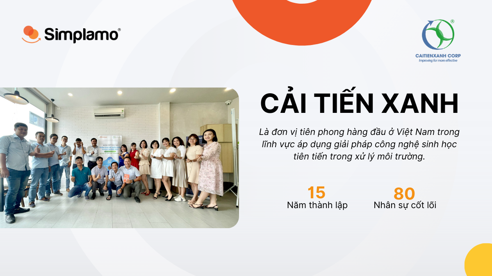
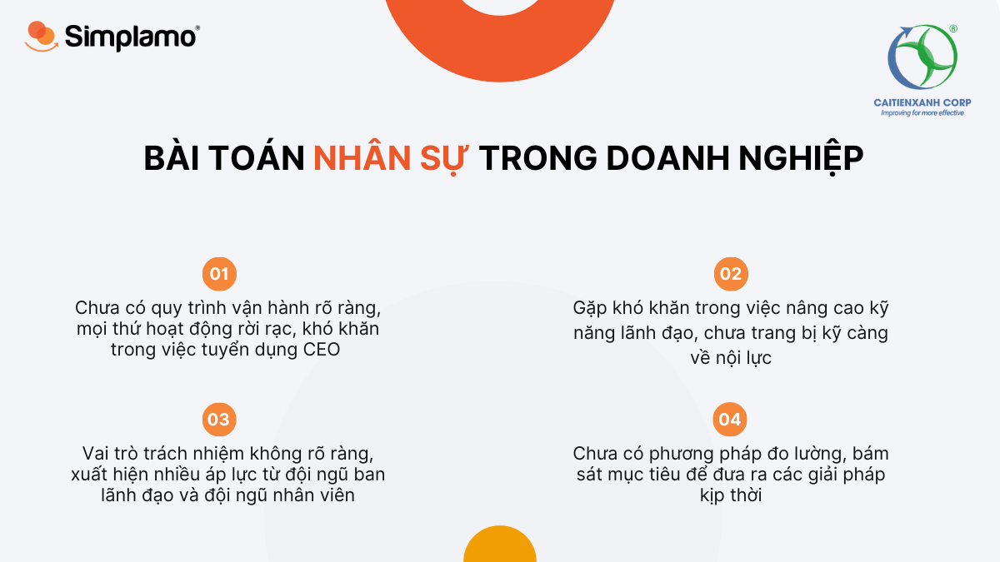
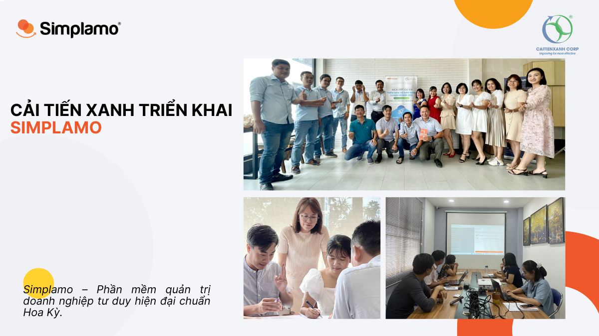
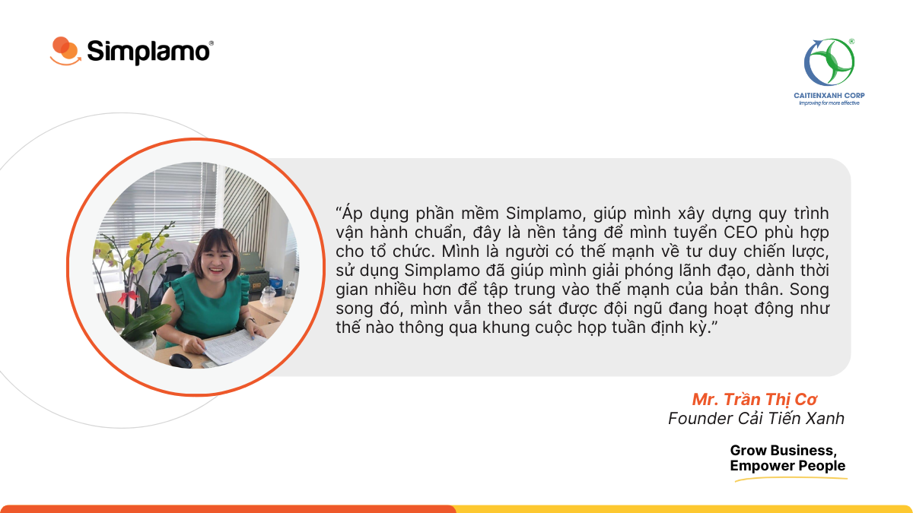

Công ty TNHH CẢI TIẾN XANH bắt đầu hoạt động vào ngày 21/11/2008, cung cấp giải pháp công nghệ bảo vệ môi trường. Cải Tiến Xanh Luôn không ngừng hoàn thiện tổ chức, xây dựng đội ngũ nhân viên với chuyên môn chất lượng cao, tiên phong trong việc nghiên cứu công nghệ dịch vụ môi trường mới với những tiêu chuẩn bền vững.

Chị Trần Thị Cơ – Founder Cải Tiến Xanh luôn mong muốn củng cố sức mạnh của đội ngũ, phát huy hết sự nhiệt huyết nghề nghiệp, với khao khát không chỉ đem lại hiệu quả kinh tế cho khách hàng mà còn góp phần bảo vệ môi trường cho đời sống và xã hội.

## **1. Cải Tiến Xanh – Nhân sự là lợi thế cạnh tranh cũng là vấn đề lớn trong doanh nghiệp**

Cải Tiến xanh hoạt động với kim chỉ nam “Thành tựu vĩ đại không bao giờ được mang lại bởi một cá nhân duy nhất, mà nó là nỗ lực của cả tập thể”. Chính vì vậy trong hành trình phát triển doanh nghiệp của mình, đó cũng là lý do khiến chị Cơ luôn muốn xây dựng môi trường làm việc năng lượng, nuôi dưỡng **một tập thể gắn kế**t nơi mà các thành viên mỗi tính cách khác nhau nhưng cùng nhìn về một hướng.

Tuy nhiên, để làm được những điều trên lại không hề dễ dàng và nếu không làm “**đúng**” , vấn đề của đội ngũ lại không thể giải quyết và kéo dài, sau cùng làm giảm hiệu suất làm việc. Trong quá trình điều hành Cải Tiến Xanh chị Cơ đã gặp phải nhiều vấn đề ảnh hưởng đến yếu tố **con người** trong tổ chức:

### **1.1 Chưa có một khung vận hành rõ ràng**:

Việc chưa có một khung vận hành rõ ràng khiến cho đội ngũ Cải Tiến Xanh thời điểm lúc bấy giờ hoạt động **rối loạn**, mọi thứ **rời rạc**, **không thống nhất**. Nhiều áp lực theo đó cũng xuất hiện từ **phía ban lãnh đạo** và cả đội ngũ **nhân viên**. Hơn bao giờ hết, chị Cơ cần một khung vận hành rõ ràng, minh bạch để chấm dứt tình trạng này, tạo điều kiện cho CEO mới tuyển dụng về dễ dàng vận hành Cải Tiến Xanh hơn.

### **1.2 Kỹ năng điều hành doanh nghiệp:**

Là người có thiên hướng cao hơn về khả năng tư duy chiến lược, việc giới hạn ở năng lực quản lý là điều chị Cơ gặp phải. Thời điểm lúc này Cải Tiến Xanh cũng đang hưởng ứng làn sóng “chuyển đổi số”. Tuy nhiên “**kỹ năng lãnh đạo**” khi đặt trong bối cảnh chuyển đổi số của doanh nghiệp là một vấn đề mà chị Cơ lo lắng, vì không chỉ đơn thuần áp dụng các phần mềm quản trị doanh nghiệp mà song song đó chúng ta phải nâng cao kỹ năng lãnh đạo điều hành ở các cấp phòng ban.

*Theo thống kê từ McKinsey năm 2021, có đến 70% doanh nghiệp thất bại trong chuyển đổi số. Thực tế, có một số tổ chức sử dụng các phần mềm quản trị doanh nghiệp và điều đáng buồn chúng lại trở thành một bước lùi của tổ chức và doanh nghiệp phải vật lộn với việc nâng cao kỹ năng lãnh đạo ở cấp phòng ban. Doanh nghiệp chúng ta rất cần số hóa quy trình hoạt động, số hóa các dữ liệu để theo dõi liên tục nhưng liệu chúng ta đã có sự chuẩn bị kỹ càng về **nội lực**, **kỹ năng lãnh đạo** hay chưa, hay có phần mềm nào giải quyết được vấn đề này hay không?*

### **1.3 Không kiểm soát được tình hình doanh nghiệp lúc bấy giờ**:

Hơn 14 năm hình thành và phát triển với số lượng nhân sự và dự án ngày một tăng cao, việc**kiểm soát hoạt động kinh doanh ngày** một trở nên khó khăn hơn, điều đó làm cho chị Cơ rất khó đưa ra các giải pháp kinh doanh kịp thời. Đây cũng chính là thách thức mà Cải Tiến Xanh cần phải vượt qua để đáp ứng tốc độ tăng trưởng trong thời gian tới.

Nhìn chung, các bất cập Cải Tiến Xanh gặp phải đều ảnh hưởng đến bài toán **“con người”** trong tổ chức. Để xóa bỏ những rào cản, khó khăn về con người, đầu tiên doanh nghiệp cần một **quy trình vận hành chuẩn** để mọi thứ có thể đi vào khuôn khổ, bên cạnh đó cải thiện được **kỹ năng quản lý của đội ngũ** ban lãnh đạo và **kiểm soát được tình hình doanh nghiệp** lúc bấy giờ.

Hiểu rõ sự khó khăn khi doanh nghiệp không có khung vận hành rõ ràng, điều này dẫn đến nhiều vấn đề về nhân sự rắc rối trong tổ chức. Trước khi tìm đến Simplamo, chị Cơ cũng đã sử dụng các phần mềm quản trị khác nhưng cuối cùng lại không tìm ra sự “đồng bộ” cho doanh nghiệp của mình. Chị biết đến phần mềm Simplamo trong một hội thảo và hoàn toàn bị chinh phục bởi các tính năng của Simplamo. Simplamo chính là giải pháp cho những rào cản hiện tại của Cải Tiến Xanh.

## **2. Với sự đồng hành Simplamo, Cải Tiến Xanh thành công khi tháo gỡ các rào cản về “Nhân sự”**

### **2.1 Khung vận hành giúp doanh nghiệp hoạt động hệ thống – tuyển CEO phù hợp**

Đầu tiên, Simplamo giải đáp bài toán khó nhất của Cải Tiến Xanh chính là **“thiếu khung vận hành”**. Áp dụng phần mềm Simplamo vào tổ chức, giúp cho Cải Tiến Xanh hoạt động và làm việc một cách trật tự, các công việc thông suốt từ các cấp phòng ban đến nhân viên. **Sơ đồ trách nhiệm trên Simplamo** làm rõ vai trò, trách nhiệm của từng cá nhân, được thể hiện trực quan trên một màn hình và chia sẻ đến toàn bộ đội ngũ. Vì vậy mà mọi người nắm rất rõ công việc của mình, mọi thứ không còn **chồng chéo** và **phức tạp** như trước kia.

### **2.2 Simplamo nâng cao năng lực lãnh đạo – nhìn rõ thế mạnh bản thân**

Việc điều hành doanh nghiệp giờ đây đã không còn cảm tính, chị Cơ nhìn ra được các vấn đề trong tổ chức rõ ràng hơn, và thấy được toàn cảnh bức tranh của doanh nghiệp thông qua phần mềm, từ đó đưa ra các **quyết định đúng đắn**.

Sử dụng Simplamo giúp chị Cơ nâng cao năng lực quản lý, có cơ sở vững chắc để ủy quyền và đội ngũ chủ động trong công việc nhiều hơn. Giờ đây chị đã có thời gian làm điều mình thích, tập trung vào thế mạnh của bản thân.

### **2.3 Xây dựng mục tiêu thông suốt – Định hướng doanh nghiệp rõ ràng**

Thông qua việc xây dựng mục tiêu ưu tiên trong quý, cùng với bảng chỉ số hàng tuần được xây dựng khoa học, không chỉ chị mà đội ngũ cùng nắm bắt được các mục tiêu rõ ràng, nhận định được các công việc quan trọng cần tập trung. Chị Cơ nắm rõ được tình hình hoạt động của doanh nghiệp trên một nền tảng duy nhất, mọi việc không bị bỏ sót, nếu đội ngũ có đi chệch hướng cũng nhanh chóng phát hiện.

Một điều quan trọng không kém đó chính là Simplamo cung cấp một khung cuộc họp tuần có trật tự. Khung cuộc họp này giúp chị dễ dàng nắm bắt diễn tiến các dự án quan trọng, nói cách khác chị có thể kịp thời theo dõi các vấn đề phát sinh và giải quyết chúng.

## **3. Simplamo – Không chỉ là phần mềm quản trị khoa học – Đây là phần mềm số hóa tư duy quản trị cho chủ doanh nghiệp**

Sau 6 tháng vận hành trên Simplamo, chị Cơ hào hứng chia sẻ về những thay đổi tích cực mà Cải Tiến Xanh đạt được, theo chị, Simplamo không chỉ là một phần mềm, nó chính là một hệ tư duy vì chỉ có tư duy thật sự mới tác động sâu sắc đến đội ngũ:

- Simplamo xây dựng **bức tranh tổng thể** và tạo nên **định hướng chung** cho toàn doanh nghiệp
- **Đội ngũ duy trì nhịp họp** hàng tuần, luôn **theo sát hoạt động kinh doanh**
- CEO mới nhanh chóng tiếp quản công việc điều hành từ chị Cơ
- Giải phóng lãnh đạo, làm điều mà chị cảm thấy thích nhất
- Tìm kiếm được nhân sự phù hợp với vai trò và trách nhiệm rõ ràng

CEO – Simplamo Mr. Phan Thanh Tùng có chia sẻ: “Với Simplamo các bạn có thể hiểu đơn giản nó như một liều thuốc đi sâu vào trong lòng tổ chức, từng thành viên giúp tăng cường sức khỏe đội ngũ, gắn kết nhân viên qua cuộc họp hàng tuần. Các mục tiêu được đề ra, nhân viên có chung cách nghĩ với lãnh giúp đạo thúc đẩy năng lượng nhân viên và không tạo áp lực cho từng cá nhân”.

Hy vọng với sự đồng hành của đội ngũ Simplamo sẽ giúp Cải Tiến Xanh xây dựng đội ngũ vững mạnh và đi xa hơn trong thời gian tiếp theo.

—————————————————

[Simplamo](http://simplamo.com/) – Phần mềm quản trị mục tiêu khoa học hiện đại, kết hợp độc đáo giữa KPI, OKR. Biến mọi thứ phức tạp trong điều hành trở nên đơn giản và gần gũi đến từng nhân viên. Giải phóng áp lực cho nhà lãnh đạo, tập trung vào điều quan trọng, tối ưu hiệu suất làm việc cho doanh nghiệp.

Hãy bắt đầu trải nghiệm Simplamo và cảm nhận sự thay đổi chỉ sau 4 tuần!

Đăng ký nhận buổi demo Simplamo tại: <https://app.simplamo.com/sign-up>

