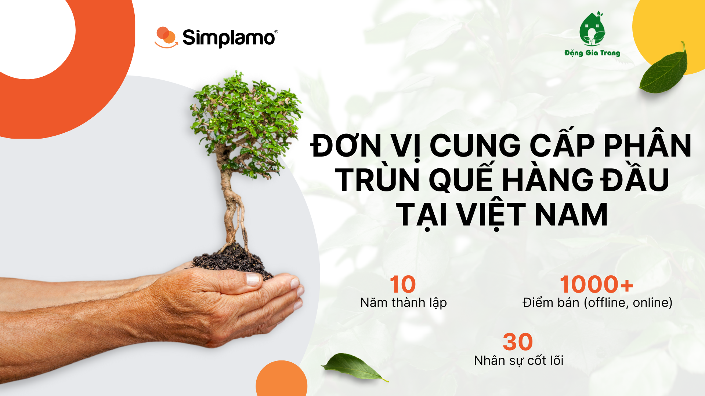
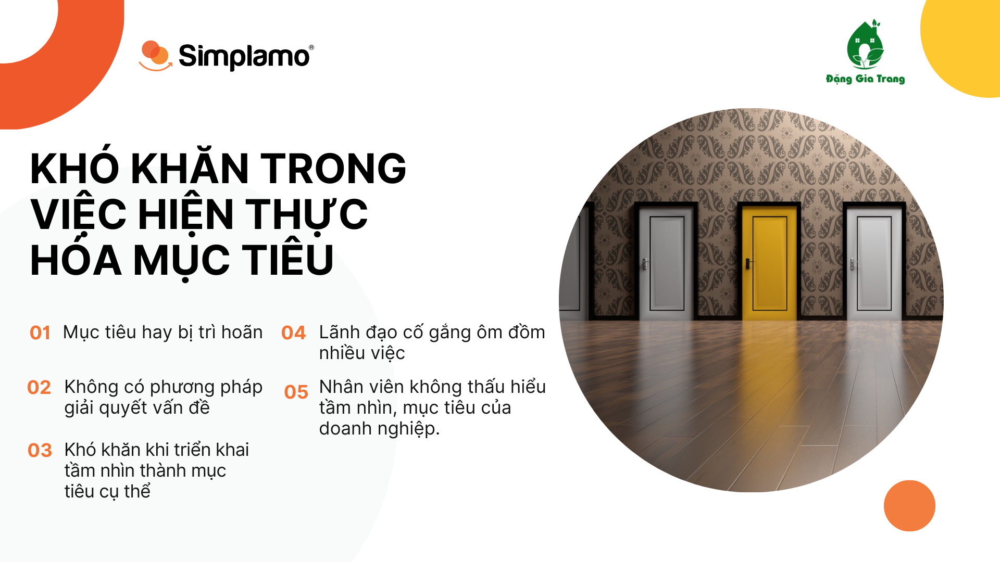
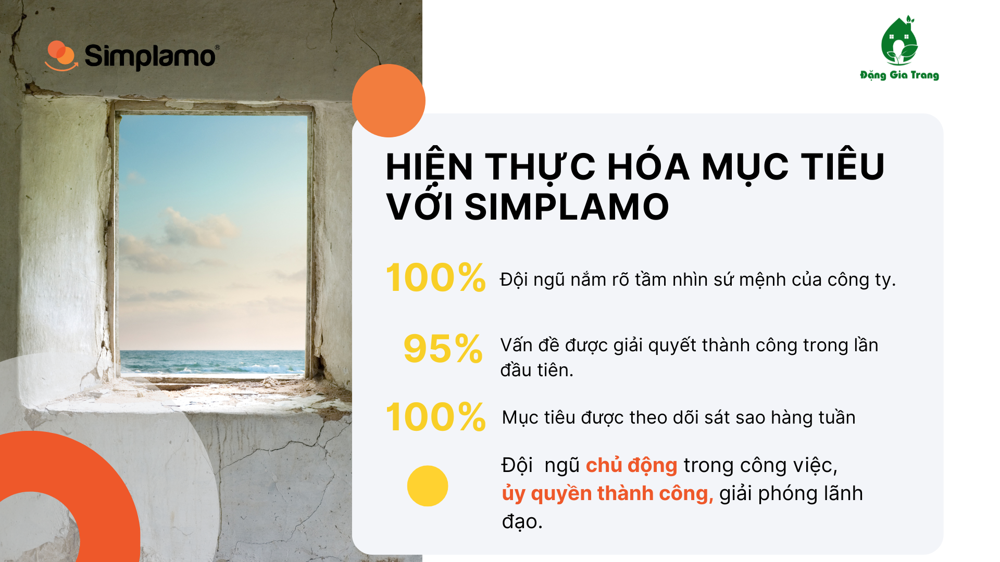
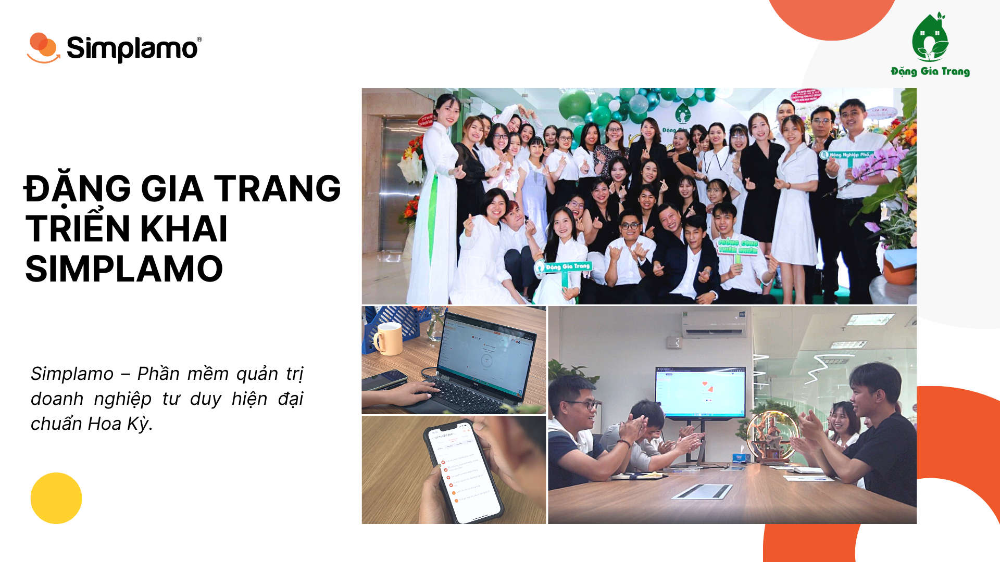
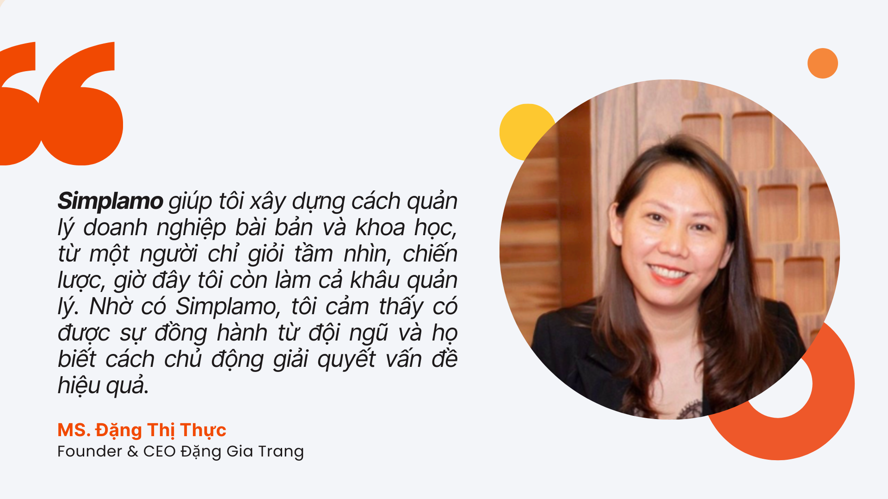

*Đặng Gia Trang là đơn vị cung cấp phân trùn quế hàng đầu tại Việt Nam với thương hiệu SFARM. Hiện tại Đặng Gia Trang hoạt động với hơn 1000+ điểm bán (offline, online) có mặt tại các thành phố của 63 tỉnh thành trên cả nước.*

*Chị Đặng Thị Thực – Founder Đặng Gia Trang là một nữ lãnh đạo mang khát vọng lớn phủ xanh thành phố, đưa doanh nghiệp vươn ra thế giới. Nhưng phía sau đó là nỗi trăn trở về hành trình **hiện thực hóa mục tiêu** biến tầm nhìn thành hiện thực.*

## **1. Đi cùng với khó khăn để tìm kiếm giải pháp tối ưu**

Trong suốt hành trình dẫn dắt đội ngũ, chị Đặng Thị Thực – Founder công ty Đặng Gia Trang không ngừng đặt câu hỏi về vấn đề hiện thực hóa mục tiêu để giúp công ty đi xa hơn nữa. Chị là một người có rất nhiều chiến lược và tầm nhìn xa, nhưng khó ở chỗ là làm thế nào để đội ngũ hiểu và thực thi các chiến lược này một cách hiệu quả. Các khó khăn hiện nay chị đang đối mặt:

- Làm thế nào để triển khai tầm nhìn thành những mục tiêu cụ thể, giúp đội ngũ dễ dàng bám sát va theo dõi thường xuyên.
- Nhân viên không thấu hiểu tầm nhìn, mục tiêu của doanh nghiệp.
- Mục tiêu hay bị trì hoãn, lãnh đạo cố gắng ôm đồm nhiều công việc cùng một lúc.
- Quá trình thực thi mục tiêu bắt gặp các khó khăn về kỹ năng giải quyết vấn đề ở các cấp phòng ban và cá nhân.

Xuất phát từ nỗi trăn trở làm thế nào để hiện thực hóa mục tiêu chị Đặng Thị Thực luôn đau đáu tìm phương pháp để giúp doanh nghiệp của mình. Sau một thời gian tìm hiểu nhiều phần mềm quản trị khác nhau, chị quyết định áp dụng Simplamo và nhận thấy rằng so với các phương pháp quản trị khác, Simplamo là những gì “đơn giản” nhưng quan trọng nhất mà trước giờ chị tìm kiếm khi phải đối diện với nhiều sự **khó khăn, phức tạp** trong tổ chức.

## 2. Khi khó khăn được xóa bỏ, mục tiêu được hiện thực

Được biết đến và áp dụng Simplamo từ đầu năm 2022, đến thời điểm hiện tại Simplamo được đội ngũ Đặng Gia Trang đánh giá cao bởi sự “đơn giản” nhưng mang lại hiệu quả rõ ràng. Đặng Gia Trang đã có một số bước thay đổi quan trọng như:

- Trước giờ quá trình đưa ra mục tiêu và hoàn thành chúng luôn tồn tại một khoảng cách nhất định, Simplamo vạch ra một hướng đi sâu sát hơn cho doanh nghiệp từ tầm nhìn, sứ mệnh, đến mục tiêu 1 năm và bám sát thực hiện.
- Simplamo giúp đội ngũ **“đồng điệu”** trong quá trình thực thi mục tiêu, đội ngũ luôn thấu hiểu công việc mình đảm nhận, nhìn rõ bản thân mình đang ở đâu trong bức tranh lớn của doanh nghiệp.
- Là **“cánh tay đắc lực”** giúp chị Đặng Thị Thực đưa tầm nhìn, sứ mệnh của mình đến với đội ngũ, giúp đội ngũ bước cùng một nhịp. Simplamo giúp chị làm rõ và trình bày một cách dễ hiểu để cả đội ngũ cùng nắm được chiến lược, tầm nhìn và khát vọng mà chị xây dựng cho Đặng Gia Trang. Đây là điều tiên quyết để các thành viên có chung một cách nhìn, hướng dẫn mọi người đi chung một con thuyền mà chị đang chèo lái.
- Theo dõi tiến trình thực thi mục tiêu qua cuộc họp hàng tuần. Cuộc họp diễn ra không còn mất nhiều thời gian mà chỉ trong khuôn khổ 90 phút, tích hợp phương pháp nhận diện và giải quyết vấn đề kịp thời, công việc không bị đình trệ. Khi áp dụng cuộc họp hàng tuần trên Simplamo một cách khoa học và “có nghi thức”, chị cảm thấy sự thay đổi rõ rệt nơi đội ngũ, họ gắn kết hơn, sẻ chia nhiều hơn.
- Dù không có xuất thân từ trường lớp về quản trị doanh nghiệp, từ nay chị Đặng Thị Thực rất tự tin trong cách quản trị của mình nhờ áp dụng Simplamo. Bởi ở Simplamo, đó không chỉ là phần mềm, mà là một tư duy quản trị được set up sẵn, giúp nhà lãnh đạo tự tin hơn trong chính tổ chức của mình.

## 3. Phía sau câu chuyện thực thi, Simplamo giúp Đặng Gia Trang xây dựng hệ thống vận hành doanh nghiệp.

Tính đến thời điểm hiện tại, Đặng Gia Trang đã áp dụng Simplamo được 01 năm. Bằng việc tin tưởng và khai thác hiệu quả các tính năng của Simplamo, hiện nay Đặng Gia Trang đã có được một **đội ngũ nhân sự mạnh mẽ,** **gắn kết** để hiện thực hóa mục tiêu, tập trung vào điều quan trọng, còn bản thân CEO – chị Thực đã **có nhiều thời gian hơn** cho cuộc sống của mình.

Một điều quan trọng Simplamo đã giúp cho Chị Đặng Thị Thực biết được doanh nghiệp mình đang ở đâu, đội ngũ mình đang ở đâu trên con đường đạt được mục tiêu của mình và hy vọng rằng với sự đồng hành của Simplamo sẽ giúp Đặng Gia Trang đạt được những cột mốc đáng tự hào trong thời gian tiếp theo.

***Chị Đặng Thị Thực chia sẻ về Simplamo kết hợp tư duy quản trị***

—————————————————

[Simplamo](http://simplamo.com/) – Phần mềm quản trị mục tiêu khoa học hiện đại, kết hợp độc đáo giữa KPI, OKR. Biến mọi thứ phức tạp trong điều hành trở nên đơn giản và gần gũi đến từng nhân viên. Giải phóng áp lực cho nhà lãnh đạo, tập trung vào điều quan trọng, tối ưu hiệu suất làm việc cho doanh nghiệp.

Hãy bắt đầu trải nghiệm Simplamo và cảm nhận sự thay đổi chỉ sau 4 tuần!

Đăng ký nhận buổi demo Simplamo tại: <https://app.simplamo.com/sign-up>

