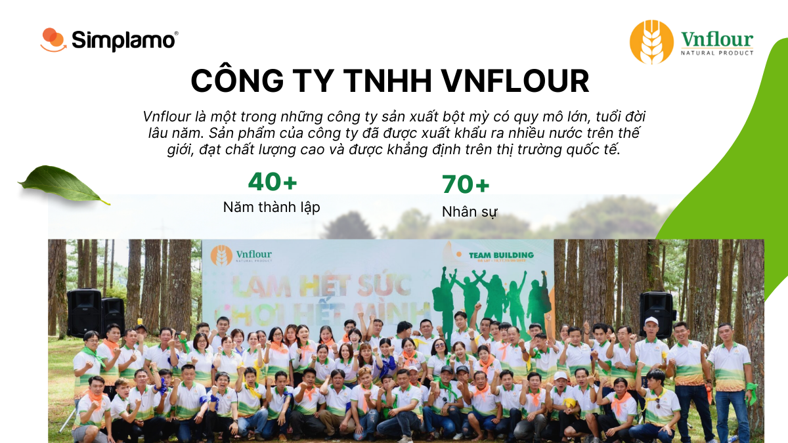
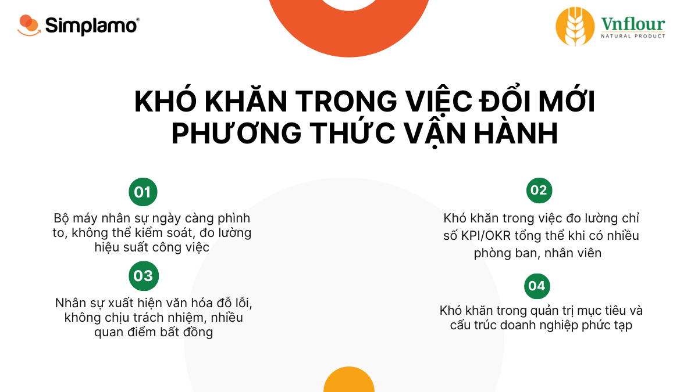
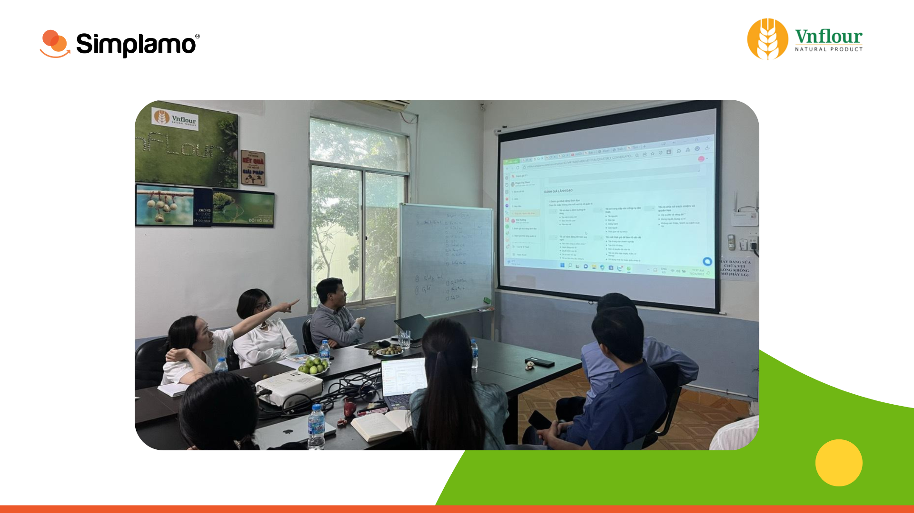
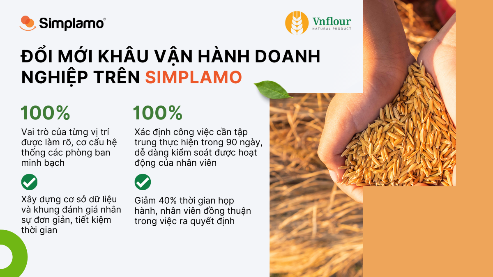

*Là một doanh nghiệp có tuổi đời trên 40 năm, Vnflour đã đi qua nhiều giai đoạn phát triển của nền kinh tế. Với tôn chỉ kinh doanh tập trung vào chất lượng sản phẩm, Vnflour luôn dành được niềm tin và sự ủng hộ của khách hàng. Điều mà VNflour cần trong giai đoạn này đó chính là đổi mới phương thức vận hành, củng cố nội lực để đi xa hơn trong thời gian tới.*

## **VnFlour – Sản phẩm chất lượng, dây chuyền sản xuất hiện đại**

Vnflour là công ty có hơn 40 năm trong lĩnh vực sản xuất lúa mỳ tại Việt Nam, đón đầu thời kỳ mở cửa kinh tế thị trường đầu tiên ở nước ta. Từ một doanh nghiệp chuyên sản xuất các sản phẩm bột mỳ thô và bỏ mối cho các công ty, đại lý sản xuất sản phẩm hoàn thiện như mỳ gói, quán ăn, nhà hàng,… Vnflour giờ đây đã trở thành một trong những công ty sản xuất bột mỳ có quy mô lên tới hàng trăm nhân viên, xuất khẩu ra nhiều nước trên thế giới, là sản phẩm Việt Nam chất lượng cao được khẳng định trên thị trường quốc tế.

Vì đã chứng kiến và trải qua nhiều giai đoạn biến động của thị trường, Vnflour xác định việc nắm bắt được xu thế tương lai là điều vô cùng quan trọng, cần liên tục cập nhật để không bị tụt lại phía sau, trong đó công nghệ chính là một trong những điểm mấu chốt cho những bước phát triển dài hạn đó.

Nhưng để đầu tư công nghệ như thế nào cho phù hợp, và có thể giúp Vnflour thay đổi cách vận hành ngay tại thời điểm hiện tại được hay không, lại là một câu chuyện không hề dễ. Với đặc thù ngành sản xuất của mình, Vnflour có nhiều nhà quản lý nhiều năm kinh nghiệm, giỏi về chuyên môn nhưng lại không giỏi về tư duy quản trị doanh nghiệp trên nền tảng số.

“Áp dụng phương pháp quản trị mà không đi đôi với công nghệ, sẽ không đạt được hiệu quả như mong đợi” – Chia sẻ từ anh Mã Văn Phước, Phó Tổng Giám đốc Vnflour.

## **Khó khăn và sự quyết tâm đổi mới từ nhà lãnh đạo nhiều hoài bão**

Các vấn đề gặp phải lúc bấy giờ của Vnflour như sau:

- Làm sao để kiểm soát, đo lường hiệu suất công việc khi bộ máy điều hành, sản xuất ngày càng phình ra.
- Sẽ có nhiều phòng ban, nhân viên hơn, làm sao đo lường chỉ số KPI/OKR tổng thể và từng phòng ban phù hợp với kỳ vọng phát triển của công ty.
- Chưa có sự liên kết, phối hợp làm việc hiệu quả giữa các phòng ban, cá nhân, cũng như thiếu tính trách nhiệm giải trình cho công việc mà mỗi thành viên đảm nhận.
- Khó khăn trong quản trị mục tiêu và đơn giản hóa cấu trúc doanh nghiệp phức tạp
- Liệu có một phần mềm nào đủ đơn giản để áp dụng cho đội ngũ và mang đến hiệu quả đồng bộ?

Là một người ham học hỏi, anh Phước đã tìm kiếm nhiều phương pháp quản trị và các phần mềm vận hành khác nhau mang về áp dụng. Nhưng đâu đó vẫn có một khoảng cách rất lớn giữa anh và đội ngũ. Mọi người đã quá quen với các công việc chuyên môn phòng ban và không muốn có thêm sự thay đổi. Cánh cửa để cho một phần mềm bước vào vốn đã rất nhỏ, nếu phần mềm đó còn phức tạp, chắc chắn sẽ không được chào đón.

Anh Phước nhận định, điều mà Vnflour cần trong thời gian tới, phải là một phần mềm quản trị đáp ứng 3 yếu tố:

- Đơn giản, để đội ngũ của anh ngay cả thế hệ 7x vẫn có thể sử dụng được
- Có tư duy quản trị đồng nhất, để mang đến **one team one voice,** phá tan rào cản “phòng ban”
- Tạo nên sự tập trung, trách nhiệm và đạt được các mục tiêu tăng trưởng

## **Sự đồng lòng tạo nên cục diện mới**

Qua vài lần tiếp xúc với Simplamo, anh Phước rất ấn tượng với nền tảng tư duy của phần mềm, và cách thể hiện các chức năng của Simplamo (rất dễ nhìn, dễ hiểu và tập trung). Nhưng để đạt được sự đồng thuận từ đội ngũ, Simplamo cần phải cho họ thấy lợi ích trước mắt.

Trước thực trạng này, Simplamo quyết định rút ngắn khoảng cách bằng việc nâng cao chất lượng cuộc họp tại Vnflour thông qua khung cuộc họp hàng tuần Weekly Meeting, đây là cách giúp đội ngũ ban lãnh đạo cảm nhận sự khác biệt mà không gây ra quá nhiều sự thay đổi trong cách vận hành hiện tại.

Bằng cách tổ chức cuộc họp này, kết hợp với sự hỗ trợ từ đội ngũ tư vấn của Simplamo, Vnflour từng bước nhận diện được các vấn đề xuất hiện trong tổ chức, cách thức giải quyết vấn đề hiệu quả, mọi thành viên được trao cơ hội nói lên suy nghĩ của mình. Và đặc biệt với khung cuộc họp được số hóa này, thời gian cuộc họp hàng tuần giảm đáng kể từ 2 tiếng xuống còn 90 phút.

Với một loạt những lợi ích mang lại trong 2 tháng trải nghiệm tính năng cuộc họp, đội ngũ Vnflour đồng lòng áp dụng phần mềm quản trị doanh nghiệp Simplamo trong toàn bộ tổ chức. Ngày kickoff dự án vận hành doanh nghiệp trên Simplamo diễn vào tháng 3 năm 2022 cùng với sự tư vấn triển khai của chuyên gia Simplamo:

- Đầu tiên là xây dựng lại **sơ đồ trách nhiệm** cho tổ chức, hệ thống lại các phòng ban, làm rõ vai trò của từng vị trí. Đây đồng thời cũng là lúc mọi người nhìn lại các trách nhiệm và đóng góp của nhau suốt một thời gian dài, từ đó xây nên một sơ đồ mới đáp ứng cho hoạt động trong 6 đến 12 tháng tới.

Đội ngũ Vnflour xây dựng sơ đồ trách nhiệm trước khi thể hiện lên simplamo

- Thiết lập các **mục tiêu ưu tiên của quý** (Rocks) cho công ty. Bằng cách này, đội ngũ cùng thống nhất đâu là những việc công ty cần tập trung thực hiện trong 90 ngày tới. Khi cùng nhìn về một hướng, các rào cản phòng ban cũng dần được tháo dỡ.
- Xây dựng **bảng scorecard** đo lường các chỉ số quan trọng hàng tuần, giúp ban lãnh đạo Vnflour theo sát mọi diễn biến của toàn công ty diễn ra trong tuần, từ đó kịp thời đưa ra các dự báo – điều đặc biệt quan trọng cho ngành hàng sản xuất nguyên liệu nhập khẩu như Vnflour. Các chỉ số này cũng phục vụ cho việc đánh giá hiệu suất làm việc nhân viên và đảm bảo đội ngũ luôn tập trung vào công việc của mình.
- Với bộ dữ liệu sẵn sàng và một sơ đồ trách nhiệm minh bạch, đội ngũ Vnflour tiếp tục tổ chức cuộc họp **weekly meeting** nhịp nhàng hàng tuần, bám sát và đốc thúc nhau thực thi các mục tiêu cho tổ chức.

## **Vnflour – Tổ chức đổi mới, nội lực mạnh mẽ**

Trong một buổi gặp gỡ với Vnflour vào những ngày cuối năm 2022, chúng tôi được chứng kiến nhiều điều thay đổi ấn tượng. Các anh chị trong ban lãnh đạo rất hồ hởi chia sẻ về hoạt động trong năm vừa qua, mọi người nói về nhau về scorecard, về mục tiêu và về vision.

Trải qua gần một năm vận hành trên Simplamo, các thuật ngữ này không còn gì xa lạ với các anh chị nữa, họ trao đổi với nhau về các mục tiêu trong năm mới rất dễ hiểu và rất dễ nắm bắt được tâm ý của nhau.

Simplamo hướng dẫn sử dụng tính năng Đánh giá 1-1 cho Vnflour

“Vận hành trên Simplamo, đội ngũ của Vnflour học được tư duy quản trị doanh nghiệp bài bản và có được khung vận hành chung nhất, thậm chí mọi người còn trao đổi với nhau về cách xây rocks sao cho hiệu quả và đo lường bằng chỉ số gì mới đúng. Simplamo mang tư duy quản trị Hoa Kỳ về Việt Nam, và nhờ đó Vnflour cũng có được tư duy quản trị này. Mọi thứ trở nên minh bạch, và anh có được sự đồng hành từ đội ngũ.” – Anh Phước bộc bạch.

Những điều thay đổi sau gần một năm áp dụng:

- Hệ thống phòng ban, vai trò rõ ràng minh bạch, các thành viên có trách nhiệm cao trong công việc
- Dễ dàng kiểm soát được hoạt động của nhân viên và tập trung sức lực của đội ngũ vào những mục tiêu quan trọng.
- Có cơ sở dữ liệu và khung đánh giá nhân sự đơn giản, tiết kiệm thời gian, mang đến hiệu quả cho doanh nghiệp.
- **Giảm 40%** thời gian họp hành
- Đội ngũ hiểu rõ tầm nhìn sứ mệnh và hình thành nên tiếng nói chung trong mọi quyết định

Vnflour có được một nội lực mạnh mẽ nhờ đội ngũ ban lãnh đạo khỏe mạnh và trách nhiệm. Dựa trên nền tảng con người vững chắc này, Vnflour đặt ra các mục tiêu tăng trưởng vượt trội trong năm 2023, **tăng gần 200% so với 2022**. Đây là tín hiệu rất vui mừng cho một doanh nghiệp sản xuất đã bước sang tuổi 40 như Vnflour.

Hy vọng các giá trị từ Simplamo sẽ không ngừng lan tỏa và tạo nên các kết quả ấn tượng trong thời gian tới cho Vnflour.

—————————————————

[Simplamo](https://simplamo.com/vi/) – Phần mềm quản trị mục tiêu khoa học hiện đại, kết hợp độc đáo giữa KPI, OKR. Biến mọi thứ phức tạp trong điều hành trở nên đơn giản và gần gũi đến từng nhân viên. Giải phóng áp lực cho nhà lãnh đạo, tập trung vào điều quan trọng, tối ưu hiệu suất làm việc cho doanh nghiệp.

Hãy bắt đầu trải nghiệm Simplamo và cảm nhận sự thay đổi chỉ sau 4 tuần!

Đăng ký nhận buổi demo Simplamo tại: <https://app.simplamo.com/sign-up>

