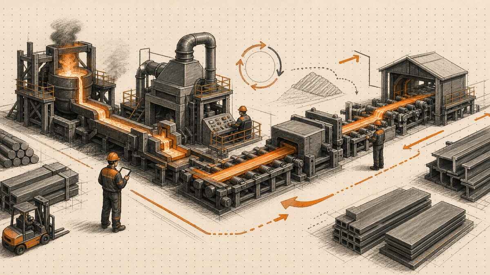
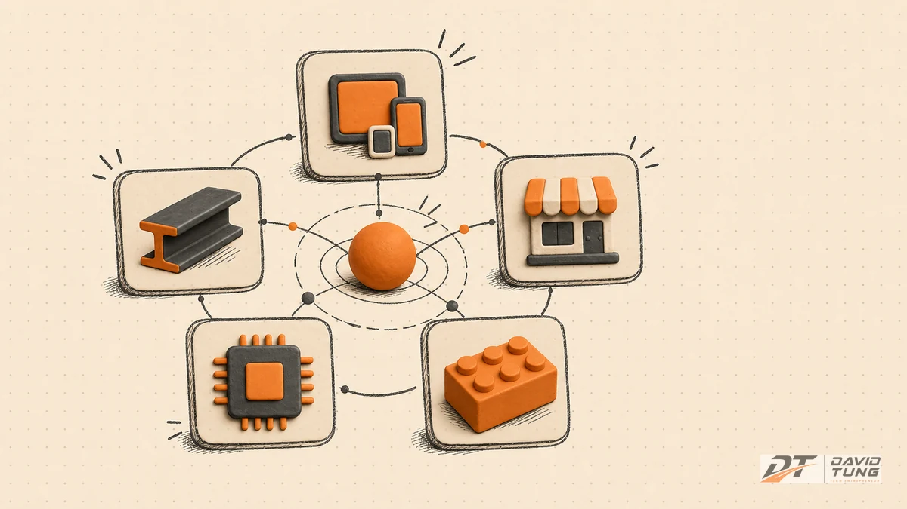

Nhiều doanh nghiệp không chết vì thiếu cơ hội.

Họ chết vì cơ hội nào cũng muốn làm.

Câu này nghe hơi phũ. Nhưng càng làm với nhiều CEO, tôi càng thấy nó đúng. Nhất là trong thời đại AI.

Ngày trước, một ý tưởng mới còn tốn tiền, tốn người, tốn thời gian để thử. Bây giờ thì khác. Một landing page có thể dựng trong vài giờ. Một chiến dịch nội dung có thể lên trong một buổi. Một prototype có thể làm nhanh hơn trước rất nhiều. Một tính năng AI nhìn có vẻ “bắt trend” cũng không còn quá khó để thử.

Vấn đề là: làm được nhanh hơn không có nghĩa là nên làm.

AI làm chi phí thử nghiệm thấp đi. Nhưng nó cũng làm FOMO chiến lược tăng lên. CEO nhìn đâu cũng thấy cơ hội: sản phẩm mới, thị trường mới, kênh mới, AI feature mới, automation mới, nội dung mới, partnership mới.

Và rồi công ty bắt đầu chạy.

Chạy nhanh hơn. Nhưng không chắc là chạy đúng hướng.


## AI không sửa được một chiến lược thiếu tập trung

Một trong những hiểu nhầm phổ biến nhất về AI là: vì AI giúp làm nhiều việc nhanh hơn, nên công ty nên làm nhiều việc hơn.

Nghe rất hợp lý. Nhưng nguy hiểm.

Nếu công ty đang có một lõi mạnh, AI có thể làm lõi đó sắc hơn. Nhưng nếu công ty đang phân tán, AI chỉ giúp sự phân tán đó diễn ra nhanh hơn, nhiều hơn, và có vẻ “hiện đại” hơn.

Một đội marketing chưa rõ thông điệp cốt lõi sẽ dùng AI để tạo ra nhiều nội dung hơn, nhưng chưa chắc nội dung đó có lực hơn.

Một đội sales chưa rõ phân khúc khách hàng tốt nhất sẽ dùng AI để gửi nhiều email hơn, nhưng chưa chắc tỷ lệ thắng cao hơn.

Một công ty chưa rõ sản phẩm nào tạo ra biên lợi nhuận thật sự sẽ dùng AI để nghĩ thêm tính năng, thêm gói, thêm kênh, thêm thị trường. Nhìn bên ngoài thì bận rộn. Bên trong thì lõi ngày càng mỏng.

Đây là cái bẫy của thời đại AI:

```text
Làm được nhanh hơn
→ tưởng là nên làm
→ mở thêm nhiều hướng
→ đội ngũ bận hơn
→ công ty không mạnh hơn
```

Câu hỏi của CEO vì vậy không nên là:

> “AI giúp mình làm thêm được gì?”

Câu hỏi đúng hơn là:

> “AI giúp năng lực cốt lõi của mình sắc hơn ở đâu?”


## Quay lại thuyết con nhím: đơn giản, nhưng không dễ

Trong *Good to Great*, Jim Collins nói về “Hedgehog Concept” — thuyết con nhím.

Ý tưởng khá đơn giản. Công ty muốn đi từ tốt đến vĩ đại cần tìm được giao điểm của ba câu hỏi:

1. **Mình có thể giỏi nhất ở điều gì?**
2. **Điều gì tạo ra động cơ kinh tế thật sự?**
3. **Điều gì khiến đội ngũ có năng lượng theo đuổi lâu dài?**

Giao điểm đó là “con nhím” của công ty.

Không phải thứ công ty thích nhất trên slide chiến lược. Không phải trend đang ồn nhất trên thị trường. Không phải cơ hội khách hàng vừa hỏi tuần trước. Cũng không phải thứ đối thủ vừa làm nên mình thấy sốt ruột.

Nó là vùng mà công ty có thể kiên trì đủ lâu, tích lũy đủ sâu, và càng làm càng mạnh.

Đây là chỗ nhiều CEO nhầm.

Họ nghĩ chiến lược là tìm thêm cơ hội tăng trưởng. Nhưng nhiều khi chiến lược là đủ tỉnh để không nhận những cơ hội làm công ty rời khỏi lõi.

Cơ hội mới không xấu. Nhưng cơ hội nào cũng có chi phí ẩn. Nó ăn sự chú ý của CEO. Nó kéo đội ngũ ra khỏi việc đang làm tốt. Nó làm roadmap nở ra. Nó làm khách hàng không còn hiểu công ty thật sự giỏi ở đâu.

Và tệ nhất: nó tạo cảm giác công ty đang tiến lên, trong khi thực ra chỉ đang xoay ngang.


## Năm ví dụ: công ty mạnh lên khi biết quay về lõi

Để không nói lý thuyết suông, hãy nhìn vài ví dụ.

### Apple: cắt để rõ


Khi Steve Jobs quay lại Apple năm 1997, Apple không thiếu sản phẩm. Ngược lại, họ có quá nhiều dòng sản phẩm chồng chéo: nhiều biến thể Mac, Newton, máy in, phụ kiện, các dự án rời rạc.

Khách hàng rối. Nội bộ cũng rối.

Jobs làm một việc rất khó với mọi tổ chức: cắt.

Ông kéo danh mục về một ma trận 2×2 đơn giản: consumer/pro và desktop/portable. Từ rất nhiều hướng, Apple quay lại một lõi rõ hơn: làm ít sản phẩm hơn, nhưng làm sâu hơn, tốt hơn, dễ hiểu hơn.

Bài học không phải là mọi công ty nên bắt chước Apple. Bài học là: đôi khi tăng trưởng bắt đầu bằng việc ngừng làm những thứ khiến công ty mờ đi.

### Nucor: lõi là kỷ luật vận hành



Nucor là một trong các case trong *Good to Great*. Họ không trở nên vĩ đại vì chạy theo mọi mảng công nghiệp mới. Họ xây lợi thế quanh năng lực sản xuất thép hiệu quả, kỷ luật vận hành, mô hình nhà máy tinh gọn, và văn hóa năng suất rất mạnh.

Nói đơn giản: họ biết mình thắng bằng gì.

Khi một công ty biết rõ “động cơ kinh tế” của mình nằm ở đâu, họ sẽ không bị mọi cơ hội doanh thu kéo đi. Họ hỏi: việc này có cải thiện lõi kinh tế của mình không? Nếu không, dù nghe hấp dẫn, nó vẫn có thể là nhiễu.

### Walgreens: lõi là sự tiện lợi có thể nhân rộng


Walgreens cũng là một case nổi tiếng trong *Good to Great*. Thay vì cố trở thành đủ loại hình bán lẻ, họ tập trung vào mô hình cửa hàng thuốc tiện lợi, vị trí tốt, dễ ghé, dễ mua, kinh tế tốt trên mỗi lượt khách.

Điểm đáng học là sự đơn giản.

Không phải mô hình nào nghe to cũng mạnh. Có những công ty thắng vì hiểu rất rõ một động cơ kinh tế nhỏ nhưng lặp lại cực tốt. Khi đã hiểu động cơ đó, mọi quyết định mở rộng đều phải phục vụ nó.

### NVIDIA: AI khuếch đại lõi, không thay lõi


NVIDIA là ví dụ rất hợp với thời điểm này.

Nếu nhìn bề mặt, có thể nói NVIDIA “gặp may” vì AI bùng nổ. Nhưng nếu nhìn sâu hơn, AI không biến NVIDIA thành một công ty khác. AI khuếch đại năng lực lõi mà họ đã xây nhiều năm: GPU, accelerated computing, hệ sinh thái phần mềm/phần cứng cho tính toán song song.

Đây là bài học quan trọng cho CEO thời AI.

AI không nhất thiết là một hướng đi mới. Với công ty có lõi rõ, AI có thể là chất xúc tác làm lõi đó mạnh hơn rất nhiều.

### LEGO: quay lại hệ chơi cốt lõi


LEGO từng có giai đoạn mở rộng quá rộng: công viên, game, quần áo, nhiều hướng giải trí khác nhau. Có những phần tạo tiếng vang, nhưng cũng có giai đoạn khiến công ty bị phân tán.

Sự phục hồi của LEGO gắn với việc quay lại lõi: hệ gạch, khả năng sáng tạo, trải nghiệm chơi có thể mở rộng qua chủ đề, IP, cộng đồng, và cả digital — nhưng vẫn xoay quanh “system of play”.

Điểm hay là LEGO không từ chối đổi mới. Họ vẫn dùng IP, phim, game, trải nghiệm số. Nhưng những thứ đó hiệu quả hơn khi quay quanh lõi, thay vì thay thế lõi.



## Câu hỏi CEO: việc này có làm lõi sắc hơn không?

Trong thời đại AI và FOMO, tôi nghĩ CEO nên thêm một câu hỏi vào mọi cuộc họp chiến lược:

> Việc này có làm lõi của mình sắc hơn không?

Trước khi mở sản phẩm mới, kênh mới, thị trường mới, hay tính năng AI mới, hãy hỏi thêm năm câu:

1. Việc này có làm năng lực cốt lõi của công ty mạnh hơn không?
2. Việc này có cải thiện động cơ kinh tế thật sự không?
3. Việc này có khiến đội ngũ có thêm năng lượng dài hạn không?
4. Nếu bỏ cơ hội này, công ty có mất lợi thế chiến lược không?
5. Nếu nhận cơ hội này, công ty phải hy sinh điều gì?

Câu số 5 thường là câu bị né.

Vì cơ hội mới lúc nào cũng được trình bày bằng mặt đẹp: doanh thu mới, tệp khách mới, tính năng mới, thị trường mới. Nhưng ít ai nói đủ về mặt còn lại: đội ngũ nào sẽ bị kéo ra, roadmap nào bị chậm, chất lượng lõi nào bị mỏng, khách hàng nào bị phục vụ kém hơn.

Một CEO giỏi không chỉ hỏi “cơ hội này có hay không?”.

CEO giỏi hỏi: “cơ hội này có xứng đáng với sự phân tâm mà nó tạo ra không?”.


## AI nên được dùng để mài lõi, không phải mở thêm mê cung

Nếu công ty đã biết lõi của mình, AI trở nên rất mạnh.

Không phải vì AI làm được mọi thứ. Mà vì AI giúp công ty làm những việc quan trọng nhanh hơn, đều hơn, và học được từ mỗi lần làm đúng.

Ví dụ:

Nếu lõi của công ty là **nội dung chuyên sâu**, AI không chỉ để viết caption. AI nên giúp nghiên cứu, lên script, tạo visual direction, dựng voice, sync subtitle, render video, QA, rồi biến workflow tốt thành quy trình lặp lại.

Nếu lõi của công ty là **bán hàng tư vấn**, AI không chỉ để viết email. AI nên giúp đọc lịch sử khách hàng, chuẩn hóa nhu cầu, tạo proposal, báo giá DOCX/PDF, tạo QR thanh toán, gợi ý follow-up, và giảm thời gian từ nhu cầu đến đề xuất.

Nếu lõi của công ty là **triển khai/vận hành**, AI không chỉ để hỏi lỗi server. AI nên giúp đọc log, đề xuất lệnh kiểm tra, viết checklist, tạo tài liệu restore, và lưu lại cách xử lý để lần sau không dò lại từ đầu.

Cùng là AI. Nhưng khác hoàn toàn về tầng sử dụng.

Tầng thấp là: AI trả lời cho từng người.

Tầng cao hơn là: AI làm năng lực cốt lõi của tổ chức sắc hơn.

Công ty nào chưa biết lõi của mình là gì sẽ dùng AI như một cái chợ công cụ. Mỗi phòng ban thử một chút. Mỗi người prompt một kiểu. Mỗi tuần lại có một tool mới. Nhìn thì sôi động, nhưng tổ chức không tích lũy được nhiều.

Công ty nào biết lõi của mình sẽ hỏi khác:

```text
Năng lực nào nếu được AI khuếch đại 10 lần
thì công ty sẽ mạnh lên rõ nhất?
```

Đó là câu hỏi rất đáng để CEO ngồi yên 30 phút mà trả lời.

## Bài tập 30 phút: tìm con nhím của công ty

Nếu muốn làm nhanh, CEO có thể mở một bảng đơn giản với 5 cột:

| Việc công ty đang làm | Có tạo tiền thật không? | Có làm tốt hơn thị trường không? | Càng làm càng tích lũy lợi thế không? | Có phải FOMO không? |
|---|---|---|---|---|
| Sản phẩm / dịch vụ A |  |  |  |  |
| Kênh bán hàng B |  |  |  |  |
| AI feature C |  |  |  |  |
| Thị trường D |  |  |  |  |
| Dự án nội bộ E |  |  |  |  |

Đừng làm bài này quá “workshop”. Cứ thẳng tay.

Có những việc đang tạo doanh thu nhưng không tạo lợi thế. Có những việc đội ngũ thích nhưng khách hàng không trả tiền đủ tốt. Có những việc nghe rất thời thượng nhưng càng làm càng kéo công ty ra khỏi điểm mạnh.

Sau đó hỏi tiếp:

> Nếu chỉ được dùng AI để làm một năng lực của công ty sắc hơn 10 lần, mình sẽ chọn năng lực nào?

Câu trả lời đầu tiên thường chưa chắc đúng. Nhưng nó mở ra cuộc nói chuyện đáng giá hơn nhiều so với câu: “Tuần này mình thử tool AI nào?”.

## Đừng chạy khỏi lõi. Mài nó sắc hơn.

Làm kinh doanh đôi khi không cần thêm một hướng đi.

Chỉ cần đủ kỷ luật để không rời xa hướng đúng.

Thời đại AI càng ồn, CEO càng phải bình tĩnh. Vì cái mới sẽ luôn hấp dẫn. Cơ hội mới sẽ luôn có vẻ hợp lý. Tool mới sẽ luôn hứa rằng công ty có thể đi nhanh hơn.

Nhưng đi nhanh hơn về đâu?

Nếu hướng đó kéo công ty rời khỏi năng lực cốt lõi, tốc độ chỉ làm cái sai lan nhanh hơn.

Thuyết con nhím không bảo công ty đứng yên. Nó nhắc CEO rằng tăng trưởng bền vững thường đến từ một lõi được mài sắc liên tục, không phải từ việc chạy theo mọi thứ có vẻ mới.

AI không thay thế năng lực cốt lõi.

AI khuếch đại công ty nào biết rõ năng lực cốt lõi của mình.

Và có lẽ câu hỏi quan trọng nhất cho CEO lúc này không phải là:

> “Chúng ta sẽ dùng AI làm gì?”

Mà là:

> “AI sẽ làm con nhím của chúng ta sắc hơn ở đâu?”
