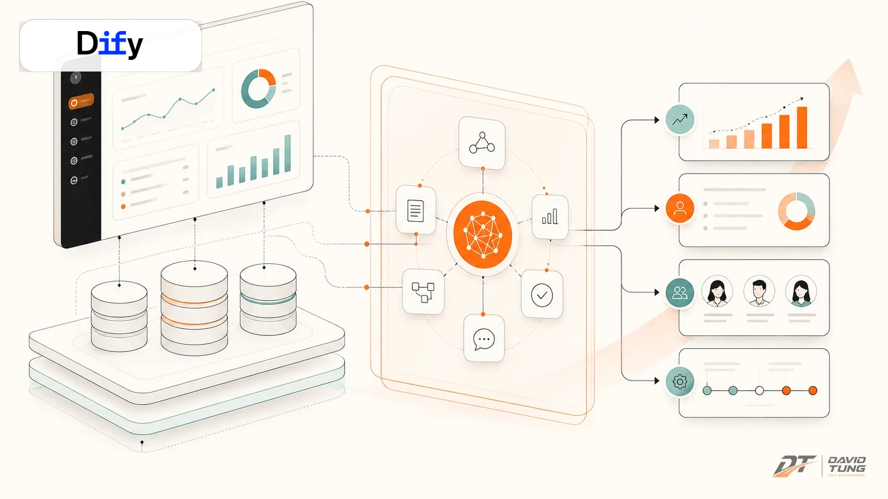
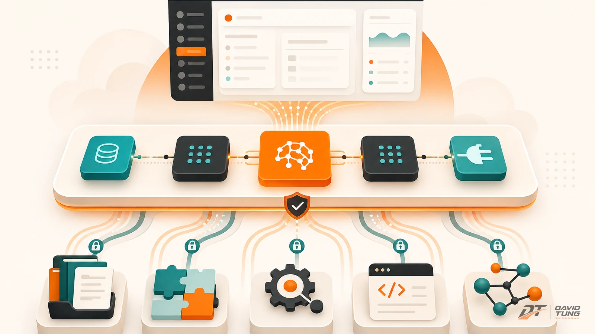
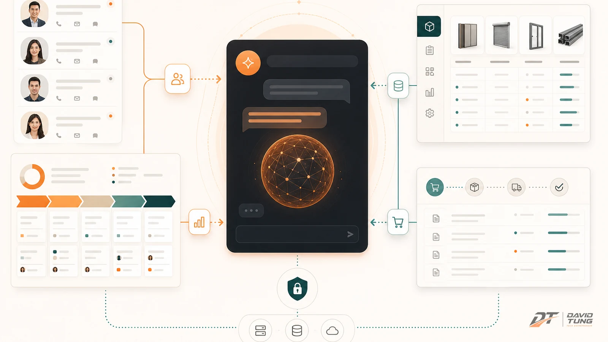
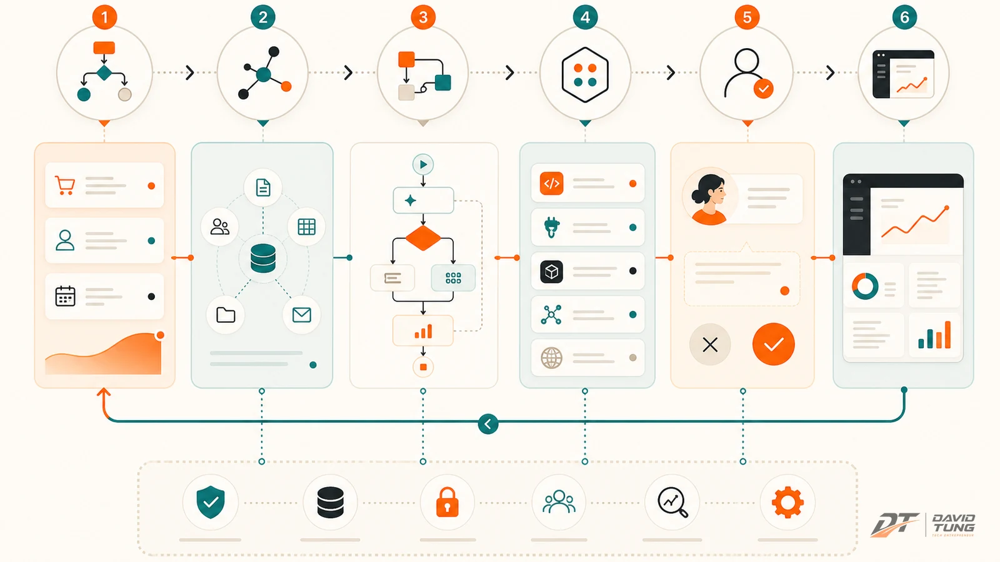

Nhiều đội SaaS bắt đầu câu chuyện AI bằng một câu rất quen:

> “Mình thêm chatbot vào sản phẩm được không?”

Được. Nhưng đó thường không phải câu hỏi đúng nhất.

Chatbot là giao diện. Giá trị thật nằm ở chỗ AI có hiểu quy trình không, có gọi được dữ liệu thật không, có gợi ý được bước tiếp theo không, và có tạo ra output để người dùng làm việc nhanh hơn không.

Với một SaaS hoặc ERP đang có sẵn, tôi không nghĩ nên vội xây toàn bộ AI platform từ số 0. Rất dễ tốn tháng trời cho hạ tầng, trong khi team vẫn chưa biết use case nào thật sự đáng làm.

Đó là lý do tôi thích nhìn Dify như một **lớp AI workflow để học nhanh**.

Không phải vì Dify là câu trả lời cuối cùng. Mà vì nó giúp đội sản phẩm trả lời được câu hỏi quan trọng hơn:

> AI nên nằm ở đâu trong sản phẩm để tạo ra giá trị vận hành thật?



## Dify không chỉ là chatbot

Nếu chỉ dùng Dify để làm một khung chat hỏi đáp, mình đang dùng nó ở tầng khá thấp.

Dify là một nền tảng open-source để phát triển ứng dụng LLM. Trong cùng một chỗ, nó gom được nhiều mảnh mà một SaaS cần khi muốn đưa AI vào sản phẩm: workflow, RAG, agent, model management, quan sát log, API, công cụ mở rộng và khả năng tích hợp.

Điểm đáng chú ý là Dify giúp team đi từ:

```text
Prompt rời rạc
→ workflow có bước
→ kết nối knowledge
→ gọi tool/API
→ tạo output
→ đóng thành feature
```

Với SaaS B2B, đây là khác biệt lớn.

Một chatbot chỉ trả lời. Một workflow AI thì có thể đọc dữ liệu, hiểu ngữ cảnh, gọi công cụ, tạo bản nháp, đưa người dùng duyệt, rồi đẩy kết quả ngược lại hệ thống.

Nói hơi thẳng: nếu AI không chạm được vào workflow, nó chỉ là “nhân viên tư vấn đứng ngoài cửa”. Nghe hay, nhưng chưa vận hành được.

## SaaS cũ không thiếu dữ liệu, chỉ thiếu lớp AI biết hành động

Một SaaS hoặc ERP đang chạy thường đã có rất nhiều thứ:

| Trong SaaS/ERP đã có | Nhưng AI layer cần hiểu thêm |
|---|---|
| User và phân quyền | Ai đang hỏi, vai trò gì, được làm gì |
| Database | Dữ liệu nào liên quan đến ngữ cảnh hiện tại |
| Module nghiệp vụ | Người dùng đang ở bước nào |
| Form và quy trình | Cần nhập gì, thiếu gì, nên làm tiếp gì |
| Báo cáo | Insight nào cần biến thành hành động |
| API | Tool nào được gọi, gọi khi nào, log ra sao |

Vấn đề của ERP không phải lúc nào cũng là thiếu chức năng.

Nhiều khi ERP khó vì người dùng không biết nên dùng chức năng nào, nhập dữ liệu gì, đọc số liệu ra sao, và sau đó nên hành động thế nào.

Đây là chỗ AI có đất diễn.

Nhưng AI không nên đứng tách rời như một ô chat tổng quát. Nó nên trở thành một lớp vận hành nằm giữa:

```text
Dữ liệu có sẵn
→ quy trình nghiệp vụ
→ người dùng cụ thể
→ output cần hoàn thành
```



## Framework 5 tầng để đưa AI vào SaaS đang có

Khi đưa AI vào một sản phẩm có sẵn, tôi thường không bắt đầu bằng model.

Tôi bắt đầu bằng operating model.

### 1. Knowledge: AI phải biết ngữ cảnh của doanh nghiệp

AI cần đọc được tài liệu sản phẩm, quy trình nội bộ, SOP, chính sách, hướng dẫn sử dụng, dữ liệu khách hàng hoặc lịch sử giao dịch.

Dify có thể giúp dựng knowledge base và RAG nhanh để team thử xem loại tri thức nào thật sự hữu ích.

Nhưng đừng ảo tưởng rằng cứ nhồi tài liệu vào là xong. RAG không cứu được một kho tri thức bừa bộn. Tài liệu càng gần nghiệp vụ thật, câu trả lời càng có lực.

### 2. Workflow: AI phải đi qua nhiều bước, không chỉ trả lời một câu

Trong SaaS, một việc hiếm khi chỉ là “hỏi — đáp”.

Ví dụ:

```text
Nhận yêu cầu khách hàng
→ hiểu loại yêu cầu
→ lấy dữ liệu liên quan
→ tạo bản nháp
→ kiểm tra điều kiện
→ đề xuất bước tiếp theo
→ chờ người duyệt
```

Dify mạnh ở chỗ team có thể dựng các luồng như vậy nhanh hơn nhiều so với tự code từ đầu.

### 3. Tool/API/plugin: AI phải gọi được hệ thống thật

Một AI workflow có giá trị khi nó biết gọi đúng công cụ.

Dify có plugin, tool và API integration để mở rộng khả năng của ứng dụng AI. Với các SaaS đang có sẵn, tầng này rất quan trọng vì AI không nên chỉ “biết”, mà phải “làm được”.

Ví dụ:

- gọi ERP API để lấy đơn hàng;
- gọi CRM để đọc trạng thái lead;
- gọi hệ thống báo giá để tạo draft;
- gọi webhook để thông báo cho team;
- gọi document generator để tạo file.

Gần đây, MCP — Model Context Protocol — cũng trở thành một hướng đáng chú ý. Nếu SaaS của bạn có thể expose dữ liệu và hành động qua MCP server, Dify hoặc lớp AI workflow có thể kết nối vào hệ sinh thái tool đó gọn hơn, thay vì mỗi nơi viết một kiểu tích hợp riêng.

Nói đơn giản:

> Plugin giúp Dify mở rộng năng lực. MCP giúp SaaS expose năng lực của mình cho AI một cách chuẩn hóa hơn.

### 4. Human-in-the-loop: việc quan trọng phải có người duyệt

Trong B2B SaaS, ERP, sales, tài chính hay vận hành, không nên auto 100% quá sớm.

Thiết kế tốt hơn là:

```text
AI tạo bản nháp
→ người dùng duyệt/sửa
→ hệ thống ghi log
→ workflow được cải thiện
```

Cách này thực tế hơn, an toàn hơn, và giúp team học nhanh hơn.

### 5. Productization: khi workflow chạy ổn mới đóng thành feature

Dify giúp prototype nhanh. Nhưng khi use case chứng minh được giá trị, team vẫn cần productize:

- gắn permission;
- theo dõi usage;
- audit log;
- giới hạn dữ liệu;
- UI/UX riêng trong SaaS;
- tính phí nếu đó là feature cao cấp.

Dify là bước đệm rất tốt. Nhưng SaaS vẫn phải chịu trách nhiệm cuối cùng về trải nghiệm, quyền dữ liệu và vận hành.

## Case Simplamo: AI chat cho chiến lược, KPI, cột mốc và tầm nhìn

Với Simplamo, hướng AI tôi thấy đúng không phải là “chatbot hỏi đáp tài liệu”.

Simplamo là một hệ thống quản trị mục tiêu và vận hành. Người dùng không chỉ cần biết nút nào ở đâu. Họ cần được hỗ trợ suy nghĩ đúng về chiến lược, mục tiêu, KPI, cột mốc và cách phân rã công việc.

Ở đây, AI chat nên đóng vai trò giống một **strategy operating assistant**.

Nó có thể giúp CEO và đội ngũ:

- làm rõ tầm nhìn;
- chuyển tầm nhìn thành mục tiêu chiến lược;
- gợi ý KPI phù hợp;
- phân rã mục tiêu thành cột mốc;
- biến cột mốc thành action plan;
- tạo sơ đồ để team dễ hiểu bức tranh tổng thể.


Điểm hay là Simplamo đã có ngữ cảnh vận hành. Nó có mục tiêu, phòng ban, người phụ trách, tiến độ, dữ liệu check-in.

AI nếu được đặt đúng tầng có thể hỏi và gợi ý rất thực tế:

> “Mục tiêu này đang quá rộng. Anh muốn đo bằng doanh thu, số khách hàng mới, hay tỷ lệ giữ chân?”

> “Cột mốc này chưa đủ rõ người chịu trách nhiệm. Có nên tách thành 3 milestone nhỏ hơn không?”

> “KPI này đang là activity metric. Có cần thêm outcome metric để đo kết quả thật không?”

Đây là thứ một chatbot tổng quát khó làm tốt nếu không được nối vào ngữ cảnh sản phẩm.

Với Dify, giai đoạn đầu có thể dựng nhanh một AI workflow cho các việc như:

```text
Input: tầm nhìn / mục tiêu thô
→ AI hỏi làm rõ
→ lấy framework chiến lược và dữ liệu nội bộ
→ gợi ý KPI
→ phân rã milestone
→ tạo sơ đồ / checklist
→ người dùng duyệt
→ đẩy lại vào Simplamo
```

Nếu workflow này chứng minh được giá trị, lúc đó mới đáng đóng sâu vào product experience của Simplamo.

Nói cách khác: Dify giúp Simplamo học nhanh xem AI nên hỗ trợ chiến lược ở đâu, trước khi biến nó thành một feature native.

## Case AUSTDOOR Sale AI: build chat riêng tích hợp ERP

AUSTDOOR Sale AI là một case khác.

Ở Simplamo, AI là lớp hỗ trợ tư duy chiến lược và vận hành mục tiêu. Với AUSTDOOR Sale AI, AI có thể tiến gần hơn đến core của sales workflow.

Bài toán không phải là một chatbot chung chung cho nhân viên sales hỏi chơi.

Bài toán đúng hơn là: **một chat riêng, được thiết kế cho sales, tích hợp ERP, hiểu dữ liệu sản phẩm, khách hàng, đơn hàng và quy trình bán hàng**.



Một sales AI có giá trị khi nó giúp người bán làm việc nhanh hơn trong bối cảnh thật:

- khách hàng đang hỏi dòng sản phẩm nào;
- tồn kho hoặc dữ liệu ERP đang nói gì;
- chính sách bán hàng có điều kiện nào;
- lead đang ở giai đoạn nào;
- bước follow-up tiếp theo là gì;
- nên tạo báo giá, tư vấn thêm hay chuyển cho bộ phận khác.

Ở đây, Dify có thể đóng vai trò giai đoạn đầu để dựng nhanh chat workflow:

```text
Sales hỏi bằng ngôn ngữ tự nhiên
→ AI hiểu intent
→ gọi knowledge về sản phẩm/chính sách
→ gọi ERP qua API/plugin/MCP
→ tổng hợp câu trả lời
→ tạo gợi ý hành động
→ ghi log hoặc đẩy kết quả về hệ thống
```

Điểm quan trọng là chat này phải là **chat riêng của nghiệp vụ sales**, không phải một chatbot AI chung dán vào website.

Vì khi đã tích hợp ERP, AI không còn chỉ viết câu trả lời. Nó bắt đầu tham gia vào sales operating layer.

Nếu làm tốt, AUSTDOOR Sale AI không chỉ giúp sales hỏi nhanh hơn. Nó giúp chuẩn hóa cách tư vấn, giảm phụ thuộc vào trí nhớ cá nhân, và đưa dữ liệu ERP vào cuộc hội thoại bán hàng đúng lúc.

## Vì sao Dify hợp cho giai đoạn này?

Tôi không xem Dify là “đũa thần”. Nhưng tôi xem nó là công cụ tốt để giảm chi phí học.

Một SaaS muốn AI-native sẽ phải trả lời rất nhiều câu hỏi:

- Use case nào đáng làm trước?
- Knowledge nào đủ sạch?
- Workflow nên có mấy bước?
- Khi nào cần gọi ERP?
- Khi nào cần người duyệt?
- Output nào khiến user thấy đáng tiền?
- Phần nào nên nằm trong Dify, phần nào nên code native?

Nếu tự build từ đầu, team rất dễ dành 80% thời gian cho plumbing: hạ tầng, queue, prompt service, tool adapter, logging, UI thử nghiệm.

Dify giúp đi nhanh hơn ở đoạn đầu:

1. dựng workflow nhanh;
2. thử prompt và RAG nhanh;
3. nối tool/API/plugin nhanh;
4. quan sát log dễ hơn;
5. demo cho business owner sớm hơn;
6. học use case trước khi xây platform riêng.

Với tôi, đây là điểm đáng giá nhất.

Dify không thay thế tư duy sản phẩm. Nhưng nó giúp team không bị kẹt trong hạ tầng quá sớm.

## Công thức triển khai: bắt đầu bằng một workflow có output rõ

Nếu ngày mai phải đưa AI vào một SaaS đang chạy, tôi sẽ không bắt đầu bằng câu:

> “Làm AI assistant toàn năng nhé?”

Tôi sẽ bắt đầu bằng một workflow nhỏ, có output rõ.

Ví dụ:

- từ tầm nhìn thô → gợi ý KPI và milestone;
- từ lead mới → tóm tắt nhu cầu và gợi ý follow-up;
- từ câu hỏi sales → lấy dữ liệu ERP và gợi ý tư vấn;
- từ ticket khách hàng → tóm tắt lỗi và đề xuất xử lý;
- từ dữ liệu vận hành → tạo checklist hành động.

Framework triển khai có thể đi theo 6 bước:

```text
1. Chọn một job-to-be-done thật
2. Gom knowledge tối thiểu nhưng sạch
3. Dựng workflow trong Dify
4. Kết nối API/plugin/MCP của SaaS
5. Cho user thật dùng với human review
6. Đo output rồi productize
```



Điểm cần giữ là: output phải cụ thể.

AI nên tạo ra thứ gì đó người dùng dùng được ngay:

- một bộ KPI;
- một milestone tree;
- một sơ đồ;
- một email follow-up;
- một báo giá nháp;
- một ticket summary;
- một action plan;
- một API update đã được duyệt.

Nếu sau buổi demo, mọi người chỉ nói “AI trả lời cũng hay”, thì chưa đủ.

Nếu sau buổi demo, một user nói “cái này tiết kiệm cho tôi 30 phút mỗi ngày”, lúc đó mới bắt đầu có tín hiệu sản phẩm.

## Những lỗi dễ mắc khi đưa Dify vào SaaS

### Lỗi 1: Làm chatbot trước khi hiểu workflow

Chatbot dễ demo. Nhưng SaaS sống bằng workflow.

Nếu chưa biết user cần hoàn thành việc gì, chatbot sẽ nhanh chóng thành một ô hỏi đáp phụ. Có cũng được, không có cũng không chết.

### Lỗi 2: Nhồi quá nhiều knowledge

Nhiều team nghĩ RAG là cứ ném tài liệu vào.

Không phải.

Knowledge phải được tổ chức theo job. Tài liệu chiến lược phục vụ câu hỏi chiến lược. Tài liệu sales phục vụ sales. Tài liệu ERP phục vụ thao tác ERP. Trộn hết vào một nồi thì AI cũng… hơi tội.

### Lỗi 3: Không nối vào hệ thống thật

Nếu AI không đọc được ERP, CRM, SaaS database hoặc API nội bộ, nó chỉ đang đoán trên bề mặt.

Với sản phẩm B2B, tích hợp là điểm sống còn.

### Lỗi 4: Muốn auto 100% quá sớm

AI nên bắt đầu bằng bản nháp và gợi ý.

Khi dữ liệu, prompt, workflow và log đủ tin cậy, lúc đó mới tăng mức tự động hóa.

### Lỗi 5: Không có governance

SaaS cần phân quyền, audit, log, data boundary, rollback.

Dify giúp dựng nhanh workflow, nhưng khi đưa vào sản phẩm thật, phần governance phải được thiết kế nghiêm túc.

## Khi nào nên dùng Dify, khi nào không?

Nên dùng Dify khi:

- cần prototype AI workflow nhanh;
- SaaS đã có API hoặc có thể mở API;
- team muốn thử nhiều use case trước khi chọn cái đáng build sâu;
- cần RAG, workflow, tool calling, plugin hoặc MCP integration;
- muốn có demo thật cho business owner trong vài ngày, không phải vài tháng.

Không nên kỳ vọng Dify giải quyết mọi thứ nếu:

- nghiệp vụ chưa rõ;
- dữ liệu nội bộ quá rối;
- chưa biết output cụ thể là gì;
- chưa có owner vận hành;
- cần custom product experience rất sâu ngay từ ngày đầu.

Dify là accelerator. Không phải strategy.

Chiến lược vẫn phải do CEO và product team chọn.

## Kết luận: đừng xây AI từ số 0 khi chưa biết AI nên nằm ở đâu

Với tôi, bài học từ Simplamo và AUSTDOOR Sale AI khá rõ.

Simplamo cho thấy AI có thể giúp người dùng làm chiến lược tốt hơn: rõ tầm nhìn hơn, chọn KPI tốt hơn, phân rã cột mốc tốt hơn, và học ERP dễ hơn.

AUSTDOOR Sale AI cho thấy khi AI chat được thiết kế riêng cho sales và tích hợp ERP, nó không còn là chatbot. Nó bắt đầu trở thành một phần của sales operating layer.

Cả hai case đều dẫn về một điểm:

> AI-native SaaS không bắt đầu bằng model. Nó bắt đầu bằng workflow.

Dify là một cách nhanh để học workflow đó trước khi xây sâu.

Vậy nếu bạn đang có một SaaS hoặc ERP đang chạy, đừng hỏi ngay:

> “Mình nên thêm chatbot ở đâu?”

Hãy hỏi:

> “Workflow nào nếu có AI sẽ tạo ra output tốt hơn, nhanh hơn, và đáng tiền hơn cho user?”

Trả lời được câu đó, Dify mới thật sự có đất diễn.

Còn nếu chưa trả lời được, xây AI từ số 0 chỉ là một cách rất hiện đại để… đốt thời gian. 😄
