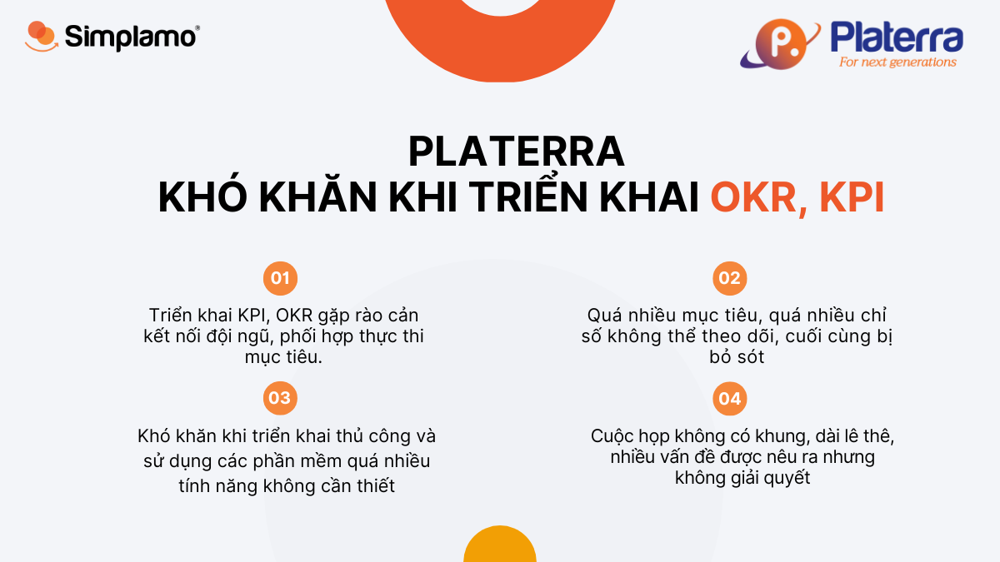
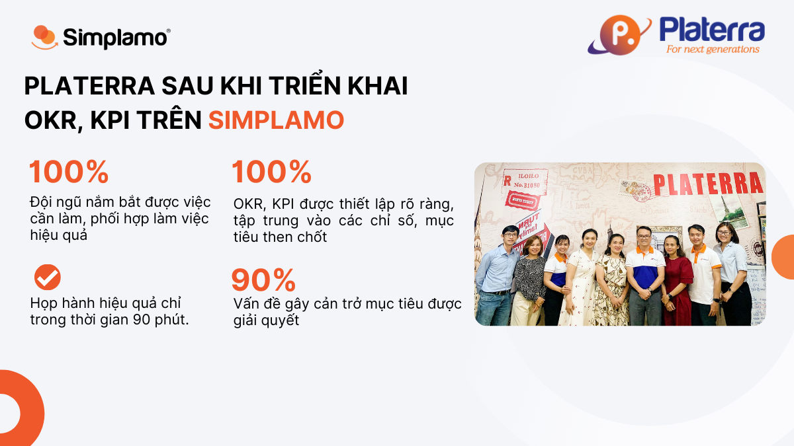
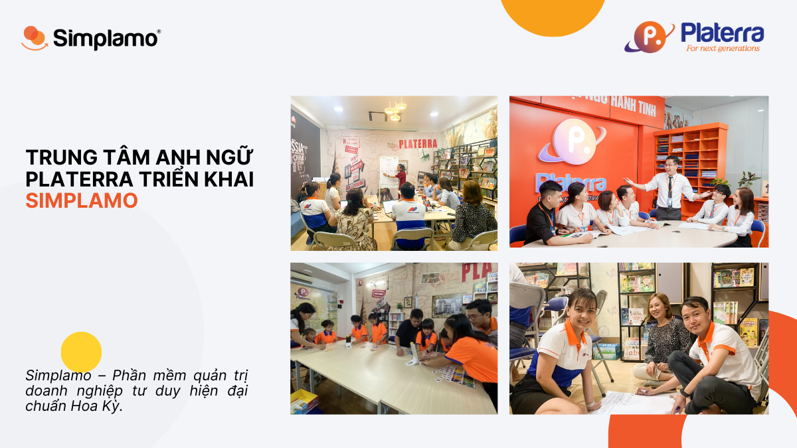

Hệ thống Trung tâm Ngoại ngữ Hành Tinh được thành lập vào tháng 3 năm 2009 nhằm mang đến cho các em thiếu nhi, học sinh, sinh viên, người lao động các chương trình học ngoại ngữ tối ưu bằng các phương pháp tiên tiến nhất, trong điều kiện cơ sở vật chất đạt tiêu chuẩn, đáp ứng nhu cầu ngày càng cao của học viên, đảm bảo đạt kết quả cao nhất trong việc phát triển kỹ năng ngoại ngữ, dễ dàng vượt qua các kỳ thi lấy bằng cấp quốc tế như: Cambridge, TOEIC, TOEFL…

## **1. Platerra – Xây dựng doanh nghiệp, mục tiêu thì nhiều hiện thực mới khó**

Với niềm đam mê trong lĩnh vực đào tạo, Anh Trương Nguyễn Mạnh Cương – Founder Platerra đã không ngừng phát triển hệ thống trung tâm anh ngữ Platerra. Hiện tại trung tâm anh ngữ Platerra có hơn 3.500 học viên mỗi năm với 3 cơ sở đang được vận hành tại TP Hồ Chí Minh.

Với hành trang nhiều năm giữ vai trò quản lý lãnh đạo tại nhiều công ty lớn, anh Cương nhận thấy vẫn chưa đủ để bản thân xây dựng một doanh nghiệp đạt được các mục tiêu kinh doanh như kỳ vọng. Một số thách thức Platerra gặp phải lúc bấy giờ:

- **Rào cản kết nối đội ngũ:** Quá trình triển khai **OKR, KPI** với những trăn trở làm thế nào để kết nối các thành viên trong tổ chức cùng làm việc với nhau, mọi người cùng phối hợp thực thi hiệu quả.
- **Khó khăn khi triển khai thủ công:** Ban đầu anh Cương loay hoay trong việc tìm kiếm các công cụ, áp dụng một cách thủ công nhưng không hiệu quả lại tốn nhiều thời gian. Sau đó là các bất cập trong việc **sử dụng các phần mềm triển khai OKR, KPI quá nhiều tính năng**, nhưng không biết điều gì cần tập trung khiến cho mọi thứ trở nên **phức tạp**.

*“Nó giống như chúng ta đang khoác một chiếc áo quá rộng và chúng ta không sử dụng hết các tính năng và làm cho mọi thức phức tạp hơn”\_ **Mr. Trương Nguyễn Mạnh Cương** chia sẻ.*

- **Có quá nhiều mục tiêu không thể theo dõi hết, bị bỏ sót:**Sau khi triển khai cho đội ngũ, Platerra không có công cụ để theo dõi,  đánh giá mục tiêu, chưa kể đến có quá nhiều vấn đề phát sinh trong quá trình triển khai làm ảnh hướng đến tiến độ.

Thực tế các doanh nghiệp dành nhiều thời gian để lên cho mình một kế hoạch với nhiều mục tiêu đáng để theo đuổi, thế nhưng việc có quá nhiều mục tiêu khiến cho doanh nghiệp không thể tập trung vào những điều quan trọng, theo thời gian các mục tiêu bị bỏ quên. Một thực trạng mà anh Cương cũng thừa nhận, đó chính việc đánh giá các chỉ số rất “cảm tính”, không có công cụ để đo lường là nguyên nhân của việc thiếu đi các đánh giá khách quan. Từ đó cũng không có được các biện pháp để cải thiện kịp thời.

- Cuộc họp là điều không thể bỏ qua, nhưng lại không có một định khung nhất định, khiến cho việc họp mất rất nhiều thời gian, đội ngũ áp lực trong họp hành và cũng không giải quyết được vấn đề.

## **2. Simplamo – Công cụ đúng thời điểm giúp Platerra vượt khó thành công**

Với cơ duyên được đội ngũ Simplamo giới thiệu, Anh Trương Nguyễn Mạnh Cương bắt đầu áp dụng Simplamo vào trong doanh nghiệp từ tháng 7 năm 2022. Đến thời điểm hiện tại anh nhận thấy một số thay đổi như:

- **Minh bạch, rõ ràng ở quy trình vận hành:** Thông qua **Sơ đồ trách nhiệm** trên Simplamo, đội ngũ Platerra chủ động nắm rõ được công việc cần làm, nhận thức được cần phối hợp với ai để hoàn thành nhiệm vụ. Bên cạnh đó đội ngũ thấu hiểu được tầm nhìn sứ mệnh của chủ doanh nghiệp, **mục tiêu** không còn là mong muốn của ban lãnh đạo mà giờ đây có đội ngũ cùng đồng hành và cố gắng.
- **OKR, KPI** **được thiết lập rõ ràng, tập trung** vào điều quan trọng, phù hợp với mỗi phòng ban, mỗi cá nhân. **“LESS IS MORE”** đôi khi ít hơn là nhiều hơn, mang lại hiệu quả hơn.

*“Simplamo giúp doanh nghiệp làm rõ vai trò trách nhiệm ở từng cá nhân, đưa tầm nhìn của mình đến đội ngũ, phân rã xuống mục tiêu quý, công việc cần làm hàng tuần kết hợp với khung cuộc họp tuần giải quyết vấn đề. Nhờ đó, việc theo dõi thực thi mục tiêu hiệu quả hơn trước rất nhiều.”*

- **Khung cuộc họp gắn kết, bám sát thực thi hiệu quả:** Thông thường các mục tiêu được thiết lập nhưng sau đó chúng bị lãng quên và bỏ trôi là trường hợp của nhiều doanh nghiệp không chỉ riêng Platerra. Simplamo không chỉ giúp Platerra tập trung vào các mục tiêu quan trọng bên cạnh đó còn kết hợp khung cuộc họp tuần để đội ngũ ngồi lại review quá trình thực thi, kịp thời hiệu chỉnh mục tiêu phù hợp với bối cảnh hiện tại.
- **Phương pháp giải quyết vấn đề hiệu quả:** Phương pháp giải quyết vấn đề một cách khoa học, giúp đội ngũ Platerra giải quyết được các vấn đề gây cản trở trong quá trình thực thi và giúp mọi người ra quyết định để chốt phương án giải quyết.

“Thông thường chúng ta hay bị sa đà vào quá trình thảo luận vấn đề nhưng cuối cùng không chốt được phương án, sau đó chúng ta lướt qua và thảo luận các vấn đề khác. Chính vì vậy các vấn đề tồn đọng không được giải quyết sẽ ngày càng nhiều.” – **Anh Trương Nguyễn Mạnh Cương** chia sẻ.

## ***3. Triển khai OKR, KPI thành công đi đôi với việc củng cố đội ngũ khỏe mạnh***

Đ*ằng sau việc sử dụng các phương pháp quản trị mục tiêu còn là vấn đề **kết nối đội ngũ**, **giải quyết vấn phát sinh** và điều đặc biệt là làm cho mọi người **đồng lòng** cùng hướng tới một đích đến chung. Tuy nhiên để một doanh nghiệp đạt được mục tiêu, đây không chỉ là bài toán của người làm chủ, điều này cần sự đồng lòng niềm đam mê cống hiến của cả một đội ngũ, của cả một tập thể.*

Trong dịp gặp gỡ tại sự kiện về Hiện Thực Hóa Mục Tiêu, anh Trương Nguyễn Mạnh Cương tâm sự một số thành tựu mà anh và cả doanh nghiệp đạt được sau khi áp dụng Simplamo:

- Các chỉ số **OKR, KPI rất khoa học rõ ràng, giúp đội ngũ dễ dàng bám sát đo lường tiến độ.**
- Đội ngũ rất **nhận thức**, **tin tưởng** công việc việc mình làm.
- Họp hành hiệu quả chỉ trong thời gian **90 phút, mặc dù không tham gia vào cuộc họp nhưng anh Cương vẫn nắm được thông tin do hệ thống ghi nhận.**
- Minh bạch trong vai trò trách nhiệm, các phòng ban, cá nhân phối hợp thực thi mục tiêu hiệu quả.
- Kịp thời quan sát tình hình hoạt động của đội ngũ.

*“Simplamo giúp mình định hình lại tổ chức, giáo dục nhận thức của đội ngũ, nhân viên bắt đầu tự giác khi nắm rõ công việc của mình, trách nhiệm khi cảm thấy rằng bản thân là một phần của tổ chức.” – Anh Trương Nguyễn Mạnh Cương chia sẻ.*

Hy vọng với sự đồng hành của Simplamo trong thời gian tới sẽ giúp Platerra thành công hơn trong quá trình triển khai OKR, KPI, giúp doanh nghiệp hiện thực mục tiêu kinh doanh và một đội ngũ khỏe mạnh, đồng lòng.

—————————————————

[Simplamo](http://simplamo.com/) – Phần mềm quản trị mục tiêu khoa học hiện đại, kết hợp độc đáo giữa KPI, OKR. Biến mọi thứ phức tạp trong điều hành trở nên đơn giản và gần gũi đến từng nhân viên. Giải phóng áp lực cho nhà lãnh đạo, tập trung vào điều quan trọng, tối ưu hiệu suất làm việc cho doanh nghiệp.

Hãy bắt đầu trải nghiệm Simplamo và cảm nhận sự thay đổi chỉ sau 4 tuần!

Đăng ký nhận buổi demo Simplamo tại: <https://app.simplamo.com/sign-up>

