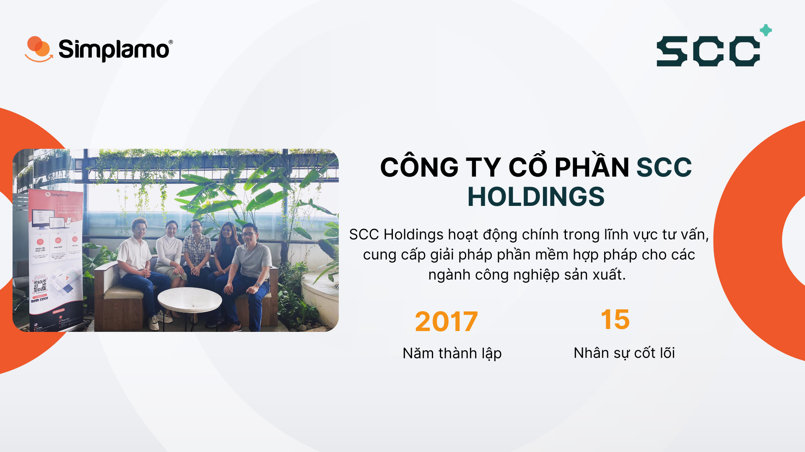
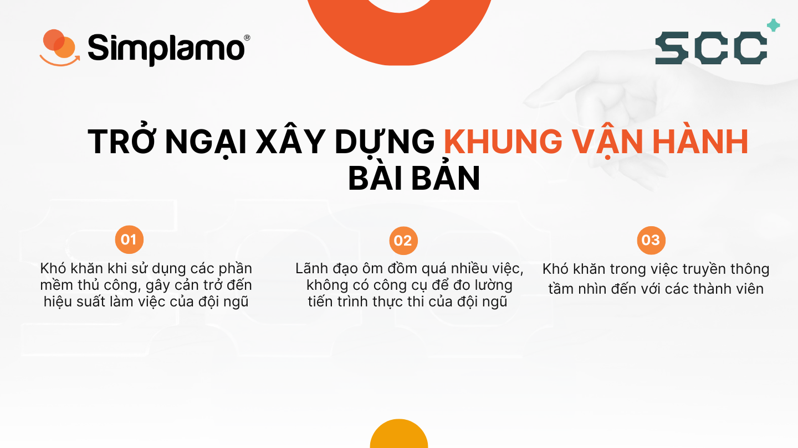
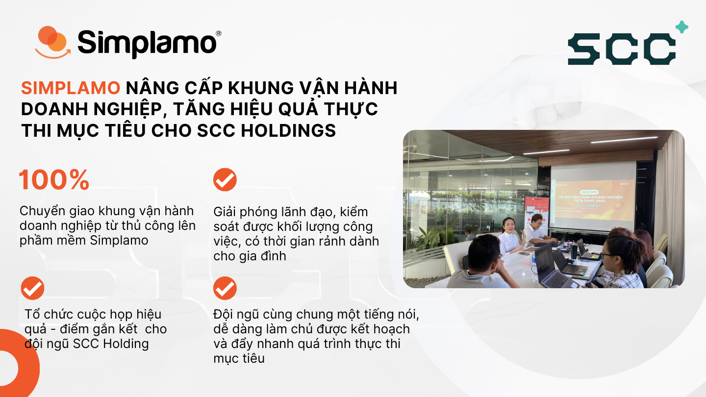
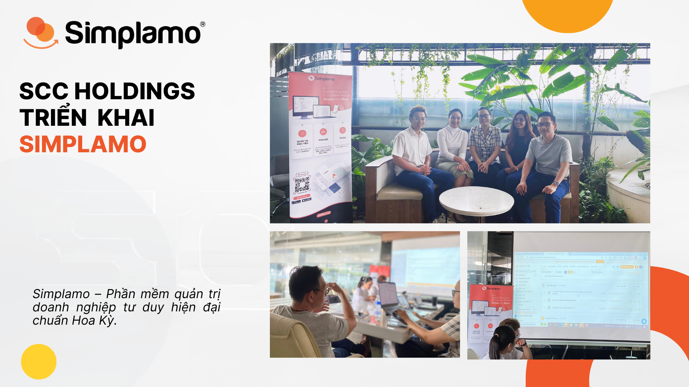
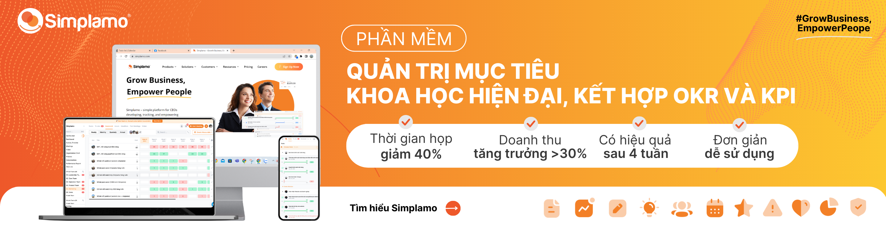

*SCC Holdings hoạt động trong lĩnh vực tư vấn, cung cấp giải pháp phần mềm hợp pháp cho các công ty sản xuất. Bên cạnh đó SCC Holdings còn có nhiều năm kinh nghiệm trong việc tư vấn giải pháp CAD/CAM/CAE sao cho phù hợp nhất với nhu cầu sản xuất của các doanh nghiệp. Hiện nay, SCC Holdings tập trung vào 6 ngành công nghiệp trọng điểm đang phát triển một cách mạnh mẽ tại thị trường Việt Nam (Ô tô – Xe máy, Hàng không vũ trụ, Điện tử…)*

## **I. Xây dựng khung vận hành bài bản bắt gặp những trở ngại**

Nắm bắt được tầm quan trọng của một **khung vận hành bài bản** trong doanh nghiệp, Anh Huỳnh Ích Xuyên – Founder SCC Holding đã quyết tâm xây dựng khung vận hành nhằm nâng cao nội lực quản trị cho tổ chức. Nhưng việc triển khai các công cụ thủ công khiến anh gặp khó khăn trong việc chuẩn hóa, theo dõi tiến trình và chuyển giao tư duy quản trị xuống cho đội ngũ.

Các khó khăn anh Xuyên gặp phải lúc bấy giờ:

- **Không có công cụ** cập nhật số liệu kịp thời, đo lường tiến trình thực thi và cung cấp một góc nhìn tổng quan để đưa ra các quyết định chính xác. Đội ngũ của anh cũng không có một mẫu chung để làm theo và hình thành nên tính kỷ luật. Các sai sót trong quản trị rất dễ xảy ra và điều đó làm giảm tốc độ cũng như hiệu quả trong kinh doanh.
- **Khó khăn trong quá trình “nhân bản”:** Một tổ chức hoạt động trơn tru và hiệu quả là khi mọi người nói cùng chung một ngôn ngữ và đồng lòng với mục tiêu chung. Anh Xuyên thấu hiểu được tầm quan trọng của việc này nhưng bài toán khó của anh là làm sao để đội ngũ hiểu được cách của anh đang vận hành tổ chức và cùng chung góc nhìn với anh.
- **Áp lực trên vị trí người làm chủ:** phải gánh vác trên vai một doanh nghiệp và áp lực trong guồng quay công việc khiến anh Xuyên không còn thời gian cho bản thân. Anh luôn mong muốn tìm kiếm một phần mềm tối ưu quá trình vận hành doanh nghiệp, giúp đội ngũ thực thi mục tiêu thành công, anh có nhiều thời gian dành cho gia đình nhiều hơn.

## II. Simplamo **nâng cấp khung vận hành doanh nghiệp, tăng hiệu quả thực thi mục tiêu cho SCC Holdings**

Bằng việc giải đáp được các khó khăn và mong đợi của mình, ngày 17/03/2023 vừa qua, SCC Holdings đã chính thức chuẩn hóa hệ thống vận hành doanh nghiệp trên Simplamo.

Buổi triển khai có sự tham gia hướng dẫn của chuyên gia Simplamo đã giúp đội ngũ ban lãnh đạo SCC chuẩn hóa các dữ liệu trên phần mềm, giải thích tư duy quản trị, kéo mọi người lại cùng chung góc nhìn với chủ doanh nghiệp:

### **1. Hoàn thiện sơ đồ trách nhiệm**

Chuẩn hóa và chuyển đổi sơ đồ trách nhiệm được xây dựng thủ công trên Excel lên Simplamo. Vai trò của từng thành viên được làm “sáng tỏ” đáp ứng các tiêu chí: đúng người, đúng việc và loại bỏ các mô tả phức tạp không cần thiết để đội ngũ tập trung vào vai trò cốt lõi của bản thân.

Sơ đồ trách nhiệm được thể hiện rõ trên phần mềm đã cung cấp cho đội ngũ cái nhìn đi từ tổng quan và chi tiết. Bên cạnh việc nắm rõ vai trò của bản thân, mỗi thành viên còn biết được cần phối hợp với ai để hoàn thành tốt công việc, từ đó nâng cao trách nhiệm trong toàn tổ chức.

### **2. Xây dựng chiến lược kinh doanh năm**

Chiến lược kinh doanh năm 2023 được xây dựng trên khung chuẩn của Simplamo và chia sẻ đến toàn bộ đội ngũ, giúp mọi thành viên hình dung được bức tranh toàn diện 2023. Đây là nền tảng để doanh nghiệp tiến hành xây dựng và thực thi mục tiêu quý có cơ sở, không làm việc và đưa ra các quyết định dựa trên “cảm tính”.

### **3. Xây dựng mục tiêu ưu tiên quý 2**

Các mục tiêu ưu tiên quý 2 của SCC qua đó cũng được thống nhất dưới sự hướng dẫn của chuyên gia Simplamo. Các mục tiêu được cụ thể hóa bằng các mốc milestone, có khả thi, giúp tăng tính chủ động cho đội ngũ và luôn được theo sát không bị bỏ lỡ. Bên cạnh việc làm rõ các khúc mắc trong việc xây dựng mục tiêu, buổi triển khai đã ghi nhận các ý kiến của từng cá nhân về mục tiêu của mình, tạo nên tính đóng góp và sự đồng thuận cao vì sự phát triển của doanh nghiệp.

### **4. Hoàn thiện bảng chỉ số đo lường sức khỏe của doanh nghiệp hàng tuần**

Với sự hướng dẫn và cách đặt câu hỏi khéo léo của chuyên gia, đội ngũ SCC làm rõ các chỉ số quan trọng cần đo lường hàng tuần để ban lãnh đạo nắm được những hoạt động cốt lõi của doanh nghiệp, giúp ban lãnh đạo trao đổi rõ ràng và liên tục về tình hình của doanh nghiệp. Từ đó đưa ra các quyết định thông minh và đúng đắn hơn dựa trên tình hình thực tế của tổ chức ở thời điểm hiện tại.

### **5. Tổ chức cuộc họp tuần phá bỏ rào cản giao tiếp giữa các thành viên**

*Phần chia sẻ tin tốt trong khung cuộc họp tuần – điểm kết nối đội ngũ, xóa bỏ khoảng cách giữa các thành viên SCC*

Ngày 10/4 chuyên gia Simplamo đã tiếp tục hướng dẫn đội ngũ ban lãnh đạo SCC triển khai cuộc họp hàng tuần. Khi chia sẻ là rào cản của mọi người trong cuộc họp, cuộc họp hàng tuần 7 bước trên Simplamo bước đầu đã tháo gỡ các trở ngại về giao tiếp trong đội ngũ SCC.

***Một nghiên cứu của Deloitte cho thấy 70% nhân viên trong một loạt các ngành nghề “thừa nhận đã giữ im lặng về các vấn đề ảnh hưởng đến hiệu suất.”***

Một trong những cách tốt nhất để khuyến khích mọi người **thẳng thắn** là giúp mọi người thấy rằng những người lên tiếng vẫn bình an vô sự. Cuộc họp trên Simplamo “bắt đầu với một tin tốt”, nghe có vẻ đơn điệu với Sếp và kể cả những thành viên trong môi trường công sở. Tuy nhiên, trong buổi triển khai, đội ngũ Simplamo đã nhìn thấy rõ rằng đây mới chính là chìa khóa giúp các thành viên của SCC có được tâm lý thoải mái, cởi mở nhiều hơn. Nếu như để nói trung tâm cuộc họp nằm ở phần giải quyết vấn đề, thì có thể tưởng tượng tại phần chia sẻ “tin tốt” đầu tiên là điểm giao thoa giúp các thành viên phá vỡ rào cản về khoảng cách, tâm lý thoải mái để giải quyết vấn đề mượt mà hơn.

Khi đội ngũ của anh cùng đồng lòng trong các **mục tiêu chung**, cùng cố gắng hoàn thành các **chỉ số hàng tuần** vì sự phát triển của doanh nghiệp và hơn hết là luôn **thống nhất trong cách giải quyết mọi vấn đề**, thì cũng là lúc cả tổ chức cùng nói chung một ngôn ngữ, hòa chung một nhịp đập. Với Simplamo, tư duy quản trị của anh đã nhanh chóng được cả đội ngũ thấu hiểu và nhân bản xuống dưới từng nhân viên cấp thấp nhất.

Hy vọng với khung vận hành chuẩn trên Simplamo sẽ giúp Anh Xuyên và SCC trong thời gian tới ngày một mạnh mẽ và bức phá tăng trưởng thành công như những gì cả đội ngũ đã thống nhất ở các mục tiêu năm 2023 vừa qua.

[Simplamo](https://simplamo.com/vi/) – Phần mềm quản trị mục tiêu khoa học hiện đại, kết hợp độc đáo giữa KPI, OKR. Biến mọi thứ phức tạp trong điều hành trở nên đơn giản và gần gũi đến từng nhân viên. Giải phóng áp lực cho nhà lãnh đạo, tập trung vào điều quan trọng, tối ưu hiệu suất làm việc cho doanh nghiệp.

Hãy bắt đầu trải nghiệm Simplamo và cảm nhận sự thay đổi chỉ sau 4 tuần!

Đăng ký nhận buổi demo Simplamo tại: <https://app.simplamo.com/sign-up>

