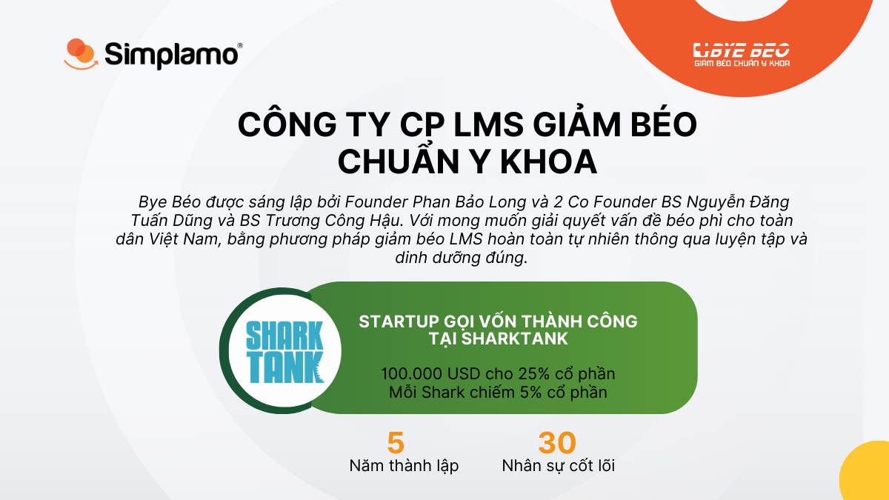
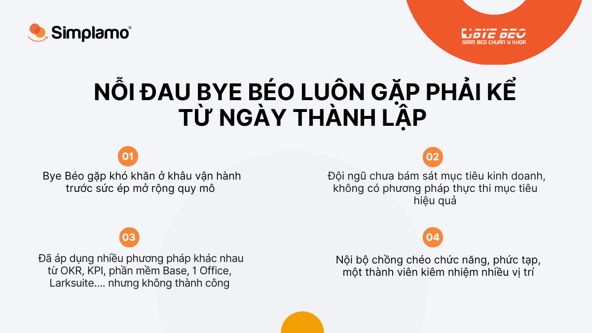
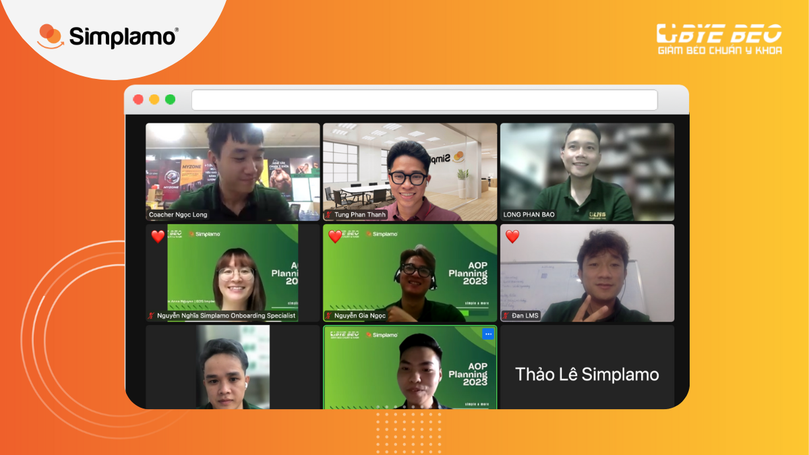
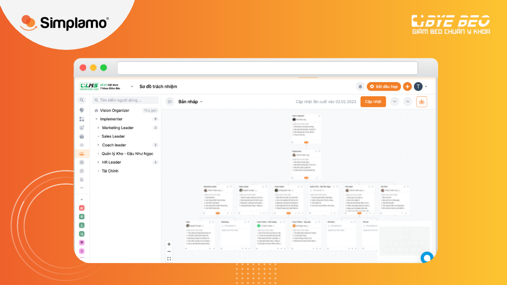
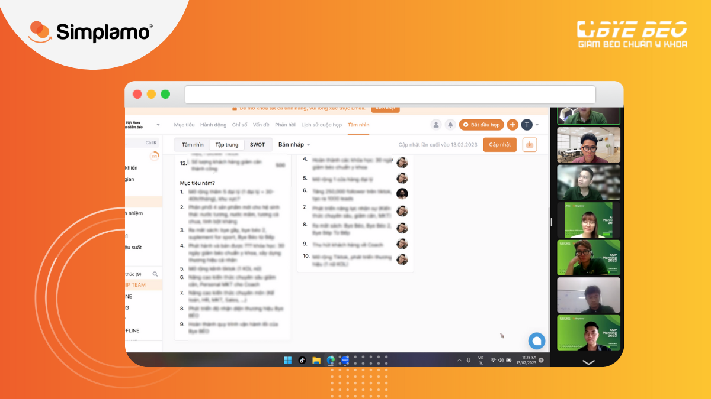
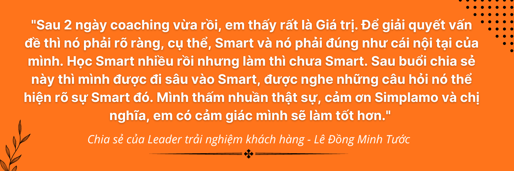
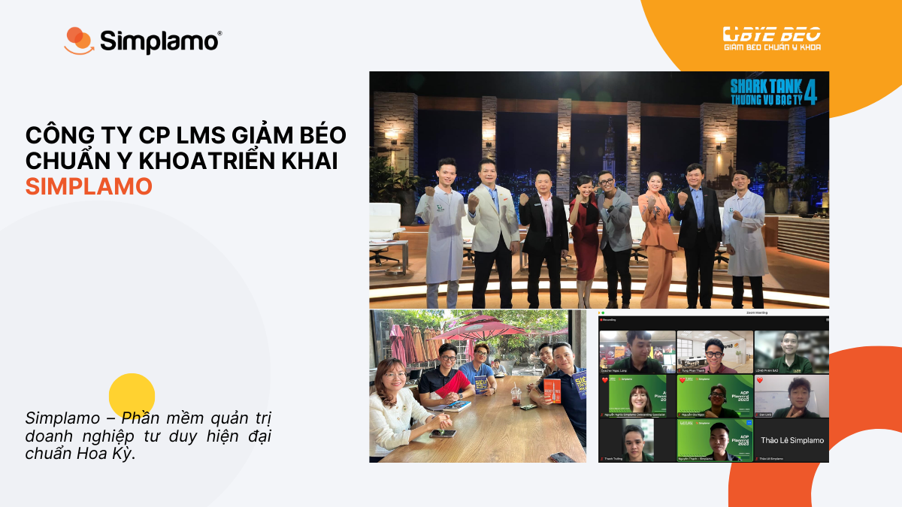
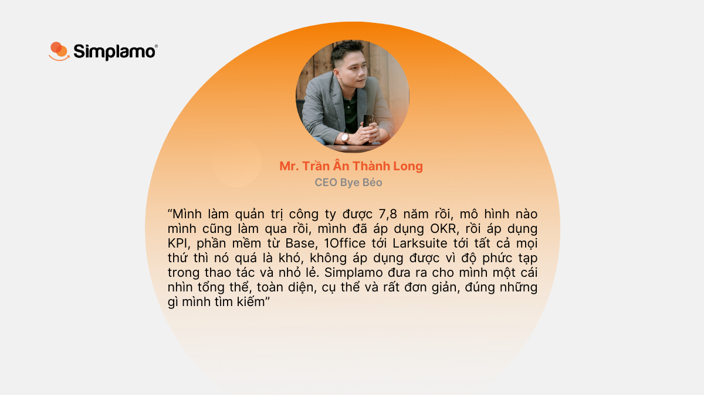

“Mình làm quản trị công ty được 7,8 năm rồi, mô hình nào mình cũng làm qua rồi, mình đã áp dụng **OKR, rồi áp dụng KPI, phần mềm từ Base, 1Office tới Larksuite** tới tất cả mọi thứ thì nó quá là khó, không áp dụng được vì độ **phức tạp** trong thao tác và nhỏ lẻ. **Simplamo** đưa ra cho mình một cái nhìn **tổng thể, toàn diện, cụ thể và rất đơn giản**, đúng những gì mình tìm kiếm” – Chia sẻ đầy chân thành của CEO Bye Béo Trần Ân Thành Long.

## **1. Start-up Bye Béo – Chinh phục Shark Tank bởi công nghệ giảm cân ấn tượng**

Bye Béo được sáng lập bởi Founder Phan Bảo Long và 2 Co-Founder BS Nguyễn Đăng Tuấn Dũng và BS Trương Công Hậu. Với mong muốn giải quyết vấn đề béo phì cho toàn dân Việt Nam bằng phương pháp giảm béo LMS hoàn toàn tự nhiên thông qua luyện tập và dinh dưỡng đúng.

Bye Béo đã xuất hiện trong chương trình Shark Tank mùa 4, thành công với màn gọi vốn ấn tượng cùng 5 cái gật đầu từ bể cá mập, các Shark đưa ra đề nghị đầu tư 100.000 USD cho 25% cổ phần, mỗi Shark chiếm 5% cổ phần.

## **2. Nỗi đau Bye Béo luôn gặp phải kể từ ngày thành lập**

Với những tiếng vang từ chương trình Shark Tank, Bye Béo có được lượng lớn khách hàng, đặc biệt trên nền tảng mạng xã hội và gần đây là nhu cầu khách hàng offline cũng tăng ngày càng cao, cần mở rộng quy mô tổ chức để đáp ứng.

Kéo theo đó là những khó khăn trong khâu vận hành ngày càng rõ nét và quá tải, nội bộ chồng chéo chức năng, một người ngồi nhiều vị trí, áp lực cho đội ngũ ban lãnh đạo, không có phương pháp thực thi mục tiêu hiệu quả.

[<https://simplamo-cdn.simplamo.com/wp-content/uploads/2023/02/CEO-Tran-An-Thanh-Long-1.mp4>](https://simplamo-cdn.simplamo.com/wp-content/uploads/2023/02/CEO-Tran-An-Thanh-Long-1.mp4?_=1)

Chia sẻ của CEO Trần Ân Thành Long trong buổi triển khai Simplamo

Bye Béo đã áp dụng nhiều phương pháp khác nhau từ **OKR, KPI, phần mềm Base, 1Office, Larksuite...** nhưng vẫn không thành công, vì quá phức tạp và không chuyển giao được cho đội ngũ.

Vô tình biết đến Simplamo tại sự kiện Shark Tank Forum 5, chủ tịch Phan Bảo Long rất ấn tượng bởi tư duy quản trị của Simplamo, đơn giản đến mức đáng ngạc nhiên, dễ hiểu và tập trung vào con người. Sau buổi gặp gỡ đầu tiên với Simplamo, anh đã bị thuyết phục ngay lập tức, đây chính xác là điều anh luôn tìm kiếm và quyết định áp dụng ngay sau đó.

## 3. Cuộc truy tìm chìa khóa vận hành đơn giản, xóa bỏ sự hỗn loạn của Bye Béo đã có lời giải từ Simplamo

### a, Coaching buổi 1 cùng chuyên gia trong cơ cấu lại tổ chức bằng sơ đồ trách nhiệm và lên kế hoạch mục tiêu năm 2023

Ngày 13/02/2023 diễn ra buổi **Kick Off** dự án vận hành doanh nghiệp trên Simplamo cùng sự hướng dẫn của chuyên gia Nguyễn Thị Nghĩa.

Với những thách thức mà Bye Béo đang gặp phải, chuyên gia của Simplamo đã từng bước gỡ rối thông qua việc định hướng tư duy quản trị đơn giản, khoa học và cách áp dụng quản trị trên phần mềm bằng thao tác dễ hiểu, đơn giản.

Đội ngũ ban lãnh đạo Bye Béo trong ngày triển khai dự án Simplamo

Đầu tiên là **Sơ đồ trách nhiệm**: làm rõ bức tranh toàn cảnh, cơ cấu hiện tại của Bye Béo, gói lại với **5 vai trò trở xuống** cho từng vị trí, cách định hướng vai trò cốt lõi cho từng vị trí, thật ngắn gọn và thật trọng tâm. Thông qua đó, mỗi nhân viên hiểu rõ nội tại của tổ chức, **CEO** đang ngồi rất nhiều vị trí **bị quá tải** và cần được chia sẻ, cơ cấu lại cùng toàn thể nhân viên để ra một sơ đồ tối ưu hóa cách vận hành thông minh hơn.

Sơ đồ trách nhiệm của Bye Béo được cơ cấu lại trên Simplamo

Thứ hai là xây dựng **mục tiêu năm 2023**, các **chỉ số kỳ vọng** đội ngũ hướng tới và làm thế nào phân rã, cụ thể đúng vai trò cho từng vị trí, tất cả đều tập trung cho một bức tranh 2023 đạt hiệu quả bằng **quá trình vận hành mượt mà, đơn giản** và thúc đẩy nội lực đi xa trên con đường dài hạn phía trước.

Ban lãnh đạo Bye Béo thảo luận và thống nhất mục tiêu năm 2023

Sau buổi tư vấn đầu tiên, những điểm rối bấy lâu nay không thể giải đáp được của Bye Béo đã được làm rõ nét gần như toàn diện, điểm nghẽn cốt lõi gây ra hỗn loạn trong tổ chức đã được khai phá. **Bộ giáp Khổng lồ mang tên “Trách nhiệm”** của CEO **được tháo gỡ** từng bước một.

[<https://simplamo-cdn.simplamo.com/wp-content/uploads/2023/02/BBanlanxh-nnh.mp4>](https://simplamo-cdn.simplamo.com/wp-content/uploads/2023/02/BBanlanxh-nnh.mp4?_=2)

Cảm nhận của đội ngũ ban lãnh đạo sau ngày triển khai đầu tiên

### b, Buổi 2, Simplamo cùng Bye Béo thiết lập mục tiêu Quý và đo lường chỉ số KPI

Ngày 16/02/2023 diễn ra buổi đào tạo thứ 2 cùng chuyên gia Nguyễn Thị Nghĩa, trong buổi đào tạo đội ngũ Bye Béo được hướng dẫn cách thiết lập mục tiêu trong 2 quý đầu của năm 2023 từ kế hoạch năm đã được thiết lập trong buổi 1.

Thứ nhất là, **thiết lập mục tiêu quý** chỉ tóm gọn trong 7 mục tiêu cốt lõi của toàn công ty, tất cả các thành viên cùng thảo luận, mỗi phòng ban và thành viên có mục tiêu rõ ràng, cụ thể theo **phương pháp S.M.A.R.T.** Đặc biệt với các phòng Marketing, Sale, Coach, LMS Shop, các mục tiêu cốt lõi đều tóm gọn dưới 7, sử dụng câu khẳng định và đo lường được, **giảm thiểu thói quen làm việc nửa vời**, ai cũng nắm được việc của nhau và hiểu rõ việc của mình. Tất cả đều thao tác trên Simplamo.

Bye Béo thiết lập mục tiêu quý trên Simplamo

Tiếp đến là đặt **chỉ số KPI** từng tuần trên Scorecard: Cả đội Bye Béo dưới sự hướng dẫn của chuyên gia đã thảo luận và tính toán cho ra các con số đo lường theo từng tuần **bám sát với mục tiêu Quý**, nhưng vẫn **giữ được khoảng thở** cho sự linh hoạt của biến động thị trường. Ví dụ các chỉ số chất lượng, chỉ số số lượng, chỉ số đánh giá,... Tất cả rất cụ thể và dễ hiểu. Giúp Bye Béo đơn giản hóa để **nhanh chóng bắt tay vào thực hiện.**

[<https://simplamo-cdn.simplamo.com/wp-content/uploads/2023/02/3491125398974165524.mp4>](https://simplamo-cdn.simplamo.com/wp-content/uploads/2023/02/3491125398974165524.mp4?_=3)

Ban lãnh đạo Bye Béo chia sẻ sau ngày xây dựng Mục tiêu ưu tiên quý, chỉ số Scorecard (KPI)

Kết thúc 2 buổi đào tạo, các thành viên **Bye Béo** đã **bày tỏ sự cảm ơn sâu sắc** tới chuyên gia và Simplamo đã giúp Bye Béo thiết lập các **mục tiêu Quý và chỉ số KPI** một cách rất thông minh, **vô cùng dễ hiểu** và **cảm giác nó khả thi**. Theo chia sẻ chung, họ chưa bao giờ cảm thấy việc **lập kế hoạch khoa học** nó nhẹ nhàng mà dễ hiểu đến thế. Bây giờ, chỉ cần đặt **mục tiêu theo luồng** là được, tất cả đều được tự động trên Simplamo.

Cuộc gặp thân tình giữa Simplamo và ban lãnh đạo Bye Béo

**Tư duy quản trị** được ráp vừa khít trên Simplamo, giúp quá trình vận hành công ty thực sự hiệu quả, quan trọng lãnh đạo và nhân viên thực sự **biết mình đang làm gì, cần phải đi đâu và đi như thế nào**, bản đồ định hướng trên Simplamo đã có sẵn, doanh nghiệp không còn **hoài nghi** bị lạc trôi trong con đường mình theo đuổi, biến tầm nhìn trở thành thực tế.

Khi quản trị công ty trên [**Simplamo.com**](https://simplamo.com/), **năng lực trong việc hoàn thành mục tiêu rất dễ được nhìn thấy và sự kém hiệu quả trong bất kỳ khâu hành động nào là hoàn toàn không thể che giấu**. Minh bạch và gọn nhẹ, loại bỏ khó khăn càng nhanh càng tốt, tập trung làm điều quan trọng.

Cùng CEO **bước qua nỗi đau** **điều hành** và cảm nhận tự do cho những tham vọng phía trước, với sự giúp sức vững từ nội lực của phần mềm quản trị đơn giản Simplamo, Bye Béo tự tin mơ thêm nhiều chiến thắng khác trong con đường chinh phục **hoài bão** triệu đô của mình!

—————————————————

[Simplamo](http://simplamo.com/) – Phần mềm quản trị mục tiêu khoa học hiện đại, kết hợp độc đáo giữa KPI, OKR. Biến mọi thứ phức tạp trong điều hành trở nên đơn giản và gần gũi đến từng nhân viên. Giải phóng áp lực cho nhà lãnh đạo, tập trung vào điều quan trọng, tối ưu hiệu suất làm việc cho doanh nghiệp.

Hãy bắt đầu trải nghiệm Simplamo và cảm nhận sự thay đổi chỉ sau 4 tuần!

Đăng ký nhận buổi demo Simplamo tại: <https://app.simplamo.com/sign-up>

