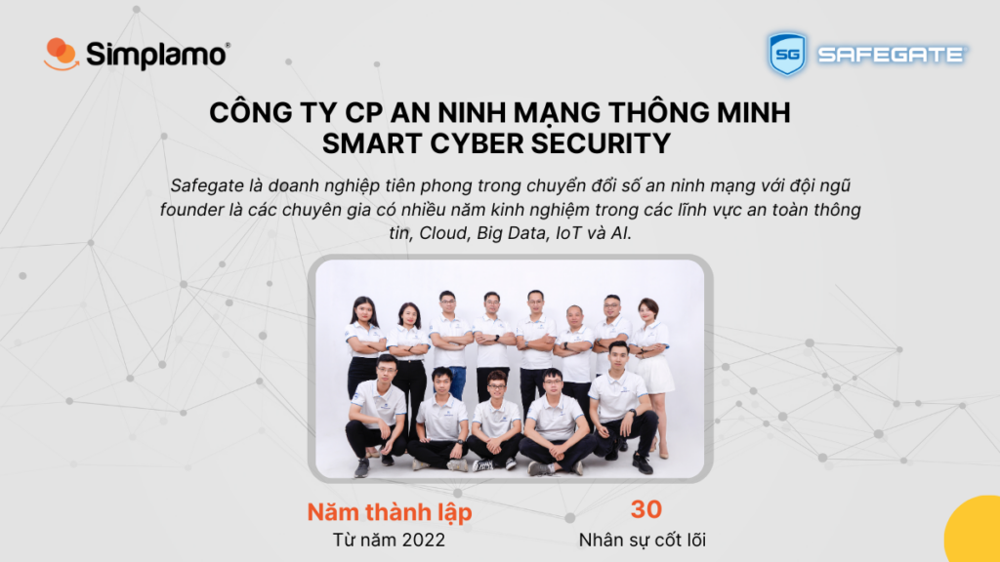
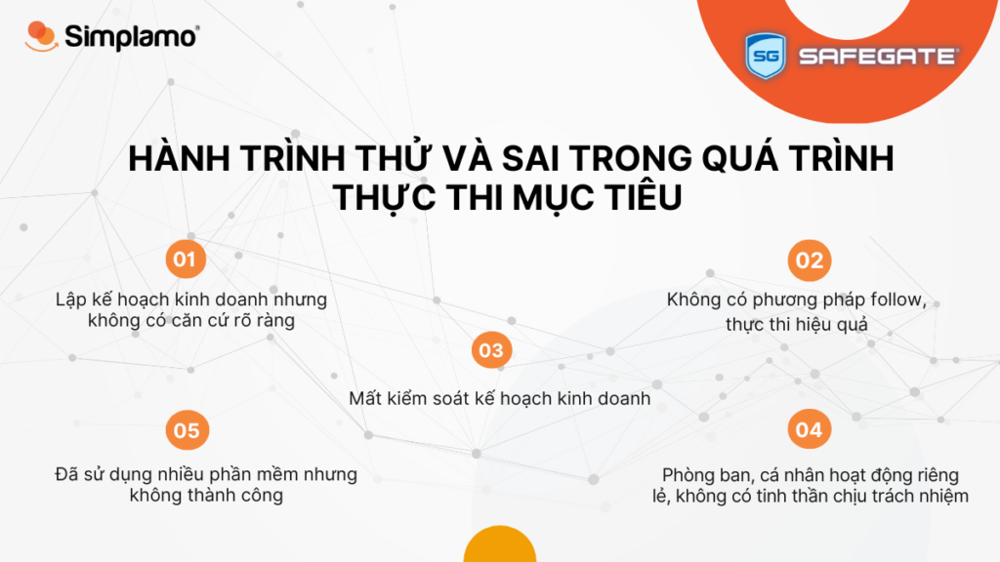
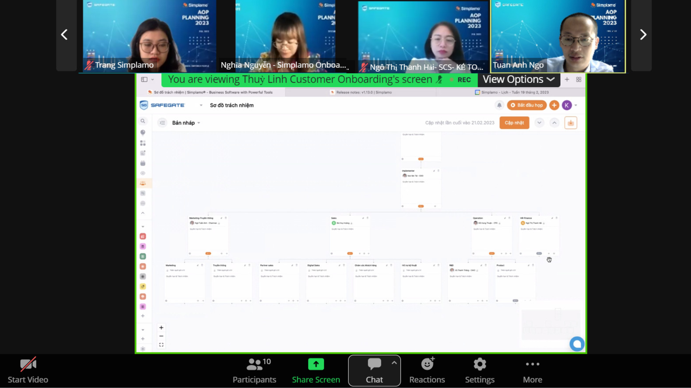
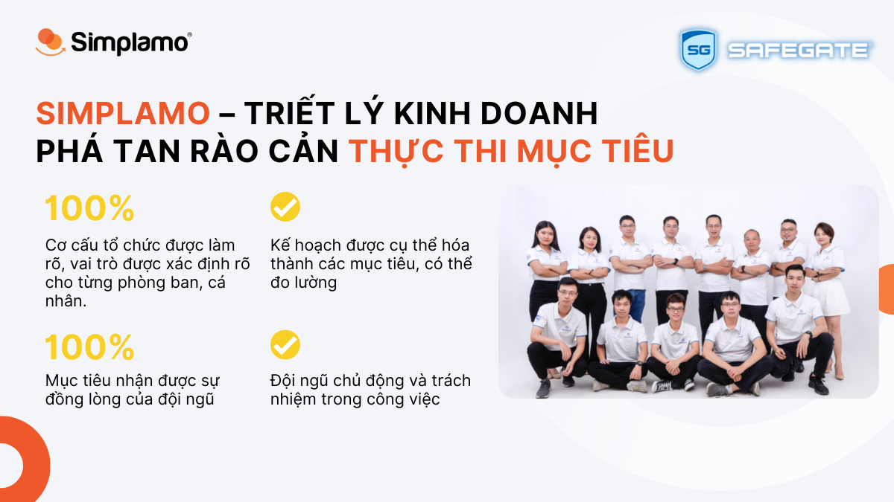
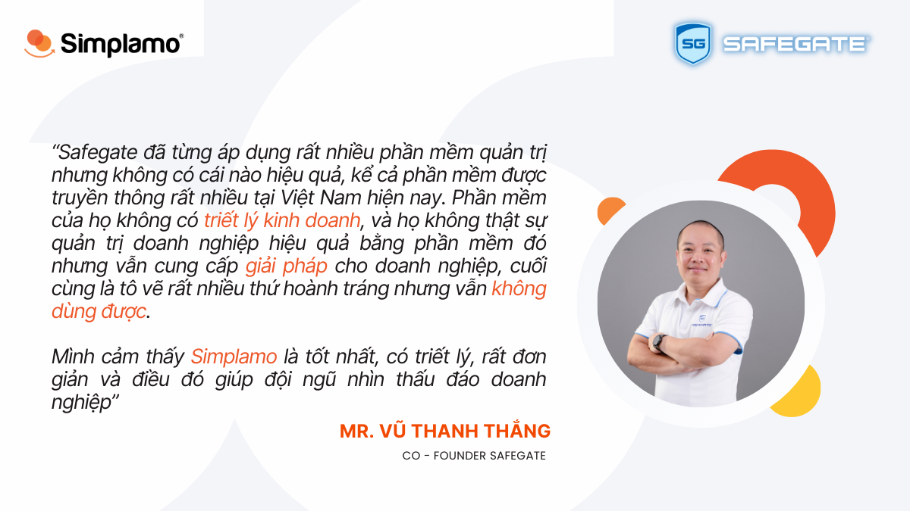

“Safegate đã từng áp dụng rất nhiều phần mềm quản trị nhưng không có cái nào hiệu quả, kể cả phần mềm được truyền thông rất nhiều tại Việt Nam hiện nay. Phần mềm của họ **không có triết lý kinh doanh**, và họ không thật sự quản trị doanh nghiệp hiệu quả bằng phần mềm đó nhưng vẫn cung cấp giải pháp cho doanh nghiệp, cuối cùng là tô vẽ rất nhiều thứ hoành tráng nhưng vẫn không dùng được.

Mình cảm thấy **Simplamo là tốt nhất, có triết lý, rất đơn giản** và điều đó giúp đội ngũ nhìn thấu đáo doanh nghiệp” – Chia sẻ của anh Vũ Thanh Thắng – Co Founder Safegate.

Chỉ với vài dòng chia sẻ của anh, nhưng Simplamo hiểu, anh và Safegate đã trải qua một hành trình rất dài với bao nhiêu hy vọng. Đó là hành trình của thử và sai nhưng thất vọng thật nhiều. Đến với Simplamo, anh cũng bắt đầu với một trạng thái do dự, Simplamo hiểu điều đó và từ từ tháo gỡ những nút thắt bằng chính sự cởi mở, đơn giản và tập trung vào điều cần thiết nhất cho doanh nghiệp.

## **1. Safegate – Hành trình thử và sai và điểm chạm với Simplamo**

Công ty cổ phần An ninh mạng thông minh – [Smart Cyber Security (Safegate)](https://safegate.vn) khởi nghiệp trong lĩnh vực an toàn thông tin với nền tảng vững chắc nhờ đội ngũ founder là các chuyên gia có nhiều năm kinh nghiệm trong các lĩnh vực an toàn thông tin, Cloud, Big Data, IoT và AI.

Safegate là doanh nghiệp tiên phong trong quá trình chuyển đổi số an ninh mạng, sở hữu đội ngũ trẻ, nhiều năng lượng và đầy khát vọng. Thách thức, khó khăn là điều mà không doanh nghiệp nào tránh khỏi, với anh Ngô Tuấn Anh – Chairman Safegate, thách thức lớn nhất mà anh gặp phải là nằm trong quá trình **THỰC THI MỤC TIÊU:**

- Lập kế hoạch kinh doanh ngẫu hứng, chưa có căn cứ rõ ràng để bám sát đúng tình hình của doanh nghiệp.
- **Không có phương pháp** follow thực thi hiệu quả, thậm chí là chìm vào quên lãng chỉ sau một tuần.
- Lập kế hoạch kinh doanh xong nhưng không có người và cách thức theo dõi, kiểm soát, dẫn đến kế hoạch năm khó thành.
- Không xác định rõ vai trò trách nhiệm trong thực thi, việc ai nấy làm, **không ai đứng ra chịu trách nhiệm**.

Là một người am hiểu về công nghệ, anh Tuấn Anh và đội ngũ của mình đã dành ra rất nhiều thời gian tìm hiểu và sử dụng nhiều phần mềm quản trị mục tiêu khác nhau, kể cả phần mềm nổi tiếng như Base, nhưng không có phần mềm nào mang lại hiệu quả thật sự. Cho đến khi tình cờ biết đến Simplamo, anh đã quyết định triển khai phần mềm chỉ sau 2 tuần gặp gỡ.

[Video chia sẻ của anh Vũ Thanh Thắng – Giám đốc phòng AI, Co-Founder](https://simplamo-cdn.simplamo.com/wp-content/uploads/2023/02/Vu-Thanh-thang-GD-phong-Ai-CCOFOUNDer-1.mp4)

Đội ngũ Safegate cùng chia sẻ trong ngày triển khai dự án.

## 2. Simplamo – Triết lý kinh doanh phá tan rào cản thực thi mục tiêu

Ngày 22/02/2023 dưới sự hướng dẫn của chuyên gia Simplamo Nguyễn Thị Nghĩa, buổi kick off triển khai sử dụng phần mềm Simplamo cho Safegate đã diễn ra rất sôi nổi. Đội ngũ đã cùng nhau tranh luận và nhận ra nhiều vấn đề trong tổ chức.

- **Sơ đồ trách nhiệm: làm rõ cơ cấu, tăng sự chủ động và trách nhiệm**

**Vai trò chồng chéo, khó khăn trong phối hợp công việc** là điểm đầu tiên mà đội ngũ Safegate cần phải thay đổi trước khi đến với các mục tiêu kinh doanh của năm 2023. Chuyên gia Simplamo đã đưa Safegate về với những gì cơ bản nhất của một doanh nghiệp, đó là để ra được một cơ cấu đúng, chúng ta cần dựa vào hành trình đến và đi của một khách hàng thông qua 3 chức năng cơ bản: **Sale & MKT/ Vận hành/ Finance&HR.**

Chốt được cơ cấu, đội ngũ cùng nhau thảo luận để đưa ra **5 vai trò quan trọng nhất** cho từng vị trí, có tranh luận thì mới có sự thấu hiểu. Bằng cách nhìn ngắm lại và làm rõ mọi vị trí trên một mặt phẳng, đội ngũ Safegate nhận ra nhiều điều mà mình đã bỏ lỡ suốt thời gian vừa qua.

Chuyên gia Simplamo hướng dẫn tư duy xây dựng Sơ đồ trách nhiệm cho Safegate.

- **Xây dựng kế hoạch năm 2023 – cụ thể và có thể đạt được**

Cái hay của Simplamo là biến những thứ phức tạp thành những thứ đơn giản, và biến những thứ xa vời thành gần trong tầm tay. Chuyên gia Simplamo đã cùng đội ngũ của Safegate làm rõ những mong đợi bằng **những con số cụ thể nhất**. Phải cụ thể, phải đo lường được và hình dung được mình sẽ làm gì thì đó mới là một mục tiêu có khả năng đạt được, còn không, đó chỉ là một lời tuyên bố sáo rỗng.

Với cách đặt câu hỏi vào đúng trọng tâm và khai thác ý kiến từ đội ngũ của chuyên gia Simplamo, Safegate đã làm rõ các mục tiêu mình mong muốn trong năm 2023. Ở đó mọi mục tiêu đều được **sự đồng lòng của đội ngũ**, và ai nấy đều hình dung ra được phòng ban của mình sẽ làm gì ngay khi kết thúc cuộc họp này.

*“Mục tiêu viết ngắn gọn, đơn giản mà dễ hiểu mới thật sự là khó, còn viết dài dòng thì ai cũng viết được” – Chia sẻ từ chị Nghĩa – chuyên gia Simplamo trong buổi triển khai.*

[Video chia sẻ của anh Ngô Tuấn Anh – Chairman Safegate](https://simplamo-cdn.simplamo.com/wp-content/uploads/2023/02/Chairman-Ngo-Tuan-Anh.mp4)

Anh Ngô Tuấn Anh – Chairman Safegate chia sẻ sau buổi triển khai Simplamo.

Qua buổi triển khai đầu tiên, đội ngũ Safegate rất ấn tượng với triết lý đơn giản, các công cụ hỗ trợ và phương pháp họp định kỳ của Simplamo, họ tin tưởng với những gì mà Simplamo mang đến sẽ giúp Safegate xây dựng, bám sát và thực thi mục tiêu thành công.

Chuyên gia Simplamo sẽ cùng đồng hành với Safegate trong thời gian tới để đưa triết lý quản trị về sát với cuộc họp hàng tuần và công việc hàng ngày.

Hy vọng với sự đồng hành của đội ngũ Simplamo trong chặng đường tiếp theo sẽ giúp Safegate quản trị doanh nghiệp hiệu quả, xóa bỏ các thách thức trong vận hành và đạt được các kỳ vọng trong kinh doanh.

[Video chia sẻ của anh Đỗ Hưng Thuận – CTO, Founder Safegate](https://simplamo-cdn.simplamo.com/wp-content/uploads/2023/02/Video-Train-khach-hang.mp4)

Anh Đỗ Hưng Thuận – CTO – Founder Safegate chia sẻ sau buổi triển khai Simplamo.

—————————————————

[Simplamo](http://simplamo.com/) – Phần mềm quản trị mục tiêu khoa học hiện đại, kết hợp độc đáo giữa KPI, OKR. Biến mọi thứ phức tạp trong điều hành trở nên đơn giản và gần gũi đến từng nhân viên. Giải phóng áp lực cho nhà lãnh đạo, tập trung vào điều quan trọng, tối ưu hiệu suất làm việc cho doanh nghiệp.

Hãy bắt đầu trải nghiệm Simplamo và cảm nhận sự thay đổi chỉ sau 4 tuần!

Đăng ký nhận buổi demo Simplamo tại: <https://app.simplamo.com/sign-up>

