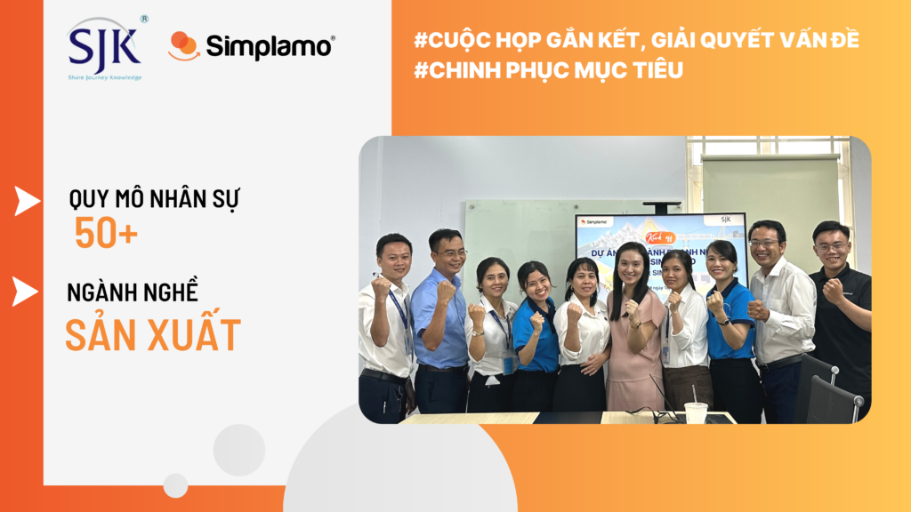
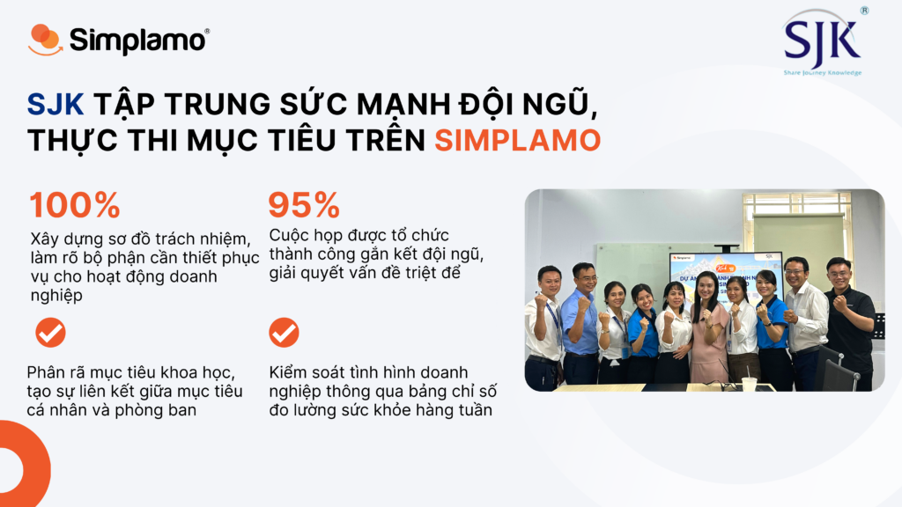
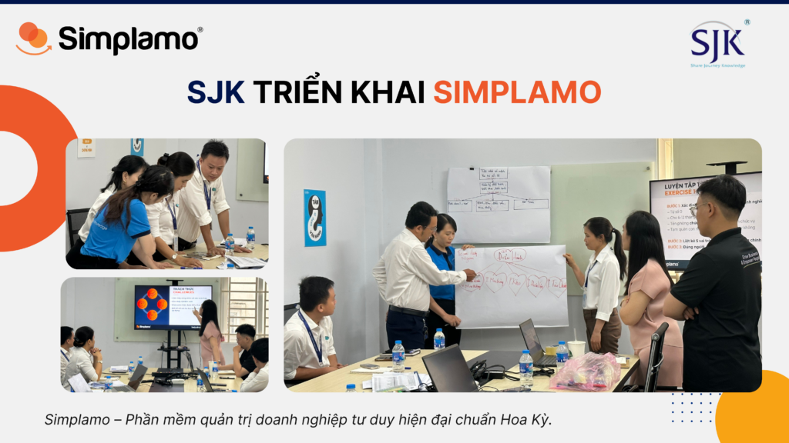

[Công ty cổ phần đầu tư SJK](https://simplamo.com/wp-content/uploads/2023/10/sjk.vn) chuyên sản xuất và cung cấp các vật tư phụ kiện phục vụ xây dựng, thiết bị xây dựng, nguyên vật liệu trong thi công xây dựng dân dụng, công nghiệp, vật tư phụ M&E. Với chiến lược trở thành công ty hàng đầu trong lĩnh vực Phân phối sỉ & lẻ các loại vật tư, thiết bị, nguyên vật liệu trong xây dựng, SJK đặt mục tiêu lấy chất lượng, tiến độ, sự hài lòng của khách hàng làm nền tảng cho sự phát triển.

*Trong lộ trình phát triển của doanh nghiệp ở thời gian tới, anh Nguyễn Anh Quốc – CEO SJK mong muốn giúp đội ngũ có phương pháp thực thi mục tiêu hiệu quả, thúc đẩy đôi ngũ chinh phục các mục tiêu lớn hơn của doanh nghiêp, quan trọng hơn là mở rộng hệ sinh thái của mình.*

## 1. CEO mong muốn trao quyền, nhưng đội ngũ gặp khó khăn khi thiếu công cụ gắn kết, làm chủ mục tiêu

SJK có một nguồn lực mạnh mẽ với đội ngũ có tinh thần nhiệt huyết và chủ động trong công việc. Ở thời điểm hiện tại anh Quốc mong muốn có một phần mềm giúp tập trung sức mạnh của cả đội ngũ, phát huy nguồn lực sẵn có để chinh phục các mục tiêu trong thời gian tới. Sau đây là một số điều anh kỳ vọng:

- Một mô hình vận hành chuẩn chỉnh giúp doanh nghiệp hoạt động trơn tru, mở rộng hệ sinh thái.
- Có phương pháp trao quyền cho đội ngũ để ban lãnh đạo có thời gian làm điều quan trọng.
- Công cụ giúp gắn kết đội ngũ và giúp các phòng ban phối hợp làm việc khoa học cùng chinh phục mục tiêu.
- Phương pháp giải quyết vấn đề  một cách triệt để, với tư duy khoa học.

## 2. SJK tập trung sức mạnh đội ngũ, thực thi mục tiêu dựa trên Simplamo

Sau một khoảng thời gian tìm hiểu, anh Nguyễn Anh Quốc nhận thấy Simplamo là phần mềm đáp ứng đầy đủ các kỳ vọng của mình. Anh Quốc quyết định triển khai Simplamo vào ngày 18.09.2023.

Đội ngũ chuyên gia Simplamo đã hỗ trợ SJK củng cố mô hình vận hành, tập trung năng lượng, gắn kết đội ngũ cùng chinh phục mục tiêu, thông qua các công tác:

- Đầu tiên, minh bạch rõ ràng ai chịu trách nhiệm về việc gì, thông qua việc **xây dựng sơ đồ trách nhiệm** trên Simplamo. Khi sơ đồ tổ chức truyền thống chỉ thể hiện rõ chức năng cùng với người đảm nhận, thì sơ đồ trách nhiệm trên Simplamo thể hiện rõ 5 vai trò tại mỗi vị trí, nhấn mạnh vào trách nhiệm của mỗi thành viên để phát huy tối đa năng lực. Đây cũng là cơ sở để mọi người phối hợp làm việc một cách rõ ràng, minh bạch, tạo sự thông suốt trong quá trình thực thi mục tiêu.
- Xây dựng **bảng chỉ số Scorecard** giúp ban lãnh đạo SJK bám sát tình hình hoạt động kinh doanh của doanh nghiệp. Bảng chỉ số được xây dựng 5-15 chỉ số cốt lõi , được đo lường hàng tuần với người chịu trách nhiệm rõ ràng.
- Tập trung sức mạnh của đội ngũ để thực thi mục tiêu chung thông qua công tác xây dựng **mục tiêu ưu tiên quý**. Mục tiêu trên Simplamo được xây dựng xuất phát từ tầm nhìn của tổ chức, các mục tiêu được phân rã thành các mục tiêu nhỏ hơn. Quá trình này tạo sự liên kết giữa mục tiêu các phòng ban khi đều xuất phát từ tầm nhìn và tạo sự thông suốt giữa mục tiêu mỗi cá nhân với mục tiêu trưởng bộ phận.
- Tổ chức cuộc **họp tuần 7 bước** với khung cuộc họp khoa học, giúp đội ngũ bám đuổi mục tiêu khi đo lường các chỉ số cốt lõi và review mục tiêu thường xuyên, cùng với khung giải quyết các vấn đề theo 3 bước. Cuộc họp trên Simplamo giúp các phòng ban, các bộ phận SJK có cái nhìn tổng quan, mọi người nhìn thấy được các mục tiêu mà các phòng ban khác đang hoạt động, đây là cơ sở giúp mọi người cùng nhau phối hợp làm việc.

Khung cuộc họp trên Simplamo bao gồm:

1. Chia sẻ tin tốt – 5 phút
2. Review chỉ số hàng tuần – 5 phút
3. Rà soát mục tiêu – 5 phút
4. Phản hồi – 5 phút
5. Danh sách Hành động – 5 phút
6. Vấn đề cần giải quyết – 60 phút
7. Kết luận – 5 phút

Anh Anh Quốc chia sẻ “Tư duy của cuộc họp trên Simplamo rất hữu ích, giúp mình thật sự tập trung vào cuộc họp, mình có không gian để nhìn ngắm lại đội ngũ và doanh nghiệp một cách tổng quan. Thông qua phần giải quyết vấn đề trên Simplamo, các vấn đề được giải quyết triệt để, cả vấn đề gốc và vấn đề con. Khi các cuộc họp được tổ chức liên tục như vậy, mỗi ngày các vấn đề sẽ được giải quyết một ít, và các khó khăn sẽ dần dần biến mất.”

Áp dụng Simplamo trong quá trình vận hành doanh nghiệp giúp SJK tạo ra sự thay đổi trong văn hóa làm việc, tạo ra cách thức giúp đội ngũ theo dõi và thực thi mục tiêu, từ đó giúp CEO trao quyền thành công. Đội ngũ Simplamo sẽ tiếp tục đồng hành cùng SJK trong khoảng thời gian tới.

Hy vọng việc lựa chọn Simplamo để xây dựng mô hình quản trị chuẩn sẽ giúp SJK thúc đẩy quá trình thực thi một cách có khuôn khổ, đưa mọi thứ vào quy trình khoa học từ đó phát huy sức mạnh của cả đội ngũ.

—————————————————

[Simplamo](https://simplamo.com/vi/) – Phần mềm quản trị mục tiêu khoa học hiện đại, kết hợp độc đáo giữa KPI, OKR. Biến mọi thứ phức tạp trong điều hành trở nên đơn giản và gần gũi đến từng nhân viên. Giải phóng áp lực cho nhà lãnh đạo, tập trung vào điều quan trọng, tối ưu hiệu suất làm việc cho doanh nghiệp.

Hãy bắt đầu trải nghiệm Simplamo và cảm nhận sự thay đổi chỉ sau 4 tuần!

Đăng ký nhận buổi demo Simplamo tại: [https://app.simplamo.com/sign-up](https://app.simplamo.com/sign-up?lang=vi)

