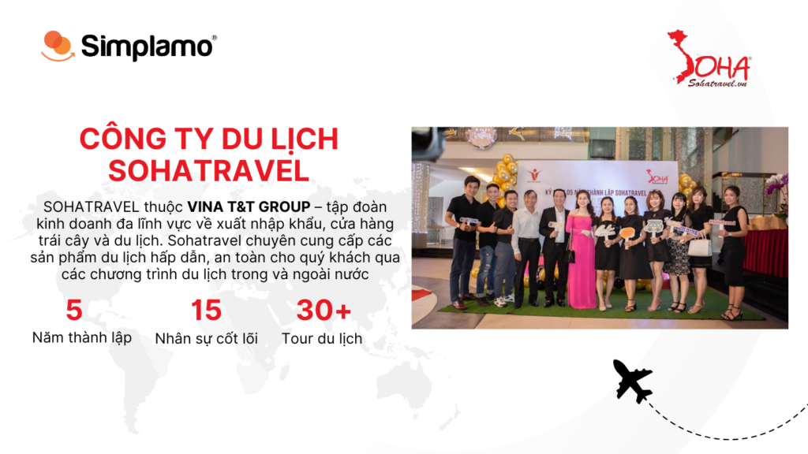
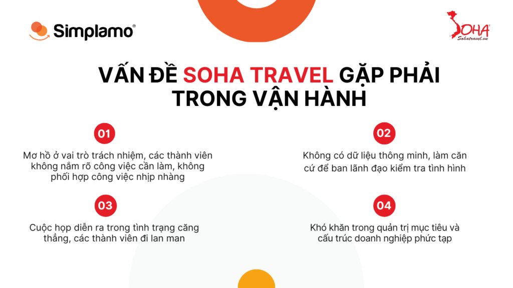
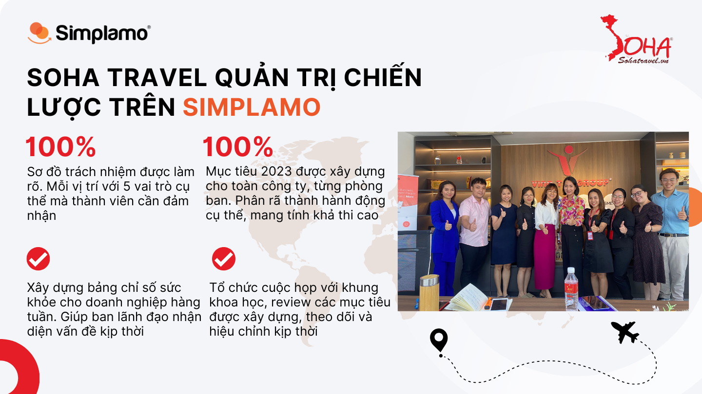
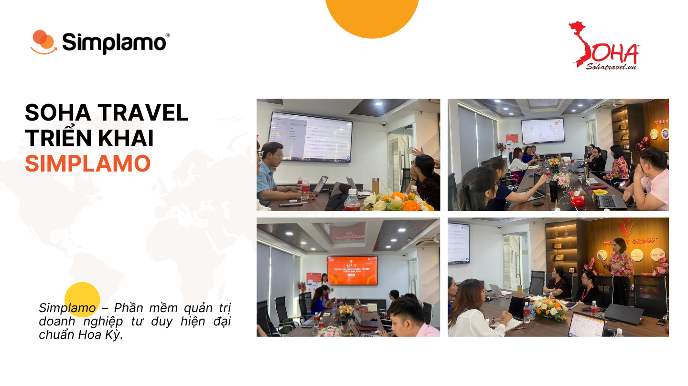

“Em muốn các bạn ngồi đây hiểu những gì em đang suy nghĩ, phải lao động mới có thành quả, có tâm với nghề, lên các vị trí càng cao, trách nhiệm sẽ càng lớn. Với các em, Chị hiểu hết những nỗi lòng của nhân viên vì đã từng trải qua những gì nổi chìm trong cách tư duy của từng vị trí. Chị muốn các em hiểu KPI nhẹ nhàng, không bị áp lực, cái gì cũng vậy khi làm các bạn phải thật thoải mái để tự tin cảm nhận đây thực sự là cái sinh ra dành cho mình, đặt tâm huyết của mình vô nó, nỗ lực cho những gì thuộc về mình, thì sẽ thành công.

Hôm nay thông qua phần mềm Simplamo, mọi điều, tâm tư của chị đều được thấu hiểu, chị không cần phải nói nhiều mà chưa chắc các em đã hiểu như trước đây, giờ chỉ cần nhìn phần mềm là các em sẽ hiểu ngay những điều công ty hướng tới. Simplamo thực sự đã giúp cho đội ngũ thấu hiểu và gắn kết, thực sự có thể truyền cảm hứng làm việc cho các bạn” – **Chia sẻ của chị Thái Diễm Thảo (Phó Giám Đốc Soha Travel) tại buổi triển khai Simplamo.**

## **1. Soha travel và triết lý Làm dịch vụ không bao giờ Say No**

Soha Travel – Một công ty con của chuỗi tập đoàn được mệnh danh là *Vua Xuất Khẩu* trái cây tại Việt Nam VINA T&T. Với phương châm “Triệu niềm vui, vạn nẻo đường” mong muốn đem lại những trải nghiệm đúng nghĩa Du lịch thoải mái, hân hoan cho cá nhân tổ chức, để có những khoảnh khắc đọng lại ý nghĩa trong mỗi người tham gia, công ty đã tổ chức rất nhiều Tour cho các công ty, tập đoàn lớn.

Chị Thảo phó tổng giám đốc của Soha Travel đã chia sẻ về triết lý làm dịch vụ tại Soha: Vì Soha là một công ty du lịch đi sau rất nhiều công ty về du lịch khác, nhưng mình có một lợi thế cạnh tranh đặc biệt đó là: Luôn tận tụy với khách hàng thực sự bằng các con số chi phí hợp lý, tâm huyết xây dựng ý tưởng thiết kế tour mang tính cá nhân hóa cao nhất cho từng khách hàng và luôn sẵn sàng say Yes, Khách hàng là thượng đế – hãy quan tâm tới khách hàng bằng cả con tim chân thành vì du lịch với Soha không chỉ là sự trải nghiệm đơn thuần, nó là những khoảnh khẳng đọng lại sâu sắc trong lòng mỗi khách hàng khi nhắc tới địa điểm đó. Hãy tôn trọng thời gian của họ và giúp sức biến những kỳ vọng du lịch của họ trở nên thú vị chưa từng thấy, đó mới chính là chúng ta – Một Soha travel không bao giờ say No.

## **2. Khi mục tiêu tham vọng chạm trán hiện thực lạnh lùng**

Tuy nhiên, sau dịch, tình hình du lịch đã thay đổi rất nhiều, để điều hành công ty hoạt động đạt chỉ tiêu, ổn định là rất khó, nhiều áp lực, đội ngũ thường xuyên rơi vào bế tắc, không hiểu được ý của sếp. Như chia sẻ của các thành viên Soha với Simplamo, Soha đang có quá nhiều vấn đề cần phải giải quyết, sự kém hiệu quả trong kinh doanh mới lộ ra vô vàn điểm yếu trong quản trị nội bộ, phức tạp đến nỗi rất dễ mất kiểm soát cho ban lãnh đạo và cả những nhân viên đang làm việc. Điều họ cần nhất lúc này là một **ngôn ngữ chung** để giao tiếp trong công việc, tiết kiệm thời gian và tránh bị tình trạng ông nói gà bà nói vịt nữa, không ai có thể hoàn thành mục tiêu một mình vì công ty không phải nhà kinh doanh đơn độc.

**Cụ thể những vấn đề Soha đang gặp phải khi điều hành công ty:**

- Vai trò trách nhiệm của mỗi thành viên chưa rõ ràng, đội ngũ gặp khó khăn trong việc phối hợp làm việc và giải quyết các vấn đề phát sinh.
- Đối với việc thực thi kế hoạch năm, mục tiêu quý sếp chỉ nhận được báo cáo vào thời điểm cuối tháng từ các trưởng bộ phận. Có quá nhiều dữ liệu để đánh giá, không có sự tập trung vào những chỉ số cần thiết, các giải pháp cũng chưa xác đáng với tình hình thực tế doanh nghiệp.
- Nhân viên quên nhiệm vụ và mục tiêu quý. Không có phần mềm giúp sếp phân rã mục tiêu dễ dàng và giúp đội ngũ theo sát mục tiêu của mình.
- Dành nhiều thời gian cho cuộc họp để giải quyết vấn đề nhưng gặp khó khăn trong việc tìm ra người chịu trách nhiệm cụ thể và theo dõi hành động giải quyết vấn đề đó.
- Chưa có phần mềm đủ đơn giản và tập trung để sếp kịp thời theo dõi tình hình hoạt động các phòng ban, tiến độ thực thi mục tiêu.

Đối mặt với khủng hoảng đang ngày càng lan tỏa mạnh mẽ tại công ty, Anh Nguyễn Đình Tùng – Chủ tịch của Vina T&T Group đã ra tay hành động để chấm dứt tình trạng này càng nhanh càng tốt và [Simplamo.com](http://Simplamo.com) đã xuất hiện ngay trong thời điểm cần nhất một công cụ hỗ trợ đắc lực cho toàn công ty. Simplamo – Phần mềm quản trị chiến lược bằng những thao tác đơn giản, kết hợp KPI/OKR, lưu trữ và đo lường dữ liệu, tất cả đều được tối ưu hóa cho quy trình ra quyết định có cơ sở, hành động thống nhất nhờ sự rõ ràng và siêu dễ hiểu. Cả công ty thu gọn trong một màn hình, sếp có thể theo dõi tình hình của ban nào cũng được, chạm vào là ra ngay.

Soha travel đã quyết định lựa chọn Simplamo cho vận hành chiến lược cho toàn công ty, một công cụ rất cần cho quá trình vận hành của Soha lúc này.

## **3. Soha travel quản trị chiến lược trên Simplamo – Một mũi tên trúng nhiều đích**

Ngày 22/03/2023, Soha Travel – Một công ty con của chuỗi tập đoàn được mệnh danh là *Vua Xuất Khẩu* trái cây tại Việt Nam VINA T&T, chính thức Kick off dự án vận hành doanh nghiệp trên phần mềm Simplamo.

Buổi triển khai đầu tiên bắt đầu với **Sơ đồ trách nhiệm**: Lúc đầu mọi người còn khá mơ hồ với cách làm rõ vai trò của các thành viên, viết thành câu khẳng định dưới 5 vai trò, nhưng với sự hướng dẫn từ chuyên gia chị Nguyễn Thị Nghĩa – mọi người đã dần nắm được cách đặt 5 vai trò cốt lõi bám sát nhất vị trí của mình. Cách đặt vai trò phải cụ thể bằng các mô tả chứa tính từ.

Tiếp theo là **xây dựng kế hoạch năm 2023** cho toàn công ty và từng phòng ban cụ thể, từ Sale-Marketing, Kế toán đến ban lãnh đạo. Một bức tranh toàn cảnh chỉ tóm gọn trong 7 mục tiêu, tất cả đều được thảo luận với sự hướng dẫn từ chuyên gia, phải tập trung và phải cốt lõi, mang tính đo lường. Bởi vì hôm nay thiết lập mục tiêu rõ ràng mới tiến hành phân rã ra hành động cụ thể, mang tính khả thi cao. Hấp thụ được năm 2023 rồi – sẽ nhìn rõ 2024 – sau đó 2025.

Chuyên gia của Simplamo cùng Soha Travel **thiết lập mục tiêu quý**, các mục tiêu chỉ tóm gọn trong 7 mục tiêu cốt lõi của toàn công ty, tất cả các thành viên cùng thảo luận, mỗi phòng ban và thành viên có mục tiêu rõ ràng, cụ thể theo **phương pháp S.M.A.R.T.** Đặc biệt với các phòng Marketing, Sale, Hr, Kế toán, các mục tiêu cốt lõi đều tóm gọn dưới 7, sử dụng câu khẳng định và đo lường được, **giảm thiểu thói quen làm việc nửa vời**, ai cũng nắm được việc của nhau và hiểu rõ việc của mình. Tất cả đều thao tác trên Simplamo.

**Đo lường chỉ số KPI** từng tuần trên Scorecard : Cả đội Soha Travel dưới sự hướng dẫn của chuyên gia đã thảo luận và tính toán cho ra các con số đo lường theo từng tuần **bám sát với mục tiêu Quý**, nhưng vẫn **giữ được khoảng thở** cho sự linh hoạt của biến động thị trường, biết ai đang bị quá tải để sếp giúp kịp thời, bây giờ dễ hơn khi chỉ cần mở bảng số liệu sẽ biết liền vấn đề và có thể thảo luận trực tiếp với những người PIC trực tiếp công việc đó. Từ đó xây dựng các chương trình khuyến mãi theo tour, cách duy trì các khách hàng thân thiết và những điểm yếu cần cải tiến với cách tiếp cận xu hướng mới của du lịch bây giờ, với số liệu và hiệu suất được đo lường cụ thể, dễ quan sát hiệu suất tổng quan của toàn bộ nhân sự. Tất cả rất cụ thể và dễ hiểu. Giúp team đơn giản hóa để **nhanh chóng bắt tay vào thực hiện.**

[<../../../assets/blog/soha-travel-quan-tri-de-hieu-voi-simplamo-thay-ngan-loi-noi-chi-bang-mot-man-hinh/Hinh-anh-casestudy-.mp4>](../../../assets/blog/soha-travel-quan-tri-de-hieu-voi-simplamo-thay-ngan-loi-noi-chi-bang-mot-man-hinh/Hinh-anh-casestudy-.mp4)

Trong thời gian tới, đội ngũ Simplamo sẽ tiếp tục đồng hành cùng đội ngũ Soha Travel để hoàn thiện quy trình vận hành trên Simplamo.

Khi quản trị công ty trên **Simplamo**, **năng lực trong việc hoàn thành mục tiêu rất dễ được nhìn thấy và sự kém hiệu quả trong bất kỳ khâu hành động nào là hoàn toàn không thể che giấu**. Minh bạch và gọn nhẹ, loại bỏ khó khăn càng nhanh càng tốt, tập trung làm điều quan trọng.

**Tư duy quản trị** được rap vừa khít trên Simplamo, giúp quá trình vận hành công ty thực sự hiệu quả, quan trọng lãnh đạo và nhân viên thực sự **biết mình đang làm gì, cần phải đi đâu và đi như thế nào**, bản đồ định hướng trên Simplamo đã có sẵn, doanh nghiệp không còn **hoài nghi** bị lạc trôi trong con đường mình theo đuổi, biến tầm nhìn trở thành thực tế.

—————————————————

[Simplamo](https://simplamo.com/vi/) – Phần mềm quản trị mục tiêu khoa học hiện đại, kết hợp độc đáo giữa KPI, OKR. Biến mọi thứ phức tạp trong điều hành trở nên đơn giản và gần gũi đến từng nhân viên. Giải phóng áp lực cho nhà lãnh đạo, tập trung vào điều quan trọng, tối ưu hiệu suất làm việc cho doanh nghiệp.

Hãy bắt đầu trải nghiệm Simplamo và cảm nhận sự thay đổi chỉ sau 4 tuần!

Đăng ký nhận buổi demo Simplamo tại: <https://app.simplamo.com/sign-up>

