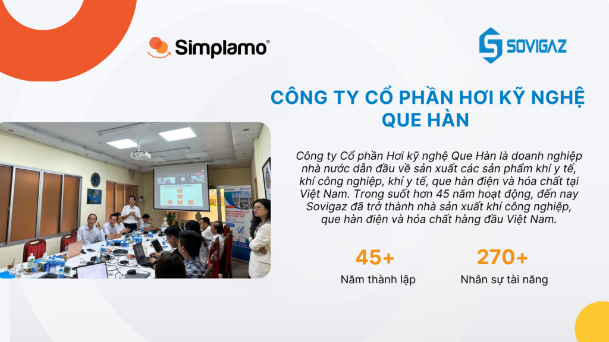
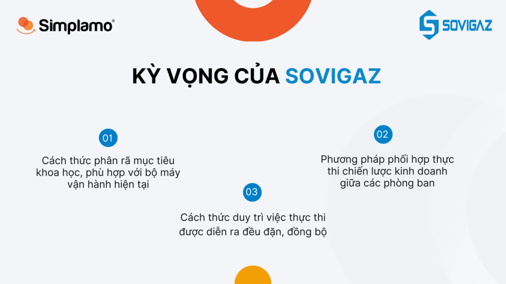
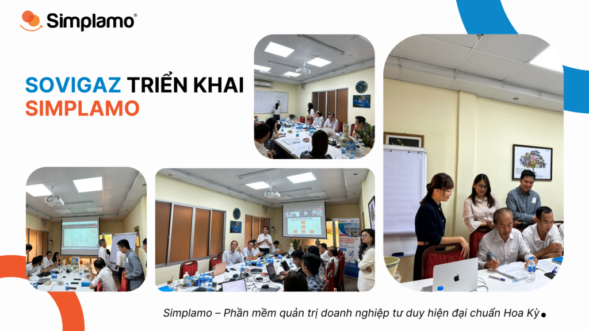
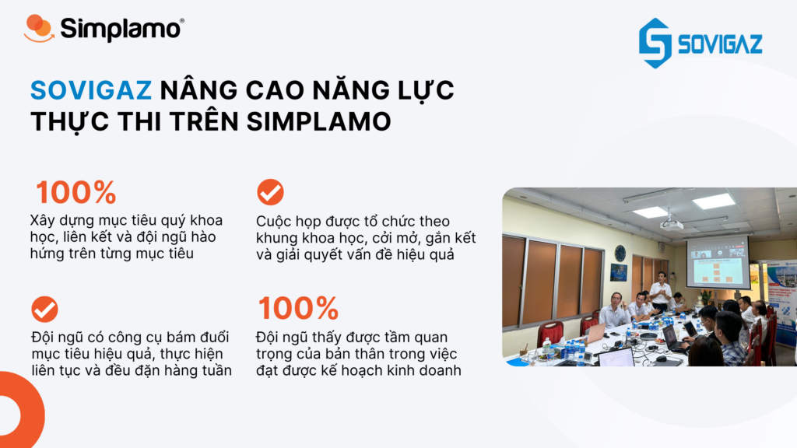

[Công ty Cổ phần Hơi kỹ nghệ Que Hàn](https://sovigaz.com.vn/) là doanh nghiệp nhà nước dẫn đầu về sản xuất các sản phẩm khí y tế, khí công nghiệp, khí y tế, que hàn điện và hóa chất tại Việt Nam. Trong suốt hơn 45 năm hoạt động, đến nay Sovigaz đã trở thành nhà sản xuất khí công nghiệp, que hàn điện và hóa chất hàng đầu Việt Nam và trở thành thương hiệu uy tín trong các ngành công nghiệp với sứ mệnh cao cả “phục vụ dân sinh”, có trách nhiệm với xã hội.

## 1. Sovigaz và mong muốn nâng cao năng lực thực thi mục tiêu

Trong suốt hành trình của mình, Sovigaz hoạt động với kim chỉ nam lấy “Con người” làm trung tâm của mọi hoạt động, lợi ích của nhân viên và công ty được gắn kết để cùng nhau phát triển. Theo đó, việc đạt được kế hoạch kinh doanh hằng năm phù thuộc rất nhiều vào **năng lực thực thi mục tiêu** của đội ngũ. Anh Phong cũng đã tìm kiếm nhiều phương pháp và công cụ khác nhau để giúp đội ngũ có cùng chung cách phân rã, theo dõi và thực thi tốt hơn, thế nhưng vẫn chưa tìm được phương pháp phù hợp và đủ đơn giản.

Dưới đây, là một số kỳ vọng của anh và đội ngũ tại thời điểm tìm đến Simplamo:

- Cách thức **phân rã mục tiêu khoa học, phù hợp** với bộ máy vận hành hiện tại của Sovigaz, giúp phát huy sức mạnh của từng thành viên và nhấn mạnh sự đóng góp của họ vào thành công của tổ chức.
- **Phương pháp phối hợp thực thi** chiến lược kinh doanh hiệu quả giữa các phòng ban với nhau, đảm bảo luôn phục vụ cho mục tiêu chung
- **Cách thức duy trì việc thực thi** được diễn ra đều đặn, đồng bộ trong đội ngũ, ban lãnh đạo dễ dàng nắm được mọi diễn biến đang xảy ra trong tổ chức

## 2. Simplamo – phần mềm quản trị tập trung vào yếu tố con người, nâng cao năng lực thực thi cho Sovigaz

Việc củng cố nội lực trong Sovigaz là nền tảng để doanh nghiệp đạt được mục tiêu kinh doanh 2023, vượt qua các thách thức của nền kinh tế và tăng trưởng mạnh mẽ trong các năm tới. Khi tiếp cận với Simplamo, anh Phong nhận thấy, đây không chỉ là một phần mềm quản trị đơn thuần, mà phía sau nó là một tư duy quản trị mục tiêu khoa học, tập trung vào yếu tố con người để giúp đội ngũ hoàn thành kế hoạch kinh doanh, đúng với kỳ vọng của anh.

Ngày 13/06/2023 vừa qua, Sovigaz đã quyết định triển khai phần mềm Simplamo. Với sự hướng dẫn và đồng hành của chuyên gia Simplamo, Sovigaz đã đạt được những bước tiến mạnh mẽ chỉ sau 3 tháng áp dụng:

- **Củng cố nền tảng con người vững chắc thông qua việc xây dựng sơ đồ trách nhiệm**

Làm rõ cơ cấu tổ chức Sovigaz và 5 vai trò chính tại mỗi vị trí, cung cấp góc nhìn chung, minh bạch trong toàn đội ngũ, đề cao giá trị và sự đóng góp của mỗi cá nhân vào bức tranh của doanh nghiệp. Và khi các thành viên ngồi đúng vị trí, đảm nhận đúng vai trò sẽ tạo nên cơ sở phân rã mục tiêu chuẩn xác.

- **Đội ngũ làm quen với cách thức xây dựng mục tiêu hàng quý mới, đơn giản, khoa học**

Tư duy xây dựng mục tiêu trên Simplamo tập trung vào yếu tố **dễ hiểu, dễ đo lường và dễ ghi nhớ**. Tại đó mỗi mục tiêu đều được giao cho từng nhân sự cụ thể, phù hợp với vị trí của họ trên sơ đồ trách nhiệm. Mỗi mục tiêu đều được chia nhỏ thành các cột mốc quan trọng, cả đội ngũ đều nắm được tiến trình thực hiện mỗi mục tiêu là gì, đảm bảo đội ngũ có chung góc nhìn để phối hợp thực thi hiệu quả.

Cuối cùng, là việc giới hạn mục tiêu công ty quý ở mức dưới 7 và mỗi cá nhân có tối đa 3 mục tiêu để đạt sự tập trung và khả năng hoàn thành cao nhất.

- **Tổ chức cuộc họp tuần nhịp nhàng, bám sát mục tiêu chặt chẽ hàng tuần**

Sau khi đã đồng thuận với danh sách mục tiêu quý 3, đội ngũ Sovigaz làm quen với nhịp họp tuần 7 bước trên Simplamo và ngày càng yêu thích khung cuộc họp này. Khung cuộc họp hiệu suất này giúp Sovigaz tập trung vào những điều quan trọng cần review hàng tuần (mục tiêu, chỉ số, todos), có công cụ để đo lường việc thực thi, giải quyết vấn đề cốt lõi và tạo report tự động. Mọi thảo luận đều vô cùng cởi mở, tràn đầy nhiệt huyết, các thành viên đều đứng trên góc nhìn chung để chia sẻ.

- **Tổ chức cuộc họp quý 4 và xây dựng thành công mục tiêu quý 4**

Vào đầu tháng 10 vừa qua, sau một quý áp dụng Simplamo và làm quen với việc xây dựng, phân rã, theo sát thực thi, đội ngũ Sovigaz đã tiến hành cuộc họp quý 4, tại đây đội ngũ tổng kết các mục tiêu quý 3 và tiếp tục xây dựng các mục tiêu quý 4. Theo đó, kế hoạch quý 4 được xây dựng nên rất chặt chẽ, liên kết từ công ty xuống từng phòng ban, đảm bảo khả năng đạt được cao và sự quyết tâm từ ban lãnh đạo Sovigaz.

Trong suốt thời gian đồng hành cùng Sovigaz, Simplamo vô cùng ấn tượng với sự cởi mở và nhiệt huyết của cả đội ngũ Sovigaz. Anh Phong và đội ngũ ban lãnh đạo rất tin tưởng với sự hỗ trợ đắc lực của công cụ Simplamo, mục tiêu năm 2023 sẽ được theo sát và hoàn thành theo đúng kế hoạch, chuẩn bị cho năm 2024 tăng trưởng mạnh mẽ.

Xem thêm: [Sovigaz Khởi Động Năm 2024: Xây Dựng Tầm Nhìn Doanh Nghiệp Cùng Simplamo](https://simplamo.com/sovigaz-khoi-dong-nam-2024-xay-dung-tam-nhin-doanh-nghiep-cung-simplamo/)

[Đặt lịch](https://simplamo.com/vi/simplamo-demo/) với Simplamo để gặp gỡ chuyên gia và tìm hiểu cách Simplamo giúp Doanh nghiệp chinh phục mục tiêu, tăng trưởng bền vững.

—————————————————

[Simplamo](https://simplamo.com/vi/) – Hệ điều hành thực thi mục tiêu đơn giản mà hiệu quả, ứng dụng KPI, OKRs, BSC, 4DX. Biến mọi thứ phức tạp trong điều hành trở nên đơn giản và gần gũi đến từng nhân viên. Giải phóng áp lực cho nhà lãnh đạo, tập trung vào điều quan trọng, tối ưu hiệu suất làm việc cho doanh nghiệp.

Hãy bắt đầu trải nghiệm Simplamo và cảm nhận sự thay đổi chỉ sau 4 tuần!

Đăng ký nhận buổi demo Simplamo tại: <https://app.simplamo.com/sign-up>
