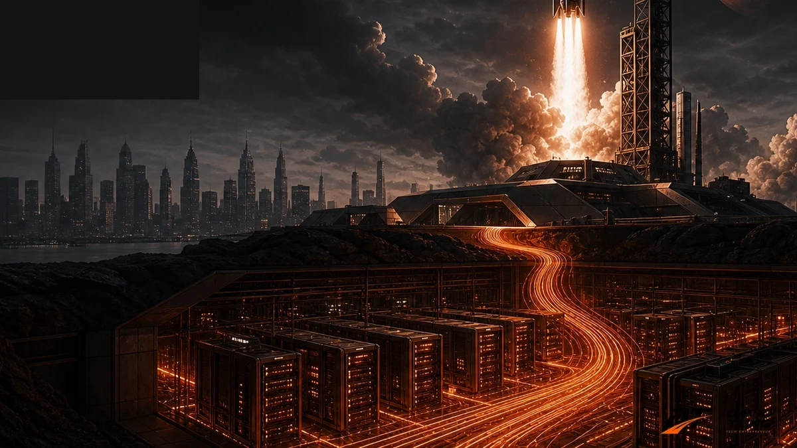
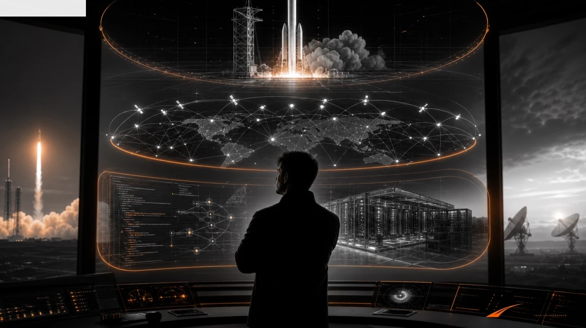
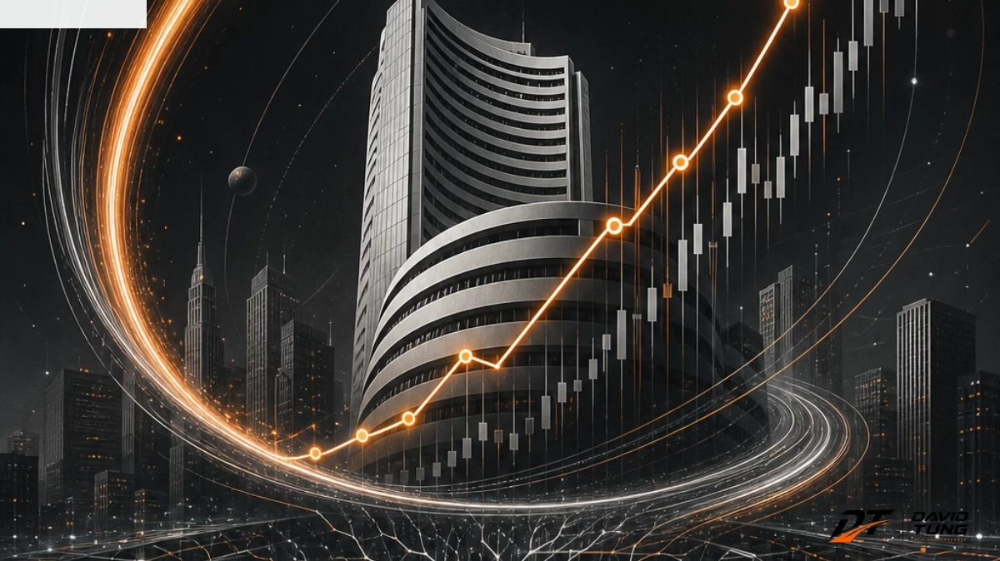
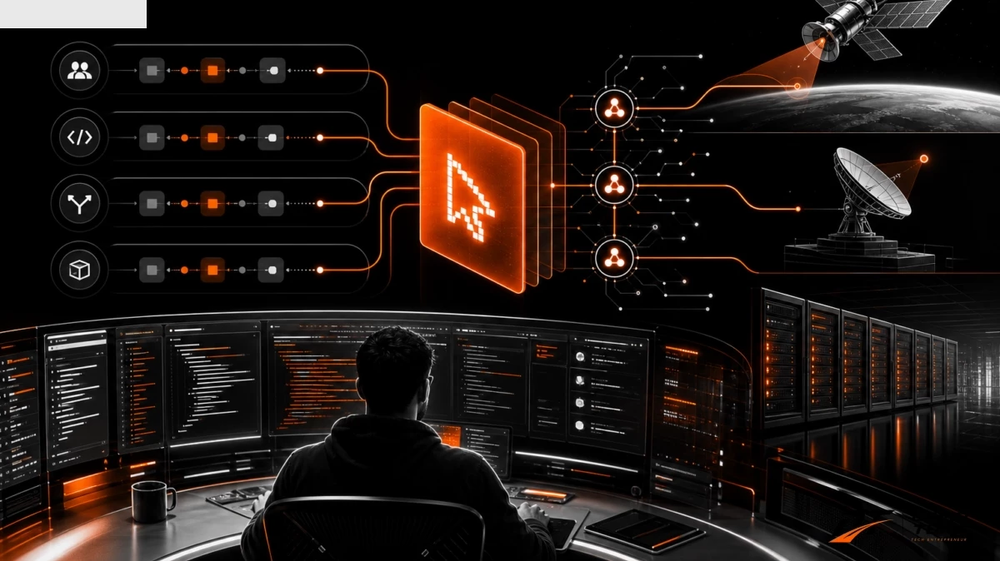
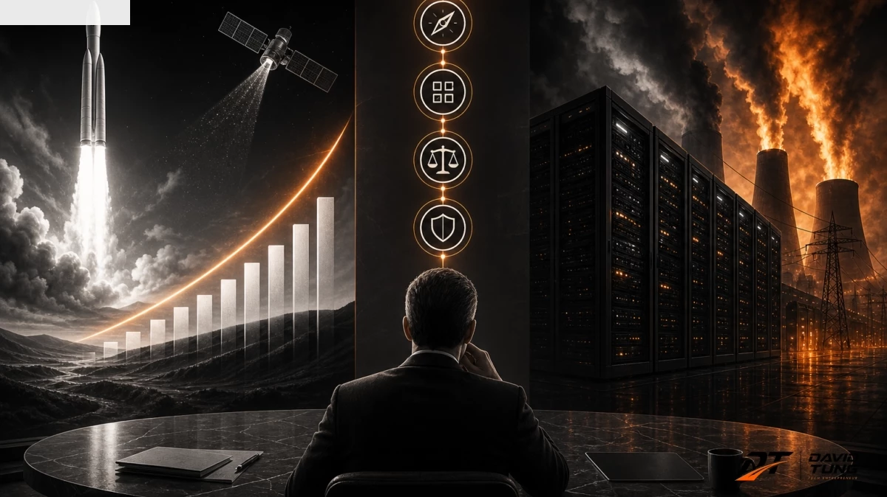

Tôi khá bất ngờ khi nghe giả định **SpaceX mua Cursor với mức giá 60 tỷ đô**.

Một công ty tên lửa mua một công cụ AI viết code?

Nghe qua thì rất lệch pha. SpaceX trong đầu số đông là Starship, Starlink, sao Hỏa, bệ phóng, động cơ Raptor và những cú hạ cánh làm cả thế giới phải ngước nhìn. Cursor thì lại thuộc một thế giới khác: lập trình viên, môi trường viết code, năng suất kỹ sư, AI hỗ trợ phần mềm.

Nhưng càng nhìn kỹ, tôi càng thấy đây là một nước cờ rất đáng học.

Không phải vì tôi nghĩ thương vụ nào gắn chữ AI cũng hay. Ngược lại, tôi thường khá dị ứng với kiểu “mua AI để có thông cáo báo chí”. Nhưng nếu đặt giả định này vào bối cảnh **IPO, định giá, Wall Street và cuộc đua AI**, logic phía sau lại rất thú vị.

Đây có thể không chỉ là câu chuyện SpaceX mua một công cụ.

Đây có thể là câu chuyện một công ty biểu tượng đang tìm cách **mở rộng khung định giá của chính mình**.

Và ở điểm này, phải công nhận: **tư duy chiến lược của Elon Musk rất đáng nể**.

Tôi thần tượng Elon không phải vì ông luôn đúng. Elon sai nhiều, gây tranh cãi nhiều, và đôi khi làm thị trường đau tim như chơi tàu lượn. Nhưng thứ rất đáng học ở Elon là khả năng nhìn một doanh nghiệp không như một “công ty đơn lẻ”, mà như một **hệ sinh thái các đòn bẩy**: công nghệ, vốn, truyền thông, thị trường, nhân tài, dữ liệu, hạ tầng và niềm tin tương lai.

Nhiều CEO chỉ hỏi: “Công ty này kiếm tiền thế nào?”

Elon thường hỏi câu lớn hơn: “Nếu ghép các mảnh này lại, thị trường sẽ định giá tương lai nào?”

Đó là khác biệt rất lớn.

---

## Nếu chỉ nhìn SpaceX như công ty tên lửa, ta sẽ bỏ lỡ câu chuyện vốn hóa

SpaceX có một lợi thế mà rất ít công ty trên thế giới có: **biểu tượng**.

Tên lửa là biểu tượng mạnh. Sao Hỏa là biểu tượng mạnh. Một công ty tư nhân đưa con người trở lại tham vọng liên hành tinh là một câu chuyện gần như không cần quảng cáo thêm.

Nhưng thị trường vốn không chỉ định giá biểu tượng.

Thị trường vốn định giá **khả năng mở rộng câu chuyện tăng trưởng**.

Một công ty phóng tên lửa có thể được định giá cao nếu nó có công nghệ vượt trội, hợp đồng tốt, lợi thế chi phí và rào cản gia nhập. Nhưng dù mạnh đến đâu, ngành không gian vẫn bị nhìn như một ngành nặng vốn: phần cứng, bệ phóng, nhiên liệu, chu kỳ thử nghiệm dài, rủi ro kỹ thuật cao.

Còn AI thì khác.

AI cho thị trường một loại trí tưởng tượng khác: phần mềm, dữ liệu, biên lợi nhuận, nền tảng, tự động hóa, năng suất, hạ tầng tính toán, mô hình có thể mở rộng toàn cầu.

Vì vậy, nếu SpaceX chỉ kể câu chuyện “chúng tôi là công ty tên lửa”, khung định giá của nó nằm trong một vùng.

Nhưng nếu SpaceX kể câu chuyện “chúng tôi là hạ tầng AI, dữ liệu, vệ tinh và năng suất kỹ sư cho tương lai”, khung định giá có thể bước sang vùng khác.

Đó là lúc Cursor trở nên đáng chú ý.

---

## IPO không chỉ là bán cổ phiếu. IPO là bán một câu chuyện tương lai

Rất nhiều người nghĩ IPO là lúc công ty “lên sàn để huy động vốn”. Đúng, nhưng chưa đủ.

IPO còn là thời điểm công ty phải trả lời một câu hỏi rất khó:

> “Vì sao thị trường nên định giá tương lai của tôi cao hơn hiện tại?”

Một công ty có thể có doanh thu tốt, sản phẩm tốt, đội ngũ tốt, nhưng nếu câu chuyện tăng trưởng không đủ lớn, thị trường sẽ không trả premium quá cao.

Với SpaceX, câu chuyện tên lửa đã quá nổi tiếng. Starlink cũng đã chứng minh năng lực tạo dòng tiền tốt hơn nhiều dự án không gian truyền thống. Nhưng nếu muốn bước vào một giai đoạn định giá mới, đặc biệt trong bối cảnh AI đang là trục tưởng tượng lớn nhất của thị trường, SpaceX cần một câu chuyện rộng hơn.

Và câu chuyện đó có thể là:

- Starship tạo biểu tượng.
- Starlink tạo dòng tiền.
- xAI/Grok tạo lớp mô hình và sản phẩm AI.
- Trung tâm dữ liệu tạo hạ tầng tính toán.
- Cursor tạo lớp năng suất kỹ sư và phần mềm.

Khi ghép lại, SpaceX không còn chỉ là “công ty đưa tên lửa lên trời”.

Nó có thể được kể như một **hạ tầng công nghệ tổng hợp**: vệ tinh, dữ liệu, AI, phần mềm, tính toán và mạng lưới toàn cầu.

Đó là một câu chuyện thị trường vốn lớn hơn rất nhiều.

---

## Vì sao trend AI có thể giúp tăng vốn hóa?

Tôi không thích cách nhiều công ty gắn chữ AI vào mọi thứ chỉ để làm đẹp slide gọi vốn.

Nhưng phải công bằng: trong thị trường vốn, AI đang là một trong những narrative mạnh nhất.

Không phải vì AI là phép màu. Mà vì AI chạm vào bốn thứ thị trường rất thích:

**Thứ nhất: quy mô thị trường.**  
AI có thể được kể như một lớp hạ tầng nằm trên gần như mọi ngành: phần mềm, bán hàng, vận hành, chăm sóc khách hàng, dữ liệu, kỹ thuật, tài chính, giáo dục.

**Thứ hai: biên lợi nhuận kỳ vọng.**  
Nếu AI biến một phần công việc con người thành phần mềm, nhà đầu tư sẽ tưởng tượng ra biên lợi nhuận tốt hơn.

**Thứ ba: dữ liệu và mạng lưới.**  
AI càng gắn với nhiều dữ liệu, nhiều người dùng, nhiều workflow, câu chuyện “lợi thế tích lũy” càng mạnh.

**Thứ tư: tốc độ mở rộng.**  
Một bệ phóng không thể nhân bản như một phần mềm. Nhưng một công cụ AI, một workflow kỹ sư, một mô hình phần mềm có thể mở rộng nhanh hơn nhiều.

Vậy nếu SpaceX mua Cursor, thị trường không chỉ nhìn một khoản chi 60 tỷ đô.

Thị trường có thể nhìn thấy một thông điệp:

> SpaceX không chỉ muốn phóng tên lửa. SpaceX muốn sở hữu lớp năng suất AI của những người đang xây tương lai công nghệ.

Đây là một thông điệp rất mạnh trước IPO hoặc sau IPO.

Nó nói với thị trường rằng: “Đừng định giá tôi như một công ty phần cứng không gian. Hãy định giá tôi như một hạ tầng AI có vệ tinh, dữ liệu, kỹ sư, phần mềm và trung tâm tính toán.”

Đó là lúc vốn hóa có thể đổi khung.

---

## Cursor trong bức tranh này không chỉ là công cụ viết code

Nếu nhìn Cursor như một IDE có AI, mức 60 tỷ đô nghe rất khó nuốt.

Nhưng nếu nhìn Cursor như một lớp điều khiển năng suất kỹ sư, câu chuyện bắt đầu khác.

Kỹ sư là nhóm người tạo ra phần mềm, mô hình, hệ thống, công cụ, sản phẩm và hạ tầng. Nếu một công ty sở hữu được lớp giao diện nơi kỹ sư làm việc mỗi ngày, công ty đó không chỉ sở hữu một công cụ. Nó sở hữu một phần của **luồng sản xuất phần mềm**.

Với SpaceX, điều này càng thú vị.

SpaceX là công ty có văn hóa kỹ thuật rất mạnh. Tốc độ thử nghiệm, vòng lặp thiết kế, mô phỏng, phần mềm điều khiển, dữ liệu vận hành, Starlink, tự động hóa, hệ thống mặt đất — tất cả đều cần kỹ sư và phần mềm.

Nếu Cursor được đặt vào một hệ sinh thái gồm xAI, Grok, Starlink và trung tâm dữ liệu, nó có thể trở thành một lớp năng suất nội bộ rất mạnh.

Không chỉ giúp kỹ sư viết code nhanh hơn.

Mà còn có thể giúp tổ chức biến tri thức kỹ thuật thành workflow, biến dữ liệu vận hành thành hỗ trợ quyết định, biến kinh nghiệm kỹ sư thành tài sản phần mềm.

Đây là chỗ tôi thấy tư duy của Elon rất đáng học: ông thường không mua một mảnh ghép chỉ vì mảnh ghép đó đang hot. Ông mua vì nó có thể trở thành **đòn bẩy trong hệ sinh thái**.

Tesla không chỉ là xe. Nó là pin, phần mềm, dữ liệu lái, nhà máy, robot, năng lượng.

SpaceX không chỉ là tên lửa. Nó là phóng, vệ tinh, Internet, dữ liệu, phần mềm, AI, hạ tầng tính toán.

Nếu Cursor thật sự nằm trong bức tranh này, nó không phải là “mua công cụ viết code”.

Nó là mua một phần của **hệ điều hành kỹ sư**.

---

## Nhưng phản biện quan trọng: mua AI để tăng định giá không có nghĩa là tạo giá trị thật

Đây là chỗ cần tỉnh.

Một thương vụ AI có thể làm câu chuyện định giá đẹp hơn. Nhưng câu chuyện đẹp không tự động biến thành dòng tiền bền vững.

Có ba rủi ro lớn.

### 1. Mua narrative đắt hơn mua năng lực

Trong mùa AI, nhiều tài sản được định giá rất cao vì thị trường đang trả tiền cho kỳ vọng tương lai. Nếu doanh nghiệp mua lại ở đỉnh kỳ vọng, họ không chỉ mua công nghệ. Họ mua cả phần “nóng” của thị trường.

Nếu sau đó công nghệ không gắn được vào lõi vận hành, khoản mua lại trở thành một cái logo đẹp trong bài thuyết trình.

### 2. Dòng tiền tốt có thể bị kéo sang cuộc đua đốt vốn

Starlink có thể tạo dòng tiền tốt. Nhưng AI và trung tâm dữ liệu là cuộc chơi rất tốn vốn: chip, điện, làm mát, nhân tài, mô hình, hạ tầng.

Nếu dòng tiền từ vệ tinh bị kéo quá mạnh sang AI mà chưa tạo ra doanh thu tương xứng, nhà đầu tư sẽ phải hỏi:

> “Tôi đang đầu tư vào công ty không gian có dòng tiền, hay đang tài trợ cho một cỗ máy AI đốt vốn?”

Câu hỏi này không tiêu cực. Nó cần thiết.

### 3. Thị trường có thể nhầm giữa định giá cao hơn và mô hình tốt hơn

Một công ty có thể được định giá cao hơn vì kể được câu chuyện AI. Nhưng mô hình kinh doanh chỉ tốt hơn khi AI thực sự tạo ra:

- doanh thu mới,
- biên lợi nhuận tốt hơn,
- tốc độ phát triển sản phẩm nhanh hơn,
- lợi thế dữ liệu khó sao chép,
- hoặc chi phí vận hành thấp hơn.

Nếu không có những thứ này, AI chỉ là lớp sơn mới trên một căn nhà cũ.

Và thị trường vốn cuối cùng vẫn có một thói quen rất lạnh lùng: sau vài quý báo cáo, nó sẽ hỏi tiền ở đâu.

---

## Bài học chiến lược: vốn hóa không chỉ đến từ lợi nhuận, mà từ khả năng kể một tương lai đáng tin

Bài học lớn nhất ở đây không phải là “hãy đi mua AI”.

Bài học là: **vốn hóa được tạo ra từ ba lớp cùng lúc**.

### Lớp 1: Câu chuyện

Thị trường cần hiểu bạn đang đi về đâu.

SpaceX có câu chuyện sao Hỏa. Nhưng khi thêm AI, dữ liệu, Cursor, xAI, Starlink, câu chuyện có thể chuyển từ “đưa người lên sao Hỏa” thành “xây hạ tầng công nghệ cho nền kinh tế ngoài Trái Đất và dưới mặt đất”.

Câu chuyện đó rộng hơn.

### Lớp 2: Năng lực thật

Câu chuyện hay mà không có năng lực thật thì chỉ là marketing.

Điểm mạnh của Elon là ông thường đứng trên một nền kỹ thuật rất thật. Tên lửa phóng được. Starlink có người dùng. Tesla có xe chạy ngoài đường. Những thứ đó làm cho câu chuyện tương lai bớt giống ảo tưởng.

Đây là lý do tôi vẫn đánh giá cao tư duy của Elon: ông biết bán tương lai, nhưng tương lai đó thường được neo bằng những artifact rất cụ thể.

Một bệ phóng. Một chiếc xe. Một vệ tinh. Một nhà máy. Một mô hình AI. Một công cụ phần mềm.

### Lớp 3: Dòng tiền

Sau cùng, vốn hóa muốn bền phải có dòng tiền hoặc một con đường rất rõ để tạo ra dòng tiền.

Nếu Starlink tạo dòng tiền, AI tạo kỳ vọng, Cursor tạo năng suất kỹ sư, còn SpaceX tạo biểu tượng công nghệ — tổ hợp này có thể rất mạnh.

Nhưng nếu AI chỉ đốt vốn mà không tạo ra hiệu quả kinh tế, câu chuyện sẽ yếu đi rất nhanh.

Vì vậy, bài học cho CEO không phải là “hãy mua công ty AI để tăng định giá”.

Bài học đúng hơn là:

> Hãy xây một câu chuyện vốn hóa đủ lớn, nhưng phải có năng lực và dòng tiền đủ thật để chống lưng cho câu chuyện đó.

---

## Framework: 4 câu hỏi trước khi mua AI để tăng định giá

Nếu bạn là CEO, founder hoặc nhà đầu tư, hãy dùng bốn câu hỏi này trước khi bị cuốn vào một thương vụ AI nghe rất đẹp.

### 1. AI có gắn vào lõi kinh doanh không?

Nếu bạn bán thép, AI phải giúp bán thép tốt hơn, quản trị tồn kho tốt hơn, dự báo nhu cầu tốt hơn, báo giá nhanh hơn, chăm sóc khách hàng tốt hơn.

Nếu bạn làm SaaS, AI phải làm sản phẩm mạnh hơn, dữ liệu sâu hơn, onboarding nhanh hơn, support tốt hơn.

Nếu AI không gắn vào lõi, nó chỉ là đồ trang trí đắt tiền.

### 2. AI có tạo doanh thu hoặc biên lợi nhuận không?

Đừng chỉ hỏi: “AI này có hay không?”

Hãy hỏi:

- Nó giúp bán thêm bao nhiêu?
- Nó giảm chi phí nào?
- Nó tăng tốc đội ngũ nào?
- Nó cải thiện biên lợi nhuận ở đâu?

Nếu không trả lời được, rất có thể bạn đang mua câu chuyện chứ chưa mua năng lực.

### 3. AI có tận dụng được dữ liệu và kênh phân phối hiện có không?

Một thương vụ AI tốt thường không đứng một mình. Nó phải dùng được dữ liệu, khách hàng, kênh bán hàng, đội ngũ và hạ tầng mà công ty đã có.

Đây là lý do SpaceX + Starlink + xAI + Cursor là một giả định thú vị. Vì nếu ghép đúng, chúng không phải các mảnh rời. Chúng có thể trở thành một vòng lặp: dữ liệu, phần mềm, kỹ sư, mô hình, hạ tầng, người dùng.

### 4. Sau IPO, thị trường còn tin câu chuyện này sau bốn quý báo cáo không?

Trước IPO, câu chuyện có thể rất đẹp.

Sau IPO, thị trường sẽ nhìn báo cáo tài chính.

Một narrative AI có thể giúp định giá bay lên. Nhưng nếu sau bốn quý không thấy doanh thu, biên lợi nhuận, sản phẩm, tốc độ, hoặc lợi thế dữ liệu, thị trường sẽ kéo câu chuyện về mặt đất.

Đây là điểm khác biệt giữa chiến lược vốn hóa và bong bóng.

---

## Kết luận: tên lửa giúp thế giới nhìn lên, AI giúp thị trường định giá lại

Tôi vẫn thấy giả định SpaceX mua Cursor 60 tỷ đô là một câu chuyện rất đáng suy nghĩ.

Nó bất ngờ, nhưng không vô lý.

Nếu nhìn từ góc vận hành, Cursor có thể là lớp năng suất kỹ sư.

Nếu nhìn từ góc AI, Cursor có thể là giao diện làm việc của tương lai phần mềm.

Nếu nhìn từ góc IPO, Cursor có thể giúp SpaceX kể một câu chuyện định giá rộng hơn: không chỉ là công ty tên lửa, mà là hạ tầng AI + dữ liệu + vệ tinh + phần mềm.

Và nếu nhìn từ góc tư duy Elon Musk, đây là kiểu nước cờ tôi rất thích: không chỉ mua một tài sản, mà mua một **mảnh ghép để thị trường nhìn lại toàn bộ hệ sinh thái theo cách khác**.

Nhưng cũng phải tỉnh táo.

Mua AI để tăng định giá có thể là chiến lược thông minh. Nhưng chỉ khi AI thật sự gắn vào năng lực cốt lõi, tạo ra hiệu quả kinh tế, và được chứng minh qua dòng tiền.

Nếu không, nó chỉ là một cách rất đắt để kể một câu chuyện rất đẹp.

Tên lửa giúp thế giới nhìn lên.

AI có thể giúp vốn hóa bay cao hơn.

Nhưng cuối cùng, báo cáo tài chính vẫn là trọng lực kéo mọi câu chuyện trở lại mặt đất.

Và đó mới là bài học chiến lược đáng nhớ nhất.
