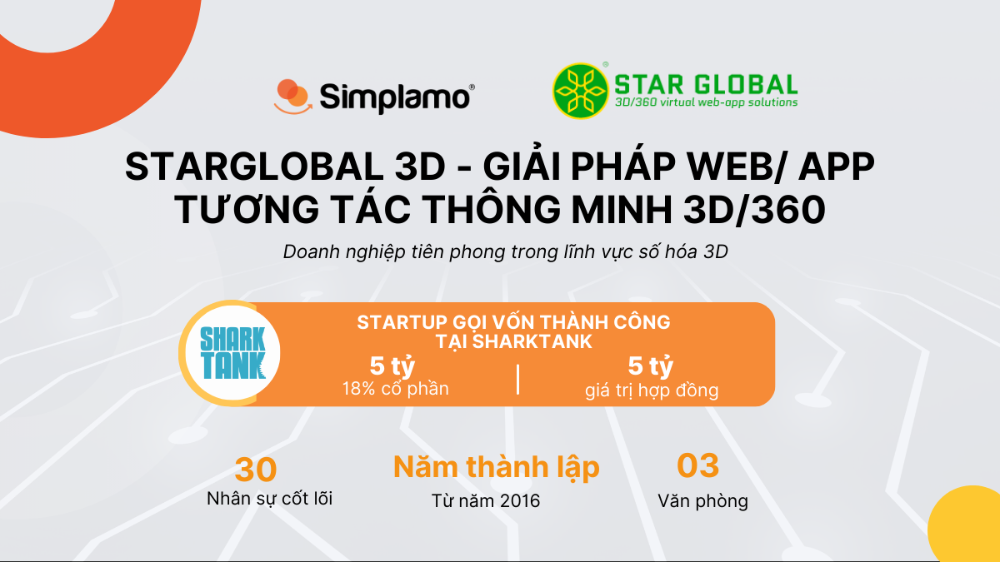
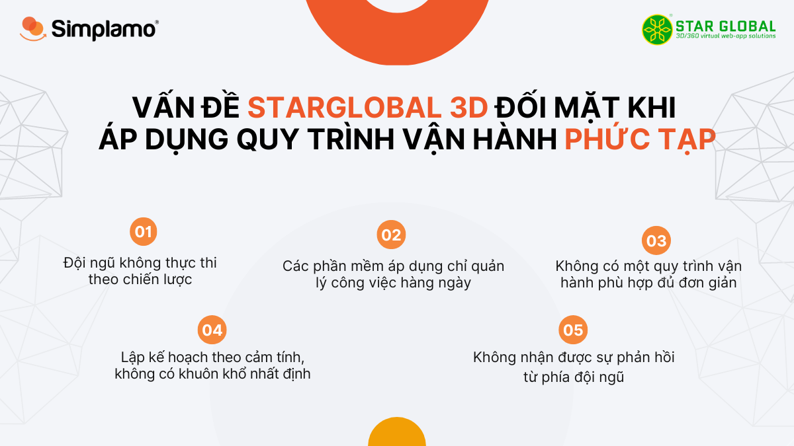
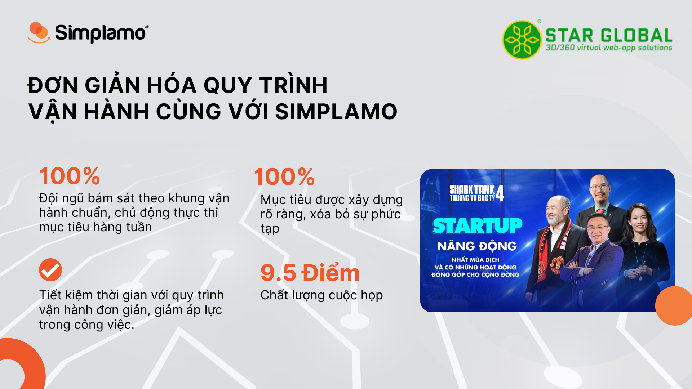
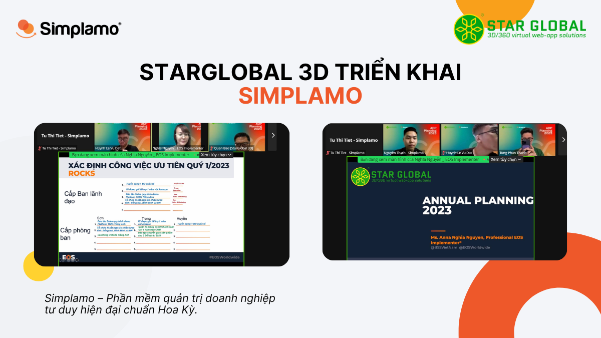
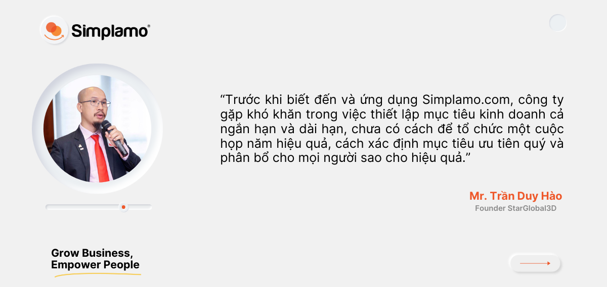

**[StarGlobal3D](https://starglobal3d.com)** là một trong những công ty tiên phong trong lĩnh vực giải pháp số hoá 3D, được cơ quan sáng chế và thương hiệu **Hoa Kỳ USPTO** cấp bằng sáng chế độc quyền (Patent) với sản phẩm “Web/App tương tác thông minh 3D/360”.

**Anh Trần Duy Hào – Founder StarGlobal 3D,** là nhà lãnh đạo xuất thân từ dân kỹ thuật, hiểu biết tường tận kiến thức chuyên môn, cùng với một khoảng thời gian làm việc tại các tập đoàn lớn, công ty đa quốc gia, anh còn rất am hiểu về các quy trình vận hành doanh nghiệp.

Với mục tiêu tăng trưởng mạnh và hướng đến thị trường quốc tế Mỹ, Canada… Anh Hào đã áp dụng các quy trình vận hành hệ thống giúp doanh nghiệp phát triển vững mạnh, theo đuổi mục tiêu kinh doanh. Anh đã sử dụng qua các phần mềm như: Excel, Base, MyXTeam, Amis… nhưng sau khoảng thời gian áp dụng anh thấy rằng các phần mềm này rất **phức tạp** ở quy trình, đội ngũ áp lực, không thể follow, cuối cùng các **mục tiêu** được thiết lập được không đạt **kết quả** như kỳ vọng ban đầu.

## 1. Vấn đề đối mặt của StarGlobal 3D khi sử dụng quy trình vận hành phức tạp

Việc sử dụng **quy trình vận hành** phức tạp khiến cho đội ngũ Starglobal 3D **không thực thi được mục tiêu** theo kế hoạch đã được vạch ra, mặc dù anh Hào đã có những tầm nhìn, mục tiêu rất rõ ràng. Một số khó khăn anh gặp phải như:

- Đội ngũ không thực thi theo chiến lược.
- Không có một quy trình vận hành phù hợp đủ đơn giản để đội ngũ dễ dàng follow.
- Sử dụng phần mềm nhưng chỉ quản lý công việc hàng ngày, đội ngũ không tập trung vào điều quan trọng.
- Chưa có sự đồng bộ, phối hợp làm việc kịp thời ở các cấp phòng ban.
- Lập kế hoạch theo cảm tính, không có khuôn khổ nhất định, không thấy bức tranh doanh nghiệp để đánh giá, theo sát mục tiêu.
- Không nhận được sự phản hồi từ phía đội ngũ trong quá trình thực thi.

Để gỡ rối cho doanh nghiệp vào thời điểm này Anh Hào cần một phần mềm quản trị **đơn giản**, **vừa vặn** với tổ chức, tạo nền móng vững chắc giúp đội ngũ hiểu được **tầm nhìn của anh**, và **bám sát** thực thi mục tiêu hiệu quả. Là người **đã có tư duy vận hành bài bản**, cùng với đó là tính kỷ luật cao, thời điểm hiện tại anh chỉ thiếu công cụ “đúng” để đưa doanh nghiệp phát triển.

## 2. Simplamo giúp Starglobal 3D đơn giản hóa quy trình vận hành phức tạp, bám sát quá trình thực thi mục tiêu năm 2023

Anh Trần Duy Hào xây dựng Starglobal3D với các giá trị: không ngừng phát triển, kỳ vọng nhiều ở thứ mình làm. Anh dành nhiều thời gian tìm hiểu và quyết định sử dụng Simplamo vào tháng 1/2023, anh chia sẻ rằng “Hy vọng việc sử dụng phần mềm Simplamo với sự đơn giản sẽ giúp Starglobal 3D xây dựng hệ thống vận hành đơn giản, quản trị mục tiêu hiệu quả, thực hiện được điều kỳ vọng trong kinh doanh và hơn thế nữa – như slogan mà Simplamo đã hứa hẹn – Simple and more.”

StarGlobal 3D cũng là một startup đã gọi vốn thành công trong chương trình “Thương vụ Bạc tỷ – Shark Tank mùa 4” với sự đầu tư của Shark Phạm Thanh Hưng – Tập đoàn CEN GROUP.

Theo chia sẻ của chị Nguyễn Thị Nghĩa – chuyên gia Simplamo: “Để lên kế hoạch và để thực thi thành công chúng ta cần phải xác định các công việc hiện tại, nhưng vẫn hướng đến tầm nhìn xa của doanh nghiệp. Có nghĩa là chúng ta vừa đi gần vừa đi xa, đội ngũ làm các công việc ở hiện tại, nhưng vẫn hướng đến mục tiêu tương lai. Việc lập **kế hoạch kinh doanh năm** là một **đoạn đường** trong hành trình doanh nghiệp đi đến **tầm nhìn**, chứ không chỉ lập kế hoạch chỉ trong vỏn vẹn 1 năm là xong.”

Ngày 10/1/2023 chuyên gia Simplamo đã tiến hành xây dựng Annual Planning 2023 cho StarGlobal 3D, qua các buổi triển khai đã giúp cho StarGlobal:

- **Xóa bỏ sự phức tạp trong việc xây dựng hệ thống mục tiêu, đội ngũ bám sát kế hoạch 2023**

Với sự dẫn dắt của chuyên gia Nguyễn Thị Nghĩa đã giúp đội ngũ StarGlobal 3D làm rõ được bức tranh toàn diện năm 2023, và **cụ thể hóa thành** các mục tiêu ưu tiên quý OKR, đồng thời minh bạch ở các chỉ số KPI mỗi thành viên cần đảm nhận hàng tuần.

Bên cạnh đó hệ thống mục tiêu của Starglobal 3D đã được thể hiện rõ ràng sâu sát bằng các **cột mốc** trên phần mềm, đưa đội ngũ tập “làm điều quan trọng”. Hơn hết, mọi thành viên giờ đây đã **nắm bắt** và **hiểu** được chiến lược mà anh Hào muốn truyền tải. Các mục tiêu, chỉ số đã nhận được sự đồng thuận của đội ngũ StarGlobal 3D và các thành viên đều cam kết cho việc thực thi mục tiêu của công ty.

- **Gắn kết đội ngũ với mục tiêu công ty – Review hoạt động kinh doanh qua cuộc họp hàng tuần**

Qua buổi triển khai, với sự hướng dẫn của đội ngũ Simplamo đã giúp StarGlobal 3D tổ chức nhịp họp hàng tuần hiệu quả. Khung cuộc họp 7 bước giúp cả đội ngũ cùng **xem lại**, **cập nhật tình hình** các mục tiêu, chỉ số đã được đưa ra. Điều này đã giúp mọi người xóa bay áp lực khi hàng ngày phải dành nhiều thời gian cho việc tiến hành báo cáo trên quy trình phức tạp gây ảnh hưởng đến năng suất làm việc không đáng có.

Simplamo đã giúp StartGlobal làm rõ kế hoạch kinh doanh năm một cách cụ thể kết hợp với việc tổ chức cuộc họp hàng tuần sẽ giúp Anh Hào đi sát và hiểu được thực trạng của doanh nghiệp trong quá trình thực thi mục tiêu nhiều hơn.

Vì là một công ty công nghệ, nên anh Hào hiểu rõ tầm quan trọng của sự chuyển đổi việc quản trị từ thủ công sang áp dụng phần mềm hiện đại rất quan trọng và cấp thiết để điều hành công ty hiệu quả và có tổ chức hơn. Hy vọng rằng Simplamo sẽ là một phần mềm mang lại sự đơn giản không chỉ cho Anh Hào mà còn cho cả đội ngũ, giúp Anh đạt được những điều kỳ vọng trong kinh doanh và xóa bỏ những sự rắc rối trong quy trình vận hành, đưa mọi thứ trở về “đơn giản”.

Simplamo hy vọng rằng, Anh Hào và đội ngũ của mình có bước phát triển đột phá khi sử dụng Simplamo vào trong quá trình vận hành doanh nghiệp, quản trị mục tiêu hiệu quả và giúp doanh nghiệp đạt được những điều kỳ vọng như anh mong muốn.

Simplamo hân hạnh đồng hành cùng công ty trong hành trình xây dựng khung vận hành tối giản, chuyên nghiệp và phát triển tổ chức bền vững.

—————————————————

[Simplamo](http://simplamo.com/) – Phần mềm quản trị mục tiêu khoa học hiện đại, kết hợp độc đáo giữa KPI, OKR. Biến mọi thứ phức tạp trong điều hành trở nên đơn giản và gần gũi đến từng nhân viên. Giải phóng áp lực cho nhà lãnh đạo, tập trung vào điều quan trọng, tối ưu hiệu suất làm việc cho doanh nghiệp.

Hãy bắt đầu trải nghiệm Simplamo và cảm nhận sự thay đổi chỉ sau 4 tuần!

Đăng ký nhận buổi demo Simplamo tại: <https://app.simplamo.com/sign-up>

