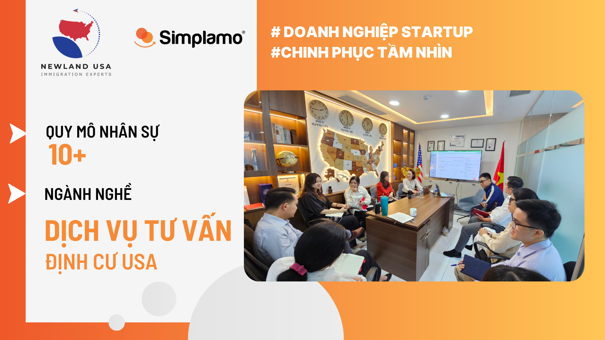
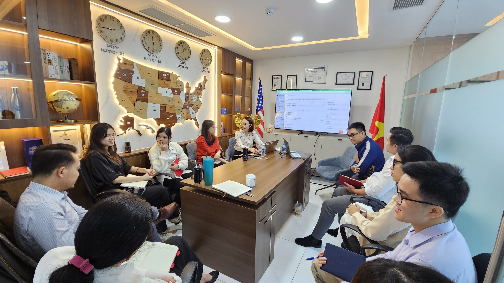
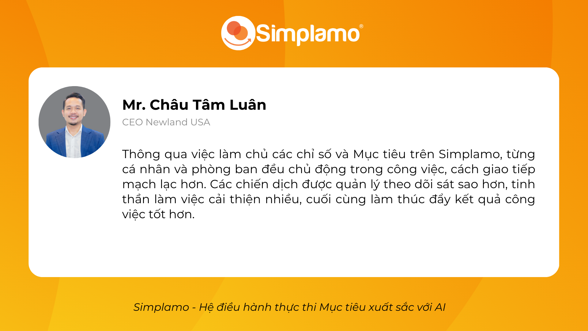
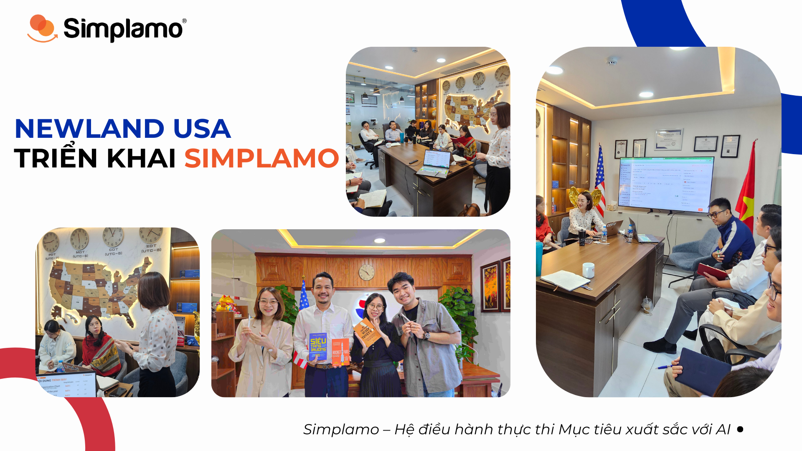

**Newland USA** là công ty chuyên cung cấp giải pháp định cư Mỹ an toàn, chuyên nghiệp với thời gian ngắn nhất. Newland USA đồng thời là đơn vị tiên phong thực hiện chương trình EB-3 Skilled Workers tại Việt Nam cùng các dự án đầu tư EB-5 uy tín. Với đội ngũ chuyên gia hơn 13 năm kinh nghiệm trong lĩnh vực di trú, Newland USA đã thực hiện thành công hàng trăm hồ sơ định cư thông qua các diện đầu tư, lao động, du học, kinh doanh,…

Được thành lập từ 2023, Newland USA là start up năng động với nhiều hoài bão lớn trong lĩnh vực di trú. Với phương châm đặt chất lượng dịch vụ lên hàng đầu, Newland USA hiểu rằng việc thiết lập tư duy quản trị chuyên nghiệp từ những viên gạch đầu tiên là vô cùng quan trọng.

Anh Châu Tâm Luân – CEO Newland USA cho rằng việc ứng dụng Simplamo ngay từ thời gian đầu thành lập là một quyết định vô cùng đúng đắn của Newland USA.

## Chinh phục khó khăn của một Startup

Từ khi mới thành lập cho đến nay, đội ngũ nhân sự Newland USA đã tăng lên gấp đôi. Cũng như các startup khác khi phát triển nhanh trong thời gian đầu, Newland USA gặp một số khó khăn điển hình như:

- Chưa có cách thức vận hành bài bản, đồng bộ cho toàn công ty và từng phòng ban
- Không có công cụ để thiết lập Mục tiêu hiệu quả, đội ngũ hoạt động rời rạc và rất khó để tập trung mọi người vào Mục tiêu chung
- Giao tiếp giữa các phòng ban và cá nhân còn nhiều vướng mắc do chưa có tiếng nói chung

Sau khoảng thời gian gặp gỡ và trải nghiệm Simplamo, Anh Luân đánh giá Simplamo rất phù hợp trong việc thiết lập Doanh nghiệp ở thời điểm ban đầu nên đã quyết định sử dụng Simplamo vào ngày 27.06.2024 vừa qua.

Trong 4 buổi triển khai phần mềm cho đội ngũ Newland USA, đội ngũ chuyên gia Simplamo đóng vai trò là người đồng hành sâu sát, đảm bảo đội ngũ Newland USA vừa hiểu về tư duy quản trị, vừa hiểu được cách sử dụng và thao tác trên phần mềm.

Đầu ra của 4 buổi triển khai này là: đội ngũ Newland USA biết cách setup Mục tiêu quý, phân rã cho các phòng ban cá nhân, đội ngũ đồng lòng và nắm chắc các Mục tiêu này để tập trung thực hiện, đồng thời biết cách tổ chức cuộc họp để review tiến trình thực thi Mục tiêu và giải quyết vấn đề hàng tuần.

Các hạng mục chính trong 4 buổi triển khai:

- **Xây dựng Sơ đồ trách nhiệm Newland USA**: thiết lập một sơ đồ tổ chức phù hợp với mô hình kinh doanh, quy mô nhân sự và đảm bảo cung cấp dịch vụ trơn tru nhanh chóng cho khách hàng.
- **Hướng dẫn xây dựng Mục tiêu quý 3**, đội ngũ biết cách đặt Mục tiêu đúng, cách phân rã Mục tiêu liên kết xuống các phòng ban, tạo nên sự tập trung, đồng bộ trong toàn tổ chức, không còn các hành động thừa thải và ban lãnh đạo dễ dàng quản lý công việc tại các phòng ban.
- **Hướng dẫn xây dựng bộ chỉ số đo lường** hoạt động kinh doanh hàng tuần để phục vụ cho việc báo cáo một cách nhanh chóng, tập trung, trong đó các chỉ số tập trung hướng đến đạt kết quả kinh doanh.
- **Hướng dẫn cách tổ chức cuộc họp review Mục tiêu hàng tuần**, đảm bảo đội ngũ có sự chủ động cao nhất, các phòng ban có cùng chung tiếng nói, phối hợp làm việc mượt mà và cùng nhau giải quyết các vấn đề phát sinh theo lợi ích chung của doanh nghiệp.

## Sự thay đổi ấn tượng từ đội ngũ trẻ và nhiệt huyết

Kết thúc các buổi triển khai, Anh Luân nhận thấy sự thay đổi rõ rệt ở đội ngũ nhân sự:

Anh dành lời khen cho đội ngũ chuyên gia triển khai của Simplamo vì sự chu đáo, nhiệt tình, giúp cho đội ngũ Newland USA hiểu tư duy, biết cách sử dụng và có Mục tiêu chung để phấn đấu. Bên cạnh đó, anh cũng đưa ra lời khuyên dành cho các **Doanh nghiệp mới startup hoặc đang setup Doanh nghiệp dưới 1 năm nên ứng dụng Simplamo**, vì giúp cho:

- Ban lãnh đạo dễ dàng quản lý công việc nhân viên
- Các phòng ban, nhân viên biết Mục tiêu của ban lãnh đạo để có tiếng nói chung, Tầm nhìn chung và cùng nhau đạt được

Xem toàn bộ video phỏng vấn anh Châu Tâm Luân – CEO Newland USA tại đây:

Dù mới trải qua hơn một tháng đồng hành cùng Simplamo, nhưng đội ngũ Newland USA đã có sự thay đổi rõ rệt đáng ngưỡng mộ. Simplamo rất ấn tượng với tinh thần ham học hỏi, sự cởi mở và quyết tâm của đội ngũ ban lãnh đạo Newland USA.

Simplamo hân hạnh đồng hành cùng Newland USA trên hành trình phát triển mạnh mẽ ở phía trước. Chúc Newland USA gặp hái nhiều thành công trong tương lai!

…

Simplamo – Hệ điều hành quản trị thực thi Mục tiêu xuất sắc với AI, ứng dụng KPI, OKRs, BSC, 4DX. Giải phóng áp lực cho nhà lãnh đạo, tập trung vào điều quan trọng, tối ưu hiệu suất làm việc cho doanh nghiệp.

Hãy bắt đầu trải nghiệm [Simplamo](https://www.facebook.com/simplamocom) và cảm nhận sự thay đổi chỉ sau 4 tuần!

Đăng ký nhận buổi demo [Simplamo](https://www.linkedin.com/company/79564065/) tại: <https://app.simplamo.com/vi/sign-up>

