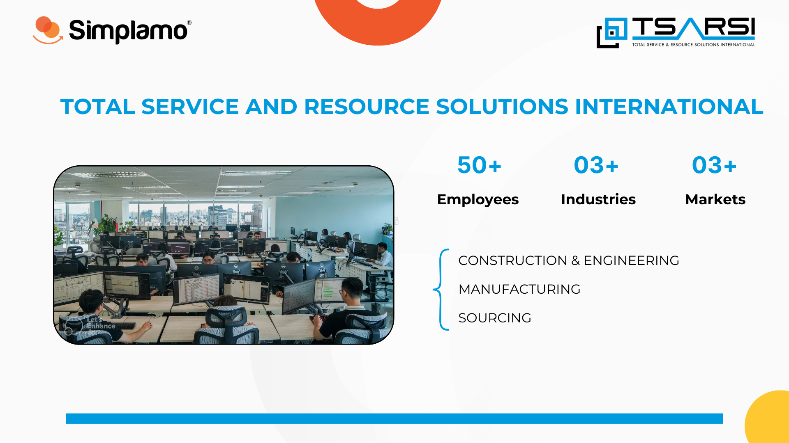
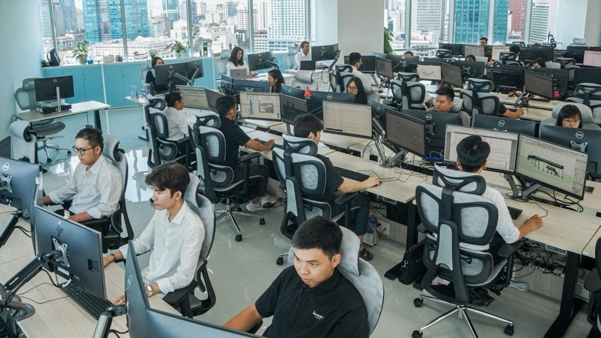
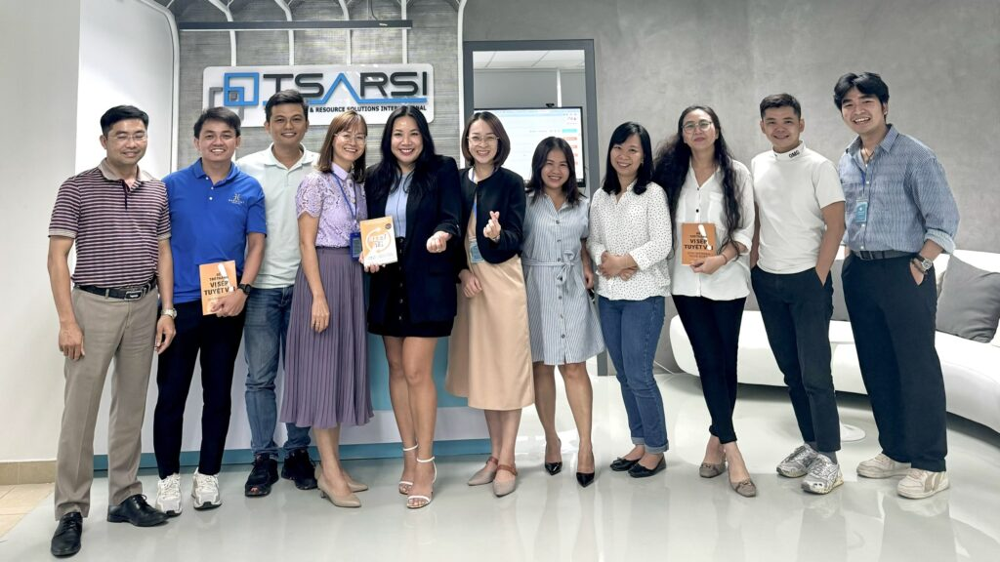
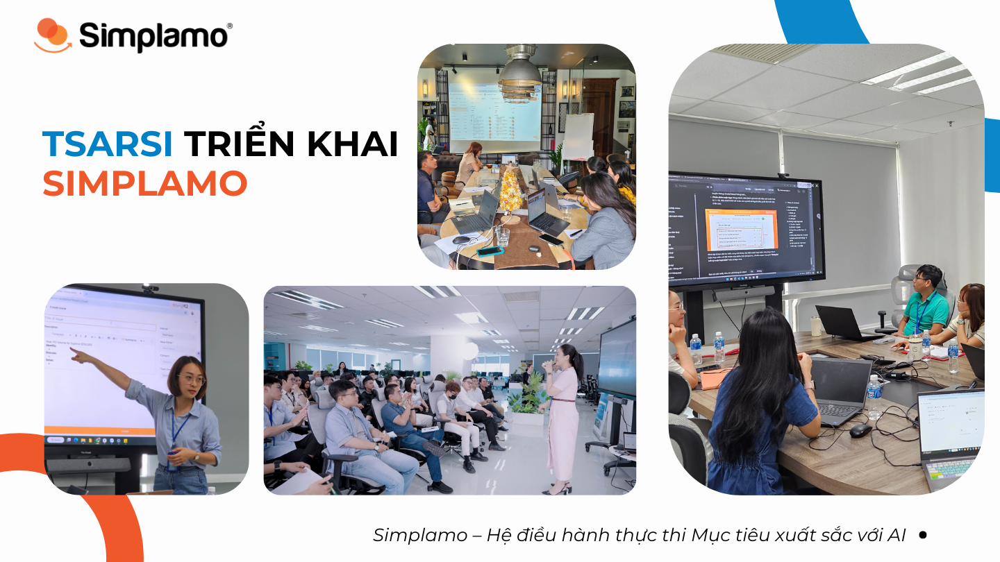
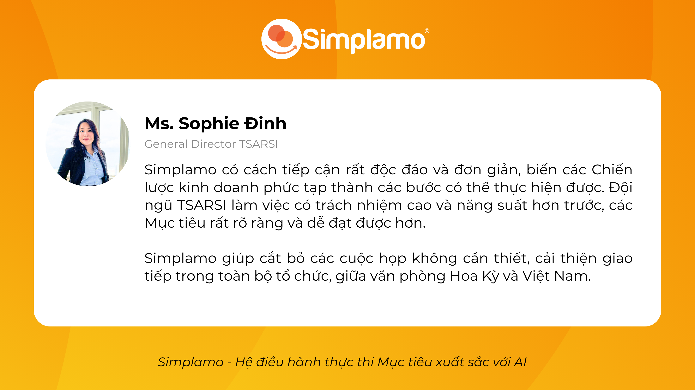
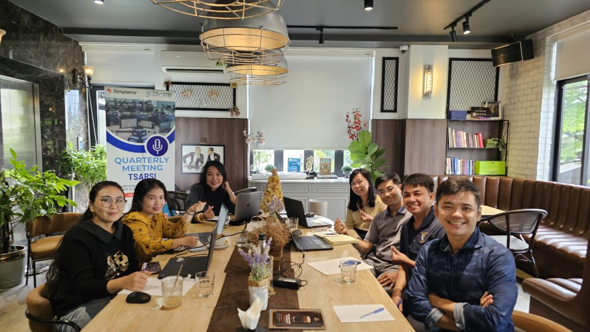

TSARSI –  Total Service and Resource Solutions International, là công ty chuyên cung cấp nguồn nhân lực và dịch vụ chuyên dụng cho các công ty Mỹ và Úc đang kinh doanh trong các ngành Xây Dựng, Kỹ Thuật và Sản Xuất. TSARSI có trụ sở đặt tại bang Minnesota, Mỹ và văn phòng vận hành tại thành phố Hồ Chí Minh, Việt Nam.

## **TSARSI – Giải bài toán điều hành từ xa và những thách thức trong giao tiếp kinh doanh**

Ban lãnh đạo TSARSI được phân bố ở cả hai quốc gia: **Mỹ và Việt Nam**. Khoảng cách địa lý, sự khác biệt về văn hoá, ngôn ngữ, cũng như phong cách lãnh đạo của các thành viên trong ban lãnh đạo luôn là những thách thức được ban Điều Hành Cấp Cao TSARSI dự đoán và xử lý tốt nhất để đạt được những thành công lớn trong giai đoạn đầu.

Khi nguồn nhân lực ngày càng đông hơn do sự khởi phát tốt đẹp của TSARSI trong chiến lược kinh doanh của mình, những thách thức trên đã dần hiện rõ và khó kiểm soát. Việc giao tiếp và quản lý giữa ban lãnh đạo và nhân viên ngày càng trở nên khó khăn. Các Chỉ số công việc và Mục tiêu không phải lúc nào cũng rõ ràng và được theo dõi nhất quán ảnh hưởng tới kết quả cuối cùng.

**Sự gắn kết tổ chức và tập trung đội ngũ vào cùng Mục tiêu chung để phục vụ khách hàng tốt nhất là ưu tiên hàng đầu tại thời điểm đầu năm 2024**.

Mặc dù TSARSI đang sử dụng nhiều phần mềm và công cụ khác nhau trong việc quản lý khách hàng, quản lý dự án & công việc, ban lãnh đạo TSARSI nhận thấy vẫn còn nhiều sự rời rạc, thiếu gắn kết và tính trách nhiệm chưa cao khi triển khai các dự án.

Do đó, một công cụ quản trị Mục tiêu hiệu quả, nơi có thể gắn kết đội ngũ, gia tăng tính trách nhiệm và tập trung vào thực thi Mục tiêu bất chấp những trở ngại về địa lý và văn hóa chính là điều TSARSI tìm kiếm.

Sau nhiều lần gặp gỡ và trình bày giải pháp, TSARSI đã quyết định lựa chọn Simplamo – Hệ điều hành thực thi Mục tiêu xuất sắc với AI trong lãnh đạo & phát triển công ty vào tháng 4.2024 vừa qua.

## **Nâng cấp hệ thống quản trị từ xa & tập trung thực thi Mục tiêu với Simplamo**

*“Khi có nhiều khác biệt về văn hóa và khoảng cách địa lý, điều đầu tiên chúng ta cần làm là gắn kết mọi người bằng các cuộc họp gặp gỡ định kỳ, cùng hiểu rõ Mục tiêu chung và Mục tiêu cá nhân để có sự thấu hiểu hơn trong công việc và gia tăng tính trách nhiệm”* – Chị Nguyễn Thị Nghĩa Founder Simplamo chia sẻ trong ngày kickoff dự án.

Thật vậy, trải qua hơn 3 tháng đồng hành cùng đội ngũ lãnh đạo TSARSI cả ở Việt Nam và Hoa Kỳ, Simplamo đã mang đến giải pháp hiệu quả trong việc gắn kết đội ngũ lãnh đạo và giúp mọi người tập trung vào việc thực hiện Mục tiêu chung.

### **Các hoạt động nổi bật trong 3 tháng triển khai:**

- Làm rõ **sơ đồ trách nhiệm TSASRI**, để các thành viên ở Mỹ và Việt Nam đều có chung một góc nhìn về cơ cấu vận hành của công ty, làm tiền đề cho việc giao tiếp rõ ràng, phối hợp công việc đúng người đúng vai trò và nâng cao tính trách nhiệm cho từng phòng ban.
- Đội ngũ đứng trên góc nhìn công ty để **đặt ra các Mục tiêu ưu tiên Quý 2** cấp phòng ban phục vụ cho Mục tiêu cấp công ty, một cách liên kết và nhất quán.
- Hình thành văn hóa minh bạch và hợp tác thông qua **Bảng điểm, Bảng Mục tiêu có cấu trúc**, với người phụ trách cụ thể.
- Hướng dẫn **tổ chức cuộc họp gắn kết hàng tuần** theo một khung chuẩn, theo dõi việc thực thi của đội ngũ và giải quyết vấn đề hiệu quả, các Mục tiêu luôn “ontrack” với tinh thần hoàn thành cao nhất. Cuộc họp chuẩn của Simplamo giúp cắt bỏ các cuộc họp không cần thiết, cải thiện giao tiếp trong toàn bộ tổ chức, giữa văn phòng Hoa Kỳ và Việt Nam.
- Biết cách **đối thoại nhân sự hiệu quả** thông qua khung đối thoại quý trên Simplamo, giúp mọi người có cùng tiếng nói và đi cùng “samepage”. Thời gian đối thoại ngắn gọn hơn, hiệu quả hơn.

*Chị Thảo Võ (Financial controller tại TSASRI) chia sẻ, thông qua các buổi triển khai và quan sát dữ liệu trên Simplamo, chị hiểu rất rõ về Mục tiêu công ty, và các Mục tiêu cần có sự liên kết với nhau để đạt Mục tiêu chung. Từ đó, chị đã biết cách xây dựng các Mục tiêu cá nhân của mình sao cho đáp ứng với Mục tiêu công ty tốt nhất. Mục tiêu còn liên quan đến con người, chị còn nắm được cách tìm người phù hợp cho mục tiêu đó.*

Tính năng cuộc họp trên Simplamo gây ấn tượng đặc biệt với đội ngũ TSARSI, chia sẻ với Simplamo **chị Nguyễn Thanh Hiền – HR Manager tại TSARSI** cho biết:

> *Mình cảm thấy Simplamo rất hay và đơn giản. Thông qua Simplamo, mọi người tập trung vào cái mình cần làm và hiểu công việc của các phòng ban khác đang làm. Trước đây, mọi người họp rất nhiều, vì không có phương pháp và công cụ nên họp rất lan man. Mỗi phòng ban sẽ có chính kiến riêng nên họ muốn chia sẻ nhiều hơn thay vì vào giải quyết vấn đề. Cuộc họp thường kéo dài đến 3 tiếng. Bây giờ khi họp theo khung của Simplamo, chỉ còn họp 1 tiếng mà các vấn đề được nêu lên và giải quyết hiệu quả hơn.*

[<https://simplamo-cdn.simplamo.com/wp-content/uploads/2024/07/feedback-tsarsi.mp4>](https://simplamo-cdn.simplamo.com/wp-content/uploads/2024/07/feedback-tsarsi.mp4?_=1)

Thông qua các buổi triển khai với chuyên gia Simplamo, việc quan sát dữ liệu trên phần mềm, và thực hành tổ chức các cuộc họp hàng tuần, đội ngũ TSARSI đã có sự gắn kết sâu sắc trong việc thực thi Mục tiêu chung, mọi người hiểu về công việc lẫn nhau và cùng nhau giải quyết các vấn đề hiệu quả hàng tuần.

Tại ngày cuối triển khai dự án, chị Sophie Đinh – General Director tại Tsarsi chia sẻ với Simplamo về kết quả đạt được trong hành trình vừa qua:

Xem toàn bộ video cảm nhận tại đây:

Chị Sophie nhấn mạnh về một điểm độc đáo khác của Simplamo đó là rất dễ dàng tích hợp vào hoạt động hàng ngày trong Doanh nghiệp nên không làm quá tải các quy trình hiện có.

Ban lãnh đạo TSARSI trong ngày họp quý 3 được tổ chức với sự dẫn dắt của Chuyên gia Simplamo

Cảm ơn TSARSI đã lựa chọn Simplamo. Simplamo sẽ luôn bên cạnh đồng hành, hỗ trợ TSARSI trong hành trình chinh phục Mục tiêu năm sắp tới!

Simplamo – Hệ điều hành thực thi mục tiêu xuất sắc với AI là giải pháp rất phù hợp cho các công ty đa quốc gia, vận hành từ xa với nhiều khác biệt về văn hóa, ngôn ngữ. Simplamo giúp gắn kết đội ngũ, cải thiện giao tiếp, phá bỏ rào cản địa lý và văn hóa, tập trung vào chinh phục Mục tiêu chung và tăng trưởng mạnh mẽ.

…

Simplamo – Hệ điều hành quản trị thực thi Mục tiêu xuất sắc với AI, ứng dụng KPI, OKRs, BSC, 4DX. Giải phóng áp lực cho nhà lãnh đạo, tập trung vào điều quan trọng, tối ưu hiệu suất làm việc cho doanh nghiệp.

Hãy bắt đầu trải nghiệm [Simplamo](https://www.facebook.com/simplamocom) và cảm nhận sự thay đổi chỉ sau 4 tuần!

Đăng ký nhận buổi demo [Simplamo](https://www.linkedin.com/company/79564065/) tại: <https://app.simplamo.com/vi/sign-up>

