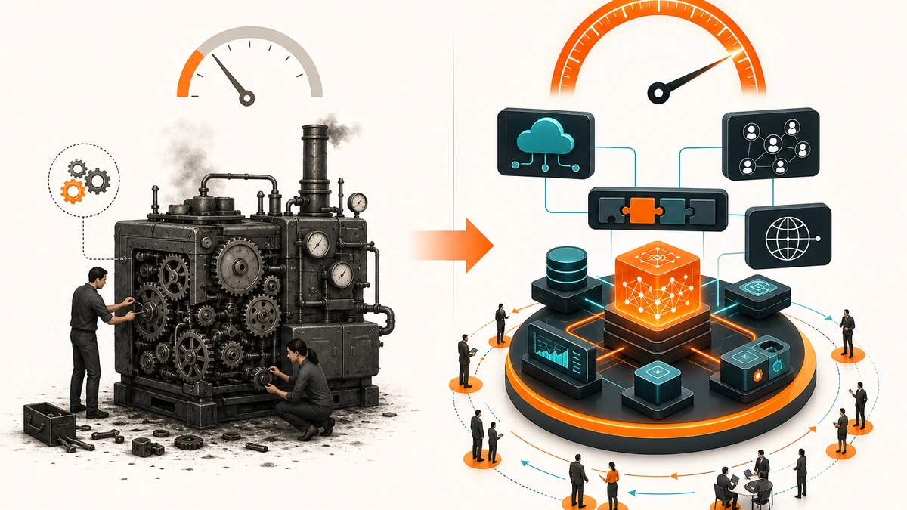

Có một kiểu mục tiêu nghe rất đã tai: tăng trưởng 10 lần.

Doanh thu x10. Người dùng x10. Đối tác x10. Thị trường x10. Định giá x10.

Nhưng điều nguy hiểm là nhiều công ty đặt mục tiêu 10X rồi vẫn lập kế hoạch như đang làm 10%.

Thêm sales. Thêm ads. Thêm KPI. Thêm dashboard. Thêm cuộc họp. Thêm áp lực.

Nói hơi phũ: nếu mục tiêu là lớn hơn 10 lần mà cách làm vẫn là phiên bản phóng to của hiện tại, công ty không trở thành 10X. Công ty chỉ kiệt sức to hơn.

Tư duy 10X không bắt đầu bằng việc làm nhiều hơn.

Nó bắt đầu bằng một câu hỏi khó chịu hơn:

> Nếu phải đạt kết quả lớn hơn 10 lần, mô hình hiện tại còn xứng đáng được giữ lại không?

Đây là điểm khác biệt giữa tối ưu và reset.

Tối ưu là làm cái cũ tốt hơn.

10X là dám hỏi: có nên tiếp tục chơi trò chơi cũ không?


## 10% tối ưu bánh răng, 10X thiết kế lại cỗ máy

Trong bài trước về 5 Ways, tôi nói nhiều về việc quay lại điều cơ bản để tạo thay đổi thấy được trong 90 ngày.

5 Ways rất phù hợp khi công ty cần cải thiện vận hành:

```text
Khách hàng tiềm năng
× Tỷ lệ chuyển đổi
× Tần suất mua
× Giá trị mỗi lần bán
× Biên lợi nhuận
```

Mỗi yếu tố nhích lên 10%, doanh thu và lợi nhuận có thể thay đổi rất lớn.

Nhưng 10X là một câu chuyện khác.

Nếu 5 Ways là chỉnh bánh răng để cỗ máy chạy tốt hơn, thì 10X là hỏi lại: **cỗ máy này có đúng là cỗ máy cần có không?**

Một công ty có thể tăng conversion thêm 10% bằng script tốt hơn.

Nhưng để tăng trưởng 10 lần, có thể họ phải đổi từ bán trực tiếp sang partner-led growth.

Một SaaS có thể giảm churn 10% bằng CS tốt hơn.

Nhưng để tăng trưởng 10 lần, có thể họ phải biến onboarding thành self-serve + AI coach.

Một đội sales có thể tăng năng suất 10% bằng CRM tốt hơn.

Nhưng để tăng trưởng 10 lần, có thể họ phải biến kiến thức của top sales thành hệ thống AI giúp cả mạng lưới đại lý bán tốt hơn.

Đó là sự khác biệt.

10% hỏi:

> Làm sao tốt hơn một chút?

10X hỏi:

> Nếu không bị ràng buộc bởi mô hình cũ, mình sẽ thiết kế lại cuộc chơi như thế nào?



## 5 nguyên lý lõi của tư duy 10X

Tài liệu Simplamo 10X đặt một định nghĩa rất rõ:

> Tư duy 10X là cách suy nghĩ nhằm tạo ra kết quả gấp 10 lần thay vì cải tiến 10%. Nó đòi hỏi loại bỏ rào cản hiện tại, tái thiết lại cách làm, chứ không đơn thuần là cải tiến.

Tôi thích định nghĩa này vì nó cắt thẳng vào vấn đề.

10X không phải là tham vọng được viết to hơn trên slide.

10X là kỷ luật để bỏ giả định cũ.

Có 5 nguyên lý đáng giữ lại.

### 1. Think from zero

Nếu bắt đầu lại từ con số 0, bạn có còn chọn cách đang làm không?

Đây là câu hỏi rất khó với CEO, vì mô hình hiện tại thường gắn với công sức, tự hào và lịch sử của công ty.

Nhưng lịch sử không phải lúc nào cũng là tài sản. Đôi khi nó là trọng lực.

### 2. Không tối ưu cái cũ, tạo ra cái mới

Nếu thị trường đang đi từ xe xăng sang xe điện, tối ưu động cơ xăng thêm 10% có thể là một nỗ lực rất giỏi nhưng sai cuộc chơi.

Điều đáng sợ không phải là làm chưa đủ tốt.

Điều đáng sợ là làm rất tốt trong một logic cạnh tranh đang hết thời.

### 3. Dùng công nghệ và hệ thống làm đòn bẩy

AI, automation, API, community, partner network, marketplace, dữ liệu, template, self-serve onboarding — đây là các đòn bẩy giúp kết quả tăng mà không buộc chi phí tăng cùng tỷ lệ.

Nếu doanh thu muốn x10 mà nhân sự cũng phải x10, đó chưa phải mô hình 10X. Đó là mô hình tuyến tính được trang điểm bằng một cái tên đẹp.

### 4. Hỏi câu hỏi khác biệt

Đừng chỉ hỏi:

> Làm sao tăng 10%?

Hãy hỏi:

> Làm sao đạt 10 lần kết quả mà không cần 10 lần chi phí?

Câu hỏi khác sẽ kéo ra mô hình khác.

### 5. Thiết kế để mở rộng, không để quản lý

Nhiều công ty lớn lên bằng cách thêm tầng quản lý. Nhưng tầng quản lý quá dày cũng làm công ty chậm lại.

10X cần thiết kế để scale:

- khách hàng tự bắt đầu được;
- partner tự bán được;
- AI tự hướng dẫn được;
- dashboard tự cảnh báo được;
- dữ liệu tự quay lại làm hệ thống thông minh hơn.

Nói ngắn gọn: **mô hình phải mở rộng mà không làm CEO phải ôm thêm mọi thứ vào người.**

## Case 1: Tesla — không làm xe xăng tốt hơn

Tesla là một ví dụ dễ hiểu cho tư duy 10X vì họ không bắt đầu bằng câu hỏi: “Làm sao làm xe xăng tốt hơn 10%?”

Nếu hỏi như vậy, câu trả lời sẽ là:

- tiết kiệm nhiên liệu hơn;
- động cơ hiệu quả hơn;
- sản xuất rẻ hơn;
- thiết kế đẹp hơn;
- bán hàng tốt hơn.

Tất cả đều có lý. Nhưng vẫn ở trong cuộc chơi cũ.

Tesla chọn một logic khác: xe điện không chỉ là một chiếc xe. Nó là một nền tảng gồm pin, phần mềm, dữ liệu, cập nhật OTA, mạng lưới sạc và hệ sinh thái năng lượng.

Điểm 10X nằm ở chỗ này.

Khi xe trở thành một nền tảng phần mềm và năng lượng, biên giới cạnh tranh thay đổi.

Hãng xe truyền thống tối ưu sản phẩm vật lý.

Tesla kéo cuộc chơi sang phần mềm, dữ liệu, pin, sạc và trải nghiệm người dùng.

Đây không phải tối ưu 10%.

Đây là reset mô hình.

Bài học cho CEO:

> Nếu thị trường đang bị khóa trong một logic cũ, 10X có thể đến từ việc đổi logic cạnh tranh, không phải làm giỏi hơn trong logic cũ.


## Case 2: Shopify — từ dịch vụ làm website thành platform thương mại

Nếu Shopify chỉ là một công ty làm website bán hàng cho từng khách, họ sẽ bị giới hạn bởi năng lực triển khai.

Muốn tăng 10 lần khách, có thể phải tăng gần 10 lần người làm.

Đó là mô hình dịch vụ tuyến tính.

Nhưng Shopify đi theo hướng platform.

Họ không chỉ giúp một merchant có website. Họ tạo ra hạ tầng để rất nhiều người tự mở cửa hàng, tự chọn theme, tự kết nối payment, tự dùng app, tự thuê agency, tự mở rộng vận hành.

Khi đó, nhiều thành phần bắt đầu tham gia tạo giá trị:

- merchant tạo cửa hàng;
- developer tạo app;
- agency triển khai dịch vụ;
- partner giới thiệu khách;
- hệ sinh thái theme/app làm sản phẩm mạnh hơn;
- cộng đồng kéo người dùng mới vào.

Đây là bánh đà platform.

Nếu Shopify tối ưu 10%, họ có thể làm website đẹp hơn hoặc triển khai nhanh hơn.

Nhưng khi đổi mô hình sang platform, họ không còn bán sức người. Họ bán một hạ tầng để người khác cùng xây trên đó.

Bài học:

> 10X xuất hiện khi công ty biến năng lực của mình thành nền tảng để người khác cùng tạo giá trị.

Đây là câu hỏi rất đáng hỏi với mọi doanh nghiệp B2B:

> Mình đang làm thay khách hàng, hay đang tạo một hệ thống để khách hàng, đối tác và cộng đồng cùng tạo giá trị với mình?


## Case 3: Austdoor — AI tạo bánh đà sale đại lý

Bây giờ lấy một case gần hơn: Austdoor và bài toán sale qua hệ thống đại lý.

Với một doanh nghiệp sản xuất có mạng lưới đại lý, tăng trưởng thường bị nghẽn ở chỗ thông tin và tư vấn.

Đại lý hỏi sản phẩm.

Sales tìm tài liệu.

Khách cần báo giá.

Sales hỏi lại kỹ thuật hoặc kế toán.

Chính sách thay đổi.

Bảng giá có phiên bản mới.

Follow-up nằm trong Zalo, điện thoại, Excel, trí nhớ cá nhân.

Người giỏi thì xử lý nhanh. Người mới thì học rất lâu. Đại lý lớn thì được chăm tốt. Đại lý nhỏ dễ bị bỏ sót.

Nếu tối ưu 10%, công ty có thể:

- đào tạo sales tốt hơn;
- làm tài liệu rõ hơn;
- cập nhật bảng giá nhanh hơn;
- nhắc sales nhập CRM đầy đủ hơn.

Tất cả đều cần. Nhưng chưa phải 10X.

Tư duy 10X sẽ hỏi khác:

> Làm sao để mỗi sales và mỗi đại lý đều có năng lực tư vấn như người giỏi nhất hệ thống?

Ở đây, AI không nên được xem như một chatbot trả lời câu hỏi.

AI phải trở thành **bánh đà sale đại lý**.

Mô hình mới có thể là:

```text
Đại lý hỏi
→ AI hiểu sản phẩm, chính sách, tồn kho, bảng giá
→ AI gợi ý cấu hình phù hợp
→ AI tạo báo giá nháp
→ Sales duyệt và cá nhân hóa
→ CRM ghi nhận toàn bộ quá trình
→ Follow-up tự động
→ Dữ liệu quay lại làm AI tư vấn tốt hơn
```

Điểm quan trọng là vòng lặp dữ liệu.

Càng nhiều đại lý hỏi, hệ thống càng hiểu nhu cầu thị trường.

Càng nhiều báo giá được tạo, hệ thống càng biết cấu hình nào bán tốt.

Càng nhiều phản hồi từ sales, AI càng hiểu cách tư vấn thực tế.

Càng nhiều dữ liệu follow-up, công ty càng biết điểm rơi nào làm đơn hàng thắng hoặc thua.

Đó là bánh đà.

AI không thay sales.

AI biến mỗi sales thành một người có trí nhớ sản phẩm, dữ liệu báo giá và năng lực tư vấn gần hơn với top performer.

Đây là 10X vì công ty không cần tăng 10 lần sales để tăng năng lực tư vấn của toàn hệ thống.

Công ty tạo một lớp trí tuệ dùng chung cho mạng lưới bán hàng.


## Simplamo 10X: từ phần mềm quản trị mục tiêu thành Execution Operating System

Với Simplamo, nếu chỉ nghĩ theo hướng 10%, câu hỏi sẽ là:

- Làm sao thêm tính năng OKR tốt hơn?
- Làm sao dashboard đẹp hơn?
- Làm sao onboarding nhanh hơn một chút?
- Làm sao sales demo tốt hơn?
- Làm sao hỗ trợ khách hàng nhanh hơn?

Những câu hỏi này cần thiết. Nhưng nếu mục tiêu là 10X, chúng chưa đủ.

Tầm nhìn trong tài liệu 10X của Simplamo rõ hơn:

> Simplamo trở thành Execution Operating System toàn cầu dành cho doanh nghiệp và công ty tư vấn, giúp họ thiết lập, thực thi, đo lường mục tiêu với AI Coach và cộng đồng toàn cầu.

Điểm chuyển mô hình nằm ở chữ **Operating System**.

Nếu Simplamo chỉ là phần mềm OKR tốt hơn 10%, nó vẫn nằm trong category OKR.

Nhưng nếu Simplamo trở thành Execution OS, cuộc chơi khác đi.

Khi đó sản phẩm không chỉ lưu mục tiêu. Nó hướng dẫn cách thiết lập mục tiêu.

Không chỉ hiển thị KPI. Nó cảnh báo khi thực thi lệch nhịp.

Không chỉ có dashboard. Nó đề xuất hành động tiếp theo.

Không chỉ onboarding bằng người. AI chính là onboarding.

Không chỉ bán trực tiếp. Partner, consultant, coach, marketplace và community cùng tham gia triển khai.

Không chỉ phục vụ một thị trường. Template, ngôn ngữ, playbook và payment được bản địa hóa theo từng quốc gia.

Đây là mô hình 10X:

```text
AI Coach
+ Template ngành
+ Partner network
+ Community
+ API / Embed
+ Execution data
= Execution Operating System
```

Nếu làm đúng, mỗi khách hàng không chỉ là người dùng.

Họ trở thành một nguồn dữ liệu thực thi.

Mỗi partner không chỉ là kênh bán.

Họ trở thành một node triển khai trong hệ sinh thái.

Mỗi template không chỉ là tài liệu.

Nó trở thành cách đóng gói tri thức quản trị để scale toàn cầu.

Đó là cách một phần mềm nội địa có thể nghĩ theo hướng toàn cầu mà không cần copy mô hình bán hàng tuyến tính của ngày cũ.


## Công thức thực hành: 3 bước để bắt đầu tư duy 10X

Tư duy 10X nghe lớn, nhưng cách bắt đầu không cần phức tạp.

Tôi thích dùng 3 bước.

### Bước 1: Viết lại mục tiêu cấp 10X

Đừng viết mục tiêu kiểu “tăng trưởng 20%”.

Hãy viết một mục tiêu đủ lớn để mô hình hiện tại bị lộ giới hạn.

Ví dụ:

- từ 5.000 users lên 50.000 users;
- từ 50 partner lên 3.000 certified partners;
- từ phần mềm nội địa thành Execution OS đa ngôn ngữ;
- từ đội sales đại lý thủ công thành AI sales flywheel;
- từ onboarding 30 ngày thành AI onboarding trong 15 phút.

Mục tiêu 10X không phải để làm màu.

Nó dùng để ép công ty nhìn thấy cái gì trong mô hình cũ chắc chắn không scale.

### Bước 2: Loại bỏ toàn bộ giả định cũ

Đây là bước quan trọng nhất.

Hãy hỏi:

- Tại sao phải cần đội sales lớn hơn để tăng trưởng?
- Tại sao onboarding phải do người làm?
- Tại sao triển khai phải mất nhiều tuần?
- Tại sao dashboard chỉ báo cáo, không cảnh báo và đề xuất?
- Tại sao partner chỉ giới thiệu khách, không thể tự triển khai?
- Tại sao sản phẩm chỉ bán như phần mềm, không bán như một hệ điều hành thực thi?

Câu hỏi càng khó chịu càng tốt.

Vì 10X thường nằm sau một giả định mà công ty đã quen đến mức không còn nhìn thấy nó.

### Bước 3: Thiết kế đòn bẩy mới

Sau khi bỏ giả định cũ, hãy thiết kế lại bằng đòn bẩy.

Các đòn bẩy thường gặp:

| Đòn bẩy | Tác dụng |
|---|---|
| AI Coach | Scale tri thức tư vấn và onboarding |
| Automation | Giảm thao tác lặp lại |
| API / Embed | Đi vào hệ sinh thái sản phẩm khác |
| Partner marketplace | Biến đối tác thành lực lượng triển khai |
| Community | Tạo lan truyền và học tập ngang hàng |
| Template ngành | Đóng gói kinh nghiệm thành tài sản scale |
| Data flywheel | Mỗi lần dùng làm hệ thống thông minh hơn |
| Product-led growth | Người dùng tự bắt đầu, tự trải nghiệm, tự chia sẻ |

Đừng hỏi “công ty cần thêm gì?”.

Hãy hỏi:

> Đòn bẩy nào giúp kết quả tăng mà chi phí không tăng cùng tỷ lệ?

Đó mới là câu hỏi 10X.


## Bộ câu hỏi CEO nên dùng khi muốn reset mô hình

Nếu đang đứng trước một mục tiêu lớn, tôi sẽ không bắt đầu bằng việc lập kế hoạch hành động ngay.

Tôi sẽ bắt đầu bằng câu hỏi.

Vì câu hỏi đúng làm lộ mô hình sai.

Dưới đây là bộ câu hỏi tôi nghĩ CEO nên tự hỏi cùng đội leadership:

1. Nếu bắt đầu lại từ con số 0, chúng ta có còn chọn mô hình hiện tại không?
2. Nếu không được tuyển thêm người, chúng ta sẽ scale bằng gì?
3. Nếu phải tăng 10 lần kết quả với một nửa nguồn lực, điều gì bắt buộc phải thay đổi?
4. Phần nào đang được vận hành bằng trí nhớ cá nhân nhưng có thể biến thành hệ thống?
5. Khách hàng, đối tác hoặc cộng đồng có thể tham gia tạo giá trị cùng mình ở đâu?
6. AI đang chỉ giúp tiết kiệm thời gian, hay đang tạo ra một năng lực mới?
7. Nếu đối thủ bắt đầu lại từ đầu hôm nay, họ sẽ thiết kế mô hình nào để vượt mình?
8. Mô hình hiện tại đang scale bằng người, bằng tiền, hay bằng hệ thống?
9. Dữ liệu nào nếu tích lũy đủ sẽ tạo lợi thế cạnh tranh mà người khác khó sao chép?
10. Nếu không còn được phép làm theo cách cũ, phiên bản đơn giản hơn, nhanh hơn, mới hơn sẽ là gì?

Đừng trả lời quá nhanh.

Nếu câu trả lời nghe vẫn giống kế hoạch năm ngoái nhưng mục tiêu lớn hơn, có thể đó chưa phải tư duy 10X.

Đó chỉ là Excel được kéo dài thêm vài dòng.

## 10X không phải là mơ lớn hơn, mà là dám bỏ cách chơi cũ

Tôi thích mục tiêu lớn.

Nhưng mục tiêu lớn mà không đổi mô hình thường biến thành áp lực.

CEO áp lực hơn.

Team mệt hơn.

Cuộc họp nhiều hơn.

KPI căng hơn.

Nhưng cỗ máy vẫn là cỗ máy cũ.

Tư duy 10X bắt đầu bằng sự trung thực.

Trung thực rằng mô hình hiện tại có thể chỉ đủ cho tăng trưởng tuyến tính.

Trung thực rằng thêm người không phải lúc nào cũng là scale.

Trung thực rằng AI không nên chỉ là công cụ làm nhanh hơn, mà phải trở thành một lớp năng lực mới.

Trung thực rằng nếu muốn kết quả phi tuyến, công ty phải thiết kế lại cách tạo, phân phối và mở rộng giá trị.

5 Ways giúp công ty thắng trong 90 ngày.

10X giúp công ty bước sang một mô hình mới.

Cả hai đều cần.

Nhưng đừng nhầm chúng với nhau.

Nếu đang cần cải thiện nhanh, quay lại 5 Ways.

Nếu đang đặt mục tiêu lớn hơn 10 lần, đừng chỉ tối ưu cái cũ.

Hãy reset mô hình.


